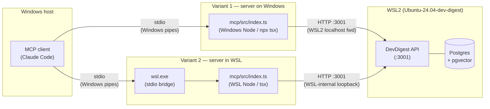

# Connecting the DevDigest MCP Server to an MCP Client

> **Scope:** this manual covers registering and verifying `@devdigest/mcp` with
> an MCP client (Claude Code). It applies to the common topology where the
> DevDigest API + Postgres run inside **WSL2** and the MCP client runs on
> **Windows**. Both supported transport variants are documented in full.
>
> **Short version:** copy `.mcp.json.example` → `.mcp.json` at the repo root,
> make sure `./scripts/dev.sh` is running, and you are done (Variant 1).

---

## Table of contents

1. [Overview](#1-overview)
2. [Prerequisites](#2-prerequisites)
3. [Variant 1 — MCP server on Windows (recommended)](#3-variant-1--mcp-server-on-windows-recommended)
4. [Variant 2 — MCP server inside WSL via `wsl.exe`](#4-variant-2--mcp-server-inside-wsl-via-wslexe)
5. [Choosing a variant](#5-choosing-a-variant)
6. [Verifying the connection](#6-verifying-the-connection)
7. [Testing with the MCP Inspector](#7-testing-with-the-mcp-inspector)
8. [Troubleshooting](#8-troubleshooting)
9. [References](#9-references)

---

## 1. Overview

`@devdigest/mcp` is a thin **stdio MCP server** (Variant A — HTTP bridge) that
sits between an MCP client and the DevDigest API. It holds no database, no
secrets, and no review logic. Every tool call translates to an HTTP request
against the already-running local API at `http://localhost:3001` and shapes the
response into a concise, signal-rich output for the LLM.

The mental model in one sentence: **MCP client spawns the server process over
stdio; the server forwards tool calls over HTTP to the DevDigest API running at
`:3001`.**

### Exposed tools

| Tool | Kind | One-line purpose |
|---|---|---|
| `devdigest_list_agents` | read | List PR-review agents in the workspace — call this first to get valid `agent` ids. |
| `devdigest_get_conventions` | read | Fetch the repo's coding conventions (extracted in L02): each rule with its evidence path and confidence. |
| `devdigest_get_findings` | read | Return `{ verdict, findings[] }` from the latest review run on a PR without starting a new one. |
| `devdigest_get_blast_radius` | read | Impact map of a PR — changed symbols, downstream callers, impacted endpoints, and an index `status`. |
| `devdigest_run_agent_on_pr` | **write** | Run a review agent on a PR and return the finished `{ verdict, findings[] }` in one call. The only tool that triggers a new review. |

All arguments are flat scalars: `repo` (`owner/name`), `pr` (PR number as an
integer), `agent` (an id from `devdigest_list_agents`, or `"all"`). Full
argument descriptions and error-forward messages are in
[`mcp/README.md`](../../mcp/README.md).

### Topology diagram

The two variants differ only in **where the MCP server process runs**. The API
always stays inside WSL2.



The diagram shows what to compare between variants: Variant 1 keeps the entire
stdio path on Windows pipes (no WSL boundary in the transport); Variant 2 adds
`wsl.exe` as a transparent stdio bridge, but the server process then runs with
the WSL toolchain and reaches the API via WSL-internal loopback.

---

## 2. Prerequisites

### 2.1 Runtime versions

| Requirement | Minimum |
|---|---|
| Node.js | 22 |
| pnpm | 10 |

Both Variant 1 and Variant 2 require Node ≥ 22 on the respective platform where
the server process runs (Windows for Variant 1, WSL for Variant 2).

### 2.2 DevDigest API — must be up and seeded

The MCP server is a pure HTTP client. It will fail immediately if the API is not
reachable. The API also requires a **seeded database**: `LocalNoAuthProvider`
resolves tenancy from the seeded default workspace; without it every tool call
returns `No default workspace found`.

Start everything from the repo root (runs Postgres, migrates, seeds, starts the
API on `:3001` and the web UI on `:3000`):

```bash
./scripts/dev.sh
```

Or, to seed only (after migrations have already been run):

```bash
cd server && pnpm db:seed
```

**Quick reachability check** — run this from Windows before registering the MCP
server:

```bash
curl http://localhost:3001/agents
```

Expected: HTTP 200 with a JSON array containing at least one agent object (e.g.
`{ "id": "...", "name": "General Reviewer", ... }`). A connection-refused error
means the API is not running. An empty array or `No default workspace found`
error means the DB is not seeded.

### 2.3 Install `mcp/` dependencies

The `mcp/` package has its own `package.json` and lockfile (this is not a
monorepo). Install once on the platform where you intend to run the server:

**On Windows (Variant 1):**

```bash
cd mcp
pnpm install
```

**Inside WSL (Variant 2):**

```bash
wsl.exe -d Ubuntu-24.04-dev-digest -- bash -c "cd /mnt/.../dev-digest/mcp && pnpm install"
```

#### Install gotcha — `ERR_PNPM_IGNORED_BUILDS: esbuild`

`tsx` pulls in `esbuild` as a dependency. pnpm gates native-binary builds and
may refuse with:

```
ERR_PNPM_IGNORED_BUILDS: esbuild@...
```

Resolve by approving the build (safe — it just downloads a pre-built binary):

```bash
pnpm approve-builds
```

Then re-run `pnpm install`. The binary works correctly after approval; this
gate is a pnpm security prompt, not a build failure.

---

## 3. Variant 1 — MCP server on Windows (recommended)

This is the default variant. The MCP server process runs natively on Windows
(`npx tsx` with the Windows Node runtime). stdio is local Windows pipes between
the MCP client and the server. HTTP calls from the server reach the WSL2 API via
WSL2 localhost forwarding, which is on by default.

### Why this works without WSL in the transport

The repo is on a Windows drive that is also mounted under `/mnt/<drive>` inside
WSL. Windows `tsx` loads `mcp/src/index.ts` directly from the Windows filesystem and resolves
the `@devdigest/shared` TypeScript source via the `tsconfig.json` path aliases in
`mcp/`. No WSL boundary exists in the stdio path, so none of the stdout-
corruption pitfalls described in Variant 2 apply.

WSL2 localhost forwarding (on by default since WSL 2.0) makes `http://localhost:3001`
reachable from Windows even though the API process is bound inside the WSL
distro.

### Step-by-step

**Step 1.** Verify the API is reachable from Windows (see Section 2.2).

**Step 2.** Install `mcp/` dependencies on Windows (see Section 2.3).

**Step 3.** Set up the `.mcp.json` at the repo root. The repo ships a portable
template `<repo-root>/.mcp.json.example` (Variant 1); copy it to `.mcp.json`,
which is git-ignored so your local edits stay out of version control:

```json
{
  "mcpServers": {
    "devdigest-mcp": {
      "command": "npx",
      "args": ["-y", "tsx", "src/index.ts"],
      "cwd": "./mcp",
      "env": {
        "DEVDIGEST_API_URL": "http://localhost:3001"
      }
    }
  }
}
```

This file is **project-scoped**: Claude Code picks it up automatically when the
working directory is inside the repo. You do not need to edit it for a standard
local setup.

**Step 4.** In Claude Code, verify that `devdigest-mcp` appears in the MCP
server list. In some clients this requires a restart or a manual "refresh MCP
servers" action after editing `.mcp.json`. See Section 6 for how to confirm the
tools are visible.

**Step 5.** Call `devdigest_list_agents` to confirm end-to-end connectivity (see
Section 6).

### How `DEVDIGEST_API_URL` is consumed

`mcp/src/config.ts` reads the env var at startup:

```typescript
export const DEFAULT_API_URL = 'http://localhost:3001';

export function loadConfig(env: NodeJS.ProcessEnv = process.env): McpConfig {
  const raw = env.DEVDIGEST_API_URL?.trim();
  const apiUrl = (raw && raw.length > 0 ? raw : DEFAULT_API_URL).replace(/\/+$/, '');
  return { apiUrl };
}
```

The value in `.mcp.json`'s `env` block is injected by the MCP client before
spawning the process. Change it there (not in `config.ts`) if the API runs on a
different port.

### stdout discipline

`mcp/src/index.ts` writes **all** log output to `stderr`:

```typescript
function log(message: string): void {
  process.stderr.write(`[devdigest-mcp] ${message}\n`);
}
```

`stdout` carries only the JSON-RPC protocol frames. With Variant 1 this is never
a problem because no login shell is involved, but it is worth knowing when
reading server logs: look for `[devdigest-mcp]` lines on stderr, not stdout.

---

## 4. Variant 2 — MCP server inside WSL via `wsl.exe`

Use this variant when you want the MCP server to run with the WSL toolchain (WSL
Node, WSL pnpm, the Linux module cache). The MCP client still runs on Windows;
`wsl.exe` bridges stdio transparently between the two.

### Step-by-step

**Step 1.** Verify the API is reachable from Windows (see Section 2.2).

**Step 2.** Install `mcp/` dependencies inside WSL (see Section 2.3).

**Step 3.** Replace the `.mcp.json` at the repo root with the following (or use
a separate, client-specific config location if your MCP client supports it):

```json
{
  "mcpServers": {
    "devdigest-mcp": {
      "command": "wsl.exe",
      "args": [
        "-d", "Ubuntu-24.04-dev-digest",
        "--",
        "bash", "-c",
        "cd /mnt/.../dev-digest/mcp && exec ./node_modules/.bin/tsx src/index.ts"
      ],
      "env": {
        "DEVDIGEST_API_URL": "http://localhost:3001"
      }
    }
  }
}
```

> Note: there is no `"cwd"` key here because the working directory is set
> inside the `bash -c` command itself. `wsl.exe` does not support the `cwd`
> semantics that the MCP client applies on Windows.
>
> Note: the command runs the local `tsx` binary directly
> (`./node_modules/.bin/tsx`), NOT `npx tsx`. Inside a `wsl.exe` launch, `npx`
> commonly resolves to the **Windows** `npx` — WSL interop appends the Windows
> PATH, and the distro may have no Linux `npx` — which then fails to find `tsx`
> and the server never starts. The local binary (installed by `pnpm install` in
> the WSL package) avoids this; `exec pnpm exec tsx src/index.ts` works too.

**Step 4.** Restart the MCP client so it picks up the new config.

**Step 5.** Call `devdigest_list_agents` to confirm end-to-end connectivity.

### Gotchas — read before using Variant 2

#### Gotcha 1: `bash -c`, NOT `bash -lc` (critical)

`wsl.exe` bridges stdin/stdout transparently. That means **stdout is the
JSON-RPC channel** from the moment `wsl.exe` starts. A login shell (`-l` or
`--login`) sources `/etc/profile` and `~/.bashrc` / `~/.profile`, which may
print MOTD banners, `nvm` version notices, `conda` activation messages, or other
text to stdout. Any output to stdout before the MCP server starts corrupts the
JSON-RPC handshake and the client will report a failed or garbled connection.

Always use `bash -c` (non-login, non-interactive) as shown in Step 3.

The server itself already logs only to stderr (see `mcp/src/index.ts` above), so
once the shell is clean the stream is safe.

#### Gotcha 2: UTF-8, no CRLF translation

The JSON-RPC stdio protocol is UTF-8. Ensure no tool in the shell startup chain
writes BOM bytes or switches to a different encoding. WSL2 defaults are correct;
only custom `.bashrc` tweaks would cause problems here.

#### Gotcha 3: path quoting and `wsl.exe` startup cost

`wsl.exe` incurs roughly 100–300 ms of startup latency on the first invocation
per boot (the WSL2 VM may need to wake up). Subsequent tool calls are not
affected because the server process remains alive between calls.

Set the absolute path inside the `bash -c` string to wherever the repo lives on
your machine: the WSL path `/mnt/<drive>/.../dev-digest/mcp` corresponds to the
Windows path `<drive>:\...\dev-digest\mcp`.

#### Gotcha 4: API is reached at WSL-internal `localhost:3001`

From inside WSL, `localhost:3001` resolves to the WSL2 loopback interface, which
is where the API is bound. No special forwarding is needed — this just works.

---

## 5. Choosing a variant

| Dimension | Variant 1 (Windows) | Variant 2 (WSL) |
|---|---|---|
| Transport boundary | Windows stdio pipes only — no WSL in the path | `wsl.exe` bridges stdio; WSL process handles the stream |
| Toolchain used | Windows Node | WSL Node |
| Module resolution | Windows filesystem (`<drive>:\`) | WSL filesystem (`/mnt/<drive>`) — same files |
| How API is reached | WSL2 localhost forwarding from Windows | WSL-internal loopback |
| Startup latency | Minimal | +100–300 ms on first `wsl.exe` call after boot |
| Login-shell stdout risk | None (no shell involved) | Real — must use `bash -c`, not `bash -lc` |
| When to prefer | Default; simpler, verified end-to-end | When WSL-specific toolchain behavior is required (e.g. testing Linux Node semantics) |
| Key failure mode | Windows Node not on PATH; `npx` not found | Login-shell stdout corruption; `wsl.exe` not found or distro name wrong |

**Recommendation: use Variant 1.** It is simpler and has no shell-stdout risk —
the entire stdio path stays on Windows pipes and `npx tsx` resolves the entry
point directly from the shared repo. Choose Variant 2 only when you specifically
need the WSL toolchain.

---

## 6. Verifying the connection

### 6.1 The MCP client sees the server and its tools

After the `.mcp.json` is in place and the client has restarted (or refreshed),
open the MCP server list in the client UI. You should see:

- Server: `devdigest-mcp`
- Status: connected (green / active)
- Tools (5): `devdigest_list_agents`, `devdigest_get_conventions`,
  `devdigest_get_findings`, `devdigest_get_blast_radius`,
  `devdigest_run_agent_on_pr`

### 6.2 Call `devdigest_list_agents` (first verification step)

This is the cheapest tool call — it requires only `GET /agents` and no PR
resolution.

Expected healthy result (paraphrased JSON):

```json
{
  "agents": [
    {
      "id": "xxxxxxxx-xxxx-xxxx-xxxx-xxxxxxxxxxxx",
      "name": "General Reviewer",
      "enabled": true
    }
  ]
}
```

The exact `id` value comes from the seed; what matters is that at least one
agent is returned.

### 6.3 Call a read tool — `devdigest_get_conventions`

Use a repository that has been imported into DevDigest. Pass `repo` as
`owner/name` (e.g. `"my-org/my-repo"`). A healthy result returns an array of
convention objects, each with `rule`, an optional `category`, `evidence_path`,
and `confidence` (field names are snake_case, mirroring the `@devdigest/shared`
contract):

```json
[
  {
    "rule": "Prefer named exports over default exports",
    "category": "style",
    "evidence_path": "src/components/Button.tsx",
    "confidence": 0.9
  }
]
```

If the repository is not imported you will receive a forward-leading error:
`Repository '<owner/name>' not found. Import it first, or check the spelling (expected `owner/name`).`

### 6.4 Optionally call the write tool — `devdigest_run_agent_on_pr`

```
repo:  "owner/name"
pr:    42
agent: "<id from devdigest_list_agents>"
```

This tool starts a review run, consumes the SSE event stream until the run
completes, and returns `{ verdict, findings[] }` in a single call. It may take
10–60 seconds depending on the LLM backend. `verdict` is one of
`request_changes` | `approve` | `comment` (or `null` if the run produced no
verdict); each finding uses snake_case `start_line`/`end_line` fields. A healthy
result:

```json
{
  "verdict": "request_changes",
  "findings": [
    {
      "file": "src/foo.ts",
      "start_line": 12,
      "end_line": 14,
      "severity": "error",
      "category": "correctness",
      "title": "...",
      "suggestion": "...",
      "confidence": 0.8
    }
  ]
}
```

---

## 7. Testing with the MCP Inspector

The [MCP Inspector](https://modelcontextprotocol.io/docs/tools/inspector) is an
interactive tool for testing and debugging an MCP server's tools without a full
MCP client. It runs through `npx` (no install) and has two modes: a browser **UI**
and a **CLI**. Prerequisites are the same as Section 2 (API up and seeded, `mcp/`
dependencies installed); the Inspector itself only needs Node + `npx` on the
machine you launch it from (Windows).

The Inspector always launches its **own** copy of the server as a child process —
independent of `.mcp.json` and of any MCP client that may already be running — so
it never conflicts with Claude Code over the server (each side spawns a separate
stdio process; they only share the downstream API at `:3001`).

### Ports and auth

UI mode serves the browser app on `http://localhost:6274` (proxy on `6277`) and
prints a one-time auth token plus a ready-to-open URL:
`http://localhost:6274/?MCP_PROXY_AUTH_TOKEN=<token>` — open that URL. Override the
ports with `CLIENT_PORT` / `SERVER_PORT` (PowerShell:
`$env:CLIENT_PORT=8080; $env:SERVER_PORT=9000; npx ...`). `DANGEROUSLY_OMIT_AUTH=true`
disables the token (not recommended).

### CLI mode (quick, scriptable checks)

Rule: Inspector flags (`--cli`, `--method`, `--tool-name`, `--tool-arg`, `-e`) go
**before** `--`; the server launch command goes **after** `--`.

**Variant 1** (run from the `mcp/` directory):

```bash
npx -y @modelcontextprotocol/inspector --cli --method tools/list -- npx -y tsx src/index.ts
```

**Variant 2** (server in WSL — use the direct binary, not `npx`; see Section 4):

```bash
npx -y @modelcontextprotocol/inspector --cli --method tools/list -- wsl.exe -d Ubuntu-24.04-dev-digest --cd /mnt/.../dev-digest/mcp -- ./node_modules/.bin/tsx src/index.ts
```

Call a tool (add `--method tools/call --tool-name <name>` before `--`):

```bash
npx -y @modelcontextprotocol/inspector --cli --method tools/call --tool-name devdigest_list_agents -- <server-launch-command>
```

For a string argument use `--tool-arg repo=owner/name`. For tools that take a
numeric `pr`, the **UI** form is the most reliable (it sends correctly-typed JSON
from the schema); in CLI use `--tool-arg pr=123` and fall back to the UI if the
value is rejected as a non-number.

### UI mode (interactive)

**Variant 1** (from the `mcp/` directory):

```bash
npx -y @modelcontextprotocol/inspector -- npx -y tsx src/index.ts
```

**Variant 2** — open the Inspector, then fill the connection fields:

- **Transport Type:** `STDIO`
- **Command:** `wsl.exe`
- **Arguments:** `-d Ubuntu-24.04-dev-digest --cd /mnt/.../dev-digest/mcp -- ./node_modules/.bin/tsx src/index.ts`

…or launch it pre-filled in one line:

```bash
npx -y @modelcontextprotocol/inspector -- wsl.exe -d Ubuntu-24.04-dev-digest --cd /mnt/.../dev-digest/mcp -- ./node_modules/.bin/tsx src/index.ts
```

Click **Connect**, then open the **Tools** tab → **List Tools** → the five
`devdigest_*` tools appear; select one, fill the (schema-typed) form, and **Run**.

> **Why the UI uses `wsl.exe --cd` and not the `.mcp.json` `bash -c` form.** The
> Inspector UI/proxy parses the Arguments field with `shell-quote`: it splits on
> whitespace (so a quoted `bash -c "…"` stops being one argument) and turns `&&`
> into an operator that serialises to `[object Object]`. A compound
> `bash -c "cd DIR && exec …"` therefore does **not** survive the UI. The
> `wsl.exe --cd <dir> -- ./node_modules/.bin/tsx src/index.ts` form has no `bash`,
> no `&&`, and no spaces inside any single argument, so it passes cleanly. (`--cd`
> needs a reasonably recent WSL. In CLI mode the `bash -c` form works too, because
> everything after `--` is passed to the server literally.)

> **Note.** Launching the server standalone (e.g. `./node_modules/.bin/tsx
> src/index.ts` inside WSL) and seeing it log `connected over stdio` and then
> appear to hang is **correct** — a stdio server waits for a JSON-RPC client on
> stdin. Stop it with `Ctrl+C`.

---

## 8. Troubleshooting

| Symptom | Cause | Fix |
|---|---|---|
| `No default workspace found` | DB not seeded | Run `./scripts/dev.sh` (seeds on first run) or `cd server && pnpm db:seed` |
| `Cannot reach the DevDigest API at http://localhost:3001` | API not running | Run `./scripts/dev.sh` in the repo root |
| `ERR_PNPM_IGNORED_BUILDS: esbuild` during `pnpm install` | pnpm gates the esbuild native binary build | Run `pnpm approve-builds` then re-run `pnpm install` (see Section 2.3) |
| Garbled or failed JSON-RPC handshake (Variant 2 only) | Login-shell printing to stdout | Use `bash -c` instead of `bash -lc` in `.mcp.json` args (see Section 4, Gotcha 1) |
| `Connection closed` / server exits immediately (Variant 2) | `npx` inside WSL resolves to the Windows `npx` (interop PATH) and can't launch `tsx` | Launch the local binary directly: `exec ./node_modules/.bin/tsx src/index.ts` (or `exec pnpm exec tsx src/index.ts`) instead of `npx -y tsx` |
| MCP Inspector **UI** won't connect; proxy log shows `[object Object]` in the args (Variant 2) | The Inspector UI parses the args field with `shell-quote`; `&&` and the quoted `bash -c "…"` don't survive | Use the `wsl.exe --cd <dir> -- ./node_modules/.bin/tsx src/index.ts` form (no `bash`/`&&`) — see Section 7 |
| MCP client cannot reach the API; `ECONNREFUSED localhost:3001` | WSL2 localhost forwarding disabled | Confirm WSL2 version ≥ 2.0 and that the API binds on `0.0.0.0` or `127.0.0.1` inside WSL; check `wsl --status` |
| Tool definitions visible but all calls fail | `npx` or `tsx` not on the Windows PATH | Install Node globally on Windows; verify `npx --version` in a Windows terminal |
| Server starts, but `devdigest_list_agents` returns empty | DB connected but not seeded | Run `cd server && pnpm db:seed` |
| After editing server code, MCP tool returns stale results | `tsx watch` inside WSL does not pick up edits from Windows (inotify does not cross the `/mnt/` boundary) | Restart the API process (`Ctrl+C` the `./scripts/dev.sh` session and re-run it) |
| `wsl.exe` not found or distro name mismatch (Variant 2) | `wsl.exe` not on PATH, or distro name wrong | Verify `wsl.exe --list` from a Windows terminal; update `-d` value in `.mcp.json` |
| PR not found error | PR number or repo `owner/name` is wrong, or repo not imported | Use `devdigest_list_agents` then check the repo list in the DevDigest UI |
| `devdigest_get_blast_radius` returns empty map, `status: "degraded"` | Repo is not indexed (no repo-intel data) | This is expected for unindexed repos; trigger a resync via `POST /repos/:id/resync` (out of scope for the MCP server itself) |

---

## 9. References

- [MCP Inspector](https://modelcontextprotocol.io/docs/tools/inspector) — the
  interactive testing/debugging tool used in Section 7.
- [`mcp/README.md`](../../mcp/README.md) — condensed run/register notes, tool
  argument details, and the package layout.
- [`docs/specs/devdigest-mcp-server.md`](../specs/devdigest-mcp-server.md) —
  the full development plan and architecture decisions for `@devdigest/mcp`
  (Variant A rationale, tool design principles, phase breakdown).
- [`AGENTS.md`](../../AGENTS.md) — project map; package topology and the
  `LocalNoAuthProvider` / seeding precondition are documented there.
- [`ONBOARDING.md`](../../ONBOARDING.md) — end-to-end review pipeline and
  architecture for first-time contributors.
