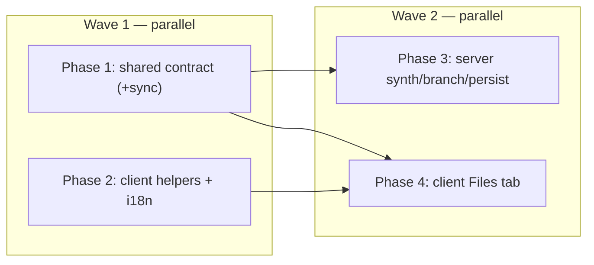

# Development Plan: Case Editor Files input tab

- **Spec:** docs/specs/SPEC-2026-07-13-case-editor-files-tab.md
- **Execution mode:** multi-agent

## Context

The eval Case Editor today lets an author simulate a PR only by pasting a
unified diff by hand — fiddly `@@` bookkeeping whose line numbers the
citation-grounding gate depends on. This feature adds a third **Files** input tab
(Diff | Files | PR meta) where an author supplies add-only `{ path, content }`
files; at run time (server) and preview time (client) those files are
**synthesized into the same unified diff** the review engine already consumes, so
the engine, the run-executor engine-input contract, and scoring are UNCHANGED
(D1). Files override the pasted diff when present, never merged (D3). The dormant
`eval_cases.input_files` jsonb column and the untyped `input_files` contract field
are activated — **no migration**, additive contract only.

Goal restated: give authors a friendlier way to produce the diff the engine
already reviews, changing nothing about the engine or scoring comparability.

## Requirements review & recommendations

The spec is testable and internally consistent except for one AC-pair tension
resolved below; nothing was blocking (the design basis D1–D3, the contract shape,
and the slice boundaries were all front-loaded and confirmed against the code).

- **Resolved tension — AC-15 vs the shipped L06 create-time guard (D-plan-1).**
  AC-15 requires a case with **zero files AND an empty pasted diff** to be
  *saveable*, with the failure deferred to run time ("`Case diff parses to zero
  files`, exactly as today"). But `EvalService.createCase`/`updateCase` today
  throw `ValidationError('Diff parses to zero files')` whenever
  `parseUnifiedDiff(input_diff).files.length === 0` (L06 AC-30). The two cannot
  both hold for the empty-diff case. **Resolution:** the create/update guard is
  re-scoped to the **effective diff** and to reject only a *non-empty* diff that
  parses to zero files (malformed input) — an **empty** pasted diff with no files
  is now saved and fails at run time. This is safe against the existing L06 test,
  which asserts 422 on the **malformed** payload `input_diff: 'not a diff'`
  (`server/test/eval.it.test.ts:251-259`), not on an empty diff — so that test
  stays green. Recorded as design decision D-plan-1; the server slice implements
  it and the integration test asserts AC-15.
- **Contract-editing nuance (recommendation).** AC-17 says "a new contract file,
  never editing the existing barrel." Typing the dormant field on `EvalCase`
  (knowledge.ts) and `EvalCaseInput` (eval-ci.ts) does require editing those two
  existing *contract* files (a field goes `z.unknown()` → `EvalCaseFile[]`), and
  registering the new file requires appending **one** `export *` line to
  `server/src/vendor/shared/index.ts`. This matches the established L06 precedent
  (`eval-suite.ts`, `eval-skill-suite.ts` each added a barrel line and did not
  touch existing *exports*). "Never edit the barrel" is read as "do not
  remove/repurpose existing exports"; the additive export line + additive field
  re-typing are sanctioned and non-breaking (`.nullish()` accepts the legacy
  `null` rows). No migration.
- **Two synthesizer twins are unavoidable (recommendation).** The synthesizer
  cannot live in `@devdigest/shared` (arch:check `shared-stays-pure` forbids logic
  there) nor in `reviewer-core` (AC-18: no core change; core is diff-only). So the
  server twin (`server/src/lib/diff-synth.ts`) and the client twin
  (`client/src/components/eval/helpers.ts`) are **separate implementations that
  must produce byte-identical output**. Mitigation: both slices use the SAME
  golden fixtures (below) so the preview provably matches what runs.
- **AC-21 touches both executors.** The Files tab must behave identically for
  agent- and skill-owned cases, so the diff-source branch must be applied to BOTH
  `EvalRunExecutor.executeCase` and `SkillEvalRunExecutor.executeCase` (they each
  parse `caseRow.inputDiff` independently today). Factor the branch into one shared
  helper so the two owners inherit it (mirrors the "don't fork a parallel skill
  path" convention, server INSIGHTS 2026-07-12).

## Affected packages & files

- **@devdigest/shared** (source of truth = `server/src/vendor/shared`; client copy
  is generated by `node scripts/sync-shared.mjs`, never hand-edited):
  - NEW `contracts/eval-files.ts` — `EvalCaseFile` `{ path, content }`.
  - `index.ts` — append one `export * from './contracts/eval-files.js';`.
  - `contracts/eval-ci.ts` — `EvalCaseInput.input_files` → `EvalCaseFile[] | null`.
  - `contracts/knowledge.ts` — `EvalCase.input_files` → `EvalCaseFile[] | null`.
  - **Out of scope (do NOT touch):** `contracts/productionize.ts`
    (`PluginEvalCase.input_files` stays `z.unknown().nullish()` — separate surface).
- **server:**
  - NEW `src/lib/diff-synth.ts` — pure add-only diff string builder (mirrors the
    placement of `src/lib/diff-parser.ts`).
  - `src/modules/eval/helpers.ts` — new `effectiveDiff(caseRow)` branch helper +
    `input_files` narrowing in `caseRowToDto`.
  - `src/modules/eval/run-executor.ts` + `src/modules/eval/skill-run-executor.ts`
    — call `effectiveDiff` instead of `parseUnifiedDiff(caseRow.inputDiff ?? '')`.
  - `src/modules/eval/service.ts` — `createCase`/`updateCase` validate + persist
    `input_files`; guard re-scoped per D-plan-1.
  - `src/modules/eval/repository/eval-case.repo.ts` — `InsertCaseValues` /
    `UpdateCaseValues` + insert/update carry `inputFiles`.
  - Reuse (no change): `src/lib/diff-parser.ts` `parseUnifiedDiff`, `scoring.ts`,
    the engine (`reviewPullRequest`), `src/db/schema/eval.ts` (`inputFiles` column
    already exists).
- **client:**
  - `src/components/eval/helpers.ts` — client synthesizer twin + `validateFiles`
    guard (mirrors the existing `validateEnvelope`/`defaultEnvelopeText` pattern).
  - `messages/en/eval.json` — new `caseEditor.*` strings incl. `caseEditor.tabs.files`.
  - `src/components/eval/CaseEditor/CaseEditor.tsx` — the Files tab (list + content
    editor + add/remove), default-tab logic, read-only synthesized Diff preview,
    Save payload, validation gate. Reuses `parsePatch`
    (`src/components/diff-viewer/helpers.ts`), `Modal`/`Tabs`/`TextInput`/`Textarea`.
  - `src/components/eval/CaseEditor/CaseEditor.test.tsx` — update the existing
    "has no Files input tab" expectations (they assert today's absence).
  - Reuse (no change): `src/lib/hooks/eval.ts` `useCreateEvalCase`/`useUpdateEvalCase`
    (they already send the whole `EvalCaseInput`, so `input_files` rides along).

**Migration:** NONE. `eval_cases.input_files` jsonb already exists
(`server/src/db/schema/eval.ts:16`, present since `0000_init.sql`). Do not run
`pnpm db:generate`/`db:migrate` for this feature.

## Shared scaffold (context pack)

Parallel implementers must NOT re-open these sources — the load-bearing bodies are
lifted verbatim below. Cited `file:line` is for traceability only.

### C1. Convention constraints (verbatim, with citations)

- **Shared contracts sync** (`server/INSIGHTS.md` 2026-06-22): "A sync script now
  exists: the SERVER copy is the source of truth (reviewer-core aliases to it
  too); run `node scripts/sync-shared.mjs` after editing a contract and CI fails
  on drift via `--check`. **Don't hand-edit the client copy.**" → Phase 1 edits
  only `server/src/vendor/shared/*` then runs the sync; it never edits
  `client/src/vendor/shared/*` by hand.
- **Client contracts are TYPE-ONLY** (`client/INSIGHTS.md` 2026-06-28): "The
  client imports `@devdigest/shared` contracts TYPE-ONLY (zero value-imports)…
  DON'T value-import a contract schema." → The client twin + `validateFiles` are
  hand-written guards; the client may `import type { EvalCaseFile }` but must NOT
  value-import the Zod schema.
- **Client tests use `fireEvent`, not user-event** (`client/INSIGHTS.md`
  2026-06-24): "`@testing-library/user-event` is NOT a dependency… render under
  `NextIntlClientProvider` (messages imported by relative path) + `ToastProvider`;
  `vi.mock` the data hooks + `next/navigation`." → Follow `CaseEditor.test.tsx`
  exactly (it already sets this up).
- **CaseEditor's two axes** (`client/INSIGHTS.md` 2026-07-12): "`caseId` decides
  create-vs-update; `initial` only PREFILLS the form." → Read `input_files` from
  `initial` for prefill; do not add a new "mode".
- **i18n namespace auto-loads** (`client/INSIGHTS.md` 2026-06-22): dropping keys in
  `messages/en/eval.json` needs no wiring; `useTranslations("eval")` sees them.
- **jsdom quirks** (`client/INSIGHTS.md` 2026-06-26): no `scrollIntoView`
  (stub if used). `HTMLElement.focus()` + `document.activeElement` DO work — use
  them to assert AC-3 path focus.
- **DB-backed tests use `*.it.test.ts`** (`server/AGENTS.md`); unit tests live in
  `server/test/` (not `src/`, `server/INSIGHTS.md` 2026-06-26).
- **Both executors share the diff branch** (`server/INSIGHTS.md` 2026-07-12): the
  skill path reuses the agent scoring/exec path — do not fork; one `effectiveDiff`
  helper feeds both (AC-21).
- **Rate-limit is a no-op under tests** (`server/INSIGHTS.md` 2026-07-13) — assert
  behavior, not 429s (not relevant here but avoids a wrong test).

### C2. `parseUnifiedDiff` — the parser the synthesized diff must satisfy (AC-11)
`server/src/lib/diff-parser.ts:14-84`. Key behaviors the synthesizer MUST honor:
`diff --git` flushes the previous file (needed to separate MULTIPLE files); path
is taken from `+++ b/<path>` with `b/` stripped; `--- /dev/null` is ignored;
`@@ -0,0 +1,N @@` sets `newLineCursor = 1`; each `+` line gets a contiguous
new-side number from 1; `files.filter(f => f.path)` keeps a file iff its path is set.
```ts
if (line.startsWith('diff --git')) { flushFile(); current = { path:'', additions:0, deletions:0, hunks:[] }; continue; }
if (line.startsWith('+++ ')) { if (!current) current = { path:'', additions:0, deletions:0, hunks:[] };
  const p = line.slice(4).replace(/^b\//, '').trim(); current.path = p === '/dev/null' ? current.path : p; continue; }
if (line.startsWith('--- ')) continue;
const hh = line.match(/^@@ -(\d+)(?:,(\d+))? \+(\d+)(?:,(\d+))? @@/);
// … '+': hunk.newLineNumbers.push(newLineCursor++); // 1..N
```

### C3. Existing add-file diff builder to mirror (server)
`server/src/modules/eval/service.ts:1279-1281` — proves the `diff --git … / --- / +++`
shape the parser expects:
```ts
function singleFileDiff(path: string, patch: string): string {
  return [`diff --git a/${path} b/${path}`, `--- a/${path}`, `+++ b/${path}`, patch].join('\n');
}
```

### C4. Canonical synthesizer (SERVER twin — Phase 3, `server/src/lib/diff-synth.ts`)
Both twins MUST produce this exact string for the same input.
```ts
/** Synthesize an add-only unified diff: each file is a newly ADDED file (AC-10/AC-11). */
export function synthesizeAddedFilesDiff(files: { path: string; content: string }[]): string {
  return files.map(fileBlock).join('\n');
}
function fileBlock(f: { path: string; content: string }): string {
  const header = [`diff --git a/${f.path} b/${f.path}`, `--- /dev/null`, `+++ b/${f.path}`];
  if (f.content === '') return header.join('\n');          // AC-14: header, NO hunk / added lines
  const lines = f.content.split('\n');                      // N = lines.length; trailing '\n' ⇒ trailing empty added line
  return [...header, `@@ -0,0 +1,${lines.length} @@`, ...lines.map((l) => `+${l}`)].join('\n');
}
```
The CLIENT twin (Phase 2, `client/src/components/eval/helpers.ts`) is the same
function body (no contract import; `{ path, content }` structural param).

### C5. The run-time diff-source branch (Phase 3)
New helper in `server/src/modules/eval/helpers.ts` (value-import of the Zod schema
is fine server-side — `helpers.ts` already imports `EvalExpectedOutput` as a value):
```ts
import { EvalCaseFile } from '@devdigest/shared';
import { synthesizeAddedFilesDiff } from '../../lib/diff-synth.js';
import { parseUnifiedDiff } from '../../lib/diff-parser.js';

/** Parse a stored `input_files` jsonb → EvalCaseFile[] (or null); legacy/garbage ⇒ null. */
export function parseInputFiles(json: unknown): EvalCaseFile[] | null {
  const r = EvalCaseFile.array().safeParse(json);
  return r.success && r.data.length > 0 ? r.data : null;
}
/** Files win when present (AC-6); else the pasted diff (AC-8). Same UnifiedDiff shape (AC-18). */
export function effectiveDiff(caseRow: { inputFiles: unknown; inputDiff: string | null }) {
  const files = parseInputFiles(caseRow.inputFiles);
  return files ? parseUnifiedDiff(synthesizeAddedFilesDiff(files)) : parseUnifiedDiff(caseRow.inputDiff ?? '');
}
```
Both executors change these two lines
(`run-executor.ts:74-75`, `skill-run-executor.ts:125-126`):
```ts
// BEFORE: const diff = parseUnifiedDiff(caseRow.inputDiff ?? '');
const diff = effectiveDiff(caseRow);                 // AC-6/AC-8/AC-18/AC-21
if (diff.files.length === 0) throw new Error('Case diff parses to zero files');   // unchanged
```

### C6. `caseRowToDto` mapper to update (Phase 3)
`server/src/modules/eval/helpers.ts:25-37`. After Phase 1 retypes `EvalCase.input_files`,
line 32 (`input_files: row.inputFiles`) no longer typechecks (`unknown` → `EvalCaseFile[]|null`).
Fix it defensively (a malformed legacy row must not 500 a read):
```ts
input_files: parseInputFiles(row.inputFiles),   // was: row.inputFiles
```

### C7. `createCase`/`updateCase` guard to re-scope (Phase 3, D-plan-1)
`server/src/modules/eval/service.ts:237-257` (create) and `:275-294` (update). Both
share this shape today:
```ts
const inputDiff = input.input_diff ?? '';
if (parseUnifiedDiff(inputDiff).files.length === 0) throw new ValidationError('Diff parses to zero files'); // AC-30
const expected = EvalExpectedOutput.parse(input.expected_output); // 422 (AC-31)
const row = await this.repo.insertCase({ workspaceId, ownerKind: …, ownerId: …, name: input.name,
  inputDiff, inputMeta: input.input_meta ?? null, expectedOutput: expected, notes: input.notes ?? null });
```
Replace the guard with the effective-diff + files-validation logic:
```ts
const files = parseInputFiles(input.input_files);          // EvalCaseFile[] | null (shape already 422'd at the route)
if (files) assertFilesValid(files);                        // AC-12 dup path / AC-13 empty|whitespace path → ValidationError (422)
const inputDiff = input.input_diff ?? '';
if (!files && inputDiff.trim() !== '' && parseUnifiedDiff(inputDiff).files.length === 0) {
  throw new ValidationError('Diff parses to zero files');   // AC-30 kept for MALFORMED diffs; empty diff now allowed (AC-15)
}
const expected = EvalExpectedOutput.parse(input.expected_output);
// insertCase/updateCase now also carries inputFiles: files (see C8)
```
`assertFilesValid` (new, in `service.ts` or `helpers.ts`): reject any file whose
`path.trim() === ''` (AC-13) and any duplicate `path` (AC-12) with `ValidationError`.

### C8. Repository values to extend (Phase 3)
`server/src/modules/eval/repository/eval-case.repo.ts`. Add `inputFiles?: unknown` to
`InsertCaseValues` (line 13) and `UpdateCaseValues` (line 67); include it in the
insert `.values` (line 27) as `inputFiles: (values.inputFiles as object|undefined) ?? null`
and in the update `.set` (line 82) as
`...(patch.inputFiles !== undefined ? { inputFiles: patch.inputFiles as object } : {})`.

### C9. Client Save-gate + preview reuse (Phase 4)
- `validateEnvelope`/`defaultEnvelopeText` pattern to mirror for `validateFiles`:
  `client/src/components/eval/helpers.ts:35-76` (a lightweight `{ ok, error? }` guard).
- `parsePatch` (renders any diff string to `+`/`-`/`ctx`/`hunk` lines, already
  prefix-marked so AC-20 "not colour-only" holds): `client/src/components/diff-viewer/helpers.ts:12-38`.
- Existing Diff-tab preview block to reuse for the read-only synthesized view
  (`CaseEditor.tsx:243-260`): a `<pre>` mapping `parsePatch(...)` lines with a
  leading `{l.kind === "add" ? "+" : l.kind === "del" ? "-" : " "}` prefix.
- Existing state + Save payload (`CaseEditor.tsx:105-156`): `inputTab` is
  `"diff" | "prMeta"` (widen to add `"files"`); `save()` builds `EvalCaseInput`
  WITHOUT `input_files` today (line 138-145) — add `input_files`.
- Hooks (no change) `client/src/lib/hooks/eval.ts:105-126`: `useCreateEvalCase`
  POSTs the whole `EvalCaseInput`; `useUpdateEvalCase` PUTs it — `input_files` rides
  along automatically.

### C10. `validateFiles` / client twin signatures (Phase 2 → consumed by Phase 4)
Phase 2 MUST ship exactly these so Phase 4 can wire without guessing:
```ts
// client/src/components/eval/helpers.ts
export interface EvalFile { path: string; content: string }   // structural; matches EvalCaseFile
export function synthesizeAddedFilesDiff(files: EvalFile[]): string;      // = C4 body
export interface FilesValidation { ok: boolean; error?: string; duplicatePath?: string }
export function validateFiles(files: EvalFile[]): FilesValidation;        // empty/whitespace path ⇒ !ok (AC-13); dup path ⇒ !ok+duplicatePath (AC-12)
```

### C11. New i18n keys (Phase 2, under `caseEditor` in `client/messages/en/eval.json`)
Add `"files"` to the existing `caseEditor.tabs` object (currently `diff`+`prMeta`,
`eval.json:56-59`) and a `caseEditor.files` block:
```json
"tabs": { "diff": "Diff", "files": "Files", "prMeta": "PR meta" },
"files": {
  "add": "Add file",
  "remove": "Remove file",
  "listLabel": "Files in this case",
  "pathLabel": "File path",
  "pathPlaceholder": "src/config.ts",
  "contentLabel": "File content",
  "contentPlaceholder": "// full file content — each line becomes an added line",
  "empty": "No files yet. Add a file to synthesize a diff for the review.",
  "readOnlyDiff": "Synthesized from the Files tab — read-only. Remove all files to paste a diff.",
  "duplicatePath": "Two files share the path \"{path}\". Paths must be unique.",
  "emptyPath": "Every file needs a non-empty path."
}
```
Keep all wording English-only (single locale `en`); never add a `messages/<locale>` dir.

### C12. Golden fixtures (BOTH synthesizer twins assert these)
```
files = [{ path: "src/config.ts", content: "a\nb\nc" }]
=> "diff --git a/src/config.ts b/src/config.ts\n--- /dev/null\n+++ b/src/config.ts\n@@ -0,0 +1,3 @@\n+a\n+b\n+c"
files = [{ path: "a.ts", content: "x" }, { path: "b.ts", content: "y" }]   // two files ⇒ two `diff --git` blocks
empty content: { path: "e.ts", content: "" }  =>  header only, NO `@@` hunk (AC-14)
grounding: a file with ≥12 lines ⇒ line 12 is a `+` line numbered 12 ⇒ `src/config.ts:12` grounds (AC-11)
```

## Tasks

### Phase 1 — Shared `EvalCaseFile` contract   (parallel-safe)
- **Surface:** shared (`@devdigest/shared`)
- **Disjoint scope:** `server/src/vendor/shared/contracts/eval-files.ts` (new),
  `server/src/vendor/shared/index.ts`, `server/src/vendor/shared/contracts/eval-ci.ts`,
  `server/src/vendor/shared/contracts/knowledge.ts`, and the generated
  `client/src/vendor/shared/**` (via `node scripts/sync-shared.mjs`).
- **Skills to apply:** `zod`. (`onion-architecture`/`typescript-expert` preloaded.)
- **What changes & why:** define the additive `EvalCaseFile` shape and give the
  dormant `input_files` field a concrete type on the write (`EvalCaseInput`) and
  read (`EvalCase`) contracts, so save/persist/read are typed (AC-16/AC-17). Then
  regenerate the client mirror so the two copies never drift.
- **How to test:** `bash scripts/test-mirror.sh server exec vitest run --exclude '**/*.it.test.ts'`
  (the new contract unit test); `node scripts/sync-shared.mjs --check` must exit 0.
  NOTE: the server package will not fully typecheck until Phase 3 fixes
  `caseRowToDto` (C6) — that is expected; the server green barrier is asserted at
  the end of Wave 2.
- [x] T1  NEW `contracts/eval-files.ts` exports `EvalCaseFile = z.object({ path: z.string(), content: z.string() })` (+ `type EvalCaseFile`) and one `export *` line is appended to the barrel `index.ts`   → AC-17  → test_eval_files_contract
- [x] T2  `EvalCaseInput.input_files` (eval-ci.ts) and `EvalCase.input_files` (knowledge.ts) are retyped from `z.unknown()` to `EvalCaseFile.array().nullish()` / `EvalCaseFile.array().nullable()`, then `node scripts/sync-shared.mjs` regenerates the client copy   → AC-16, AC-17  → test_eval_files_contract

### Phase 2 — Client pure helpers + i18n strings   (parallel-safe)
- **Surface:** client
- **Disjoint scope:** `client/src/components/eval/helpers.ts`,
  `client/messages/en/eval.json`, and the helper's unit test
  (`client/src/components/eval/helpers.test.ts` or colocated).
- **Skills to apply:** `react-best-practices`, `react-testing-library` (+ `next-best-practices` for the i18n string surface).
- **What changes & why:** ship the client synthesizer twin (C4/C10) and the
  `validateFiles` Save-gate guard (C10) as pure functions, plus the new
  `caseEditor.*` strings (C11) — front-loaded here so Phase 4 only wires the
  component. Independent of Phase 1 (structural `{ path, content }`, no contract
  value-import).
- **How to test:** `bash scripts/test-mirror.sh client test`.
- [x] T3  `synthesizeAddedFilesDiff(files)` (client twin) produces the C12 golden strings byte-for-byte (multi-file separators; empty content ⇒ no hunk)   → AC-7, AC-10  → test_client_synth
- [x] T4  `validateFiles(files)` flags an empty/whitespace-only path and a duplicate path (returns `{ ok:false, duplicatePath }`), else `{ ok:true }`   → AC-12, AC-13  → test_validate_files
- [x] T5  `caseEditor.tabs.files` + the `caseEditor.files.*` block (add/remove/labels/empty/read-only/validation) are added to `messages/en/eval.json`, English-only, no new locale dir   → AC-19  → test_files_tab_strings

### Phase 3 — Server synthesis, branch & persistence   (depends on: Phase 1)
- **Surface:** server (backend)
- **Disjoint scope:** `server/src/lib/diff-synth.ts` (new),
  `server/src/modules/eval/{helpers.ts, run-executor.ts, skill-run-executor.ts, service.ts}`,
  `server/src/modules/eval/repository/eval-case.repo.ts`, and tests under
  `server/test/` (`diff-synth.test.ts`, `eval-run-executor.test.ts` additions,
  `eval.it.test.ts` additions).
- **Skills to apply:** `onion-architecture` (synthesizer = server product logic in
  `src/lib`, NOT reviewer-core, NOT an adapter), `drizzle-orm-patterns` (jsonb
  read/write in the repository only), `zod` (`EvalCaseFile` narrowing at the seam).
  No `fastify-best-practices` needed — no route schema changes (the retyped
  `EvalCaseInput` is already the route body).
- **What changes & why:** add the pure synthesizer (C4), the `effectiveDiff` branch
  (C5) wired into BOTH executors (AC-6/AC-8/AC-18/AC-21), the `caseRowToDto`
  narrowing (C6), the create/update validate+persist path with the D-plan-1 guard
  (C7), and the repository value plumbing (C8). Reviewer-core is untouched.
- **How to test:** `bash scripts/test-mirror.sh server exec vitest run --exclude '**/*.it.test.ts'`
  (unit) and `bash scripts/test-mirror.sh server exec vitest run .it.test` (integration,
  needs Docker); `pnpm arch:check` GREEN (no new core→server edge; synthesizer in
  `src/lib`); `node scripts/sync-shared.mjs --check` still 0. No migration.
- [x] T6  `server/src/lib/diff-synth.ts` `synthesizeAddedFilesDiff` = C4 body: add-only headers per file, `@@ -0,0 +1,N @@`, `+`-prefixed lines, `diff --git` separator; empty content ⇒ header only   → AC-4, AC-10, AC-14  → test_diff_synth
- [x] T7  `effectiveDiff(caseRow)` + `parseInputFiles` (C5) in `eval/helpers.ts`; `EvalRunExecutor.executeCase` and `SkillEvalRunExecutor.executeCase` both call it instead of parsing `inputDiff` directly (files win; else pasted; identical `UnifiedDiff`)   → AC-6, AC-8, AC-18, AC-21  → test_effective_diff
- [x] T8  `caseRowToDto` narrows `row.inputFiles` via `parseInputFiles` (C6) so reads surface `EvalCaseFile[] | null` and a malformed legacy row degrades to null (no 500)   → AC-16  → test_case_dto
- [x] T9  `createCase`/`updateCase` (C7): validate `input_files` (dup/empty-path ⇒ 422, AC-12/AC-13), persist them, and re-scope the zero-file guard so an empty diff with no files SAVES (AC-15) while a malformed non-empty diff still 422s (AC-30 kept)   → AC-12, AC-13, AC-15, AC-16  → test_eval_create_files
- [x] T10  `InsertCaseValues`/`UpdateCaseValues` + the insert `.values` / update `.set` carry `inputFiles` (C8), writing to the existing jsonb column (no migration)   → AC-16, AC-17  → test_eval_create_files
- [x] T11  Run-time synthesis feeds the engine an ordinary `UnifiedDiff` unchanged and a `must_find` citing `<path>:12` grounds (parsed path == authored path, lines 1..N) — `reviewPullRequest` receives the parsed synthesized diff   → AC-10, AC-11, AC-18  → test_run_executor_files
- [x] T12  A file whose `content` holds a secret (stripe-key style) is stored locally, flows ONLY into the synthesized diff fed to the engine, and never influences the pure scorer (no LLM in scoring)   → AC-22  → test_run_executor_files

### Phase 4 — Client Files tab (CaseEditor wiring)   (depends on: Phase 1, Phase 2)
- **Surface:** client (UI)
- **Disjoint scope:** `client/src/components/eval/CaseEditor/CaseEditor.tsx` and
  `client/src/components/eval/CaseEditor/CaseEditor.test.tsx`.
- **Skills to apply:** `react-frontend-architecture`, `react-best-practices`,
  `next-best-practices`, `react-testing-library`.
- **What changes & why:** add the third **Files** tab (list + content editor +
  add/remove + empty state), default-tab logic, the read-only synthesized Diff
  preview, the Save payload extension, and the client Save-gate — consuming Phase 2
  helpers/strings and Phase 1 types. Update the header comment ("NO Files tab") and
  the existing test assertions that hard-code the tab's absence.
- **How to test:** `bash scripts/test-mirror.sh client test`.
- [x] T14  A third `Files` tab renders between `Diff` and `PR meta`; switching tabs does not resize the fixed `Modal width=1080 height=760`   → AC-1  → test_files_tab_present
- [x] T15  The Files tab shows a left file list, a content editor bound to the selected file, an add-file control and a per-file remove control; with zero files it shows the empty-state prompt   → AC-2  → test_files_tab_ui
- [x] T16  "Add file" appends a `{ path:"", content:"" }` entry, selects it, and moves focus to its path field (`document.activeElement`)   → AC-3  → test_add_file_focus
- [x] T17  Files are modelled in state as add-only `{ path, content }` (no before/after, no change-type)   → AC-4  → test_files_tab_ui
- [x] T18  Editing a path/content or removing a file updates the in-memory set and re-renders the synthesized-diff preview   → AC-5  → test_files_edit_preview
- [x] T19  When ≥1 file exists, the Diff tab shows the READ-ONLY synthesized diff (`parsePatch(synthesizeAddedFilesDiff(files))`), Edit disabled/hidden, with the `readOnlyDiff` note   → AC-7  → test_diff_readonly_when_files
- [x] T20  With zero files the Diff tab stays editable and uses the pasted `input_diff` exactly as today   → AC-8  → test_diff_editable_no_files
- [x] T21  On edit-open, the active Input tab defaults to Files when the case has files, else Diff   → AC-9  → test_default_tab
- [x] T22  Duplicate path or empty/whitespace path (via `validateFiles`) blocks Save and surfaces the `duplicatePath`/`emptyPath` message   → AC-12, AC-13  → test_save_block_files
- [x] T23  A file with empty content does NOT block Save (author-time emptiness is allowed)   → AC-14  → test_empty_content_saves
- [x] T24  Save sends `input_files` in the `EvalCaseInput` payload (create + update)   → AC-16  → test_save_sends_files
- [x] T25  All Files-tab UI text resolves via next-intl (`caseEditor.tabs.files`, `caseEditor.files.*`)   → AC-19  → test_files_strings
- [x] T26  The file list is keyboard-navigable with labelled add/remove controls and an announced selection (`aria-current`/`aria-selected`); the synthesized preview marks added lines with a `+` prefix (not colour alone); the Modal focus trap still applies   → AC-20  → test_files_a11y
- [x] T27  The Files tab behaves identically for a skill-owned case (`owner.kind==='skill'`) as for an agent-owned one   → AC-21  → test_files_skill_owner

> Task IDs are global and contiguous; T13 is intentionally absent (AC-22 is fully
> covered server-side by T12). No client task carries AC-22 — the client never
> transmits file content anywhere but the existing Save payload.

## Traceability matrix

| AC | Task(s) | Test | Commit |
|------|---------|------|--------|
| AC-1 | T14 | test_files_tab_present (client) | — |
| AC-2 | T15, T17 | test_files_tab_ui (client) | — |
| AC-3 | T16 | test_add_file_focus (client) | — |
| AC-4 | T6, T17 | test_diff_synth (server) · test_files_tab_ui (client) | — |
| AC-5 | T18 | test_files_edit_preview (client) | — |
| AC-6 | T7 | test_effective_diff (server) | — |
| AC-7 | T3, T19 | test_client_synth · test_diff_readonly_when_files (client) | — |
| AC-8 | T7, T20 | test_effective_diff (server) · test_diff_editable_no_files (client) | — |
| AC-9 | T21 | test_default_tab (client) | — |
| AC-10 | T3, T6, T11 | test_client_synth · test_diff_synth · test_run_executor_files | — |
| AC-11 | T6, T11 | test_diff_synth · test_run_executor_files (server) | — |
| AC-12 | T4, T9, T22 | test_validate_files · test_eval_create_files · test_save_block_files | — |
| AC-13 | T4, T9, T22 | test_validate_files · test_eval_create_files · test_save_block_files | — |
| AC-14 | T6, T23 | test_diff_synth (server) · test_empty_content_saves (client) | — |
| AC-15 | T9 | test_eval_create_files (server integration) | — |
| AC-16 | T2, T8, T9, T10, T24 | test_eval_files_contract · test_case_dto · test_eval_create_files · test_save_sends_files | — |
| AC-17 | T1, T2, T10 | test_eval_files_contract (server) | — |
| AC-18 | T7, T11, T12 | test_effective_diff · test_run_executor_files (server) | — |
| AC-19 | T5, T25 | test_files_tab_strings · test_files_strings | — |
| AC-20 | T26 | test_files_a11y (client) | — |
| AC-21 | T7, T27 | test_effective_diff (server) · test_files_skill_owner (client) | — |
| AC-22 | T12 | test_run_executor_files (server) | — |

Commit is "—" at planning time; implementers fill it as tasks land; plan-verifier
audits AC↔task↔test coverage against this table. All 22 ACs are covered ≥1 task;
every task cites ≥1 AC.

## Execution waves (parallelism)



- **Wave 1 (concurrent):** Phase 1 (edits `server/src/vendor/shared` + regenerates
  `client/src/vendor/shared`) ∥ Phase 2 (edits `client/src/components/eval/helpers.ts`
  + `client/messages`). Disjoint file sets; Phase 2 does not depend on Phase 1.
- **Wave 2 (concurrent):** Phase 3 (server) ∥ Phase 4 (client CaseEditor). Disjoint
  packages. Phase 3 depends on Phase 1; Phase 4 depends on Phase 1 + Phase 2.
- **Dependency minimality:** the only declared edges are real type/behavior
  couplings (Phase 3/4 consume Phase 1's `EvalCaseFile`; Phase 4 consumes Phase 2's
  `synthesizeAddedFilesDiff`/`validateFiles`/strings). Phases within a wave share no
  files.
- **Balance:** Wave 1 slices are both small. Wave 2's Phase 4 has more (fine-grained,
  single-component) tasks than Phase 3, but they are one cohesive component that
  cannot be split into concurrent disjoint files (its pure helpers were already
  lifted into Phase 2); Phase 3 carries the heavier backend logic + integration
  test, so effort is comparable — no further split.

## Risks & mitigations

- **Two synthesizer twins drift** → the preview would lie about what runs.
  *Mitigation:* both Phase 2 (T3) and Phase 3 (T6) assert the SAME C12 golden
  fixtures byte-for-byte.
- **Transient server red after Wave 1** → Phase 1 retypes `EvalCase.input_files`,
  breaking `caseRowToDto` typecheck until Phase 3 (C6). *Mitigation:* documented as
  expected; the server green barrier is asserted only at the end of Wave 2 (Phase 3
  owns `caseRowToDto`). Phase 1's implementer must NOT reach into `modules/eval`.
- **AC-15 vs L06 AC-30 regression** → relaxing the create-time guard could break the
  shipped zero-file test. *Mitigation:* D-plan-1 keeps the 422 for a *malformed*
  non-empty diff (the actual L06 test payload `'not a diff'`), relaxing only the
  *empty* diff; the integration test asserts both branches.
- **Grounding silently fails** → a wrong hunk header would make `must_find`
  citations not ground. *Mitigation:* the synthesizer is verified against the real
  `parseUnifiedDiff` (C2) and T11 asserts the `<path>:12` grounding case.
- **Contract drift between server/client copies** → *Mitigation:* Phase 1 runs
  `node scripts/sync-shared.mjs` and every server/client barrier re-runs
  `--check`; never hand-edit the client copy.
- **Untrusted, secret-bearing content** (AC-22) → file `path`/`content` are stored
  in the local workspace DB and sent only to the configured LLM provider via the
  synthesized diff (same trust boundary as a pasted diff; INJECTION_GUARD applies);
  never logged. The scorer is pure (no LLM), so hostile content cannot move a
  metric. No new authz surface.

## Critical files for implementation

- `server/src/lib/diff-synth.ts` (NEW) — the pure add-only synthesizer (C4); the
  correctness heart shared in spirit by both twins.
- `server/src/modules/eval/helpers.ts` — `effectiveDiff`/`parseInputFiles` branch
  (C5) + `caseRowToDto` narrowing (C6); the single diff-source seam for both executors.
- `server/src/modules/eval/service.ts` — `createCase`/`updateCase` validate+persist
  + the D-plan-1 guard (C7).
- `server/src/vendor/shared/contracts/eval-files.ts` (NEW) + `eval-ci.ts` +
  `knowledge.ts` — the `EvalCaseFile` contract and the typed `input_files` field.
- `client/src/components/eval/CaseEditor/CaseEditor.tsx` — the Files tab UI,
  default-tab logic, read-only synthesized preview, Save payload, and Save gate.

## Open questions / assumptions (non-blocking)

- **A1 (D-plan-1, assumed):** total emptiness (zero files + empty diff) is
  saveable; the run fails with the existing run-time "Case diff parses to zero
  files" error. A malformed non-empty diff still 422s at create/update.
- **A2:** `EvalCaseFile.path`/`content` are plain `z.string()` in the contract;
  the non-empty/whitespace-path and uniqueness rules (AC-12/AC-13) are enforced in
  the SERVICE as `ValidationError` (matching the module's existing service-level
  guards) and in the client `validateFiles` for the Save-block UX — not as Zod
  refinements on the base shape (keeps the reusable contract minimal).
- **A3:** empty-content files synthesize as a header with NO `@@` hunk (equivalently
  a zero-line hunk); either parses to a file with no groundable lines, satisfying
  AC-14. Implementers may pick either; the observable requirement is "file present,
  no groundable added lines".
- **A4:** `contracts/productionize.ts` `PluginEvalCase.input_files` is intentionally
  left `z.unknown().nullish()` (separate plugin surface, not in scope).
- **A5:** the client twin duplicates the synthesizer body (client is a separate
  package and cannot import `server/src/lib`); the C12 golden fixtures are the
  parity contract.
