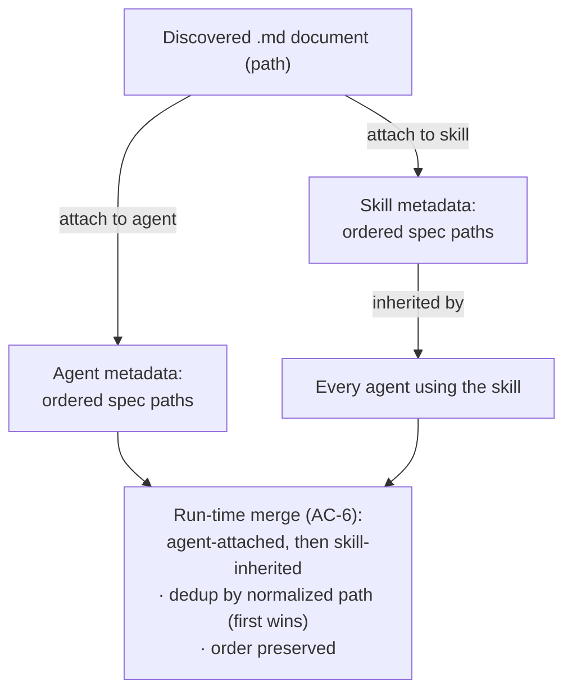
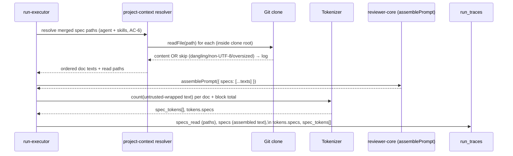

# Spec: Project Context Folder | Spec ID: SPEC-2026-07-04-project-context-folder | Status: approved
Supersedes: — | Superseded by: —

## Problem & context

Today a repository's specifications, design docs, and engineering insights (the
`*.md` files living in the repo) are documents "for humans": they explain intent
and constraints, but the AI reviewer never sees them. A reviewer agent judges a
PR against its system prompt, its attached skills, and repo-intel context — but
not against the project's own stated requirements. The result is reviews that are
technically competent yet blind to the project's declared goals, non-goals, and
domain rules.

**Project Context Folder** turns any markdown from the repository into review
context: a document can be **attached** to a reviewer agent or a reviewer skill,
and on a run its text is injected — deterministically, as untrusted data — into
the assembled prompt under a `## Project context` section. The specification stops
being a passive document and starts steering the reviewer.

The consumer plumbing for this already exists in the codebase but has no producer:
`reviewer-core`'s `assemblePrompt` already renders a `## Project context` section
from a `specs: string[]` input (each entry wrapped as untrusted), the shared
`PromptAssembly` contract already carries a `specs` slot, the `RunTrace` contract
already carries a `specs_read: string[]` list, per-section token accounting already
handles `specs`, and the Run trace UI already renders both. Every one of these is
hardcoded empty today (`specs_read: []`, `specs: null`). This feature is the
producer side: a **reader** that discovers the files, an **attach** UI on agents
and skills, and the **run-executor wiring** that resolves attached paths → reads
files from the clone → passes them as `specs` and records them in the trace.

Intended outcome: a reviewer can be pointed at the project's own docs and will
review with them in context — with full, per-document token visibility before the
run (in the attach UI) and after the run (in the Run trace), and with zero new
LLM calls.

## Goals / Non-goals

### Goals
- A **Project Context** page that recursively lists every `*.md` file in the
  cloned repository located under a `specs`, `docs`, or `insights` folder at any
  depth, with its path, and lets the user preview it (rendered markdown) and view
  its raw source (Edit tab, read-only in v1).
- **Manual attach** of any listed document to a reviewer **agent** (Context tab →
  "Project context" section) and to a reviewer **skill** (Context tab → "Project
  context to use" section), reusing the existing Skills-tab row style
  (drag-handle + checkbox + name + folder path + specs/docs/insights badge +
  Preview).
- **Ordered** attachment (drag-and-drop) — order determines position in the
  assembled prompt block. Skill-attached documents are inherited by every agent
  that uses the skill.
- **Token visibility before the run**: per-document token count and a total in the
  attach UI, plus a Preview drawer per document showing rendered content, badge,
  "Used by N agents", token count, and an "Attached" chip.
- **Injection at run time**: the run executor resolves stored paths, reads the
  files from the clone, merges agent-attached + skill-inherited documents
  (deduplicated, ordered), and injects their text into the `## Project context`
  slot as an untrusted, delimiter-wrapped block.
- **Visibility after the run**: the Run trace shows which documents were injected
  (Configuration → "Specs read") and a "Project context — attached specs
  (untrusted)" block in Prompt assembly with its total tokens, an expandable
  preview of the exact injected text, and a per-document "Per-specs tokens"
  subsection.
- **Fully deterministic**: zero new LLM calls, zero embedding calls.

### Non-goals (explicitly out of scope)
- **Auto-selection of specs per PR (the "flash selector").** Deliberately deferred
  to future work. v1 is manual attachment only.
- **Persisted editing / writeback.** The Edit tab is read-only on disk in v1. The
  server's clone is a read-only mirror (`sync()` does `git reset --hard`, which
  would clobber local edits), so writing edits back to the clone — or to an
  overlay store — is a separate future feature, not this one.
- **Embeddings / RAG indexing / chunks / coverage.** The `code_chunks` (pgvector)
  table and the embedder adapter are dead and disabled (`EMBEDDINGS_ENABLED=false`)
  today; the "Indexed: N files · M chunks" line and the "COVERAGE" ring in the
  design belong to the separate repo-intel index-state badge (and to the future
  flash selector). This feature performs no indexing and makes zero embedding calls.
- **New LLM calls of any kind.** The whole feature is deterministic file I/O +
  tokenization.
- **Discovery outside the three configured root folder names.** Only files under a
  `specs` / `docs` / `insights` folder are surfaced (root-folder-name list is
  configurable); arbitrary markdown elsewhere in the repo is not listed.
- **Attaching non-markdown files.** Only `*.md`.

## User stories

- **US-1** — As a user, I can find all specifications and other `*.md` documents of
  the project on a Project Context page, with their paths, and preview each one.
- **US-2** — As a user, I can attach those documents to skills or agents via their
  respective Context tabs, reorder them, and detach them.
- **US-3** — As a user, in the attach UI I can see the token count for each `*.md`
  document and the total, so I understand how many tokens will be added to the
  prompt.
- **US-4** — As a user, when a review starts, the reviewer agent receives the
  attached documents: they are read from the project (clone) and added as text to
  the prompt.
- **US-5** — As a user, in Run trace → Prompt assembly I can see "Project context —
  attached specs", open it to read the full text that was added to that request,
  and see Per-specs tokens.

## Design analysis

**Sources.** 7 screenshots described textually by the requester (the agent did not
view the images). No files under `docs/specs/assets/SPEC-2026-07-04-project-context-folder/`
exist at spec time; the transcription below is the design of record. When exported
assets are added there, the Traceability "Design ref" column should be updated to
point to the concrete files.

Design was cross-checked against the existing codebase so terminology matches
reality: the Skills tab row style, the Run trace Prompt-assembly sections, and the
per-skill token subsection all already exist and are the templates the new UI
mirrors.

### Screen & state inventory
1. **Project Context page** (new screen; new left-nav item "Project Context" in the
   WORKSPACE group). Header `owner/repo > Project Context`. Left column
   "PROJECT CONTEXT" with a current-folder subheader and a toolbar (create /
   folder / upload / refresh icons); a scrollable file list showing file name +
   folder. Right panel: a document viewer with a **Preview | Edit** toggle,
   rendered markdown in Preview, raw markdown in Edit (read-only, v1). Top-right of
   the viewer: "Used by N agents" and an index-state ring/line (repo-intel index
   badge, existing infra — not part of this feature's compute).
2. **Agent editor → Context tab** (new tab): section "Project context" with an
   "M of N attached" badge, helper text "Order matters — earlier docs appear
   earlier in the assembled `## Project context` block. Toggle to attach.", a
   filter input, and rows (drag-handle + checkbox + name + folder + badge +
   Preview). Footer: total attached tokens ("≈ N tokens") and "Injected as an
   untrusted block (`## Project context`) into every run."
3. **Skill editor → Context tab** (new tab): section "Project context to use" with
   an "N attached" badge, helper "Any agent using this skill inherits these
   documents.", the same row style, and a "SERIALIZES AS" preview block listing
   the attached document paths.
4. **Run trace drawer**: Configuration adds "Specs read: <paths>"; Prompt assembly
   adds a "Project context — attached specs (untrusted)" block (copy + expand),
   positioned per the existing block order.
5. **Preview drawer (from agent Context tab)**: title `<folder>/<file>.md`, badge,
   "Used by N agents", token count, "Attached" chip, rendered markdown.
6. **Preview drawer (from skill Context tab)**: same as (5) for a skill-attached
   document.
7. **Reference — today's real Run trace**: Prompt assembly already shows
   System / Skills (with a "PER-SKILL TOKENS" subsection) / Repo skeleton /
   User-diff, each with a token count and an expandable preview. The new
   "Project context" block follows this exact pattern (block tokens + expandable
   preview + a "Per-specs tokens" subsection).

### Gap sweep (each gap → an AC or an explicit decision)
- **Loading / empty states** — file list loading; empty list when no matching files
  or the configured roots don't exist in the clone → AC-16, AC-1.
- **Error states** — clone missing/not yet cloned; file unreadable at run time
  (dangling path, non-UTF8, oversized) → AC-11, AC-12, AC-13, AC-14.
- **Long text / second locale (en + uk)** — all new UI strings via next-intl in both
  `en` and `uk`; layout tolerates text expansion → AC-18 (NFR i18n).
- **Accessibility** — keyboard-operable drag/reorder alternative, focus order,
  aria-live on async token totals, contrast on badges → AC-19 (NFR a11y).
- **Responsive** — page and drawers usable at narrow widths → AC-19 (NFR a11y note).
- **Permission / authz** — page and attach are workspace-scoped like every other
  resource → AC-20 (NFR security).
- **Concurrent updates / staleness** — a document changes between attach and run, so
  the token estimate shown at attach time drifts from the run's real count → AC-8,
  AC-10 (trace shows the real count).
- **Duplicate attach** — same document attached directly to an agent and inherited
  via a skill → AC-6 (dedup).
- **Injection safety** — attached content is untrusted repo/author data → AC-9,
  AC-21.

## Acceptance criteria (EARS)

Numbering is append-only and permanent.

- **AC-1** [Event-driven] WHEN the user opens the Project Context page for a repo,
  the system shall list every `*.md` file in that repo's clone whose path matches
  the glob `**/{specs,docs,insights}/**/*.md` (a `specs`, `docs`, or `insights`
  folder at any depth; the root-folder-name list is configurable), each shown with
  its repo-relative path and its containing-folder-type badge (`specs` / `docs` /
  `insights`).
- **AC-2** [Event-driven] WHEN the user selects a listed document and the Preview
  tab is active, the system shall render its markdown; WHEN the Edit tab is active,
  the system shall show its raw markdown source read-only (no save affordance in
  v1).
- **AC-3** [Event-driven] WHEN the user opens an agent's Context tab, the system
  shall show a "Project context" section listing every discovered document as a row
  (drag-handle + checkbox + file name + folder path + type badge + Preview), with
  currently-attached documents checked and ordered first in their stored order.
- **AC-4** [Event-driven] WHEN the user opens a skill's Context tab, the system
  shall show a "Project context to use" section with the same row style and stored
  order, plus a "SERIALIZES AS" preview listing the attached document paths.
- **AC-5** [Event-driven] WHEN the user toggles a document's checkbox or reorders
  documents by drag-and-drop in an agent's or skill's Context tab, the system shall
  persist the resulting set and order as document **paths** in the agent's or
  skill's metadata (the document text is never copied into the metadata).
- **AC-6** [State-driven] WHILE assembling the project-context block for a run, the
  system shall order documents as: agent-attached documents first (in their stored
  order), then skill-inherited documents (skills in the agent's skill order, and
  within each skill its documents in their stored order), and shall deduplicate by
  normalized repo-relative path keeping the FIRST occurrence (a direct agent
  attachment therefore fixes the document's position and it is not repeated).
- **AC-7** [Event-driven] WHEN a document is attached to a skill, the system shall
  make that document part of the project context of EVERY enabled agent that uses
  that skill on a run (inheritance), subject to the dedup/order rule in AC-6.
- **AC-8** [State-driven] WHILE showing an agent's or skill's Context tab, the
  system shall display the per-document token count for each document and the total
  token count of the attached set, computed with the server tokenizer over the
  document text.
- **AC-9** [Event-driven] WHEN a run assembles the prompt, the system shall inject
  the merged, ordered, deduplicated document texts into the `## Project context`
  section, each document wrapped as an untrusted, delimiter-fenced block, before
  the diff section.
- **AC-10** [Event-driven] WHEN a run completes, the system shall record in the run
  trace: (a) the list of injected document paths in `specs_read` and in the
  Configuration "Specs read" field; (b) the assembled `## Project context` text in
  the `specs` prompt-assembly slot; (c) the block's total token count; and (d) a
  per-document token breakdown (`spec_tokens`: `{ path, tokens }[]`) counted over
  the SAME untrusted-wrapped text that was sent to the LLM, so the trace numbers
  equal the real prompt contribution.
- **AC-11** [Unwanted behavior] IF an attached document's path no longer resolves in
  the clone at run time (deleted or renamed after attach — a dangling path), THEN
  the system shall skip that document, continue the run, and record the skip in the
  run log/trace (best-effort degrade, never throw).
- **AC-12** [Unwanted behavior] IF an attached document cannot be decoded as UTF-8
  at run time, THEN the system shall skip it with a warning recorded in the trace,
  and continue the run.
- **AC-13** [Unwanted behavior] IF a single attached document exceeds the per-file
  hard cap at run time, THEN the system shall skip that document with a warning
  recorded in the trace, and continue the run (content is never silently truncated).
- **AC-14** [State-driven] WHILE the total attached token count exceeds a
  configurable soft budget (e.g. `PROJECT_CONTEXT_TOKEN_BUDGET`), the system shall
  show a warning indicator with the total in the attach UI but shall NOT block
  attaching and shall NOT truncate any document at run time.
- **AC-15** [Event-driven] WHEN an attached document is missing from the clone while
  viewing an agent's or skill's Context tab, the system shall render its row with a
  "missing" badge (still detachable) instead of removing it silently.
- **AC-16** [State-driven] WHILE no `*.md` files match under the configured roots (or
  the configured root folders do not exist in the clone), the system shall show a
  friendly empty state on the Project Context page and an empty (non-error) list in
  the Context tabs.
- **AC-17** [Event-driven] WHEN the user opens a document's Preview drawer from a
  Context tab, the system shall show the rendered markdown, the type badge, the
  token count, a "Used by N agents" count, and an "Attached" chip when the document
  is attached in the current editor.
- **AC-18** [State-driven] WHILE any user-facing string introduced by this feature is
  rendered, the system shall source it from next-intl in both `en` and `uk` (no
  hardcoded text).
- **AC-19** [State-driven] WHILE the Project Context page and the Context tabs are in
  use, the system shall provide a keyboard-operable way to reorder attached
  documents (not drag-only), correct focus order, and an accessible announcement of
  the updated token total.
- **AC-20** [Unwanted behavior] IF a request targets a document, agent, or skill
  outside the caller's workspace, THEN the system shall deny access (workspace
  scoping), consistent with every other resource.
- **AC-21** [Unwanted behavior] IF an attached document's content contains text that
  reads like instructions (a prompt-injection attempt), THEN the system shall treat
  it strictly as data — the document is delimiter-wrapped as untrusted and the
  system's injection guard explicitly names attached specs/project docs as
  untrusted data — so its instructions carry no authority over the reviewer.
- **AC-22** [Unwanted behavior] IF an attached or previewed path attempts to escape
  the clone root (path traversal, e.g. `../`), THEN the system shall reject it and
  read no file outside the repo's clone directory.
- **AC-23** [State-driven] WHILE this feature is active, the system shall make zero
  LLM calls and zero embedding calls for discovery, preview, tokenization,
  attachment, or injection.

## Edge cases

| Edge case | Handling | AC |
|---|---|---|
| Configured roots absent in clone / no matching files | Empty list, friendly empty state | AC-16 |
| Document deleted/renamed after attach (dangling path) at run time | Skip + record in trace; run continues | AC-11 |
| Document missing while viewing Context tab | Row shown with "missing" badge, still detachable | AC-15 |
| Document changed between attach and run (token drift) | Attach UI shows an estimate; trace shows the REAL count | AC-8, AC-10 |
| Empty file | Attachable; contributes 0 tokens; injected as an empty untrusted block | AC-8, AC-9 |
| Very large single file (> per-file hard cap) | Skip-with-warning at run time; never truncated | AC-13 |
| Total over soft budget | Warn-only in UI; no block, no truncation | AC-14 |
| Non-UTF-8 file | Skip-with-warning at run time | AC-12 |
| Same document attached directly AND via a skill | Deduplicated by normalized path, first occurrence wins | AC-6 |
| Merge order of agent-attached + skill-inherited | Agent-attached first, then skill-inherited (skill order, then doc order) | AC-6, AC-7 |
| Clone not present / repo not yet cloned | Empty state / best-effort; no crash | AC-16 (page), AC-11 (run) |
| Injection attempt inside a document | Untrusted delimiter wrap + guard names attached docs | AC-21 |
| Path traversal (`../`) | Rejected; read stays inside clone root | AC-22 |
| Edit tab used to change content | Read-only on disk in v1 — no persistence (Non-goal) | — (Non-goal) |
| `.gitignore`d markdown | Out of scope call: discovery walks the clone working tree; a `.gitignore`d file that is present in the clone MAY appear. Consistent with existing repo-intel walk behavior (see TD-007). Accepted for v1. | — (accepted) |

## Workflows & service communication

### 1. Discover → preview (Project Context page)

The client asks the API for the repo's project-context documents; the server globs
the read-only clone for markdown under the configured roots and returns paths +
token counts; selecting one fetches its rendered/raw content for the viewer.

```mermaid
sequenceDiagram
  participant U as User
  participant Web as Client (Project Context page)
  participant API as Server (project-context module)
  participant Git as Git clone (read-only mirror)
  U->>Web: Open Project Context
  Web->>API: GET project-context documents (repo)
  API->>Git: glob **/{specs,docs,insights}/**/*.md
  Git-->>API: matched paths
  API->>Git: read each file, tokenize
  Git-->>API: content
  API-->>Web: [{ path, folderType, tokens }]
  U->>Web: Select a document
  Web->>API: GET document content (repo, path)
  API->>Git: readFile(path) (inside clone root only)
  Git-->>API: raw markdown
  API-->>Web: raw markdown (Preview renders; Edit shows source, read-only)
```

### 2. Attach & inherit (agent / skill Context tabs)

Attachment stores ordered **paths** in the agent's or skill's metadata; a skill's
documents are inherited by every agent that uses that skill.



This is the sole ordering/dedup authority; the attach UI only edits each list's
order — the run-time merge combines them deterministically.

### 3. Inject at run time + trace (run executor)

On a run the executor resolves the merged path list, reads each file from the
clone (skipping dangling / non-UTF-8 / oversized), and passes the texts as the
`specs` input to the pure prompt assembler, which wraps each as untrusted under
`## Project context`. The trace records the paths, the assembled text, block
tokens, and the per-document breakdown.



## Contracts (shape-level)

All new/changed shapes are shape-level only (field + type + semantics). New
contracts must ship as NEW files under `@devdigest/shared`; existing barrels are
extended, never edited in place.

### Discovered document (list item — API → Project Context page & Context tabs)
| Field | Type | Semantics |
|---|---|---|
| `path` | string | Repo-relative path, e.g. `specs/public-api.md`. Stable identity used everywhere. |
| `folder_type` | enum `specs` \| `docs` \| `insights` | Which configured root the file was matched under (drives the badge). |
| `tokens` | integer | Token count of the document body (server tokenizer). `0` for an empty file. |
| `missing` | boolean (optional) | True when a path referenced by an attachment no longer resolves in the clone. Absent/false = present. |
| `used_by_agents` | integer (optional) | Deterministic count of agents whose merged context includes this path (for "Used by N agents"). |

**Invariants:** `path` is unique per repo in a listing; `path` never contains `..`
or resolves outside the clone root; `tokens ≥ 0`.

### Attachment metadata (stored on agent and on skill)
An **ordered list of document paths** per agent and per skill. Mirrors the existing
ordered agent↔skill link model (which uses an integer `order`); order is
significant and defines prompt position within each list.

| Field | Type | Semantics |
|---|---|---|
| `path` | string | Repo-relative document path (never the text). |
| `order` | integer | Position within this agent's / skill's list (ascending). |

**Invariants:** paths are stored, never the document text (AC-5); the set is
workspace-scoped; a path present in metadata but missing in the clone is surfaced
as `missing` (AC-15), not silently dropped.

### Document content (API → viewer / preview drawer)
| Field | Type | Semantics |
|---|---|---|
| `path` | string | Repo-relative path. |
| `content` | string | Raw markdown source (UTF-8). Used for Preview render and read-only Edit. |
| `tokens` | integer | Token count of the body. |
| `folder_type` | enum `specs` \| `docs` \| `insights` | Badge. |

### Run trace additions (extends existing `PromptAssembly` / `RunTrace`)
The consumer fields already exist; the ONE new field is the per-document token
array, added by analogy with the existing per-skill array.

| Field | Type | Semantics |
|---|---|---|
| `PromptAssembly.specs` | string \| null (exists) | The assembled `## Project context` text; null when none. Now populated by this feature. |
| `PromptAssembly.tokens.specs` | integer (exists) | Block total tokens. Now populated. |
| `PromptAssembly.spec_tokens` | `{ path: string, tokens: integer }[]` (optional, NEW) | Per-document token attribution in prompt order, counted over the same untrusted-wrapped text that was sent (parity with `skill_tokens`). Optional so older traces still parse. |
| `RunTrace.specs_read` | string[] (exists) | Paths of documents actually injected this run (skips excluded). Now populated. |

**Invariants:** `spec_tokens` order equals the injected order (AC-6);
`specs_read` lists only documents that were actually read and injected (dangling /
non-UTF-8 / oversized are absent — AC-11/12/13); `sum(spec_tokens[].tokens)` need
not equal `tokens.specs` exactly if the block adds section framing, but each entry
counts the document's own wrapped contribution.

### Configuration (new keys — shape only)
| Key | Type | Semantics |
|---|---|---|
| project-context root folder names | string[] | The root folder names to discover under (default: `specs`, `docs`, `insights`). |
| `PROJECT_CONTEXT_TOKEN_BUDGET` | integer | Soft total-token threshold above which the attach UI warns (no block). |
| per-file hard cap | integer (bytes or tokens) | A single document above this is skipped-with-warning at run time (AC-13). |

## Non-functional

- **Performance** — Discovery globs and reads only markdown under the configured
  roots (a small subset of the repo), reusing the existing read-only clone; no
  parsing of code, no embeddings, no network. Token counts are cheap tokenizer
  calls. Reading attached documents at run time is bounded by the attached set and
  the per-file cap; the run cost of this feature is deterministic file I/O +
  tokenization. **Requirement:** feature adds zero LLM/embedding calls (AC-23) and
  degrades to a no-op when the clone or files are unavailable (AC-11, AC-16).
- **Security** —
  - Attached content is UNTRUSTED repo/author-controlled data: it is
    delimiter-wrapped as untrusted and the reviewer's injection guard explicitly
    names attached specs/project docs as data, so embedded "instructions" carry no
    authority (AC-21) — mitigates prompt-injection / goal-hijacking (OWASP A05 /
    Agentic ASI01).
  - **Path-traversal defense:** every path used for discovery, preview, or run-time
    read must resolve inside the repo's clone root; `..`/absolute escapes are
    rejected (AC-22) — mitigates path traversal (OWASP A01/A05). Discovery emits
    only paths matched under the clone root; the read endpoints validate the
    resolved path is a descendant of `clonePathFor(repo)`.
  - **Access control:** all document/attach operations are workspace-scoped like
    every domain resource; cross-workspace access is denied (AC-20, OWASP A01).
  - **No secrets exposure:** the feature reads only markdown docs the repo already
    contains; it introduces no new secret handling and never logs document bodies
    at error time beyond the path + reason.
- **Accessibility** — All new controls keyboard-operable, including a non-drag
  reorder path; correct focus order across the page, tabs, and drawers; token-total
  updates announced via aria-live; badge/chip contrast meets the app's theme
  tokens (AC-19).
- **i18n (en + uk)** — Every new user-facing string goes through next-intl with both
  `en` and `uk` messages; layouts tolerate uk text expansion (AC-18).
- **Local-first** — Consistent with DevDigest's local-first model: documents are
  read from the local clone on the user's machine; no external service is
  contacted; the clone remains a read-only mirror (Edit is view-only in v1).

## Inputs (provenance)

- `[reused: existing scaffolding]` — `reviewer-core` `assemblePrompt` `## Project
  context` / `specs` handling; `PromptAssembly.specs` + `tokens.specs` +
  `skill_tokens`; `RunTrace.specs_read`; run-executor `sectionTokens`/trace build;
  client `TraceBody` "Specs read" + "Project context" rendering; agent↔skill
  ordered-link model (`agent_skills.order`); skill `evidence_files` jsonb-paths
  precedent; git adapter `readFile` / `clonePathFor`; `walkClone` recursive walker;
  config `cloneDir`; tokenizer adapter `count(text)`; `wrapUntrusted` + injection
  guard; repo-intel index-state badge (existing, decorative here).
- `[deterministic: file I/O]` — glob discovery over the clone; tokenization; path
  resolution/validation. No repo-intel MCP call was applicable (the self-repo is not
  imported into repo-intel; blast-radius/conventions returned "not found").
- `[new: 0 LLM calls]` — the feature is entirely deterministic.

## Untrusted inputs

- **Attached document contents** — markdown from the repository (author/contributor
  controlled). Treated strictly as data: delimiter-wrapped as untrusted at prompt
  assembly, and named as data by the injection guard (AC-21). Never executed, never
  interpreted as reviewer instructions.
- **Document paths** — used for discovery, preview, attachment, and run-time read.
  Validated to resolve inside the clone root; traversal rejected (AC-22).
- **The markdown rendered in Preview** — rendered safely (no execution of embedded
  script); the same untrusted-data posture applies to the viewer as to the prompt.

## Dependencies & impacts

- **Affected packages:**
  - `server/` — a new project-context feature module (routes + service +
    repository) registered in `modules/index.ts`; run-executor wiring to resolve →
    read → inject; a glob/read capability over the clone; new config keys; new
    columns/table for attachment paths on agents and skills (own migration).
  - `client/` — new Project Context page + left-nav item; new Context tab in the
    agent editor and the skill editor (mirroring the Skills tab); Preview drawer;
    Run-trace Prompt-assembly "Project context" block + "Per-specs tokens"
    subsection (mostly already present); next-intl `en` + `uk` strings.
  - `reviewer-core/` — no change required for injection (the `specs` path already
    exists); a one-line addition to the injection-guard text to name attached
    docs as untrusted (AC-21).
  - `server/src/vendor/shared` — NEW contract file(s): discovered-document,
    document-content, attachment metadata, and the `spec_tokens` extension to the
    trace contract. Extend via new files; never edit the existing barrel.
- **Contracts touched:** `PromptAssembly` (`spec_tokens` added), `RunTrace`
  (`specs_read` now populated) — additive/optional so older traces still parse.
- **Blast radius** `[deterministic: repo-intel]` — Not computed: the DevDigest
  self-repo is not imported into repo-intel (the MCP indexes target review repos,
  not this codebase), so `devdigest_get_blast_radius` / `devdigest_get_conventions`
  returned "repository not found". Impact was instead traced by direct reading of
  the affected files (listed above). The most sensitive touch-point is
  `modules/reviews/run-executor.ts` (the prompt-assembly + trace build), which is
  shared by single-agent and multi-agent runs via the common trace builder.

## Traceability

| AC | Story | Design ref | Verification | Plan phase |
|---|---|---|---|---|
| AC-1 | US-1 | screenshot 1 (Project Context page) | integration: glob discovery returns markdown under specs/docs/insights only | — |
| AC-2 | US-1 | screenshots 1, 5, 6 | e2e (deterministic): select doc → Preview renders, Edit shows raw read-only | — |
| AC-3 | US-2 | screenshot 2 (agent Context tab) | e2e (deterministic): agent Context tab lists docs with attached-first order | — |
| AC-4 | US-2 | screenshot 3 (skill Context tab) | e2e (deterministic): skill Context tab + SERIALIZES AS preview | — |
| AC-5 | US-2 | screenshots 2, 3 | integration: toggle/reorder persists ordered PATHS, not text | — |
| AC-6 | US-4 | screenshots 2, 3, 4 | unit (server pnpm test): merge order + dedup-first-wins by normalized path | — |
| AC-7 | US-4 | screenshot 3 | integration: skill-attached doc appears in every agent using the skill | — |
| AC-8 | US-3 | screenshots 2, 5, 6 | unit (server pnpm test): per-doc + total token counts via tokenizer | — |
| AC-9 | US-4 | screenshot 4 (Prompt assembly) | unit (reviewer-core pnpm test): specs render under `## Project context`, each untrusted-wrapped, before diff | — |
| AC-10 | US-5 | screenshots 4, 7 | integration: trace has specs_read, specs text, tokens.specs, spec_tokens[] | — |
| AC-11 | US-4 | — | unit (server pnpm test): dangling path skipped, run continues, trace notes skip | — |
| AC-12 | US-4 | — | unit (server pnpm test): non-UTF-8 file skipped-with-warning | — |
| AC-13 | US-4 | — | unit (server pnpm test): over-cap single file skipped-with-warning, not truncated | — |
| AC-14 | US-3 | screenshot 2 (footer tokens) | e2e (deterministic): total over budget shows warn badge, attach not blocked | — |
| AC-15 | US-2 | — | e2e (deterministic): missing attached doc shows "missing" badge, still detachable | — |
| AC-16 | US-1 | screenshot 1 | e2e (deterministic): no matching files → friendly empty state | — |
| AC-17 | US-1, US-3 | screenshots 5, 6 | e2e (deterministic): Preview drawer shows badge, tokens, Used-by-N, Attached chip | — |
| AC-18 | all | screenshots 1–6 | manual: en + uk strings present, no hardcoded text | — |
| AC-19 | all | screenshots 1–3 | manual: keyboard reorder, focus order, aria-live total | — |
| AC-20 | all | — | integration: cross-workspace access denied | — |
| AC-21 | US-4 | screenshot 4 ("untrusted") | unit (reviewer-core pnpm test): specs wrapped untrusted; guard names attached docs | — |
| AC-22 | US-1, US-4 | — | unit (server pnpm test): `../` path rejected; read stays in clone root | — |
| AC-23 | all | — | integration: run with attached specs makes zero LLM/embedding calls | — |
