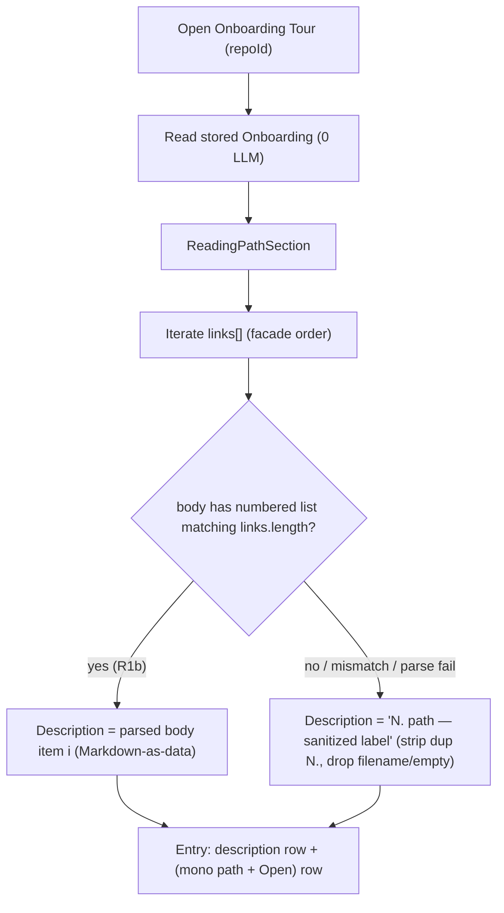
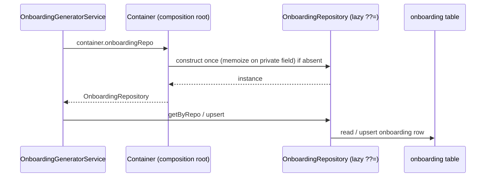
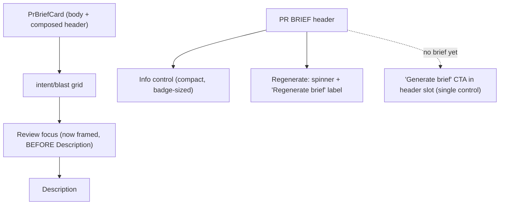

# Spec: Brief & Onboarding UI Refinements | Spec ID: SPEC-2026-07-05-brief-and-onboarding-ui-refinements | Status: implemented
Supersedes: — | Superseded by: —
Parent specs: SPEC-2026-07-05-onboarding-generator (implemented), SPEC-2026-07-05-why-risk-brief (implemented)

> Status note (2026-07-06): R1b (AC-19–AC-23) was added as a follow-up after R1
> shipped and a second design review; the scope was explicitly approved by the
> user on 2026-07-06 (the change proposal this group formalizes verbatim). The
> R1b slice shipped the same day (plan tasks T24–T29) and plan-verifier
> confirmed AC-19–AC-23 IMPLEMENTED — hence `Status: implemented` (AC-1–AC-18
> were already implemented in the first round).

## Problem & context

Two features shipped and were reviewed against their design screenshots:
**Onboarding Generator** (SPEC-2026-07-05-onboarding-generator) and **Why+Risk
Brief** (SPEC-2026-07-05-why-risk-brief). The review surfaced a set of concrete
UI-polish remarks plus one architecture-debt item, all already reproduced and
grounded in code (file:line evidence is in the Design analysis section). None of
them change what the features *do*; they refine *how* the shipped result looks
and reads, and pay down one layering inconsistency.

This spec cross-cuts BOTH shipped features plus a platform (backend layering)
item, so it is a NEW spec rather than an edit to either parent — it references
both parents and preserves every parent AC it touches. Its own acceptance
criteria are numbered fresh (AC-1…) and are independent of the parents'
numbering.

The refinements fall into six groups:

- **R1 — Onboarding Tour "Reading path": one merged list.** The section renders
  two duplicate lists today (a model-authored numbered body list AND a mirrored
  `links[]` list). Merge them into one list where each entry is a description
  row (the numbered role/rationale line) above a monospace file-path row with the
  Open control at the right edge — with the file set and order still authoritative
  from `links[]` (parent AC-3).
- **R1b — Onboarding Tour "Reading path": correct description for ALREADY-STORED
  tours (follow-up to R1).** R1 shipped, but a second design-review round found the
  merged list is wrong for tours generated under the OLD prompt: their per-file
  description lives ONLY in the `body` markdown numbered list while `link.label`
  is a junk short line (e.g. "1. _shared.ts"). The shipped renderer shows only
  `"{i+1}. {link.label}"` → doubled numbering ("1. 1. _shared.ts") and no real
  description. R1b sources the description from the `body` numbered list when it
  is present and matches `links.length` (rendered as Markdown-as-data), and
  otherwise composes a sanitized fallback from `link.path` + `label` — so
  already-stored tours reach the intended look WITHOUT regeneration.
- **R2 — onboarding-generator container-getter.** `service.ts` directly
  `new`s its repository, the only module outside the container-getter pattern;
  add a lazy `get onboardingRepo()` to the container and have the service consume
  it (the service docstring already claims this).
- **R3 — Why+Risk Brief "Review focus" section.** Give it the same card
  frame/background as the other Overview sections and render it BEFORE the
  Description block.
- **R4 — Why+Risk Brief RISK AREAS rows.** Reduce each risk title to 13px
  (keep bold) and move the file refs to separate rows BELOW the title instead of
  inline beside it.
- **R5 — Why+Risk Brief PR BRIEF header.** Make the "How this is built" info
  control compact (badge-sized), show the Regenerate control with a visible
  label + spinner while pending, and move the "Generate brief" CTA into the
  header position when no brief exists yet.
- **R6 — Onboarding Tour side-nav heading.** Rename the in-page table-of-contents
  heading from "On this page" to the feature name "Onboarding Tour" (rendered
  uppercase as "ONBOARDING TOUR" by the shared primitive's CSS), by changing only
  the page-level i18n string — not the shared primitive.

Intended outcome: both features match their intended design more closely, the
onboarding backend follows the house container-getter pattern, and no feature
behavior, contract, or LLM-call budget regresses.

## Goals / Non-goals

### Goals
- **R1** — Merge the Onboarding Tour `reading_path` section's two lists into one
  combined list (description row + mono-path row + Open), preserving the per-file
  description and the facade-authoritative file set/order, with zero extra LLM
  calls on read.
- **R1b (follow-up to R1)** — For the merged `reading_path` list, source each
  entry's description from the `body` top-level numbered list when it is present
  and its item count matches `links.length` (rendered as Markdown-as-data, mapped
  by index), and otherwise from a sanitized composition of `link.path` + `label`
  (strip a leading duplicate "N." prefix; drop a label equal to the path filename
  or empty). Never doubled numbering, never a blank description, never a crash;
  file set/order stay authoritative from `links[]`; zero LLM calls on read;
  already-stored tours reach the intended look WITHOUT regeneration. Contracts and
  the onboarding prompt are unchanged.
- **R2** — Add `get onboardingRepo()` to `server/src/platform/container.ts`
  (mirroring `get projectContextRepo()`; lazy `??=` over a private field) and make
  `OnboardingGeneratorService` consume `container.onboardingRepo` instead of
  `new OnboardingRepository(container.db)`.
- **R3** — Give the "Review focus — read these first" section the same
  background/frame as the other Overview sections, and render it BEFORE the
  Description section (new Overview order: PR Brief → intent/blast grid →
  Review focus → Description).
- **R4** — In the INTENT card RISK AREAS: reduce each risk title to 13px keeping
  bold, and render each risk's file refs as separate rows below the title (not
  inline beside it), keeping the existing MonoLink/github-blob link behavior.
- **R5** — In the PR BRIEF header: make the info ("How this is built") control
  compact (comparable to the findings/blockers badge), show the Regenerate
  control with a visible label + spinner while pending, and relocate the
  "Generate brief" CTA to the header position (next to the Score gauge cluster)
  when no brief exists.
- **R6** — Change the Onboarding Tour in-page TOC heading i18n string
  (`onboarding.onThisPage`) to the feature name "Onboarding Tour" in the `en`
  (and `uk`) page-level messages so it renders as "ONBOARDING TOUR", WITHOUT
  touching the shared `OnThisPage` primitive.
- All new/changed user-facing strings go through next-intl in both `en` and `uk`.
- Existing tests referencing the changed components/service are updated alongside.

### Non-goals (explicitly out of scope)
- **Re-litigating either parent feature's behavior.** No change to what the tour
  or brief generates, to their LLM-call budgets (zero on read, one per
  generation), to freshness/staleness semantics, or to grounding rules.
- **Any API/route contract change for R3–R5.** These are pure client work; no new
  endpoints, no response-shape changes.
- **A new `@devdigest/shared` contract or barrel edit for R1.** R1 may change the
  onboarding PROMPT and the *semantics* of `OnboardingLink.label` but must NOT
  change the stored `Onboarding` / `OnboardingSection` / `OnboardingLink` Zod
  contract; the `onboarding` table shape and its persisted documents stay valid.
- **A DB migration.** No schema/table change in any of R1–R5. R2 is a
  composition-root wiring change only.
- **Backfilling / regenerating already-stored tours.** Existing DB tours keep
  their old shape; the client must render them correctly (R1/R1b backward-compat) —
  there is no migration job that rewrites stored `Onboarding` documents, and R1b
  must make already-stored tours reach the intended look WITHOUT regeneration.
- **Changing the onboarding prompt or `Onboarding*` contracts for R1b.** R1b is a
  pure client-render change; the prompt's `link.label` semantics remain the
  forward path and the stored contract is untouched.
- **Changing the `CollapsibleCard` public contract in a breaking way.** Any
  extension (R4/R5) must keep unchanged defaults for existing consumers and
  preserve expander semantics.
- **Changing the shared `OnThisPage` primitive (R6).** R6 changes only the
  page-level `onboarding.onThisPage` i18n string; the shared
  `client/src/vendor/ui/OnThisPage.tsx` primitive and its default behavior are
  untouched, so other consumers are unaffected. The uppercase rendering stays a
  CSS concern of the primitive — the stored string value is title case.
- **Reworking the ScoreGauge, cost line, verdict pill, Outdated badge, or the
  parent brief empty/loading/error states** beyond what R5.1–R5.3 name.

## User stories

- **US-1** — As a reader of the Onboarding Tour, in the Reading path section I see
  ONE list per file: a numbered role/rationale description line, with the file
  path and an Open control beneath it — not two duplicated lists.
- **US-1b** — As a reader opening an ALREADY-STORED tour (generated under the old
  prompt), in the Reading path section I see each entry's FULL description (from
  the body list, with its inline formatting) above the file path + Open — with
  single, correct numbering and no junk label — without having to regenerate.
- **US-2** — As a maintainer, the onboarding-generator service obtains its
  repository through the container getter like every other module, so layering is
  consistent and the service is uniformly test-mockable.
- **US-3** — As a reviewer on a PR Overview, the "Review focus — read these first"
  section looks like the other framed sections and appears before the Description.
- **US-4** — As a reviewer, each RISK AREAS row reads at the card's normal text
  size with its file references on their own rows below the title, so long refs no
  longer crowd the title.
- **US-5** — As a reviewer, the "How this is built" info control is a compact
  affordance next to the findings/blockers badge; while a brief is regenerating I
  see a spinner AND the "Regenerate brief" label (no layout jump); and when no
  brief exists yet the Generate CTA sits in the header where Regenerate normally
  is.
- **US-6** — As a reader of the Onboarding Tour, the in-page navigation heading
  reads "ONBOARDING TOUR" (the feature name) instead of the generic "ON THIS
  PAGE".

## Design analysis

**Sources.** The user reviewed the shipped UI against the two features'
screenshots and gave concrete remarks (translated from Ukrainian in the task).
All remarks were already reproduced and grounded in code — the evidence below is
the design of record for this refinement round. No new exported assets exist
under `docs/specs/assets/SPEC-2026-07-05-brief-and-onboarding-ui-refinements/`;
when added, the Traceability "Design ref" column should point to concrete files.
The remarks were cross-checked against the code (each file:line below was read at
spec time).

### Screen & state inventory (grounded)

1. **Onboarding Tour → Reading path section (R1).**
   `client/src/app/repos/[repoId]/onboarding-tour/_components/OnboardingTourView/sections.tsx:41-66`
   (`ReadingPathSection`) renders `section.body` markdown FIRST, then an ordered
   `section.links[]` list (number badge + mono `link.path` + `link.label`
   underneath + an Open `MonoLink` at the right edge). The prompt
   `server/src/prompts/onboarding.system.md:18-24` instructs the model to
   reproduce the given files BOTH in the body (role line + one-line rationale) AND
   mirrored in `links`, so the two lists duplicate each other. Desired: ONE
   combined list per file — a description row (the numbered role/rationale line),
   then a `˪ <mono file path>  [Open]` row, with `[Open]` still at the right edge,
   preserving the per-file description and the facade-authoritative order.

1b. **Onboarding Tour → Reading path section, post-R1 SHIPPED state (R1b).**
   R1 shipped. The renderer
   (`client/src/app/repos/[repoId]/onboarding-tour/_components/OnboardingTourView/sections.tsx:49-73`)
   now renders, per `links[]` entry, a description row `"{i+1}. {link.label}"`
   (only when `label` is non-empty) above a mono path row + Open; `section.body`
   is NOT rendered for `reading_path` (`sections.tsx:42-44`), and the label is
   plain text (no Markdown). For an ALREADY-STORED tour (old prompt),
   `link.label` is a junk short line like `"1. _shared.ts"` while the full
   per-file description ("Foundation: shared DB utilities (e.g. `now()` helper).
   Start here…") lives ONLY in the `body` numbered list — so the screen shows
   doubled numbering ("1. 1. _shared.ts") and no real description. Desired look
   (user's third screenshot): each entry's description row is the FULL body-list
   line — number, the file path as an inline-code badge, an em-dash, the full
   description with Markdown inline formatting preserved — with the indented mono
   path row + right-aligned `[Open]` beneath it, exactly as R1 already lays out.
   When the body has no usable list, the description falls back to a sanitized
   `"N. `link.path` — label"` (no doubled number, no junk label, no blank row).

2. **onboarding-generator service (R2).**
   `server/src/modules/onboarding-generator/service.ts:55-57` runs
   `this.repo = new OnboardingRepository(container.db)` in its constructor — the
   only module that instantiates its repository directly. The container already
   exposes lazy getters for peers (`server/src/platform/container.ts:118-130`,
   e.g. `get projectContextRepo()` with a private-field `??=`), and the
   repository docstring (`repository.ts:10`) plus the service docstring
   (`service.ts:36-38`) already SAY the repo is reached via
   `container.onboardingRepo` — code must catch up.

3. **Why+Risk Brief → Review focus section (R3).**
   `client/src/app/repos/[repoId]/pulls/[number]/_components/ReviewFocusSection/ReviewFocusSection.tsx:47-80`
   renders a bare `<section>` with a `SectionLabel` + `<ol>` and no card
   background. `OverviewTab.tsx:38-46` places it AFTER the Description block. The
   Description block uses `OverviewTab/styles.ts` `descriptionBox` (border
   `var(--border)`, radius 8, bg `var(--bg-elevated)`, padding 18); Intent/Blast/
   PR Brief use the shared `Card` primitive.

4. **Why+Risk Brief → INTENT card RISK AREAS (R4).**
   `IntentCard.tsx:350-394` (`RiskRow`) renders each risk as a `CollapsibleCard`
   whose header title is hardcoded at fontSize 14 / fontWeight 600
   (`CollapsibleCard.tsx:82`) and whose `right` slot holds the file:line
   `MonoLink`(s) INLINE next to the title (`IntentCard.tsx:370-386`). Desired:
   title at 13px (still bold), file refs as SEPARATE rows below the title.
   `CollapsibleCard.title` is typed plain `string` (client INSIGHTS 2026-07-05),
   and the primitive is shared (used by PrBriefCard's `BriefInfo` at
   `PrBriefCard.tsx:368-382` and elsewhere), so the layout must be reshaped
   without a breaking change to its contract.

5. **Why+Risk Brief → PR BRIEF header (R5).**
   `PrBriefCard.tsx`: the info control `BriefInfo` (`:368-382`) is a full-size
   `CollapsibleCard`; the Regenerate control (`:274-292`) collapses to a bare
   spinning icon while pending (idle = icon-only `IconBtn`); and the
   "Generate brief" CTA lives in the empty-state body while the header control is
   hidden via `showRegenerate={!briefLoading && !!brief}` (`:143`). The
   IntentCard's Recompute `Button` (`IntentCard.tsx:152-164`: `Button` with
   `icon`, `loading`, `aria-busy`, text children) is the reference labeled-button
   shape for a consistent idle+pending affordance.

6. **Onboarding Tour → in-page TOC heading (R6).**
   `OnboardingTourView.tsx:131-133` passes `label={t("onThisPage")}` into the
   shared `OnThisPage` primitive. The primitive
   (`client/src/vendor/ui/OnThisPage.tsx:60-73`) renders `label` as the visible
   heading with `textTransform: "uppercase"` AND as the `<nav aria-label>`
   (line 61). The string is `onboarding.onThisPage` = "On this page"
   (`client/messages/en/onboarding.json:5`) / "На цій сторінці"
   (`client/messages/uk/onboarding.json:5`). Desired: the heading reads the
   feature name — `"Onboarding Tour"` in `en` (rendered "ONBOARDING TOUR") and
   `"Ознайомчий тур"` in `uk` (the existing uk feature-name translation, already
   the page `title` at `onboarding.json:2`; rendered "ОЗНАЙОМЧИЙ ТУР") → AC-18
   (resolved: reuse the existing uk translation, not the English proper noun).

### Gap sweep (each gap → an AC or an explicit decision)

- **R1 backward compatibility with already-stored tours** — old rows have
  `body` = the full numbered list and `link.label` = a short line (e.g.
  `"1. _shared.ts"`); newly-generated tours may move the rationale into
  `link.label`. Observable behavior must be defined for: old stored tour;
  body-list count ≠ links count; empty body; missing/empty label after
  regeneration → AC-2, AC-3, edge-case table.
- **R1 zero extra LLM on read** — merging must not add a generation call on page
  open (parent onboarding AC-22) → AC-4.
- **R1b description source (body list vs. label)** — for the merged list, the
  description must come from the `body` numbered list when present and matching
  `links.length` (rendered as Markdown-as-data), else from a sanitized
  `path` + `label` composition → AC-19, AC-20.
- **R1b parsing robustness** — line-level numbered-list extraction
  (`^\s*\d+\.\s+`, multi-line items folded until the next number) may fail on
  malformed body; any parse failure must degrade to the fallback, never a broken
  list or a crash → AC-21.
- **R1b markdown safety** — body-list items rendered as Markdown-as-data (inline
  code/bold preserved), never HTML/script → AC-22.
- **R1b zero LLM / no regeneration** — the fix is client-render only; opening an
  already-stored tour still makes zero LLM calls and needs no regeneration to
  look right → AC-23.
- **R2 test compatibility** — existing onboarding tests spy on
  `OnboardingRepository.prototype` (`server/test/onboarding-service.test.ts`);
  the getter must keep constructing that same class lazily so both prototype-spies
  and `ContainerOverrides` mocking keep working → AC-6, edge-case table.
- **R3/R4/R5 loading / empty / error states** — the refinements must NOT alter the
  parents' loading/empty/error branches (brief loading skeleton, "Generate brief"
  empty state, non-blocking generate error) except where R5.3 explicitly relocates
  the Generate CTA → AC-7, AC-8, AC-11, AC-12, AC-13.
- **R4/R5 CollapsibleCard shared-primitive safety** — any extension must be
  backward-compatible with unchanged defaults for existing consumers and preserve
  expander semantics (whole header toggles, `aria-expanded`, chevron) → AC-9,
  AC-11.
- **i18n (en + uk) + text expansion** — every new/changed string via next-intl;
  layout tolerates uk expansion, especially the new "Regenerate brief" /
  "Generate brief" labels → AC-14.
- **Accessibility** — keyboard operability + `aria-expanded` of the info /
  Regenerate / risk expanders preserved; state never by color alone; the
  Regenerate spinner keeps an accessible name / aria-live announcement → AC-15.
- **Untrusted model text** — all model-derived strings (risk titles, refs,
  reasons, tour body/labels, paths) stay rendered as plain text / Markdown-as-data;
  file links keep safe (https) protocols only → AC-16.
- **Responsive** — the merged reading-path rows, the framed Review focus section,
  the stacked risk refs, and the compacted header controls remain usable at narrow
  widths → AC-15.
- **R6 heading string change (en + uk) + accessible name** — the heading and the
  nav's `aria-label` both derive from the same `label` prop, so both update from
  the single string change; existing tests asserting "On this page" must be
  updated → AC-18, AC-14, AC-17.
- **R6 uk wording** — resolved: the uk heading reuses the existing uk
  feature-name translation `"Ознайомчий тур"` (not the English proper noun), for
  consistency with the page `title` and sidebar → AC-18.

## Acceptance criteria (EARS)

Numbering is append-only and permanent (independent of the parent specs).

- **AC-1** [Event-driven] WHEN the Onboarding Tour `reading_path` section is
  rendered, the system shall render exactly ONE list (no second duplicate list) in
  which each entry shows a description row (the file's numbered role/rationale
  line) followed by a row containing the monospace file path and an Open
  file-viewer control aligned at the right edge; the file set and their order
  shall remain those of `section.links[]` (facade-authoritative, parent
  onboarding AC-3).
- **AC-2** [State-driven] WHILE rendering a `reading_path` entry, the system shall
  display that file's description text (role/rationale) — sourced from whichever
  field carries it after the R1 change — so that no file loses the description it
  had before, and shall NOT render the same description twice.
- **AC-3** [Unwanted behavior] IF a stored tour has the OLD shape (a full numbered
  `body` list duplicating `links`, with short `link.label`s), or the `body` list
  count does not match `links` count, or `body` is empty, or a `link.label` is
  missing/empty after regeneration, THEN the system shall still render one
  coherent list per `links[]` entry — never a duplicated list, never a blank row,
  never a crash — degrading gracefully (e.g. showing the path alone when no
  description is available).
- **AC-4** [State-driven] WHILE the Onboarding Tour page is opened and its stored
  tour rendered, the system shall make ZERO LLM calls (the R1 change is presentation
  only; parent onboarding AC-22 is preserved).
- **AC-5** [Event-driven] WHEN a `reading_path` file's Open control is activated,
  the system shall open that file in the existing file-viewer deep-link exactly as
  before (parent onboarding AC-17 preserved).
- **AC-6** [State-driven] WHILE the composition root builds dependencies, the
  system shall expose a lazy `container.onboardingRepo` getter (a single
  `OnboardingRepository` instance memoized over a private field, mirroring
  `projectContextRepo`), and `OnboardingGeneratorService` shall obtain its
  repository from `container.onboardingRepo` rather than constructing it directly;
  existing service behavior (getTour zero-LLM read, single-flight generate, upsert)
  shall be unchanged.
- **AC-7** [Event-driven] WHEN the PR Overview tab is rendered, the system shall
  render the "Review focus — read these first" section with the same card
  frame/background as the other Overview sections (matching the Description block's
  `descriptionBox` / the shared `Card` treatment) AND positioned BEFORE the
  "Description" section — producing the order PR Brief → intent/blast grid →
  Review focus → Description.
- **AC-8** [State-driven] WHILE the Review focus section has no items to show (no
  brief, empty `review_focus`, or loading), the system shall render nothing for it
  (its existing best-effort behavior), so the reframing never introduces an empty
  framed box.
- **AC-9** [Event-driven] WHEN a RISK AREAS row is rendered, the system shall
  display the risk title at 13px font size while KEEPING it bold, and shall render
  the risk's file references as separate row(s) BELOW the title (not inline beside
  it), preserving the existing link behavior (MonoLink → github blob URL at the
  head SHA, degrading to plain mono text when repo/sha is unknown; refs are
  untrusted text).
- **AC-10** [Event-driven] WHEN the PR BRIEF header is rendered, the system shall
  present the "How this is built" info control as a compact affordance comparable
  in size to the adjacent "N findings · K blockers" badge, while keeping it
  keyboard-operable with `aria-expanded`.
- **AC-11** [State-driven] WHILE a brief exists, the system shall render the
  Regenerate control as a LABELED button (icon + visible "Regenerate brief" text,
  mirroring IntentCard's Recompute `Button` shape) in BOTH its idle and pending
  states: idle shows the icon + label; pending shows a spinner + the SAME
  "Regenerate brief" label (not an icon-only spinner), so the control's size stays
  constant and the layout does not jump between states; while pending the control
  shall remain disabled/non-interactive (parent brief AC-10 preserved).
- **AC-12** [State-driven] WHILE no brief is stored for the PR, the system shall
  render the "Generate brief" CTA in the header position where Regenerate normally
  sits (next to the Score gauge cluster) — a SINGLE control (no duplicate with the
  body) — while the empty-state body keeps its explanatory text; the control shall
  be disabled with a progress affordance while pending; opening the page shall make
  no LLM call (parent brief AC-8/AC-19 preserved).
- **AC-13** [Unwanted behavior] IF a brief generation triggered from the header CTA
  or Regenerate control fails or its output is invalid, THEN the system shall
  surface the existing non-blocking error state and leave any prior brief and the
  composed header intact (parent brief AC-13 preserved).
- **AC-14** [State-driven] WHILE any user-facing string introduced or changed by
  this feature is rendered (e.g. "Regenerate brief", "Generate brief", any changed
  reading-path/label copy), the system shall source it from next-intl in both `en`
  and `uk` with no hardcoded text, and the layout shall tolerate uk text expansion.
- **AC-15** [State-driven] WHILE the changed controls and sections are in use, the
  system shall preserve keyboard operability and `aria-expanded` of the info,
  Regenerate, and risk expanders, never convey state by color alone, keep an
  accessible name / aria-live announcement for the Regenerate/Generate state, and
  remain usable at narrow widths.
- **AC-16** [Unwanted behavior] IF any model-derived string is rendered by a
  changed component (risk title, file ref, focus reason, tour body, `link.label`,
  path), THEN the system shall render it as plain text / Markdown-as-data (no
  `dangerouslySetInnerHTML`) and restrict any file-link href to a safe protocol
  (https / in-app viewer), never an executable protocol.
- **AC-17** [State-driven] WHILE any component or the service changed by this
  feature is covered by an existing test (`sections.test.tsx`,
  `OnboardingTourView.test.tsx` — including the "On this page" assertions at
  lines 65, 304 — `ReviewFocusSection.test.tsx`, `IntentCard.test.tsx`,
  `PrBriefCard.test.tsx`, the server onboarding tests), the
  system's test suite shall be updated alongside so those tests reflect the new
  rendering/wiring and pass.
- **AC-18** [Event-driven] WHEN the Onboarding Tour page renders its in-page
  table-of-contents, the system shall show the heading as the feature name sourced
  from the page-level `onboarding.onThisPage` i18n string — `"Onboarding Tour"` in
  `en` (rendered "ONBOARDING TOUR") and `"Ознайомчий тур"` in `uk` (rendered
  "ОЗНАЙОМЧИЙ ТУР"), reusing the existing uk feature-name translation for
  consistency with the page `title` and sidebar — and the nav's accessible name
  (`aria-label`) shall follow the same string, WITHOUT modifying the shared
  `OnThisPage` primitive or its default behavior.
- **AC-19** [State-driven] WHILE rendering the `reading_path` list AND the
  section `body` contains a top-level numbered list whose item count equals
  `links.length`, the system shall use each parsed body-list item as the
  description row of the entry at the same index — rendered as Markdown-as-data
  (inline formatting such as inline-code and bold preserved) — while the file set
  and order remain authoritative from `links[]`, so an already-stored (old-prompt)
  tour shows each file's full description without regeneration.
- **AC-20** [State-driven] WHILE rendering a `reading_path` entry whose
  description is NOT taken from the body list (no usable body list, or the item
  count does not match `links.length`), the system shall compose the description
  as "N. `link.path` — label" after sanitizing the label: strip a leading
  duplicate "N." number prefix, and when the sanitized label is empty or equals
  the path's filename, render "N. `link.path`" alone (no dash, no junk label) —
  never doubled numbering and never a blank description row.
- **AC-21** [Unwanted behavior] IF parsing the `body` numbered list fails or the
  body is malformed (line-level extraction via `^\s*\d+\.\s+` with multi-line
  items folded until the next number does not yield a clean count-matching list),
  THEN the system shall fall back to the AC-20 composition rather than render a
  broken list, and shall not crash.
- **AC-22** [Unwanted behavior] IF a body-list item or a composed description
  contains model-authored text, THEN the system shall render it as
  Markdown-as-data (no `dangerouslySetInnerHTML`, no HTML/script execution),
  consistent with AC-16.
- **AC-23** [State-driven] WHILE the Onboarding Tour page renders an
  already-stored tour under R1b, the system shall make ZERO LLM/embedding calls
  and shall require NO regeneration for the tour to reach the intended look
  (client-render change only; parent onboarding AC-22 preserved).

## Edge cases

| Edge case | Handling | AC |
|---|---|---|
| Old stored tour (body = full numbered list duplicating links; short `link.label`) | Render one list per `links[]`; use the available description; never duplicate | AC-1, AC-2, AC-3 |
| `body` list count ≠ `links` count | Drive the list from `links[]`; ignore the mismatched body list; no blank/extra rows | AC-3 |
| Empty `body` | Render the list from `links[]` alone (no intro paragraph) | AC-3 |
| Missing/empty `link.label` after regeneration | Show the path row alone (no blank description row) | AC-3 |
| Opening a stored tour after R1 | Zero LLM calls; presentation-only change | AC-4, AC-23 |
| Old stored tour: body has full numbered list matching `links.length` (R1b) | Each body-list item = the entry's description row, rendered Markdown-as-data by index; single correct numbering | AC-19, AC-22 |
| Old stored tour: shipped R1 showed "1. 1. _shared.ts" (doubled number, junk label) | Body list supplies the real description (AC-19); when falling back, the duplicate "N." prefix is stripped (AC-20) | AC-19, AC-20 |
| New tour / body has no usable list / count mismatch (R1b) | Fallback: "N. `path` — sanitized-label"; label==filename or empty → "N. `path`" alone | AC-20, AC-21 |
| Body list present but malformed / parse fails (R1b) | Degrade to the AC-20 fallback; never a broken list; no crash | AC-21 |
| Body-list / composed description contains inline code/bold or model text (R1b) | Rendered as Markdown-as-data; no HTML/script | AC-22, AC-16 |
| Review focus has no items / brief loading / no brief | Render nothing (no empty framed box) | AC-8 |
| RISK AREAS risk with many/long file refs | Refs wrap onto separate rows below the 13px bold title | AC-9 |
| RISK AREAS risk with no file refs | Title row renders; no refs rows; expander still reveals explanation | AC-9 |
| Regenerate pending (labeled control) | Spinner + "Regenerate brief" label; disabled; consistent with idle size | AC-11, AC-15 |
| No brief yet (header Generate CTA) | Single Generate control in header; body keeps explanatory text; no duplicate | AC-12 |
| Brief generation fails from header CTA/Regenerate | Non-blocking error; prior brief + composed header intact | AC-13 |
| Onboarding tests spy on `OnboardingRepository.prototype` | Getter still lazily `new`s that class → prototype-spies keep working; `ContainerOverrides` path also honored | AC-6, AC-17 |
| CollapsibleCard reused by BriefInfo / trace / risk rows | Extension keeps unchanged defaults + expander semantics for all consumers | AC-9, AC-10, AC-11 |
| R6 heading changed → nav aria-label follows | Both visible heading + `aria-label` update from the one string; primitive untouched | AC-18, AC-15 |
| Tests assert "On this page" (OnboardingTourView.test.tsx:65,304) | Updated to the new heading value alongside the string change | AC-17 |
| OnThisPage primitive used by other pages | Unchanged (only the page-level string changes) — other consumers unaffected | AC-18 (decision) |

## Workflows & service communication

### 1. R1 — one merged reading-path list (client render, zero LLM)

The Onboarding Tour page reads the stored `Onboarding` document (as today, zero
LLM) and the `ReadingPathSection` renders one list driven by the
facade-authoritative `links[]`, showing each file's description above its path +
Open control — no second body-derived list.

The list is always driven by `links[]` (order is authoritative). R1b sources
each description from the `body` numbered list when it is present and its count
matches `links.length` (rendered as Markdown-as-data by index); otherwise it
composes a sanitized `path` + `label` fallback — any parse failure degrades to
that fallback, so already-stored tours render coherently with zero LLM calls.

### 2. R2 — onboarding-generator obtains its repository from the container

The service stops constructing its repository directly and reads
`container.onboardingRepo`, a lazy memoized getter mirroring the peers already in
the composition root.

Dependency direction is preserved (service → container getter → repository); no
Drizzle or SDK client is introduced into the service, and the getter is the only
place the repository is instantiated.

### 3. R3–R5 — PR Overview presentation (client only, no contract change)

The Overview tab reorders its blocks and reframes the Review focus section; the
PR BRIEF header compacts the info control and reshapes the Regenerate/Generate
control — all over the SAME brief/review data already fetched (zero extra LLM).

Every block renders from data the PR page already holds; the changes are layout,
sizing, and ordering only.

## Contracts (shape-level)

No `@devdigest/shared` contract changes and no barrel edits. R3–R5 are pure
client presentation over existing contracts (`Brief`, `Risk`, `ReviewFocusItem`,
`ReviewRecord`). R2 is a composition-root wiring change with no contract impact.
R6 is an i18n string value change only (the `OnThisPage` primitive's `label`
prop and the `onboarding.onThisPage` message) — no code contract changes.

R1 may change the onboarding PROMPT
(`server/src/prompts/onboarding.system.md`) and the *semantics* of the existing
`OnboardingLink.label` field — for example, moving the per-file rationale into
`link.label` and making `body` a short intro without the duplicated file list.
**R1b changes NO contract and NO prompt** — it only changes how the client
DERIVES the `reading_path` description at render time (body-list-as-source with a
sanitized fallback). Both stay within the EXISTING contract shape:

### `OnboardingSection` / `OnboardingLink` (EXISTS — reused, shape unchanged)
| Field | Type | Semantics (after R1 / R1b) |
|---|---|---|
| `OnboardingSection.body` | string | For `reading_path`: R1b READS it — when it holds a top-level numbered list whose count matches `links.length`, its items become the per-entry descriptions (Markdown-as-data, mapped by index, AC-19). Old stored tours (full duplicated list) and new tours (short intro / empty) are both handled. Still rendered as data, never markup/script. |
| `OnboardingSection.links` | `OnboardingLink[]` | Unchanged shape; remains the facade-authoritative file set + order for `reading_path` (parent AC-3, AC-1). |
| `OnboardingLink.label` | string | Semantics: the forward path is the per-file description (prompt unchanged). Used as the R1b FALLBACK description source when the body list is unusable, after sanitizing (strip a leading duplicate "N." prefix; drop when empty or equal to the path filename — AC-20). Rendered as data. |
| `OnboardingLink.path` | string | Unchanged: a real repo-relative path from the facts. |

**Invariants:** the `Onboarding` Zod contract, the `onboarding` table shape, and
the onboarding prompt are unchanged; already-stored documents remain valid and
render to the intended look WITHOUT regeneration (AC-19, AC-23); the
`reading_path` list is always driven by `links[]` order (AC-1); no new shared file
and no barrel edit are introduced by this spec. R1b adds a small pure client-side
body-list parser (line-level `^\s*\d+\.\s+`, multi-line items folded until the
next number) whose failure degrades to the fallback (AC-21) — its exact location
is HOW (planner).

## Non-functional

- **Performance** — N/A beyond preserving the parents': opening a tour or a brief
  stays a read with ZERO LLM/embedding calls (AC-4, AC-12); the changes are
  render/layout/wiring only, adding no network round-trips.
- **Security** — All model-derived strings (risk titles, file refs, focus reasons,
  tour body, `link.label`, paths) remain rendered as plain text / Markdown-as-data
  with no `dangerouslySetInnerHTML`; file-link hrefs remain restricted to safe
  protocols (https github-blob / in-app viewer), never executable protocols
  (AC-16; OWASP A05 XSS). **R1b** parses the model-authored `body` markdown to
  extract numbered-list items, then renders those items as Markdown-as-data
  (AC-19, AC-22) — the parser is a pure, bounded, line-level regex over already-
  stored (not attacker-request) content, with a fail-safe degrade to the fallback
  (AC-21), so it introduces no ReDoS-class or injection surface (OWASP A05; the
  content was already validated against the `Onboarding` schema server-side). No
  new inputs, secrets, endpoints, or trust boundaries are introduced. R2 keeps the
  onion dependency direction (service → container getter → repository); no
  SDK/Drizzle leaks into the service.
- **Accessibility** — Keyboard operability and `aria-expanded` of the info,
  Regenerate, and risk expanders are preserved; state is never conveyed by color
  alone; the Regenerate/Generate control keeps an accessible name and the aria-live
  announcement; layout stays usable at narrow widths (AC-15).
- **i18n (en + uk)** — Every new/changed UI string ("Regenerate brief",
  "Generate brief", any changed reading-path/label copy) is sourced from next-intl
  in both `en` and `uk`; layout tolerates uk expansion (AC-14). Model-authored tour
  and brief content remains generated content, not a UI string.
- **Local-first** — Unchanged: no new external contact; the refinements read only
  data the app already holds locally.

## Inputs (provenance)

- `[reused: SPEC-2026-07-05-onboarding-generator]` — the `Onboarding` /
  `OnboardingSection` / `OnboardingLink` contracts, the `onboarding` table, the
  `ReadingPathSection` renderer, the onboarding prompt, the file-viewer deep-link,
  the zero-LLM-on-read + facade-authoritative-order invariants (parent AC-3, AC-17,
  AC-22).
- `[reused: SPEC-2026-07-05-why-risk-brief]` — the `Brief` / `Risk` /
  `ReviewFocusItem` contracts, the `PrBriefCard`, `IntentCard` RISK AREAS,
  `ReviewFocusSection`, `OverviewTab`, the composed header (zero-LLM), the
  regenerate/empty/error states, and the MonoLink / github-blob link pattern
  (parent brief AC-6…AC-13, AC-19, AC-21).
- `[reused: server conventions]` — the container-getter pattern
  (`container.ts:118-130`, `get projectContextRepo()`); `ContainerOverrides`
  test-mock convention; onion layering (verified via the `onion-architecture` skill
  at spec time only for boundary framing — no implementation prescribed here).
- `[reused: client INSIGHTS 2026-07-05]` — `CollapsibleCard.title` is typed plain
  `string`; a status/severity prefix must be visible text or the primitive must be
  extended backward-compatibly.
- `[deterministic: repo-intel]` — `devdigest_get_blast_radius` /
  `devdigest_get_conventions` were NOT applicable: the DevDigest self-repo is not
  imported into repo-intel (verified at spec time — `devdigest_get_conventions`
  returned "repository not found"), consistent with both parent specs. Impact was
  traced by directly reading the affected files cited in Design analysis.
- `[new: 0 LLM calls]` — this feature introduces NO new LLM/embedding calls; it
  preserves the parents' budgets (zero on read; one per generation, unchanged).

## Untrusted inputs

- **Model-authored onboarding content** (`OnboardingSection.body`,
  `OnboardingLink.label`, `OnboardingLink.path`) — rendered as Markdown/plain-text
  data; paths remain facade-grounded; the R1/R1b changes keep them as data, never
  as markup/script (AC-16, AC-22). R1b additionally PARSES `body` (a pure,
  fail-safe line-level extraction) to source the per-entry descriptions; the
  parsed items are still rendered as Markdown-as-data, never executed.
- **Model-authored brief content** (risk `title`/`explanation`/`file_refs`,
  `review_focus[].reason`/`path`) — rendered as plain text; file-link hrefs remain
  safe-protocol only (AC-16). No trust boundary changes; grounding stays server-side
  per the parent brief spec.
- **No new untrusted inputs** are introduced by this spec (R2 adds no external
  data; R3–R5 render already-validated stored artifacts).

## Dependencies & impacts

- **Affected packages:**
  - `client/` — `OnboardingTourView/sections.tsx` (`ReadingPathSection`, R1 +
    R1b's body-list-as-source + sanitized fallback; likely a small pure
    body-list parser + label-sanitize helper co-located or in the view's
    `helpers`, and `<Markdown>` for the description row — exact placement is
    HOW → planner);
    `OverviewTab/OverviewTab.tsx` + `OverviewTab/styles.ts` (R3 reorder + frame);
    `ReviewFocusSection/ReviewFocusSection.tsx` (R3 frame);
    `IntentCard/IntentCard.tsx` (`RiskRow`/`RiskAreas`, R4); `PrBriefCard/
    PrBriefCard.tsx` (`BriefHeader`, `BriefInfo`, Regenerate/Generate, R5); possibly
    `client/src/vendor/ui/CollapsibleCard.tsx` IF a backward-compatible extension is
    needed for R4/R5 (that choice is HOW → planner); `messages/en/brief.json` +
    `messages/uk/brief.json` for new brief strings; `messages/en/onboarding.json`
    + `messages/uk/onboarding.json` for the `onThisPage` heading value (R6) and any
    R1 reading-path copy; the listed test files including
    `OnboardingTourView.test.tsx` (its "On this page" assertions). The shared
    `client/src/vendor/ui/OnThisPage.tsx` primitive is NOT touched (R6).
  - `server/` — `platform/container.ts` (new `get onboardingRepo()` + private
    field, R2); `modules/onboarding-generator/service.ts` (consume
    `container.onboardingRepo`, R2); `server/src/prompts/onboarding.system.md` IF R1
    moves the rationale into `link.label` / trims the body list (that choice is
    HOW → planner); `server/test/onboarding-service.test.ts` (updated alongside).
  - `@devdigest/shared` — no change (no new file, no barrel edit).
- **Contracts touched:** none broken. `Onboarding`/`OnboardingSection`/
  `OnboardingLink`, `Brief`/`Risk`/`ReviewFocusItem`, `ReviewRecord`,
  `CollapsibleCardProps` remain shape-compatible (any CollapsibleCard extension
  must be additive with unchanged defaults).
- **Blast radius** `[deterministic: repo-intel]` — Not computed: the DevDigest
  self-repo is not imported into repo-intel (`devdigest_get_conventions` →
  "repository not found" at spec time), consistent with both parents. Impact was
  traced by directly reading the affected files. The most sensitive touch-points
  are the shared `CollapsibleCard` primitive (used by multiple consumers — any
  extension must stay backward-compatible) and the shared `onboarding.system.md`
  prompt (its change affects only onboarding generation).

## Traceability

| AC | Story | Design ref | Verification | Plan phase |
|---|---|---|---|---|
| AC-1 | US-1 | sections.tsx:41-66 (ReadingPathSection) | unit (client `pnpm test`): reading_path renders ONE list per links[]; description above path+Open | — |
| AC-2 | US-1 | onboarding.system.md:18-24 | unit (client `pnpm test`): each entry shows its description once (no duplicate list) | — |
| AC-3 | US-1 | (grounding: old stored shape) | unit (client `pnpm test`): old body-list / count-mismatch / empty body / missing label → coherent single list, no crash | — |
| AC-4 | US-1 | — | e2e (deterministic, no LLM): open stored tour → 0 LLM calls | — |
| AC-5 | US-1 | sections.tsx:59 (Open MonoLink) | e2e (deterministic): reading_path Open → file-viewer deep-link | — |
| AC-6 | US-2 | container.ts:118-130; service.ts:55-57 | unit (server `pnpm test`): container.onboardingRepo lazy getter; service uses it; getTour/generate behavior unchanged | — |
| AC-7 | US-3 | OverviewTab.tsx:38-46; styles.ts:descriptionBox | unit (client `pnpm test`) + manual: Review focus framed like other sections AND before Description | — |
| AC-8 | US-3 | ReviewFocusSection.tsx:39-42 | unit (client `pnpm test`): no items/loading/no brief → renders nothing (no empty framed box) | — |
| AC-9 | US-4 | IntentCard.tsx:350-394; CollapsibleCard.tsx:82 | unit (client `pnpm test`): risk title 13px+bold; file refs on separate rows below title; link behavior preserved | — |
| AC-10 | US-5 | PrBriefCard.tsx:368-382 (BriefInfo) | unit (client `pnpm test`): info control compact (badge-comparable); keyboard-operable + aria-expanded | — |
| AC-11 | US-5 | PrBriefCard.tsx:274-292; IntentCard.tsx:152-164 | unit (client `pnpm test`): pending → spinner + "Regenerate brief" label; disabled; no layout jump | — |
| AC-12 | US-5 | PrBriefCard.tsx:143 (showRegenerate) | unit (client `pnpm test`): no brief → single Generate CTA in header slot; body keeps text; 0 LLM on open | — |
| AC-13 | US-5 | PrBriefCard.tsx:148-163 (error) | unit (client `pnpm test`): generate/regenerate failure → non-blocking error; prior brief + header intact | — |
| AC-14 | all | onboarding.json:5 (R6); brief.json (R5) | manual: en + uk strings present for all new/changed copy (incl. Regenerate/Generate labels + R6 heading); no hardcoded text; uk expansion tolerated | — |
| AC-15 | all | — | manual: keyboard + aria-expanded of info/Regenerate/risk expanders; no color-only state; narrow-width usable | — |
| AC-16 | all | ReviewFocusSection.tsx:114; IntentCard.tsx:388 | unit (client `pnpm test`): model strings as data (no dangerouslySetInnerHTML); hrefs safe-protocol only | — |
| AC-17 | all | (test files) | unit (client + server `pnpm test`): sections/OnboardingTourView/ReviewFocusSection/IntentCard/PrBriefCard/onboarding-service tests updated & green | — |
| AC-18 | US-6 | OnboardingTourView.tsx:131-133; onboarding.json:5; OnThisPage.tsx:60-73 | unit (client `pnpm test`): TOC heading = "Onboarding Tour" (en); nav aria-label follows; primitive untouched | — |
| AC-19 | US-1b | sections.tsx:49-73 (shipped R1); user screenshot 3 | unit (client `pnpm test`): body numbered list matching links.length → items become per-entry descriptions (Markdown-as-data) by index; single numbering | — |
| AC-20 | US-1b | sections.tsx:54-61 (label render) | unit (client `pnpm test`): no/mismatch body list → "N. `path` — sanitized label"; dup "N." stripped; label==filename/empty → path alone | — |
| AC-21 | US-1b | — | unit (client `pnpm test`): malformed body / parse failure → AC-20 fallback; no broken list; no crash | — |
| AC-22 | US-1b | — | unit (client `pnpm test`): body-list/composed description with inline code/bold rendered as Markdown-as-data; no HTML/script | — |
| AC-23 | US-1b | — | e2e (deterministic, no LLM): open already-stored tour → intended look, 0 LLM calls, no regeneration | — |

## [NEEDS CLARIFICATION]

None — both open points are resolved and folded into the ACs.

Resolved decisions:
- **R5.2 idle-state appearance (AC-11)** → the Regenerate control is a LABELED
  button (icon + "Regenerate brief" text) in BOTH idle and pending states
  (pending swaps the icon for a spinner, same label), mirroring IntentCard's
  Recompute `Button`; the constant size prevents a layout jump.
- **R6 uk heading wording (AC-18)** → the uk in-page TOC heading reuses the
  existing uk feature-name translation `"Ознайомчий тур"` (en stays
  `"Onboarding Tour"`), for consistency with the page `title` and sidebar.

Status note (2026-07-05): the two clarifications above were resolved by the user
and the user explicitly approved the spec the same day; R1–R6 (AC-1–AC-18) were
then implemented.

Status note (2026-07-06): **R1b (AC-19–AC-23)** was added as a follow-up after R1
shipped and a second design review found the merged Reading-path list wrong for
already-stored tours. R1b has no open `[NEEDS CLARIFICATION]` — the scope was
approved and relayed via the coordinator. Per the status rule, a substantive
change (new ACs) to an implemented spec resets `Status: draft`, and promotion
back to `approved`/`implemented` requires the USER'S OWN explicit confirmation (a
coordinator-relayed approval is not the user's own message). The spec is
therefore `draft` with zero open questions — the added R1b scope is
ready for the user to approve.
