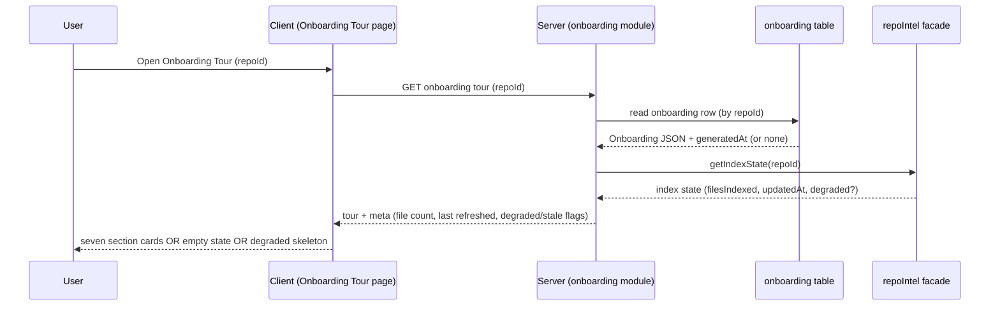
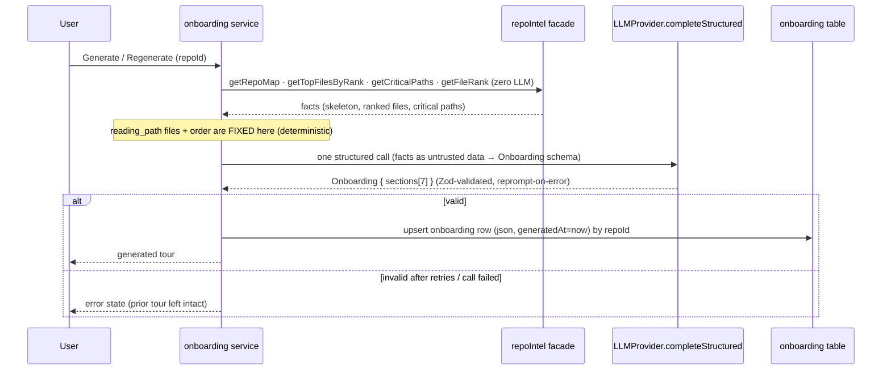
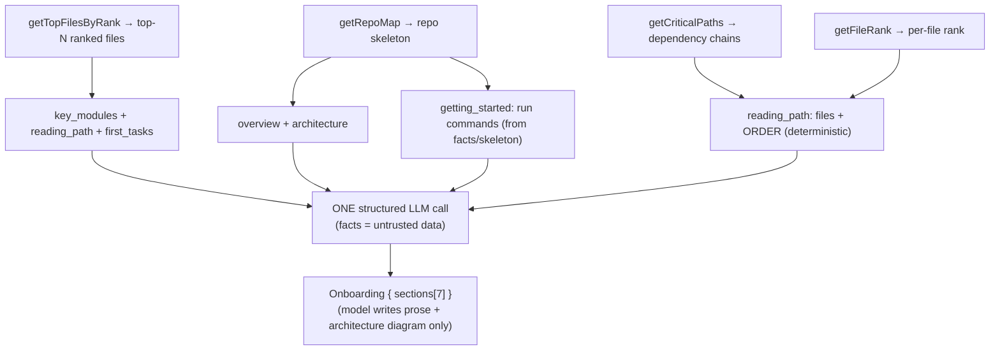

# Spec: Onboarding Generator | Spec ID: SPEC-2026-07-05-onboarding-generator | Status: approved
Supersedes: — | Superseded by: —

## Problem & context

A developer dropped into an unfamiliar repository spends their first day
reverse-engineering the shape of the codebase: which file boots the app, which
paths are load-bearing, how to run it locally, what to read first, and where to
make a safe first change. DevDigest already indexes every connected repository
with `repo-intel` (an import graph, PageRank-based file importance, dependency
chains, a compact repo skeleton), yet none of that is surfaced to a human as a
readable tour — the index exists only to fuel PR reviews.

**Onboarding Generator** turns that index into a guided, per-repo **Onboarding
Tour** page: seven sections that answer "what is this, how is it built, what
matters, what do I read, how do I run it, what are the conventions, and what
should I do first". It follows the house pattern **"code collects the facts, the
model writes the narrative"**: a deterministic analyzer pulls structured facts
from the `repoIntel.*` facade at **zero LLM cost** (import graph, PageRank rank,
dependency/critical paths, the repo skeleton, top-ranked files), and then **one**
structured LLM call turns those facts into the seven narrative sections. The
facts (files, order, ranks) are authoritative and never invented by the model;
the model supplies only prose, rationale, and an architecture diagram.

Substantial scaffolding for this feature already exists in the codebase and this
spec is deliberately built on it rather than around it:
- an `onboarding` table (`{ repoId PK → repos, json jsonb, generatedAt }`);
- the shared `Onboarding` / `OnboardingSection` / `OnboardingLink` Zod contracts;
- a first-class `onboarding` entry in the per-feature model registry
  (`FeatureModelId`), so the single LLM call already has a configurable model;
- a system prompt (`server/src/prompts/onboarding.system.md`) with a
  parameterized `{{sections}}` slot, untrusted-data handling, strict grounding
  rules, and mermaid-safety rules;
- `repoIntel.getCriticalPaths()` / `getTopFilesByRank()` (documented in code as
  "onboarding reading-path") plus `getRepoMap()`, `getFileRank()`, and
  `getIndexState()`;
- client i18n stubs and an existing `MermaidDiagram` renderer and `Markdown`
  primitive.

The `repoIntel.*` facade **degrades, never throws**: on an unbuilt/partial index
it returns empty results and `getIndexState()` reports `degraded` with a reason.
The feature honors this: when the index is degraded it renders a **deterministic
skeleton** built from the facts alone plus an honest degraded badge — never an
empty screen and never a fabricated tour.

Intended outcome: for any indexed repository, a newcomer can open **Onboarding
Tour**, read a grounded seven-section tour, jump to real files, copy the run
commands, and see exactly how fresh the tour is — with the whole thing generated
on demand from one structured LLM call over deterministic facts.

## Goals / Non-goals

### Goals
- A new **Onboarding Tour** page, per selected repository, reachable from a new
  "Onboarding Tour" item in the left sidebar's WORKSPACE group (between "Pull
  Requests" and "Project Context").
- A deterministic **facts analyzer** that assembles onboarding facts from the
  `repoIntel.*` facade at **zero LLM / zero embedding cost**: the repo skeleton
  (`getRepoMap`), top-ranked files (`getTopFilesByRank`), dependency/critical
  paths (`getCriticalPaths`), and per-file rank (`getFileRank`).
- **One** structured LLM call (`completeStructured`, JSON-schema + Zod-validated,
  reprompt-on-error) that turns those facts into an `Onboarding` document of
  **seven** ordered sections (see Contracts): `overview`, `architecture`,
  `key_modules`, `reading_path`, `getting_started`, `conventions_gotchas`,
  `first_tasks`.
- **Deterministic reading-path ordering:** the files and their order in the
  `reading_path` section come from the facade (top-ranked files / critical
  paths); the model writes only each file's role line and rationale — it never
  chooses or invents the files.
- **A model-generated mermaid diagram** for the `architecture` section
  (best-effort colour-coding via `classDef`); an invalid diagram is dropped
  silently by the renderer while the section still renders.
- **Manual generation only:** an ungenerated tour shows an empty state with a
  **Generate** button; **Regenerate** overwrites the stored tour and its
  `generatedAt`; a stored tour is read from persistence and shown with a
  freshness ("last refreshed X ago") indicator.
- **Honest degraded fallback:** on a degraded/partial index the page renders a
  deterministic fact-only skeleton with a visible degraded badge — never empty.
- **Persistence** in the existing `onboarding` table keyed by `repoId`, storing
  the `Onboarding` JSON and the `generatedAt` timestamp.
- The design's page chrome: breadcrumb `owner/repo › Onboarding Tour`; an
  in-page table of contents ("ON THIS PAGE") with active-section highlighting; an
  `H1` `Onboarding for <repo>` (repo name styled as code); a meta line
  `Generated from index of N files · last refreshed X ago`; **Regenerate** and
  **Share link** actions; seven collapsible section cards (coloured round icon +
  title + chevron).
- **Share link:** copies the current page's workspace URL to the clipboard with a
  confirmation toast (no public sharing).
- **i18n (en + uk)** for every new user-facing string via next-intl.

### Non-goals (explicitly out of scope)
- **Hotness / churn in the rank formula.** The live ranking is `rank = pagerank`
  (`hotness = 0`) because the clone is shallow (`CLONE_DEPTH = 1`, no churn
  window). The `hotness` column exists so `rank = pagerank × (1 + hotness)` can be
  switched on later without a schema change, but computing churn / deepening the
  clone is **future work, not this feature**.
- **Public / external share links.** Share is clipboard-copy of the internal
  workspace URL only; a publicly reachable share link (with its own auth model) is
  out of scope.
- **Automatic (re)generation.** Generation is user-initiated. Opening an
  ungenerated tour does **not** auto-invoke the LLM; a reindex/resync does **not**
  regenerate the tour (it only makes it stale — surfaced by the freshness badge).
- **A deterministic TODO/FIXME scan for `first_tasks`.** In v1 `first_tasks` is
  produced by the same single LLM call, grounded strictly on the provided facts;
  no separate source-scan capability is added.
- **New `repoIntel` facade capabilities.** The feature consumes only existing
  facade methods; it adds no stack-detection, directory-tree, route-enumeration,
  or `package.json`-scripts facade method (none exist today and none are added
  here). Any run-command facts come from the facade's existing outputs and the
  repo skeleton the model is given — not a new analyzer.
- **Multiple diagrams / diagrams outside `architecture`.** Only the `architecture`
  section carries a diagram in v1.
- **New embedding / RAG work.** Zero embedding calls.
- **A second onboarding surface.** This is the sole Onboarding Tour; the existing
  `/onboarding` route is the unrelated "Add repository" screen and is untouched.
- **Surfacing generation token/cost in the UI.** Out of scope in v1 (the design
  screenshots show no cost element); it may be added later.

## User stories

- **US-1** — As a newcomer, I can open an **Onboarding Tour** for a repository and
  read a seven-section guided tour of it.
- **US-2** — As a user, I can **Generate** a tour for a repo that has none, and
  **Regenerate** it later; I can see when it was last generated.
- **US-3** — As a reader, I can navigate the tour with an in-page "ON THIS PAGE"
  table of contents and collapse/expand each section card.
- **US-4** — As a reader, in the `reading_path` and other sections I can jump to
  the referenced real files (Open), and in `getting_started` I can copy each shell
  command to the clipboard.
- **US-5** — As a user, when the repo's index is degraded, I still get a useful
  fact-only skeleton with an honest badge instead of an empty screen or a fake
  tour.
- **US-6** — As a user, I can copy a link to the current tour page (Share link).

## Design analysis

**Sources.** Screenshots described textually by the requester (the agent did not
view the images); the transcription is the design of record. No exported assets
exist under `docs/specs/assets/SPEC-2026-07-05-onboarding-generator/` at spec
time — when they are added, the Traceability "Design ref" column should point to
the concrete files. The design was cross-checked against the codebase so
terminology matches reality (the `onboarding` table, the `Onboarding` contract,
the facade methods, the mermaid renderer, and the sidebar structure all exist).

### Screen & state inventory
1. **Sidebar (change).** WORKSPACE group gains an "Onboarding Tour" item with an
   icon, positioned between "Pull Requests" (which carries a count badge, e.g. 7)
   and "Project Context". The active item is highlighted (light text + selected
   background).
2. **Onboarding Tour page (populated).** Top-bar breadcrumb
   `owner/repo › Onboarding Tour`. A left in-page TOC titled "ON THIS PAGE" with
   section anchors; the active section marked with a vertical rule + light text,
   others grey. `H1` `Onboarding for <repo>` with the repo name styled as code
   (monospace, accent blue). A grey meta line
   `Generated from index of N files · last refreshed X ago`. Top-right actions:
   **Regenerate** (refresh icon) and **Share link** (share icon). Each section is
   a card with a coloured round icon, title, and a chevron (collapse/expand).
3. **Section — `architecture` (design's "Architecture overview").** A narrative
   paragraph (project name bold, paths as inline-code chips) followed by a panel
   containing an architecture diagram on a dark background: labelled rectangular
   nodes with monospace labels, colour-coded borders (entry point = blue;
   infrastructure = green; middleware = amber; client = neutral) and directed
   arrows. In this feature the diagram is a **model-generated mermaid** rendered by
   the existing renderer; colour-coding is best-effort.
4. **Section — `reading_path` (merged "Critical paths + Guided reading path").**
   A numbered list; each step = a round blue number badge + a monospace file path
   + a file-role line (e.g. "Token validation, used by 14 routes") + a one-line
   rationale (e.g. "Auth touches almost everything downstream") + an **Open**
   button. Files and their order are **deterministic from the facade** (top-ranked
   files / critical paths, top-N so reference files are not lost); the model writes
   only the role line and rationale.
5. **Section — `getting_started` (design's "How to run locally").** A numbered
   list of shell commands; each row = a grey step number + the command in
   monospace + a copy-to-clipboard button. Commands may contain inline
   `#` comments.
6. **Sections — `overview`, `key_modules`, `conventions_gotchas`, `first_tasks`.**
   Narrative markdown cards. `first_tasks` (design's "First tasks", not shown in
   the screenshots) renders a short body plus up to ~4 links (label = a short
   action, path = a real file from the facts). `key_modules` describes modules /
   directories, not individual files.
7. **In-page TOC — approved deviation from the mockup.** The mockup shows 5 TOC
   anchors; this feature has **seven** sections, so the TOC has **seven** anchors.
   This is a deliberate, approved deviation; all other design elements are kept as
   drawn.

### Gap sweep (each gap → an AC or an explicit decision)
- **Sidebar navigation entry** — the new WORKSPACE item, its position, its
  active-highlight while the page is open, and navigation on activation → AC-23.
- **Loading / empty states** — page loading; no stored tour yet (Generate empty
  state); generation in progress → AC-13, AC-6, AC-7.
- **Error states** — LLM call fails or returns schema-invalid output after
  retries; repo not indexed / degraded index → AC-14, AC-9.
- **Long text / second locale (en + uk)** — all new strings via next-intl in both
  locales; layout tolerates uk expansion → AC-18 (NFR i18n).
- **Accessibility** — TOC keyboard navigation + active-section announcement;
  collapsible cards keyboard-operable; focus order; copy/Share announced → AC-19.
- **Responsive** — page, TOC, and cards usable at narrow widths → AC-19.
- **Permission / authz** — page and generation are workspace-scoped like every
  resource; the `onboarding` row is scoped through its repo → AC-20.
- **Concurrent updates / staleness** — Regenerate pressed while generating;
  selected repo changed mid-generation; index changes after generation (stale
  tour) → AC-8, AC-10, AC-11.
- **Injection safety** — the repo facts fed to the model are untrusted repo data;
  the model output is untrusted content rendered as markdown/mermaid → AC-15,
  AC-16, AC-21.
- **Mermaid safety** — a model-produced diagram may be invalid or unsafe → AC-5,
  AC-16.

## Acceptance criteria (EARS)

Numbering is append-only and permanent.

- **AC-1** [Event-driven] WHEN the user opens the Onboarding Tour page for a repo
  that has a stored tour, the system shall render the stored `Onboarding` document
  as seven ordered section cards (`overview`, `architecture`, `key_modules`,
  `reading_path`, `getting_started`, `conventions_gotchas`, `first_tasks`), a
  breadcrumb `owner/repo › Onboarding Tour`, an `H1` `Onboarding for <repo>`, and a
  meta line reporting the index file count and the tour's relative "last refreshed"
  time.
- **AC-2** [Event-driven] WHEN the user clicks **Generate** (no stored tour) or
  **Regenerate** (stored tour), the system shall (a) assemble onboarding facts from
  the `repoIntel.*` facade with zero LLM/embedding calls, (b) make exactly one
  structured LLM call that returns an `Onboarding` document validated against its
  Zod schema, and (c) persist the result (JSON + `generatedAt`) keyed by `repoId`,
  overwriting any prior tour for that repo.
- **AC-3** [State-driven] WHILE assembling the `reading_path` section, the system
  shall take the file set and their order deterministically from the facade
  (`getCriticalPaths` / `getTopFilesByRank`, top-N so reference files are retained)
  and shall use the model only to author each step's role line and rationale — the
  model never selects, reorders, or invents the files.
- **AC-4** [State-driven] WHILE ranking files for the tour, the system shall use
  `rank = pagerank` (`hotness = 0`) as computed by repo-intel today, and shall not
  compute churn/hotness or deepen the clone.
- **AC-5** [Event-driven] WHEN the `architecture` section is generated, the system
  shall request a single mermaid `diagram` (best-effort colour-coding via
  `classDef` with literal hex) and shall permit a diagram ONLY for the
  `architecture` section (all other sections' `diagram` is null).
- **AC-6** [State-driven] WHILE no tour is stored for the repo, the system shall
  show a friendly empty state with a **Generate** action and shall make no LLM call
  until the user invokes it (no auto-generation on page open).
- **AC-7** [Event-driven] WHEN a generation is in progress, the system shall show a
  progress affordance and shall disable the **Generate/Regenerate** control until
  it settles.
- **AC-8** [Unwanted behavior] IF the user activates **Regenerate** while a
  generation for the same repo is already in progress, THEN the system shall not
  start a second concurrent generation (single-flight per repo) and shall coalesce
  to the in-flight generation.
- **AC-9** [State-driven] WHILE the repo's index is degraded, partial, or absent
  (`getIndexState().degraded` / empty facade results), the system shall render a
  deterministic fact-only skeleton (from whatever facts are available) together
  with a visible degraded badge stating the degraded mode, and shall never render
  an empty screen or a fabricated tour.
- **AC-10** [State-driven] WHILE a stored tour's `generatedAt` predates the repo's
  latest index refresh, the system shall show a staleness indicator, and shall NOT
  auto-regenerate the tour.
- **AC-11** [Event-driven] WHEN the selected repository changes while a generation
  is in progress, the system shall keep the generation bound to its originating
  `repoId` and shall show the tour for the currently selected repo (no cross-repo
  bleed).
- **AC-12** [Event-driven] WHEN the user clicks a section card's chevron, the
  system shall collapse/expand that section; WHEN the user activates a TOC anchor,
  the system shall scroll to that section and mark it active in the TOC.
- **AC-13** [Event-driven] WHEN the Onboarding Tour page is loading its stored
  tour, the system shall show a loading state (not an error and not a blank page).
- **AC-14** [Unwanted behavior] IF the single structured LLM call fails or its
  output fails schema validation after the configured reprompts/retries, THEN the
  system shall not persist a partial tour, shall surface a non-blocking error
  state, and shall leave any previously stored tour intact.
- **AC-15** [Unwanted behavior] IF any repo facts fed to the model contain text
  that reads like instructions (a prompt-injection attempt), THEN the system shall
  treat those facts strictly as data — wrapped as untrusted (the existing
  `<untrusted>` delimiters and grounding rules) — so their "instructions" carry no
  authority over the generation.
- **AC-16** [Unwanted behavior] IF the model returns an invalid or unsafe mermaid
  diagram, THEN the system shall drop the diagram silently and still render the
  rest of that section; and the system shall render all model-produced markdown as
  data (no HTML/script execution).
- **AC-17** [Event-driven] WHEN the user clicks a file link (Open) in a section,
  the system shall open that file in the existing file/diff viewer for the repo;
  WHEN the user clicks a command's copy button in `getting_started`, the system
  shall copy that command to the clipboard.
- **AC-18** [State-driven] WHILE any user-facing string introduced by this feature
  is rendered, the system shall source it from next-intl in both `en` and `uk` (no
  hardcoded text); model-authored tour body text is content (not a UI string) and
  is generated in the configured language.
- **AC-19** [State-driven] WHILE the Onboarding Tour page is in use, the system
  shall provide keyboard-operable TOC navigation and card collapse/expand, correct
  focus order, an accessible announcement of the active section, and accessible
  confirmation of copy/Share actions.
- **AC-20** [Unwanted behavior] IF a request targets an onboarding tour, or a
  generation, for a repo outside the caller's workspace, THEN the system shall deny
  access (workspace scoping via the repo), consistent with every other resource.
- **AC-21** [Event-driven] WHEN the user clicks **Share link**, the system shall
  copy the current page's internal workspace URL to the clipboard and confirm with
  a toast, and shall not create any publicly reachable link.
- **AC-22** [State-driven] WHILE facts are assembled, the tour is generated,
  persisted, read, or rendered, the system shall make **zero embedding calls** and
  **exactly one** LLM call per generation (and **zero** LLM calls for merely
  opening a stored tour).
- **AC-23** [Event-driven] WHEN the client shell renders the sidebar, the system
  shall show an "Onboarding Tour" item with its icon in the WORKSPACE group,
  positioned between "Pull Requests" and "Project Context", highlighted as active
  while the Onboarding Tour page is open, and navigating to the selected repo's
  tour on activation.

## Edge cases

| Edge case | Handling | AC |
|---|---|---|
| No tour stored for the repo | Friendly empty state + Generate; no auto-LLM | AC-6, AC-22 |
| Tour loading | Loading state, not blank/error | AC-13 |
| Generation in progress | Progress affordance; control disabled | AC-7 |
| Regenerate pressed during generation | Single-flight per repo; coalesce | AC-8 |
| Repo switched mid-generation | Generation bound to originating repoId; show current repo | AC-11 |
| Index degraded / partial / absent | Deterministic fact-only skeleton + degraded badge | AC-9 |
| Stored tour older than latest index | Staleness indicator; no auto-regenerate | AC-10 |
| LLM call fails / invalid schema after retries | No partial persist; error state; prior tour intact | AC-14 |
| Model emits an invalid/unsafe mermaid diagram | Diagram dropped silently; section still renders | AC-16 |
| Model output reads like instructions | Facts are untrusted data; markdown rendered as data | AC-15, AC-16 |
| Model tries to invent a file path in reading_path | Files/order are facade-authoritative; model text only | AC-3 |
| Cross-workspace access to a tour/generation | Denied (scoped via repo) | AC-20 |
| Empty facts (brand-new/tiny repo but indexed) | Skeleton with whatever facts exist; not an error | AC-9 |
| `/onboarding` add-repo route confusion | Distinct route for this page (see Contracts); add-repo untouched | — (decision) |

## Workflows & service communication

### 1. Open a stored tour (zero LLM)

Opening the page reads the persisted `Onboarding` JSON and the repo's index state
(for the meta line and the degraded/staleness badges); no LLM or embedding call
occurs.

### 2. Generate / Regenerate — facts collected by code, narrative by the model

A generation deterministically assembles facts from the facade, makes exactly one
structured LLM call, validates the result against the `Onboarding` Zod schema, and
persists it. Reading-path files/order come from the facade; the model writes the
prose.

### 3. Facts → seven sections (which facts drive which section)

The analyzer maps facade outputs to the seven-section document; the model fills
prose and (for `architecture`) a mermaid diagram.

This is the sole generation authority: deterministic facts in (files/order fixed
before the call), one validated `Onboarding` document out.

## Contracts (shape-level)

All shapes are shape-level only (field + type + semantics). The core generation
contract **already exists** and is reused unchanged; any NEW contract ships as a
NEW file under `@devdigest/shared` (existing barrels are extended, never edited in
place).

### `Onboarding` document (EXISTS — reused, stored in the `onboarding` table)
`OnboardingSection.kind` is a free-form string (not an enum), so adopting the
seven-section set requires **no contract change**.

| Field | Type | Semantics |
|---|---|---|
| `Onboarding.sections` | `OnboardingSection[]` | The ordered sections; this feature produces exactly seven. |
| `OnboardingSection.kind` | string | Section identity. This feature uses: `overview`, `architecture`, `key_modules`, `reading_path`, `getting_started`, `conventions_gotchas`, `first_tasks`. |
| `OnboardingSection.title` | string | Human-readable section title (model-authored, in the configured language). |
| `OnboardingSection.body` | string | Markdown body (model-authored). Rendered as data (no HTML/script). |
| `OnboardingSection.diagram` | string \| null | Mermaid source. Non-null ONLY for `architecture`; null elsewhere (AC-5). Invalid → dropped at render (AC-16). |
| `OnboardingSection.links` | `OnboardingLink[]` | Referenced real files. Drives Open buttons and reading-path/first-tasks link rows. |
| `OnboardingLink.label` | string | Short label (e.g. a file role or a first-task action). |
| `OnboardingLink.path` | string | Repo-relative path to a REAL file present in the provided facts (never invented — AC-3, grounding rule). |

**Invariants:** exactly seven sections in the fixed order above; `diagram` is
non-null only for `architecture`; every `links[].path` is a real path from the
facts; `reading_path` link order equals the facade-determined order (AC-3); the
per-section "≤4 links" prompt rule is raised to ~6–8 for `reading_path` so
reference files are retained.

### Persistence (EXISTS — `onboarding` table, reused)
| Field | Type | Semantics |
|---|---|---|
| `repoId` | uuid (PK → `repos.id`, cascade) | One tour per repo. No separate `workspace_id` column — the tour is workspace-scoped **through its repo** (AC-20). |
| `json` | jsonb | The `Onboarding` document. |
| `generatedAt` | timestamptz (default now) | Set on each generation; drives "last refreshed" and staleness (AC-1, AC-10). |

### Onboarding-facts input (NEW file under `@devdigest/shared` — shape only)
The deterministic bundle assembled from the facade and passed (as untrusted data)
into the single LLM call. Shape-level only; the concrete field set is finalized in
the plan.

| Field | Type | Semantics |
|---|---|---|
| `repoSkeleton` | string | From `getRepoMap` — the compact repo map fed to the model. |
| `rankedFiles` | `{ path, rank }[]` | From `getTopFilesByRank` / `getFileRank` — top-N by `rank = pagerank`. |
| `criticalPaths` | `string[][]` | From `getCriticalPaths` — dependency chains; fixes `reading_path` order (AC-3). |
| `indexState` | `{ filesIndexed, updatedAt, degraded, degradedReason }` | From `getIndexState` — meta line + degraded/staleness badges (AC-1, AC-9, AC-10). |

**Invariants:** assembled with zero LLM/embedding calls (AC-22); when the facade
degrades, fields are empty/degraded rather than absent (AC-9); the facts bundle is
bounded by repo-intel's existing repo-map default token budget (reused; no new
constant or Settings control).

### API surface (shape-level — endpoints finalized in the plan)
| Operation | Direction | Semantics |
|---|---|---|
| Get tour | client → server | Returns the stored `Onboarding` + meta (file count, last refreshed, degraded/stale flags), or "none" (empty state). Zero LLM. Workspace-scoped via repo. |
| Generate / Regenerate | client → server | Assembles facts + one structured LLM call + upsert; single-flight per repo (AC-8); returns the generated tour or an error (AC-14). |

### Configuration (reused + shape-only new)
| Key | Type | Semantics |
|---|---|---|
| `onboarding` feature model | `FeatureModelId` (EXISTS) | Provider/model for the single structured call, from Settings, with a registry default. |
| onboarding facts token budget | integer (REUSED) | Soft cap on facts sent to the model. Reuses repo-intel's existing repo-map default budget — no new constant and no new Settings control; the exact number is fixed at plan time. |

## Non-functional

- **Performance** — Opening a stored tour is a single DB read plus an index-state
  read: zero LLM/embedding, no clone parsing. Generation is one structured LLM
  call over facts already computed by the pre-existing index; fact assembly is
  cheap facade reads. Single-flight per repo (AC-8) bounds concurrent cost.
  **Requirement:** zero embedding calls; exactly one LLM call per generation; zero
  LLM calls to open a stored tour (AC-22); degrade to a deterministic skeleton when
  the index is unavailable (AC-9).
- **Security** —
  - Repo facts and model output are **untrusted data**: facts are wrapped in the
    existing `<untrusted>` delimiters with strict grounding rules so embedded
    "instructions" carry no authority (AC-15, OWASP A05 / Agentic ASI01); model
    output is rendered as markdown/mermaid **data**, never as executable HTML/script
    (AC-16, OWASP A05 XSS) — reuse the app's safe markdown renderer.
  - Model-authored content is labelled/stored as generated content and validated
    against the `Onboarding` schema before persistence (AC-14, Agentic ASI09).
  - Invalid/unsafe mermaid is dropped by the renderer (mermaid `securityLevel`
    posture; `classDef` colours must be literal hex, not CSS vars) (AC-16).
  - **Access control:** the tour and generation are workspace-scoped through the
    repo; cross-workspace access is denied (AC-20, OWASP A01). No secrets are read
    or logged; the LLM provider/key comes from the existing secrets/settings path.
- **Accessibility** — TOC and section cards fully keyboard-operable; correct focus
  order; the active section announced (aria-live); copy/Share actions confirmed
  accessibly; layout usable at narrow widths (AC-19).
- **i18n (en + uk)** — Every new UI string via next-intl in both locales
  (extending the existing `onboarding` messages); layout tolerates uk expansion.
  Model-authored body text is generated in the configured language and is content,
  not a UI string (AC-18).
- **Local-first** — Consistent with DevDigest's local-first model: facts come from
  the local index/clone; the only external contact is the single LLM call the user
  explicitly triggers; the stored tour lives in the local Postgres.

## Inputs (provenance)

- `[reused: existing scaffolding]` — `onboarding` table
  (`db/schema/context.ts`); shared `Onboarding` / `OnboardingSection` /
  `OnboardingLink` contracts (`shared/contracts/knowledge.ts`);
  `LLMProvider.completeStructured` + `toJsonSchema`/`parseWithRepair` +
  `withRetry`/`withTimeout` (undici-fetch fix baked into providers);
  `onboarding` `FeatureModelId` + per-feature model resolution;
  `server/src/prompts/onboarding.system.md` (parameterized `{{sections}}`,
  untrusted-data + mermaid-safety rules); `repoIntel.getRepoMap` /
  `getTopFilesByRank` / `getCriticalPaths` / `getFileRank` / `getIndexState`;
  client `MermaidDiagram` renderer, `Markdown` primitive, sidebar WORKSPACE nav,
  breadcrumb, and `messages/*/onboarding.json` i18n stubs.
- `[deterministic: repo-intel]` — facts assembled from the `repoIntel.*` facade;
  `rank = pagerank` (hotness=0) per `pipeline/rank.ts` "Option B". No
  `devdigest_get_blast_radius`/`devdigest_get_conventions` call was applicable —
  the DevDigest self-repo is not imported into repo-intel (the MCP indexes target
  review repos, not this codebase); impact was traced by directly reading the
  affected files.
- `[new: exactly 1 LLM call per generation]` — the single structured
  `completeStructured` call; zero embedding calls; zero LLM calls to open a stored
  tour.

## Untrusted inputs

- **Repository facts fed to the model** (repo skeleton, file paths, ranked files,
  critical paths) — repo/author-controlled. Wrapped as untrusted (`<untrusted>`)
  with grounding rules; never interpreted as generation instructions (AC-15).
- **Model-authored tour content** (`body` markdown, `diagram` mermaid, `links`) —
  treated as untrusted generated content: markdown rendered safely as data, mermaid
  validated/dropped if unsafe, `links[].path` constrained to real facts paths
  (AC-16, AC-3). Validated against the `Onboarding` Zod schema before persistence.
- **`repoId` in requests** — used to scope the tour to its repo/workspace; access
  denied cross-workspace (AC-20).

## Dependencies & impacts

- **Affected packages:**
  - `server/` — a new `onboarding` (generator) feature module (routes + service +
    repository) registered in `modules/index.ts`; a deterministic facts analyzer
    reading the `repoIntel.*` facade; the single-flight generation orchestrator
    calling `container.llm.completeStructured`; reuse of the existing `onboarding`
    table (no new table); resolves the `onboarding` feature model; updates
    `prompts/onboarding.system.md` `{{sections}}` to the seven kinds and raises the
    reading-path link cap. No new migration is required for the existing table.
  - `client/` — a new Onboarding Tour page under
    `client/src/app/repos/[repoId]/onboarding-tour/` (distinct from the existing
    `/onboarding` add-repo route); the new sidebar WORKSPACE item; the in-page TOC
    ("ON THIS PAGE") and copy-to-clipboard as small new primitives; section cards
    with collapse; reuse of `MermaidDiagram` + `Markdown`; Regenerate + Share link;
    extended `messages/en` + `messages/uk` `onboarding.json`.
  - `server/src/vendor/shared` — a NEW file for the onboarding-facts input shape
    (if a shared type is warranted); the `Onboarding` contracts are reused as-is.
    Extend via new files; never edit the existing barrel.
- **Contracts touched:** none broken — `Onboarding`/`OnboardingSection`/
  `OnboardingLink` are reused unchanged (`kind` is free-form).
- **Blast radius** `[deterministic: repo-intel]` — Not computed: the DevDigest
  self-repo is not imported into repo-intel, so
  `devdigest_get_blast_radius`/`devdigest_get_conventions` return "repository not
  found". Impact was traced by directly reading the affected files above. The most
  sensitive touch-points are the `repoIntel.*` facade (read-only consumption) and
  the shared prompt file (`onboarding.system.md`), whose `{{sections}}` change
  affects only this feature's generation.

## Traceability

| AC | Story | Design ref | Verification | Plan phase |
|---|---|---|---|---|
| AC-1 | US-1 | screenshot: Onboarding Tour page | e2e (deterministic): stored tour → 7 cards + breadcrumb + H1 + meta line | — |
| AC-2 | US-2 | screenshot: Regenerate action | integration: Generate/Regenerate → facts (0 LLM) + 1 structured call + upsert | — |
| AC-3 | US-1, US-4 | screenshot: reading_path steps | unit (server pnpm test): reading_path files+order come from facade, model text only | — |
| AC-4 | US-1 | — | unit (server pnpm test): ranking uses rank=pagerank (hotness=0); no churn compute | — |
| AC-5 | US-1 | screenshot: architecture diagram | unit (server pnpm test): diagram requested/allowed only for architecture; else null | — |
| AC-6 | US-2 | screenshot: empty/Generate state | e2e (deterministic): no tour → Generate empty state, no LLM on open | — |
| AC-7 | US-2 | screenshot: Regenerate | e2e (deterministic): generating → progress shown, control disabled | — |
| AC-8 | US-2 | — | unit (server pnpm test): single-flight per repo; concurrent Regenerate coalesces | — |
| AC-9 | US-5 | screenshot: meta/badge | integration: degraded index → deterministic skeleton + degraded badge, not empty | — |
| AC-10 | US-2 | screenshot: last refreshed | integration: stored tour older than index → staleness indicator, no auto-regen | — |
| AC-11 | US-1 | — | e2e (deterministic): repo switched mid-generation → shows current repo, no bleed | — |
| AC-12 | US-3 | screenshots: TOC + cards | e2e (deterministic): chevron collapse/expand; TOC anchor scroll + active mark | — |
| AC-13 | US-1 | — | e2e (deterministic): loading state, not blank/error | — |
| AC-14 | US-2 | — | unit (server pnpm test): LLM fail / invalid schema → no partial persist, prior tour intact | — |
| AC-15 | US-5 | screenshot: (grounding) | unit (reviewer-core/server pnpm test): facts wrapped untrusted; grounding rules present | — |
| AC-16 | US-1 | screenshot: architecture diagram | unit (client): invalid mermaid dropped, section renders; markdown as data (no script) | — |
| AC-17 | US-4 | screenshots: Open + copy | e2e (deterministic): Open → file/diff viewer; command copy → clipboard | — |
| AC-18 | all | screenshots 1–6 | manual: en + uk strings present, no hardcoded UI text | — |
| AC-19 | US-3 | screenshots: TOC + cards | manual: keyboard TOC/cards, focus order, aria-live active section, copy/Share announced | — |
| AC-20 | all | — | integration: cross-workspace access to tour/generation denied | — |
| AC-21 | US-6 | screenshot: Share link | e2e (deterministic): Share link → clipboard copy + toast; no public link | — |
| AC-22 | US-1, US-2 | — | integration: open = 0 LLM; generation = exactly 1 LLM, 0 embeddings | — |
| AC-23 | US-1 | screenshot: sidebar | e2e (deterministic): WORKSPACE sidebar shows "Onboarding Tour" item between Pull Requests and Project Context, active when open, navigates on click | — |

## [NEEDS CLARIFICATION]

None — all open points are resolved. Approved by the user on 2026-07-05.
