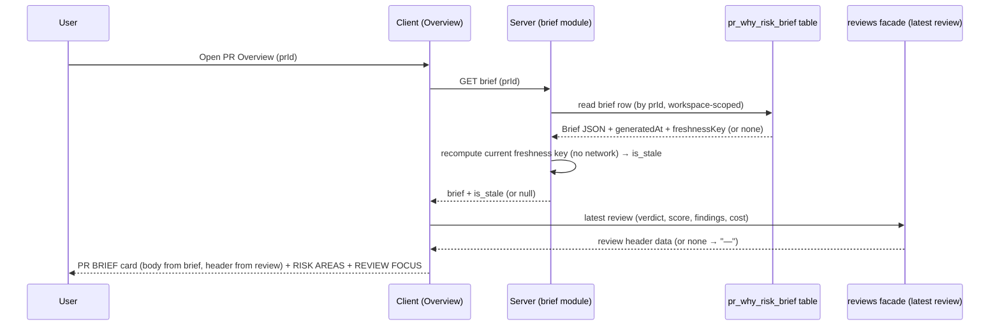
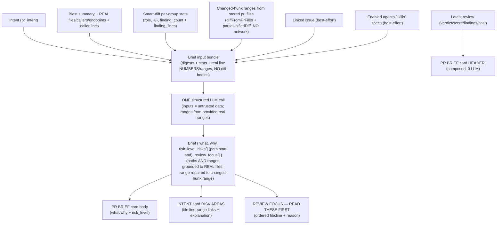

# Spec: Why+Risk Brief | Spec ID: SPEC-2026-07-05-why-risk-brief | Status: approved
Supersedes: — | Superseded by: —

> Re-approved on 2026-07-06 after the 2026-07-06 draft cycle: both change
> packages — (1) the "mandatory line-range in risk refs" change request
> (AC-1/AC-3/AC-4/AC-5 updates + new AC-22..AC-26) and (2) the English-only
> localization sync (AC-17 + related sections) — were explicitly approved by the
> user. The spec has zero open `[NEEDS CLARIFICATION]` items. (The Status was
> transiently reset to `draft` for this cycle; change history is git's job.)

## Problem & context

A reviewer opening a pull request today has to reconstruct the "so what" of a PR
by hand: read the diff, guess the author's intent, mentally trace what the change
can break, and decide where to look first. DevDigest already computes most of the
raw material for that judgement — the **intent** (`pr_intent`), the deterministic
**blast radius** (impact map from repo-intel), the **smart-diff** reviewer-ordered
groups (`core` / `wiring` / `boilerplate` with per-file stats), the linked GitHub
**issue**, and any project **specs** attached to reviewer agents/skills — but none
of it is fused into a single human answer to "what does this PR do, why, how risky
is it, and what should I read first?".

**Why+Risk Brief** is that fusion. On the PR page (Overview tab) it presents a
concise **PR BRIEF** card (what the PR does + why + a colour-coded risk level),
reworks the existing INTENT-card **RISK AREAS** so every risk points to a REAL
file from the blast map (with a file:line-range link and an expandable
explanation), and adds a full-width **REVIEW FOCUS — READ THESE FIRST** ordered
list of the highest-value places to look, each a clickable `file:line` link with a
one-line reason.

It follows the established house pattern **"code collects the facts, the model
writes the narrative"**: a new `POST /pulls/:id/brief` route assembles its input
entirely from **already-computed** artifacts — intent + blast summary + smart-diff
per-group statistics + the linked issue + the specs attached to the workspace's
enabled reviewer agents/skills — makes **exactly one** structured LLM call that
returns a `Brief { what, why, risk_level, risks[], review_focus[] }`, and persists
it per PR. Crucially the input carries **no diff bodies / hunks / file contents**:
only the pre-digested summaries and statistics, so the brief is cheap and never
re-sends the patch. Re-opening the PR serves the cached brief with **zero** LLM
calls; a **Regenerate** button recomputes it; an **Outdated** badge appears when
the PR's output-determining inputs have drifted since the brief was generated.

The PR BRIEF card's header (verdict badge, "N findings · M blockers" pill, the
"PR SCORE" gauge, and the cost line) is **not** produced by the brief — it is
**composed** from the latest *review* artifact (`ReviewRecord.verdict` /
`.score` / findings + per-run `cost_usd`), so surfacing it costs zero extra LLM
calls. The brief supplies only the card *body* (the what/why prose + the
`risk_level` badge). The two artifacts are decoupled: a brief with no review shows
"—" in the header; a review with no brief shows a "Generate brief" body.

Substantial scaffolding this feature builds on already exists:
- `POST /pulls/:id/review` produces `Review { verdict, summary, score, findings[] }`
  and per-run `cost_usd` (see the run-cost feature) — the source of the card
  header.
- The `Intent` (`pr_intent`), `BlastRadius` + provenance, and `SmartDiff` group
  contracts and their services (`modules/reviews`, `modules/blast`,
  `modules/smart-diff`) already compute the brief's inputs.
- The linked issue is resolvable server-side from `pull.body`
  (`closes|fixes|resolves #N` → `container.github().getIssue(...)`), already done
  in `intent-service.ts`.
- Project-Context-Folder resolves specs attached to agents/skills (ordered path
  lists) and reads them from the read-only clone, best-effort.
- The `Risk` shape (`{ kind, title, explanation, severity, file_refs }`) already
  exists and is reused for `Brief.risks[]`.
- The `onboarding-generator` service is the reference for the single-flight
  per-repo/per-PR generation behind a workspace guard and the freshness/staleness
  meta pattern.
- The "Onboarding Tour" sidebar item and its `g o` shortcut already ship
  (`client/src/vendor/ui/nav.ts`) — recorded here as a verify-only requirement.

Intended outcome: for any PR, a reviewer opens Overview and immediately sees a
grounded brief (what/why/risk), risks that link to real files, and an ordered
"read these first" list — generated on demand from one structured LLM call over
already-computed facts, cached per PR, and honestly flagged when stale.

### Change request (approved 2026-07-06): risk refs must always carry a line range

The shipped feature under-delivered on the "file link **with a line range**"
promise (AC-3): although the client `IntentCard` already parses and deep-links
`path:N` / `path:N-M`, the pipeline that FEEDS it renders bare paths. Three
gaps were found in code (2026-07-06): (a) the input bundle strips all
line-level data — the assembler drops `BlastCaller.line` and reduces
`SmartDiffFile.finding_lines` to a mere `finding_count`, so the model has no
real ranges to cite; (b) the system prompt makes the range **optional**
("optionally suffixed with a line range"); and (c) grounding validates only the
PATH portion of each `file_refs` entry, so a range is never checked or repaired.

The approved fix keeps the house pattern "code collects the facts, the model
writes the narrative" and stays contract-shape-compatible: the `Risk` shape is
unchanged (the range still travels inside each `file_refs` string as
`path:start-end`), the brief is still stored as `jsonb`, and no DB migration or
UI change is required. What changes is:

1. **Range semantics — risk-specific lines via the model (hybrid).** The input
   bundle is enriched with the REAL line-level data the server already holds —
   changed-hunk new-side ranges reconstructed from the stored `pr_files` (no
   network), blast-caller lines, and smart-diff finding lines — and the prompt
   requires each `file_refs` entry to be a `path:start-end` chosen from those
   provided real ranges. The model picks the risk-relevant sub-range; the server
   supplies the real candidates.
2. **Mandatory range in rendered output.** A newly generated brief never
   persists a risk ref as a bare path. When the model omits or invents a range,
   the server deterministically repairs the ref to the file's changed-hunk range
   rather than dropping the range. Legacy briefs (generated before this change)
   keep their bare paths until regenerated — that is the only exception.
3. **Range grounding.** Grounding is extended from the path to the RANGE: a
   `file_refs` range that does not intersect the file's real changed-line set is
   dropped/repaired, mirroring the findings citation-grounding rule
   ("file:line must intersect a real hunk", `reviewer-core` grounding +
   `parseUnifiedDiff` new-side line numbers).

Bumping `BRIEF_PROMPT_VERSION` (part of the freshness key) flips the Outdated
badge on every previously stored brief, so a reviewer is prompted to regenerate
into the range-carrying format; regeneration stays manual per PR.

## Goals / Non-goals

### Goals
- A new **`POST /pulls/:id/brief`** route (regenerate) plus a **`GET /pulls/:id/brief`**
  read route (cached, zero LLM), workspace-scoped like every PR resource.
- **Deterministic input assembly** from ALREADY-computed artifacts, with **zero**
  new diff parsing and **no** change bodies (no diff hunks, no file contents, no
  raw patch): the stored `Intent`, the blast-radius `summary` + the real
  changed-file/caller/endpoint list from the impact map, the smart-diff
  **per-group statistics** (`role` + per-file `additions`/`deletions`/
  `finding_lines` counts), the linked issue (title/body, best-effort), and the
  union of specs attached to the workspace's **enabled** reviewer agents/skills
  (best-effort). **Plain line NUMBERS are permitted** in the bundle (approved
  2026-07-06): each real file carries the real line-level ranges the server
  already holds — the changed-hunk new-side ranges reconstructed from stored
  `pr_files` (no network), blast-caller lines, and smart-diff finding lines — as
  the grounding source for the mandatory risk-ref range. Diff hunks / file
  contents / raw patch remain forbidden.
- **Exactly one** structured LLM call (`completeStructured`, JSON-schema + Zod
  validated, reprompt-on-error) returning a `Brief { what, why, risk_level,
  risks[], review_focus[] }` per generation.
- **Real-path AND real-range grounding:** every `risks[].file_refs` and
  `review_focus[].path` must reference a REAL file (present in the blast-map /
  changed-file input); server-side grounding drops or repairs invented paths
  before persisting. For a newly generated brief the **range portion** of each
  `risks[].file_refs` entry is grounded too: a range that does not intersect the
  file's real changed-line set is dropped/repaired, and a missing/invalid range
  is repaired to the file's changed-hunk range so a risk ref is **never persisted
  as a bare path** (approved 2026-07-06). `review_focus[].line` stays optional
  (a file-level focus item may carry no line).
- **A new PR BRIEF card** at the top of Overview whose **body** renders the
  brief's `what`/`why` prose and a colour-coded `risk_level` badge, and whose
  **header is composed from the latest review** (verdict badge, "N findings ·
  M blockers" pill, PR SCORE gauge, cost line) — zero extra LLM calls; a
  **Regenerate** icon button; an **info** affordance; the **Outdated** badge when
  stale.
- **A full-width REVIEW FOCUS — READ THESE FIRST section** below the two-column
  cards: an ordered list with a count badge; each item is a clickable `file:line`
  link + a one-line reason.
- **Reworked RISK AREAS inside the INTENT card:** the INTENT card's RISK AREAS now
  renders the brief's `risks[]` (real-path `file:line-range` link + severity +
  kind icon + an expander chevron revealing the explanation) instead of the
  standalone `Risks` artifact. For a **newly generated** brief every risk ref
  carries a mandatory `path:start-end` range (approved 2026-07-06); a legacy
  brief may still render a bare-path link until regenerated. No client change is
  required — the existing `IntentCard` `parseFileRef` already parses `path:N` /
  `path:N-M` and deep-links `#LN-LM`.
- **Per-PR cache** in a NEW table keyed by `pr_id` (carrying `workspace_id`),
  storing the `Brief` JSON, a `generated_at` timestamp, and a `freshness_key`.
  Re-opening the PR serves the cached brief with **zero** LLM calls.
- **Freshness / Outdated badge:** a `sha256` freshness key over
  `[headSha, base, title, body, brief-model provider+model, BRIEF_PROMPT_VERSION,
  storedIntent.freshnessKey]`, computed on read with **no** network; `is_stale`
  when the stored key differs from the current key.
- **Single-flight per PR behind the workspace guard:** concurrent/duplicate
  `POST /pulls/:id/brief` (double-click Regenerate) coalesce to one in-flight
  generation; the cache write is an idempotent upsert.
- **A new `FeatureModelId` registry slot** for the brief's single structured call,
  with a built-in default and a per-workspace override in Settings.
- **i18n (single locale `en`)** for every new user-facing string via next-intl
  (DevDigest ships ONLY `en` — English-only localization, AGENTS.md).
- **Deterministic e2e for AC-3 over SEEDED data** (approved 2026-07-06): one
  agent-browser flow asserts that RISK AREAS renders a `path:N-M` row and that
  the expander reveals the risk's explanation. The e2e package forbids LLM calls
  (`e2e/AGENTS.md`: no `chat`; `wait --text` locators are the assertions), so the
  flow runs against a SEEDED brief — the demo seed (`server/src/db/seed.ts`) is
  extended with a stored `pr_intent` + a `pr_why_risk_brief` row for PR #482
  (whose `pr_files` / findings already reference `src/config.ts:12` and
  `src/middleware/ratelimit.ts`), so the assertion is deterministic and
  LLM-free.
- **Verify-only:** the "Onboarding Tour" WORKSPACE nav item + `g o` shortcut are
  already shipped and must remain present (no new work).

### Non-goals (explicitly out of scope)
- **A verdict / score / blockers / cost from the brief itself.** Those are
  review-derived and composed into the card header. The brief LLM output carries
  no verdict/score/cost; introducing a second, possibly-conflicting verdict is out
  of scope.
- **Triggering a review from the brief.** The Regenerate button recomputes ONLY
  the brief; it never runs `POST /pulls/:id/review`. The two artifacts are
  independent.
- **Sending diff bodies / hunks / file contents / raw patch to the model.** The
  brief input is digests, statistics, and plain line NUMBERS/ranges only; the
  patch text is never re-sent (that is what makes the brief cheap). The
  2026-07-06 change permits real line NUMBERS (changed-hunk ranges, caller lines,
  finding lines) into the bundle as the grounding source for the mandatory risk
  range — it does NOT relax the ban on diff hunks, file contents, or raw patch.
- **Flagging Outdated on linked-issue or attached-spec edits.** The freshness key
  deliberately EXCLUDES the linked issue and the Context-Folder spec contents
  (including either would force a GitHub call / clone read on every `GET`, and the
  write/read keys must use identical inputs). Editing the issue or the attached
  specs does NOT auto-flag the brief; a manual **Regenerate** refreshes it. This
  limitation is surfaced in the UI copy.
- **Per-PR spec relevance / a "flash selector".** Spec selection is the union of
  specs attached to the workspace's enabled reviewer agents/skills — there is no
  per-PR relevance ranking (auto-selection per PR is an explicit future non-goal
  of the project-context feature).
- **Migrating the existing `pr_brief` (`Risks`) table.** The new brief lives in a
  NEW table; the existing `pr_brief`/`Risks` rows and their storage are untouched.
  See the migration note under "Contracts / migration note" for the standalone
  `Risks` Recompute's fate.
- **Base-branch advancing / new-symbol staleness beyond the freshness key.** The
  key uses the persisted `pull` row; freshness is only as fresh as the last PR
  sync (same accepted caveat as review-freshness).
- **New embedding / RAG work.** Zero embedding calls.

## User stories

- **US-1** — As a reviewer, when I open a PR's Overview I see a PR BRIEF card that
  tells me what the PR does, why, and how risky it is, plus (composed from the
  latest review) its verdict, finding/blocker counts, score, and cost.
- **US-2** — As a reviewer, I can read a REVIEW FOCUS — READ THESE FIRST list that
  points me, in order, at the exact `file:line` places to look and why.
- **US-3** — As a reviewer, the RISK AREAS in the INTENT card link to REAL files
  **with a line range** (`file:start-end`) — so I jump to the exact lines, not the
  top of the file — and expand to show each risk's explanation. (Legacy briefs
  generated before the range became mandatory may show a bare-path link until
  regenerated.)
- **US-4** — As a user, I can **Regenerate** the brief on demand; re-opening the PR
  serves the cached brief without a new LLM call; I can see when it's **Outdated**.
- **US-5** — As a user, when no brief has been generated yet I see a friendly
  "Generate brief" state; when no review has run the card header shows "—" instead
  of a fake verdict/score.
- **US-6** — As a maintainer, I can pick the model used for the brief's single
  structured call in Settings.

## Design analysis

**Sources.** Two mockup screenshots described textually by the requester (the
agent did not view the images); the transcription in the task is the design of
record. No exported assets exist under
`docs/specs/assets/SPEC-2026-07-05-why-risk-brief/` at spec time — when they are
added, the Traceability "Design ref" column should point to the concrete files.
The design was cross-checked against the codebase so terminology matches reality
(the review verdict/score, the Intent/RISK AREAS card, the Blast Radius card, the
smart-diff groups, the run-cost badge, and the sidebar nav all exist).

### Screen & state inventory
1. **Sidebar (verify-only).** WORKSPACE group already contains "Onboarding Tour"
   (icon `Workflow`, `g o` shortcut) between "Pull Requests" and "Project
   Context"; this must remain. No new nav work → AC-20.
2. **PR header / tabs (context, unchanged).** Breadcrumb, PR title, author,
   branch, `+247 −38`, "opened 3h ago", status badge, "View on GitHub" / "Run
   Review ▾" / "Compose review"; Overview / Agent runs / Files changed tabs. Not
   part of this feature except that the PR BRIEF card is the first block of
   Overview.
3. **PR BRIEF card (new, top of Overview).**
   - **Left/body (brief-sourced):** the what/why summary prose paragraph; a
     colour-coded `risk_level` badge; an **info** affordance explaining the brief.
   - **Header (review-composed):** a verdict icon + label (e.g. red circle-X
     "Request changes"); a pill "N findings · M blockers"; a circular **PR SCORE**
     gauge (e.g. "61 / PR SCORE" with a coloured arc); a **cost line** (e.g.
     "$0.014 · 8.2K→1.3K" — cost + input→output tokens).
   - **Actions:** a **Regenerate** (circular-arrow) icon button; the **Outdated**
     badge when stale.
   - Covered by AC-6 (body), AC-7 (composed header), AC-8 (empty/partial states),
     AC-9 (regenerate), AC-14 (outdated).
4. **INTENT card RISK AREAS (reworked).** Each risk row: severity/type icon +
   title + a REAL file link with a **mandatory** line range (e.g.
   `src/middleware/ratelimit.ts:12-18`) + an expander chevron revealing the
   explanation. Fed by the brief's `risks[]` (not the standalone `Risks`
   artifact) → AC-3, AC-5, AC-22, AC-24. For a newly generated brief the
   `start-end` range is always present; a legacy brief may render a bare-path
   link (the client's `parseFileRef` degrades a range-less ref to a plain path
   link) → AC-3 (legacy note). In-scope/out-of-scope lists stay as today.
5. **BLAST RADIUS card (context, unchanged).** Stats row, Tree/Graph toggle,
   per-symbol callers, endpoint/cron chips, prior-PRs collapsed section. Not part
   of this feature except as the SOURCE of the real files that ground `risks[]`
   and `review_focus[]`.
6. **REVIEW FOCUS — READ THESE FIRST section (new, full-width, count badge).** An
   ordered list; each item = a clickable `file:line` link + a one-line reason
   (e.g. "src/config.ts:12 — live Stripe key committed in plaintext"). Fed by the
   brief's `review_focus[]` → AC-2, AC-4.
7. **Files changed tab (context, out of scope).** The existing smart-diff feature;
   relevant only as the SOURCE of the per-group diff statistics fed to the brief.

### Gap sweep (each gap → an AC or an explicit decision)
- **No brief generated yet** — friendly "Generate brief" body; header still shows
  review data (or "—") → AC-8.
- **No review run yet** — header fields show "—" while the brief body renders →
  AC-7, AC-8.
- **Loading state** — Overview loading the cached brief → AC-15.
- **Generation in progress** — progress affordance; Regenerate disabled → AC-10.
- **Double-click Regenerate / concurrent POSTs** — single-flight per PR; coalesce
  → AC-11.
- **Regenerate racing a PR head-sync / cache read racing a write** — upsert cache
  write; the read serves whatever is committed; the freshness key catches a head
  move on the next read → AC-11, AC-14, AC-19.
- **LLM fails / invalid schema after retries** — no partial persist; error state;
  prior brief intact → AC-13.
- **Model invents a file path** — real-path grounding drops/repairs it → AC-5.
- **Model omits / invents the line RANGE on a risk ref** — the range is
  mandatory in a new brief: the server repairs the ref to the file's
  changed-hunk range rather than persisting a bare path; a range that does not
  intersect the file's real changed lines is dropped/repaired → AC-22, AC-24.
- **Bundle has no real line data for a file** (e.g. a blast-caller file with no
  stored `pr_files` patch) — the enrichment is best-effort/nullish, so grounding
  falls back gracefully: if no real range exists to repair to, the ref keeps only
  a validated real path (the legacy-style degradation) rather than throwing →
  AC-23, AC-24.
- **Legacy brief (pre-change, bare paths)** — kept as-is until regenerated; the
  prompt-version bump flags it Outdated, prompting a manual Regenerate that
  produces range-carrying refs → AC-3 (legacy note), AC-25.
- **Empty inputs** (no intent, degraded blast, no smart-diff, no issue, no specs)
  — best-effort: drop the missing section from the input, never throw; the brief
  still generates from whatever facts exist → AC-12.
- **Long text (single locale `en`)** — all new UI strings via next-intl (the
  single shipped locale is `en`); layout tolerates long English strings → AC-17.
- **Accessibility** — expander chevrons keyboard-operable; ordered list + links
  focus order; Regenerate/Outdated announced (aria-live); gauge has a text
  equivalent → AC-18.
- **Responsive** — card, focus list, and risk rows usable at narrow widths →
  AC-18.
- **Permission / authz** — brief read + generation workspace-scoped like every
  resource → AC-16.
- **Injection safety** — all assembled inputs are untrusted repo/author data; the
  model output is untrusted content rendered as data; file links to out-of-diff
  files must not enable protocol/script injection → AC-12, AC-5, AC-18.

## Acceptance criteria (EARS)

Numbering is append-only and permanent.

- **AC-1** [Event-driven] WHEN the user activates **Generate** / **Regenerate**
  for a PR, the system shall (a) assemble the brief input from ALREADY-computed
  artifacts — the stored `Intent`, the blast-radius `summary` + real
  changed-file/caller/endpoint list, the smart-diff per-group statistics, the
  linked issue (best-effort), and the union of specs attached to the workspace's
  **enabled** reviewer agents/skills (best-effort) — including plain line
  NUMBERS/ranges (changed-hunk new-side ranges, blast-caller lines, smart-diff
  finding lines) but **without** any diff hunks, file contents, or raw patch,
  (b) make exactly one structured LLM call returning a `Brief` validated against
  its Zod schema, and (c) persist the result (`Brief` JSON + `generated_at` +
  `freshness_key`) keyed by `pr_id`, overwriting any prior brief for that PR.
- **AC-2** [Event-driven] WHEN a stored brief is rendered, the system shall show a
  full-width **REVIEW FOCUS — READ THESE FIRST** section: an ordered list of
  `review_focus[]` items, each a clickable `file:line` link plus a one-line
  reason, with a count badge equal to the number of items.
- **AC-3** [Event-driven] WHEN a stored brief is rendered, the system shall render
  its `risks[]` inside the INTENT card's **RISK AREAS** subsection — each risk as
  a row with a severity/kind icon, a title, a REAL file link with a line range
  (`path:start-end`), and an expander chevron that reveals the risk's explanation
  — instead of the standalone `Risks` artifact. For a brief generated after the
  range became mandatory (AC-22) every risk-ref link carries a `start-end` range;
  a LEGACY brief (generated before this change, bare paths) shall still render
  its risk refs as plain file-path links until regenerated (no client change is
  required — `parseFileRef` handles both forms).
- **AC-4** [State-driven] WHILE grounding `review_focus[]` and `risks[]` before
  persistence, the system shall constrain every `review_focus[].path` and the PATH
  portion of every `risks[].file_refs` entry to a REAL file present in the
  assembled input (blast-map / changed files); the server shall drop or repair any
  path the model invents, so no fabricated path is stored or rendered.
- **AC-5** [Unwanted behavior] IF the model returns a `risks[]` or `review_focus[]`
  entry whose path is not a real file from the input, THEN the system shall not
  persist that fabricated path (drop the entry, or — for a `risks[].file_refs`
  entry — drop just that ref while keeping the risk's title/explanation/severity)
  and shall still persist the rest of the brief.
- **AC-6** [Event-driven] WHEN a stored brief is rendered, the system shall show a
  **PR BRIEF** card whose body renders the brief's `what` and `why` prose and a
  colour-coded badge for `risk_level`, plus an info affordance describing the
  brief.
- **AC-7** [State-driven] WHILE a PR BRIEF card is shown, the system shall COMPOSE
  its header from the latest **review** artifact — a verdict badge (from
  `ReviewRecord.verdict`), a "N findings · M blockers" pill (finding count and
  CRITICAL-severity count from the review's findings), a PR SCORE gauge (from
  `ReviewRecord.score`), and a cost line (cost + input→output tokens from the
  review run) — making **zero** additional LLM calls; WHEN no review exists for the
  PR, the header fields shall render as "—".
- **AC-8** [State-driven] WHILE no brief is stored for a PR, the system shall show
  a friendly "Generate brief" empty state in the card body (with a Generate
  action) and shall make no LLM call until the user invokes it (no
  auto-generation on page open); the composed header shall still render review data
  (or "—") independently.
- **AC-9** [Event-driven] WHEN the user clicks the Regenerate icon button, the
  system shall recompute ONLY the brief (it shall NOT trigger a review run) and, on
  success, replace the stored brief and refresh the rendered card body, RISK
  AREAS, and REVIEW FOCUS.
- **AC-10** [Event-driven] WHEN a brief generation is in progress, the system
  shall show a progress affordance and disable the Generate/Regenerate control
  until it settles.
- **AC-11** [Unwanted behavior] IF the user activates Regenerate while a generation
  for the SAME PR is already in progress (double-click) or a concurrent
  `POST /pulls/:id/brief` arrives, THEN the system shall not start a second
  concurrent generation (single-flight per PR, behind the workspace guard) and
  shall coalesce to the in-flight generation; the cache write shall be an
  idempotent upsert so two writes cannot violate the `pr_id` primary key.
- **AC-12** [Unwanted behavior] IF any brief input artifact is missing, degraded,
  or errors during assembly (no intent, a degraded/empty blast map, no smart-diff,
  no resolvable issue, unreadable/absent specs), THEN the system shall drop that
  section from the input best-effort and continue the single generation over
  whatever facts remain, without throwing.
- **AC-13** [Unwanted behavior] IF the single structured LLM call fails or its
  output fails schema validation after the configured reprompts/retries, THEN the
  system shall not persist a partial brief, shall surface a non-blocking error
  state, and shall leave any previously stored brief intact.
- **AC-14** [State-driven] WHILE a stored brief's `freshness_key` differs from the
  freshly-computed current key — `sha256` over `[headSha, base, title, body,
  brief-model provider+model, BRIEF_PROMPT_VERSION, storedIntent.freshnessKey]`,
  computed on read with NO network — the system shall show an **Outdated** badge
  (icon + text, never colour alone) whose tooltip notes that editing the linked
  issue or attached specs does NOT flag Outdated (Regenerate refreshes); a NULL
  stored key (legacy) shall be treated as NOT stale.
- **AC-15** [Event-driven] WHEN the Overview is loading the cached brief, the
  system shall show a loading state (not an error and not a blank card).
- **AC-16** [Unwanted behavior] IF a request targets a brief read or generation
  for a PR outside the caller's workspace, THEN the system shall deny access
  (workspace scoping), consistent with every other resource.
- **AC-17** [State-driven] WHILE any user-facing string introduced by this feature
  is rendered, the system shall source it from next-intl in the single shipped
  locale `en` (no hardcoded text; no other `messages/<locale>` directory —
  English-only localization, AGENTS.md); model-authored brief text is content
  (not a UI string) and is generated in the configured language.
- **AC-18** [State-driven] WHILE the PR BRIEF card, RISK AREAS, and REVIEW FOCUS
  are in use, the system shall provide keyboard-operable risk expanders and focus
  links, correct focus order, an accessible text equivalent for the PR SCORE
  gauge, aria-live announcement of the Regenerate/Outdated state, and usable layout
  at narrow widths.
- **AC-19** [State-driven] WHILE a stored brief is read, the system shall make
  **zero** LLM calls and **zero** embedding calls (open = cache read only);
  generation shall make **exactly one** LLM call and **zero** embedding calls.
- **AC-20** [Event-driven] WHEN the client shell renders the sidebar, the system
  shall continue to show the already-shipped "Onboarding Tour" item (icon
  `Workflow`, WORKSPACE group, between "Pull Requests" and "Project Context") with
  its `g o` shortcut — a verify-only requirement, no new work.
- **AC-21** [State-driven] WHILE the brief input includes repo/author-derived or
  model-authored text (intent, blast summary, smart-diff summaries, issue text,
  attached spec contents, and the model's own `what`/`why`/`risks`/`review_focus`),
  the system shall treat all of it as UNTRUSTED data — assembled inputs wrapped as
  untrusted (never as generation instructions), model output rendered as data
  (no HTML/script execution), and file-link hrefs restricted to safe file/URL
  targets (no `javascript:` or other executable protocols).
- **AC-22** [State-driven] WHILE the model produces a `risks[].file_refs` entry for
  a NEWLY generated brief, the system shall persist that entry as
  `path:start-end` with a mandatory line range: WHEN the model's range is present
  and valid (see AC-24) the system shall keep it; WHEN the range is missing,
  malformed, or fails validation the system shall repair the entry to the file's
  changed-hunk range, so the persisted risk ref is **never a bare path**. (Legacy
  briefs are exempt — AC-3, AC-25.)
- **AC-23** [State-driven] WHILE assembling the brief input bundle, the system
  shall enrich each REAL file with the real line-level data the server already
  holds when it is available — the file's changed-hunk new-side line ranges
  reconstructed from the stored `pr_files` (no network), blast-caller lines, and
  smart-diff finding lines — and shall carry that data into the prompt as the
  grounding source for `file_refs` ranges; this enrichment is best-effort/nullish
  (a file with no available line data contributes no range), and no diff hunks,
  file contents, or raw patch are added (AC-1).
- **AC-24** [Unwanted behavior] IF a `risks[].file_refs` entry's range does not
  intersect the file's real changed-line set (the enriched real ranges for that
  path), THEN the system shall not persist that range — it shall repair the entry
  to the file's changed-hunk range when one exists, else drop the range portion
  (keeping the validated real path) — mirroring the findings citation-grounding
  rule that a `file:line` must intersect a real hunk.
- **AC-25** [Event-driven] WHEN the brief prompt changes for this feature, the
  system shall bump `BRIEF_PROMPT_VERSION` (folded into the freshness key), so
  every previously stored (legacy, bare-path) brief is computed as **Outdated** on
  the next read (AC-14) and the reviewer is prompted to regenerate into the
  range-carrying format; regeneration remains manual per PR (no auto-regenerate).
- **AC-26** [Event-driven] WHEN the AC-3 acceptance flow runs against SEEDED demo
  data (no LLM — `e2e/AGENTS.md` deterministic locators), the system shall render,
  for the seeded PR #482 brief, a RISK AREAS row whose file link shows a
  `path:N-M` range and whose expander reveals the risk explanation; the demo seed
  shall include a stored `pr_intent` and a `pr_why_risk_brief` row for PR #482 so
  the assertion is deterministic and LLM-free.

## Edge cases

| Edge case | Handling | AC |
|---|---|---|
| No brief stored | "Generate brief" body; header shows review/"—"; no auto-LLM | AC-8, AC-19 |
| No review run yet | Header fields render "—"; brief body still renders | AC-7 |
| Brief loading | Loading state, not blank/error | AC-15 |
| Generation in progress | Progress affordance; control disabled | AC-10 |
| Double-click Regenerate / concurrent POSTs | Single-flight per PR (behind workspace guard); coalesce; upsert write | AC-11 |
| Regenerate racing a PR head-sync | Generation uses the pull row at start; the freshness key catches the head move on the next read → Outdated | AC-11, AC-14 |
| Cache read racing a write | Read serves the committed row; upsert prevents PK conflict on concurrent writes | AC-11 |
| Missing/degraded input (intent/blast/smart-diff/issue/specs) | Drop that section best-effort; generate over the rest; never throw | AC-12 |
| LLM fails / invalid schema after retries | No partial persist; error state; prior brief intact | AC-13 |
| Model invents a file path | Path grounded to real files; fabricated path dropped/repaired | AC-4, AC-5 |
| Model omits / invents a risk-ref line range (new brief) | Range mandatory; repaired to the file's changed-hunk range; never a bare path | AC-22, AC-24 |
| Risk-ref range does not intersect the file's real changed lines | Range dropped/repaired to a changed-hunk range (findings-grounding parity) | AC-24 |
| File has no available real line data in the bundle | Best-effort nullish enrichment; ref keeps a validated real path only (no range) | AC-23, AC-24 |
| Legacy brief (pre-change, bare-path refs) | Rendered as plain path links until regenerated; flagged Outdated by the prompt-version bump | AC-3, AC-25 |
| Stored brief older than the current inputs (head/title/body/model/prompt/intent) | Outdated badge; no auto-regenerate | AC-14 |
| Linked issue OR attached spec edited (no head move) | NOT flagged Outdated (excluded from key); Regenerate refreshes; caveat in tooltip | AC-14 (decision) |
| Cross-workspace access to a brief / generation | Denied (workspace scoping) | AC-16 |
| Out-of-diff file link (blast caller with no diff row) | Deep-link to the repo host (e.g. GitHub blob) via the existing out-of-diff link pattern; safe protocol only | AC-18, AC-21 |
| Standalone `Risks` Recompute superseded by brief | RISK AREAS now reads the brief; old `Risks`/Recompute path's fate is a migration note (Contracts) | — (migration note) |
| "Onboarding Tour" nav item / `g o` | Already shipped; verify present, add nothing | AC-20 |

## Workflows & service communication

### 1. Open a PR (serve the cached brief, compose the review header) — zero LLM

Opening Overview reads the persisted `Brief` (or none) and computes `is_stale` on
read (no network); the card header is composed from the latest review artifact.
No LLM or embedding call occurs.



The client fetches the review header from the existing reviews query it already
holds on the PR page; the brief endpoint itself never calls the LLM on read.

### 2. Generate / Regenerate — facts collected by code, narrative by the model

A generation runs under a per-PR single-flight behind the workspace guard,
assembles the input from already-computed artifacts (digests + stats + real line
NUMBERS/ranges, no diff bodies), makes exactly one structured LLM call, grounds
paths AND risk-ref ranges to real files/changed-lines, and upserts.

```mermaid
sequenceDiagram
  participant U as User
  participant API as brief service (single-flight per PR)
  participant Intent as intent (pr_intent)
  participant Blast as blast facade (impact map + summary)
  participant SD as smart-diff (per-group stats)
  participant GH as github (linked issue, best-effort)
  participant Specs as project-context (agent/skill specs, best-effort)
  participant LLM as LLMProvider.completeStructured
  participant DB as pr_why_risk_brief table
  U->>API: POST /pulls/:id/brief (Regenerate)
  API->>API: assertPull(workspaceId, prId) BEFORE coalescing (AC-16)
  API->>Intent: read stored intent
  API->>Blast: blast summary + real files/callers/endpoints + caller lines
  API->>SD: per-group diff stats + finding_lines (no hunks)
  API->>API: reconstruct changed-hunk ranges from stored pr_files (diffFromPrFiles + parseUnifiedDiff, NO network)
  API->>GH: resolve linked issue (best-effort; drop on error)
  API->>Specs: union of enabled agents'/skills' attached specs (best-effort)
  Note over API: input = digests + stats + real line NUMBERS/ranges ONLY (NO diff bodies)
  API->>LLM: one structured call (inputs as untrusted data → Brief schema; ranges from provided real ranges)
  LLM-->>API: Brief { what, why, risk_level, risks[] (path:start-end), review_focus[] }
  API->>API: ground risks[].file_refs & review_focus[].path to REAL files AND ranges; repair missing/non-intersecting range to changed-hunk range (AC-4/5/22/24)
  alt valid
    API->>DB: upsert brief (json, generatedAt=now, freshnessKey) by prId
    API-->>U: brief
  else invalid after retries / call failed
    API-->>U: error state (prior brief left intact)
  end
```

### 3. Inputs → the one call → the three UI surfaces

The assembler maps already-computed artifacts to one input bundle; one validated
`Brief` fans out to the card body, the reworked RISK AREAS, and REVIEW FOCUS.



The single generation is the sole authority for the brief body/risks/focus; the
card header is composed separately from the latest review. The bundle now also
carries real line NUMBERS/ranges (changed-hunk ranges, caller lines, finding
lines), so the model can emit a `path:start-end` risk ref and the server can
ground/repair that range to the file's real changed lines before persisting.

## Contracts (shape-level)

All shapes are shape-level only (field + type + semantics). NEW contracts ship as
a NEW file under `@devdigest/shared` (existing barrels are extended, never edited
in place — server INSIGHTS: the server copy is the source of truth; run the shared
sync so the client copy mirrors it). `Brief.risks[]` reuses the EXISTING `Risk`
shape (`brief.ts`).

### `Brief` document (NEW file — stored in the new table)
| Field | Type | Semantics |
|---|---|---|
| `what` | string | What the PR does — concise prose (model-authored). Rendered as data. |
| `why` | string | Why the PR exists / its intended outcome (model-authored). Rendered as data. |
| `risk_level` | enum `high` \| `medium` \| `low` | Overall merge-risk level → the colour-coded badge in the card body. Exactly these three values, aligned with the existing `RiskSeverity` enum; there is NO `critical` level (resolved decision). |
| `risks` | `Risk[]` (EXISTS, UNCHANGED) | Reworked risk areas. Each `Risk { kind, title, explanation, severity, file_refs }`; the line range travels INSIDE each `file_refs` string as `path:start-end` (the contract is not widened). For a newly generated brief each `file_refs` entry is grounded to a REAL file AND a REAL, intersecting range (AC-4, AC-22, AC-24) — never a bare path. Drives the INTENT-card RISK AREAS rows (AC-3). |
| `review_focus` | `ReviewFocusItem[]` | Ordered "read these first" items (AC-2). |

`ReviewFocusItem` (NEW):
| Field | Type | Semantics |
|---|---|---|
| `path` | string | Repo-relative REAL file path (grounded — AC-4), e.g. `src/config.ts`. |
| `line` | integer (nullish) | Line number for the `file:line` link; nullish when file-level. |
| `reason` | string | One-line reason to look here (model-authored). Rendered as data. |

**Invariants:** every `risks[].file_refs` entry and every `review_focus[].path`
is a real path from the assembled input (never invented — AC-4/5); for a NEWLY
generated brief every `risks[].file_refs` entry is a `path:start-end` whose range
intersects the file's real changed-line set (never a bare path — AC-22/AC-24),
repaired to the file's changed-hunk range when the model omits/invents it (a
legacy brief is exempt — AC-3/AC-25); `review_focus[]` order is the rendered
order; the document validates against its Zod schema before persistence (AC-13).
The `Risk` / `ReviewFocusItem` Zod shapes are UNCHANGED — the range is a string
convention inside `file_refs`, not a new field.

### Brief input bundle (NEW file under `@devdigest/shared` — shape only)
The deterministic bundle assembled from already-computed artifacts and passed (as
untrusted data) into the single LLM call. Contains NO diff bodies/hunks/file
contents/raw patch. The 2026-07-06 change ADDS nullish line-data fields
(backward compatible — extend the existing `why-risk-brief.ts` contract file, not
the barrel).
| Field | Type | Semantics |
|---|---|---|
| `intent` | `Intent` (EXISTS, nullish) | Stored intent (`intent` + in/out scope). Dropped when absent (AC-12). |
| `blast_summary` | string (nullish) | The blast-radius one-paragraph summary. |
| `blast_files` | `{ path, callers?, endpoints?, caller_lines?, changed_ranges? }[]` | REAL changed files + impacted callers/endpoints from the impact map — the grounding source for real paths (AC-4). NEW (2026-07-06, nullish): `caller_lines` = the blast callers' line numbers for this file; `changed_ranges` = the file's changed-hunk new-side line ranges reconstructed from stored `pr_files` (`diffFromPrFiles` + `parseUnifiedDiff`, NO network). These are the grounding source for the mandatory risk-ref range (AC-22/AC-23/AC-24). |
| `smart_diff_groups` | `{ role, files: { path, additions, deletions, finding_count, finding_lines? }[] }[]` | Per-group statistics only (no `patch`, no hunks). NEW (2026-07-06, nullish): `finding_lines` = the file's real smart-diff finding line numbers (previously reduced to `finding_count`) — a contributor to the file's real changed-line set for range grounding (AC-23/AC-24). |
| `linked_issue` | `{ number, title, body }` (nullish) | Best-effort; dropped on error/absence (AC-12). |
| `specs` | `{ path, content }[]` | Union of specs attached to the workspace's ENABLED reviewer agents/skills, read from the read-only clone best-effort (dropped on error — AC-12). |

**Invariants:** assembled with zero new diff parsing beyond the existing
`diffFromPrFiles`/`parseUnifiedDiff` reconstruction from stored `pr_files` and no
raw patch in the bundle (AC-1); the new line-data fields are best-effort/nullish
(a file with no available line data contributes no range — AC-23); degraded/
missing artifacts are dropped rather than aborting (AC-12); everything is treated
as untrusted data at prompt assembly (AC-21).

### Persistence (NEW table — shape only; exact name finalized in the plan)
| Field | Type | Semantics |
|---|---|---|
| `pr_id` | uuid (PK → `pull_requests.id`, cascade) | One brief per PR. |
| `workspace_id` | uuid | Multi-tenancy column (every domain table carries it); the brief is workspace-scoped (AC-16). |
| `json` | jsonb | The `Brief` document. |
| `generated_at` | timestamptz (default now) | Set on each generation; drives "generated X ago". |
| `freshness_key` | text (nullable) | `sha256` over the output-determining inputs; drives `is_stale` (AC-14). NULL (legacy) ⇒ not stale. |

### API surface (shape-level — endpoints finalized in the plan)
| Operation | Direction | Semantics |
|---|---|---|
| Get brief | client → server | `GET /pulls/:id/brief` → the stored `Brief` + `is_stale` (computed on read, no network), or "none" (empty state). Zero LLM. Workspace-scoped. |
| Generate / Regenerate | client → server | `POST /pulls/:id/brief` → assemble input + one structured LLM call + ground paths + upsert; single-flight per PR behind the workspace guard (AC-11); rate-limited (each call is an LLM run); returns the generated brief or an error (AC-13). |

The card HEADER data (verdict/score/findings/cost) is NOT a new endpoint — the
client composes it from the existing reviews query on the PR page (AC-7).

### Configuration (new registry slot + shape-only)
| Key | Type | Semantics |
|---|---|---|
| brief feature model | `FeatureModelId` (NEW slot) | Provider/model for the single structured call, from Settings, with a registry default (mirrors `onboarding` / `risk_brief`). Exact id + default finalized at plan time. |
| `BRIEF_PROMPT_VERSION` | integer constant | Bumped by hand on any brief-prompt change; folded into the freshness key (mirrors `INTENT_PROMPT_VERSION` / `RISKS_PROMPT_VERSION`). **The 2026-07-06 mandatory-range prompt change bumps this constant** (currently `1` → next value), flipping all previously stored briefs to Outdated so they regenerate into the range-carrying format (AC-25). |

### Migration note (existing `Risks` pipeline)
The standalone `Risks` artifact (`pr_brief` table, `GET/POST /pulls/:id/risks`,
`analyzeRisks`) is **superseded** for display: the INTENT-card RISK AREAS now
renders the brief's `risks[]` (AC-3). The existing `pr_brief`/`Risks` rows and
storage are **untouched** (decision 3). **Resolved decision:** the standalone
`GET/POST /pulls/:id/risks` endpoints and `analyzeRisks` are kept **dead-but-present
for one release** — the UI stops calling them (the `IntentCard` `handleRecompute`
intent→risks sequence is rewired to the brief Regenerate), the endpoints remain
in place unused, and their removal is a **separate follow-up**, not part of this
feature. The plan should record the UI rewire and the "leave endpoints in place"
posture; it must NOT delete the risks endpoints.

### Migration note (legacy `pr_why_risk_brief` rows — 2026-07-06 range change)
The mandatory-range change requires **no DB migration**: the brief is stored as
`jsonb` in `pr_why_risk_brief.json` and the `Risk` contract is unchanged (the
range travels inside each `file_refs` string). Briefs generated **before** this
change (bare-path `file_refs`) stay valid on read and render as plain path links
(the client's `parseFileRef` degrades a range-less ref to a path link — AC-3
legacy note). Bumping `BRIEF_PROMPT_VERSION` (AC-25) flips those legacy rows to
Outdated on the next read, prompting a manual Regenerate that re-emits
range-carrying refs; there is NO automatic backfill/re-generation of stored
briefs. The plan must NOT add a data migration for this.

## Non-functional

- **Performance** — Opening a brief is a single DB read plus an on-read key
  recompute (no network). Generation is one structured LLM call over already-
  computed digests/statistics plus real line NUMBERS/ranges — no raw patch is
  sent to the model, so token cost is bounded and far below a full review. The
  changed-hunk ranges are reconstructed from the ALREADY-stored `pr_files`
  patches via the existing `diffFromPrFiles`/`parseUnifiedDiff` helpers (an
  in-process, no-network parse of data the server already holds — not a new diff
  fetch). Single-flight per PR (AC-11) bounds concurrent cost. **Requirement:**
  zero embedding calls; exactly one LLM call per generation; zero LLM calls to
  open a stored brief (AC-19); degrade by dropping missing input sections
  (including the new line-data — AC-23) rather than failing (AC-12).
- **Security** —
  - All assembled inputs (intent, blast summary, smart-diff summaries, issue
    title/body, attached spec contents) are UNTRUSTED repo/author data: wrapped as
    untrusted at prompt assembly with grounding rules so embedded "instructions"
    carry no authority (AC-21, OWASP A05 / Agentic ASI01); the model output is
    rendered as markdown/text **data**, never executable HTML/script (AC-21, OWASP
    A05 XSS) — reuse the app's safe renderer.
  - **Real-path AND real-range grounding** (AC-4/5/22/24) is a correctness AND
    safety control: the model cannot smuggle an arbitrary path OR an arbitrary
    line range into a rendered link; every path is validated against the real
    input file set, and every risk-ref range is validated to intersect the file's
    real changed lines (repaired to the changed-hunk range otherwise) before
    persist (Agentic ASI09 — validate generated content before storing).
  - **Link safety:** `file:line` links use safe targets only (in-app diff viewer
    for in-diff files; the existing out-of-diff repo-host deep-link for blast
    callers) — no `javascript:`/executable protocols in any href (AC-21, OWASP
    A05).
  - **Access control:** the brief and its generation are workspace-scoped; the
    workspace guard runs BEFORE single-flight coalescing so a foreign-workspace
    caller cannot coalesce onto another tenant's in-flight generation (AC-16,
    OWASP A01; server INSIGHTS: single-flight-behind-workspace-guard).
  - **No secrets:** the feature reads only already-computed artifacts and the LLM
    provider/key comes from the existing secrets/settings path; only token counts
    are logged, never the prompt payload.
- **Accessibility** — Risk expanders and focus links keyboard-operable; correct
  focus order; the PR SCORE gauge has a text equivalent (score value + label, not
  colour alone); Regenerate/Outdated announced via aria-live; usable at narrow
  widths (AC-18).
- **i18n (single locale `en`)** — Every new UI string via next-intl in the single
  shipped locale `en`; no other `messages/<locale>` directory is added
  (English-only localization, AGENTS.md); layout tolerates long English strings.
  Model-authored brief text is content generated in the configured language, not
  a UI string (AC-17).
- **Local-first** — Consistent with DevDigest's local-first model: inputs come
  from the local DB / index / read-only clone; the only external contact is the
  single LLM call the user explicitly triggers (plus the best-effort linked-issue
  fetch, which degrades to "dropped" on failure); the stored brief lives in the
  local Postgres.

## Inputs (provenance)

- `[reused: existing scaffolding]` — the `Review`/`ReviewRecord` verdict/score/
  findings + per-run `cost_usd` (card header — `modules/reviews`, run-cost
  feature); `Intent` (`pr_intent`) + `formatIntentForPrompt`; `BlastRadius` +
  provenance + real files/callers/endpoints (`modules/blast`, `modules/repo-intel`
  facade); `SmartDiff` per-group stats (`modules/smart-diff`); linked-issue
  resolution (`closes|fixes|resolves #N` → `container.github().getIssue`,
  `intent-service.ts`); project-context spec resolution (agent/skill attached
  paths → read from clone, best-effort); `LLMProvider.completeStructured`
  (`response_format: json_schema` + Zod `parseWithRepair` + reprompt; undici-fetch
  fix in the adapters); the freshness-key discipline + `is_stale` contract shape
  (`reviews/freshness.ts`, review-freshness plan); the single-flight-behind-
  workspace-guard + upsert-cache pattern (`onboarding-generator/service.ts`,
  server INSIGHTS 2026-07-05); `formatCost` / `RunCostBadge` (run-cost feature);
  the out-of-diff `githubBlobUrl` / `MonoLink` link pattern (client INSIGHTS
  2026-06-30); the `Risk` shape (`brief.ts`, UNCHANGED); the existing `IntentCard`
  RISK AREAS render + `parseFileRef` (`path:N` / `path:N-M` → `#LN-LM` deep-link,
  already tested at `IntentCard.test.tsx:111-222`); the "Onboarding Tour" nav item
  + `g o` shortcut (`nav.ts`). NEW reuse for the 2026-07-06 range change: the
  real line-level sources the server already holds — `BlastCaller.line`
  (`contracts/brief.ts`, dropped today by `toBlastFiles`), `SmartDiffFile.
  finding_lines` (reduced today to `finding_count` by `toSmartDiffGroups`), and
  the changed-hunk new-side ranges via `diffFromPrFiles`
  (`modules/reviews/diff-loader.ts`, reconstructs from stored `pr_files`, NO
  network) + `parseUnifiedDiff` (`lib/diff-parser.ts`, the same new-side
  line-number extraction the findings citation-grounding gate uses).
- `[deterministic: repo-intel]` — the real changed-file/caller/endpoint list that
  grounds `risks[]`/`review_focus[]` comes from the blast impact map via the
  `container.repoIntel` facade. `devdigest_get_blast_radius` /
  `devdigest_get_conventions` were NOT applicable — the DevDigest self-repo is not
  imported into repo-intel (the MCP indexes target review repos, not this
  codebase), consistent with both prior specs; impact was traced by directly
  reading the affected files.
- `[new: exactly 1 LLM call per generation]` — the single structured
  `completeStructured` call for the `Brief`; zero embedding calls; zero LLM calls
  to open a stored brief or to compose the review header.

## Untrusted inputs

- **Assembled brief inputs** (intent text, blast summary, smart-diff file
  summaries, linked-issue title/body, attached spec contents) — repo/author/
  contributor-controlled. Wrapped as untrusted at prompt assembly with grounding
  rules; never interpreted as generation instructions (AC-21).
- **Model-authored brief content** (`what`, `why`, `risks[]`, `review_focus[]`) —
  untrusted generated content: rendered as data (safe markdown/text, no
  HTML/script), paths constrained to real input files (AC-4/5) AND risk-ref ranges
  constrained to the file's real changed lines (AC-22/24 — the model cannot smuggle
  an arbitrary line range into a link), validated against the `Brief` Zod schema
  before persistence (AC-13). File-link hrefs restricted to safe targets (AC-21).
- **`prId` / `workspaceId` in requests** — used to scope the brief to its PR /
  workspace; access denied cross-workspace (AC-16); the workspace guard runs
  before single-flight coalescing (AC-11).

## Dependencies & impacts

- **Affected packages:**
  - `server/` — a new `brief` feature module (routes + service + repository)
    registered in `modules/index.ts`; a deterministic input assembler reading the
    existing intent/blast/smart-diff/issue/project-context facades; the
    single-flight generation orchestrator calling `container.llm.completeStructured`;
    real-path grounding of `risks[]`/`review_focus[]`; a NEW `pr_why_risk_brief`
    table (own migration, `pnpm db:generate`; MANUAL `pnpm db:migrate`); a new
    brief prompt (with untrusted-data + grounding rules) + `BRIEF_PROMPT_VERSION`;
    a new `FeatureModelId` slot + `FEATURE_MODELS` default; a `briefFreshnessKey`
    pure helper (mirrors `reviews/freshness.ts`).
  - `client/` — a new `PrBriefCard` at the top of the Overview tab (body from the
    brief, header composed from the latest review via the existing reviews query),
    a Regenerate icon button, an info affordance, an Outdated badge, and a PR SCORE
    gauge with a text equivalent; a new full-width REVIEW FOCUS section; the
    reworked INTENT-card RISK AREAS (file:line links + expander chevrons) now fed
    by the brief; a `useBrief` / `useRegenerateBrief` hook pair; reuse of
    `formatCost` / `RunCostBadge` and the out-of-diff link pattern; extended
    `messages/en` ONLY (the single shipped locale — no `messages/uk`; likely the
    existing `brief` namespace).
  - `server/src/vendor/shared` — NEW contract file(s): `Brief`, `ReviewFocusItem`,
    the brief input bundle, and the brief read record (`pr_id` + `is_stale`).
    Extend via new files; never edit the existing barrel; sync to the client copy.
  - `reviewer-core/` — likely a new pure brief-prompt builder + `BRIEF_PROMPT_VERSION`
    constant (mirrors intent/risks prompt builders), if the brief prompt is built
    the same way; the hash stays in the server layer (reviewer-core stays pure).
- **2026-07-06 mandatory-range change — touched surfaces (no new module, no
  migration, no UI change):**
  - `server/` — the brief **assembler** (`modules/brief/assembler.ts`) stops
    discarding line data: `toBlastFiles` carries `BlastCaller.line`, `toSmartDiffGroups`
    carries `finding_lines`, and a new best-effort step reconstructs each file's
    changed-hunk new-side ranges from stored `pr_files` via `diffFromPrFiles` +
    `parseUnifiedDiff` (no network); the brief **grounding**
    (`modules/brief/grounding.ts`) is extended from path-only to path+range
    (repair to changed-hunk range / drop non-intersecting range — AC-22/24); the
    **system prompt** (`prompts/why-risk-brief.system.md`) makes the range
    MANDATORY (drop "optionally") and instructs the model to pick `path:start-end`
    from the provided real ranges; the demo **seed** (`db/seed.ts`) gains a
    `pr_intent` + `pr_why_risk_brief` row for PR #482.
  - `reviewer-core/` — bump `BRIEF_PROMPT_VERSION` (currently `1`) for the prompt
    change (AC-25); the pure `buildBriefMessages` renders the new line-data fields.
  - `server/src/vendor/shared` — EXTEND the existing `why-risk-brief.ts` contract
    file (not the barrel) with the nullish line-data fields on `BriefBlastFile`
    (`caller_lines?`, `changed_ranges?`) and `BriefSmartDiffFile` (`finding_lines?`);
    the `Risk`/`Brief`/`ReviewFocusItem` shapes are UNCHANGED.
  - `e2e/` — one new deterministic flow asserting the seeded PR #482 RISK AREAS
    `path:N-M` row + expander (AC-26).
  - `client/` — NONE: `IntentCard.parseFileRef` + `githubBlobUrl` already handle
    `path:N-M`.
- **Contracts touched:** none broken — `Risk`/`Intent`/`BlastRadius`/`SmartDiff`/
  `Review`/`ReviewRecord` reused unchanged; `FeatureModelId` gains one enum value
  (additive, original build). The 2026-07-06 change adds only nullish fields to the
  brief-input-bundle contract (`BriefBlastFile`, `BriefSmartDiffFile`) — backward
  compatible; the `Brief`/`Risk`/`ReviewFocusItem` output contracts are unchanged.
- **Blast radius** `[deterministic: repo-intel]` — Not computed: the DevDigest
  self-repo is not imported into repo-intel, so `devdigest_get_blast_radius` /
  `devdigest_get_conventions` return "repository not found". Impact was traced by
  directly reading the affected files above. The most sensitive touch-points are
  the shared reviews facade (read-only consumption of intent/blast/smart-diff/
  review), the project-context spec resolver, and the `IntentCard` (its RISK AREAS
  ownership changes from the standalone `Risks` to the brief).

## Traceability

| AC | Story | Design ref | Verification | Plan phase |
|---|---|---|---|---|
| AC-1 | US-1, US-4 | screenshot 1: PR BRIEF card + Regenerate | integration: Regenerate → input assembled (line NUMBERS/ranges present, no diff bodies) + exactly 1 structured call + upsert | — |
| AC-2 | US-2 | screenshot 1: REVIEW FOCUS section | e2e (deterministic): stored brief → ordered focus list with count badge + file:line links | — |
| AC-3 | US-3 | screenshot 1: RISK AREAS rows | e2e (deterministic, seeded PR #482): RISK AREAS renders brief risks with `path:N-M` link + expander; legacy bare-path form via unit (client) | — |
| AC-4 | US-2, US-3 | screenshot 1: real file links | unit (server pnpm test): risks/focus paths grounded to real input files; invented path dropped/repaired | — |
| AC-5 | US-2, US-3 | — | unit (server pnpm test): fabricated path not persisted; risk kept unlinked; rest of brief persisted | — |
| AC-6 | US-1 | screenshot 1: card body + risk level | e2e (deterministic): card body shows what/why + risk_level badge + info affordance | — |
| AC-7 | US-1 | screenshot 1: verdict/pill/gauge/cost | unit (client): header composed from latest review (verdict/findings/blockers/score/cost); no review → "—"; 0 LLM | — |
| AC-8 | US-5 | screenshot 1: card states | e2e (deterministic): no brief → Generate body, no LLM on open; header independent | — |
| AC-9 | US-4 | screenshot 1: Regenerate icon | e2e (deterministic): Regenerate recomputes only the brief (no review triggered), refreshes card/risks/focus | — |
| AC-10 | US-4 | screenshot 1: Regenerate | e2e (deterministic): generating → progress shown, control disabled | — |
| AC-11 | US-4 | — | unit (server pnpm test): single-flight per PR behind workspace guard; concurrent Regenerate coalesces; upsert write | — |
| AC-12 | US-1 | — | integration: missing intent/blast/smart-diff/issue/specs dropped best-effort; generation continues | — |
| AC-13 | US-4 | — | unit (server pnpm test): LLM fail / invalid schema → no partial persist, prior brief intact | — |
| AC-14 | US-4 | screenshot 1: Outdated badge | integration: stored key vs current key → Outdated; issue/spec edit not flagged; legacy NULL not stale | — |
| AC-15 | US-1 | — | e2e (deterministic): brief loading state, not blank/error | — |
| AC-16 | all | — | integration: cross-workspace brief read/generation denied; guard before coalescing | — |
| AC-17 | all | screenshot 1 | manual: `en` strings present (single locale — no `messages/uk`), no hardcoded UI text | — |
| AC-18 | US-2, US-3 | screenshot 1: gauge, links, expanders | manual: keyboard expanders/links, focus order, gauge text equivalent, aria-live, narrow-width | — |
| AC-19 | US-1, US-4 | — | integration: open = 0 LLM; generation = exactly 1 LLM, 0 embeddings | — |
| AC-20 | — | screenshot 1: sidebar | e2e (deterministic): "Onboarding Tour" item present (WORKSPACE, between Pull Requests & Project Context) + g o shortcut | — |
| AC-21 | all | screenshot 1: real file links | unit (reviewer-core/server pnpm test): inputs wrapped untrusted; output rendered as data; hrefs safe-protocol only | — |
| AC-22 | US-3 | screenshot 1: RISK AREAS `file:line-range` | unit (server pnpm test): new brief risk ref persisted as `path:start-end`; missing/invalid range repaired to changed-hunk range; never a bare path | — |
| AC-23 | US-3 | — | unit (server pnpm test): assembler enriches blast_files with caller_lines + changed_ranges (from stored pr_files, no network) and smart-diff finding_lines; best-effort nullish when absent | — |
| AC-24 | US-3 | — | unit (server pnpm test): risk-ref range not intersecting the file's real changed lines → repaired to changed-hunk range, else range dropped keeping the real path | — |
| AC-25 | US-4 | screenshot 1: Outdated badge | unit (reviewer-core pnpm test): BRIEF_PROMPT_VERSION bumped; integration: legacy stored brief reads Outdated after the bump; no auto-regenerate | — |
| AC-26 | US-3 | screenshot 1: RISK AREAS `path:N-M` | e2e (deterministic, seeded): PR #482 RISK AREAS shows a `path:N-M` row + reveals explanation; seed carries pr_intent + pr_why_risk_brief for #482 | — |

## [NEEDS CLARIFICATION]

None — all open points are resolved. Originally approved by the user on
2026-07-05; the mandatory-range change request was approved on 2026-07-06 (see
below). This draft awaits re-approval of the 2026-07-06 changes.

Resolved decisions folded into the spec:
- **Standalone `Risks` endpoints' lifecycle** → kept dead-but-present for one
  release (UI stops calling them; removal is a separate follow-up). See the
  "Migration note (existing `Risks` pipeline)" under Contracts.
- **`Brief.risk_level` enum** → exactly `high | medium | low`, aligned with the
  existing `RiskSeverity`; no `critical` level. See the `Brief` document contract.

Approved decisions — mandatory line-range in risk refs (verbatim, user-approved
2026-07-06; folded into AC-1/AC-3/AC-4/AC-5 and new AC-22..AC-26):
1. **Range semantics — risk-specific lines via the LLM (hybrid).** Enrich the
   brief input bundle with REAL line-level data the server already holds —
   changed-hunk ranges reconstructed from stored `pr_files` (`diffFromPrFiles` +
   `parseUnifiedDiff`), blast-caller lines, smart-diff `finding_lines` — and
   require the prompt to emit `file_refs` as `path:start-end` chosen from the
   provided real ranges. (AC-1, AC-22, AC-23)
2. **AC-1 interpretation — spec updated first.** Plain line NUMBERS are allowed
   into the bundle; diff hunks, file contents, and raw patch remain forbidden.
   (AC-1, AC-23)
3. **Range is mandatory in the rendered output.** When the model's range is
   missing or fails validation, the server deterministically repairs the ref with
   the file's changed-hunk range (fallback) instead of persisting a bare path;
   grounding is extended to the RANGE portion (drop/repair when it does not
   intersect the file's real changed lines — mirroring the findings
   citation-grounding "must intersect a real hunk" rule). (AC-3, AC-4, AC-5,
   AC-22, AC-24)
4. **Scope includes e2e for AC-3.** One deterministic agent-browser flow (RISK
   AREAS renders a `path:N-M` row; the expander reveals the explanation) plus
   extending the demo seed (`server/src/db/seed.ts`) with a stored intent +
   why-risk brief for PR #482; the traceability matrix is updated accordingly.
   The e2e package forbids LLM calls (deterministic flows only), so the e2e AC is
   phrased against SEEDED data. (AC-26)

Legacy exception (all four): briefs generated before this change keep bare paths
until regenerated; the `BRIEF_PROMPT_VERSION` bump flags them Outdated (AC-25).

Approved decision — English-only localization (user-approved 2026-07-06; folded
into AC-17, the i18n goal, the Non-functional i18n note, the Design-analysis gap
sweep, and the client Dependencies entry):
- DevDigest ships **ONLY** the single locale `en` (AGENTS.md: "Localization is
  English-only"; decision 2026-07-06). Every new user-facing string is sourced
  from next-intl in `en`; NO additional `messages/<locale>` directory (e.g.
  `messages/uk`) is created and no multi-locale acceptance is required. The
  earlier "en + uk" wording was a stale carry-over and has been removed spec-wide;
  the AC-17 ID is unchanged (wording edited, not renumbered). The next-intl
  infrastructure stays; only the second-locale expectation is dropped.
