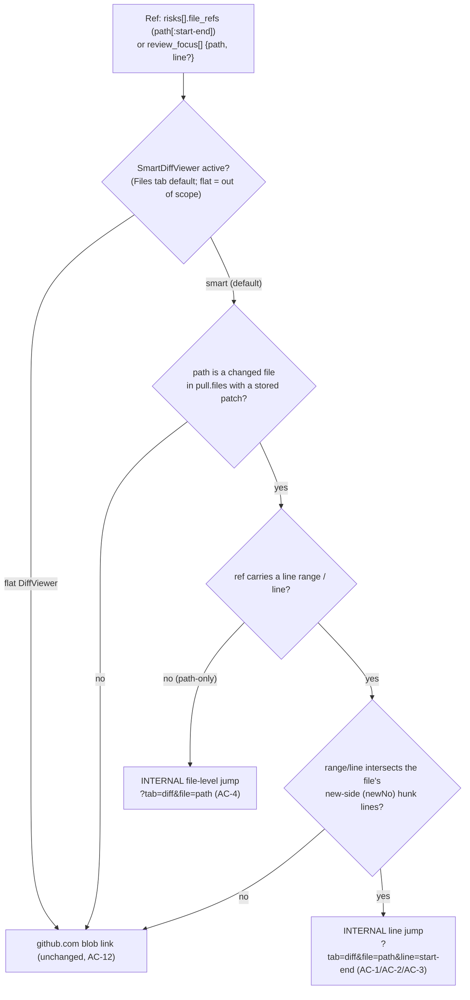

# Spec: In-diff deep-links for brief risk refs and review-focus items | Spec ID: SPEC-2026-07-06-in-diff-risk-ref-links | Status: approved
Supersedes: — | Superseded by: —

> Authored final on 2026-07-06 from user-approved English requirements and
> user-approved design decisions. Zero open `[NEEDS CLARIFICATION]` items — the
> scope-defining decisions (query-param transport, scroll-to-first-line +
> whole-range highlight, both `risks[].file_refs` and `review_focus[]` in scope,
> SmartDiffViewer-only, new-side line semantics, cascade fallback) were all made
> and approved before drafting. This spec captures WHAT/WHY only; the HOW belongs
> to the implementation plan (`docs/plans/`).

## Problem & context

On the PR detail page (Overview tab) two brief-derived surfaces point a reviewer
at the exact places to look:

- **RISK AREAS** inside the INTENT card renders the Why+Risk Brief's `risks[]`;
  each `risks[].file_refs` entry is a `path` or `path:start-end` string
  (SPEC-2026-07-05-why-risk-brief). Today the client parses that ref
  (`parseFileRef`) and builds a **github.com blob** link via
  `blobHref` → `githubBlobUrl` (`client/src/lib/github-urls.ts`), pinned to the
  PR head SHA.
- **REVIEW FOCUS — READ THESE FIRST** (`ReviewFocusSection`) renders the brief's
  `review_focus[]` `{ path, line?, reason }` items with the **same** github.com
  blob-link pattern.

The friction: DevDigest already renders the PR's full diff INTERNALLY (the
"Files changed" tab — its query value is `?tab=diff`), where the reviewer can
comment, see smart-diff grouping, and read findings in context. But every risk
ref and review-focus item bounces the reviewer OUT to github.com — a context
switch, a new tab, and a loss of the in-app review affordances — even when the
ref targets a file that IS in the current PR diff. The shared contract comment
already anticipates this: `client/src/vendor/shared/contracts/why-risk-brief.ts`
(lines ~21-23) notes a ref is "an in-diff jump or an out-of-diff blob link."

**This feature implements that intent.** When a ref's target is present in the
current PR diff, the link jumps INTERNALLY — Overview tab → Files tab (the
existing `SmartDiffViewer`) — opening the target group + file and scrolling to
the ref's first new-side line, temporarily highlighting the whole line range.
When the target is NOT in the current diff (a blast-radius caller file, a file
with no stored patch, or a stale brief whose refs no longer match the diff), the
link keeps today's github.com blob behavior unchanged — a **cascade fallback**
that guarantees no dead links.

Intended outcome: a reviewer reading the brief can jump straight into the
in-app diff for anything the PR actually changed, and still reaches the source
on github.com for everything else — with no server call, no new endpoint, and no
contract change, because the in-diff-vs-fallback decision is computed CLIENT-SIDE
from data the page already holds.

## Goals / Non-goals

### Goals
- On the PR detail page, each `risks[].file_refs` entry (IntentCard → RISK AREAS)
  and each `review_focus[]` item (ReviewFocusSection) links INTO the internal
  diff (Files tab, `SmartDiffViewer`) when its target path is a changed file in
  the current PR diff AND (for a ranged ref) its range intersects the file's
  new-side hunk lines.
- **Cascade fallback (never a dead link):** when the target path is not a changed
  file in the current diff, or the file has no stored patch, or the brief is
  stale and its refs no longer match the current diff, the link keeps today's
  github.com blob behavior UNCHANGED. A path-only ref (no range) whose path IS a
  diff file resolves to a file-level in-diff jump (open the file, no line scroll).
- **Client-side decision from already-fetched data:** the in-diff-vs-fallback
  decision is made entirely from `pull.files` (each `PrFile.patch`) and the
  hunks parsed from those patches — path membership plus new-side hunk-line
  intersection. No new API endpoint, no server/contract change, no new fetch.
- **Navigation via existing query-string tab state:** the internal jump reuses
  the PR route's `?tab=` mechanism, extended with `file` and `line` keys — e.g.
  `?tab=diff&file=server/src/modules/_shared/context.ts&line=4-11`. The deep link
  works on reload and when shared as a URL.
- **Open-then-scroll-then-highlight:** the diff view opens the containing group +
  FileRow, scrolls to the FIRST new-side line of the range, and temporarily
  highlights the whole line range.
- **New-side line semantics** (`ln.newNo`), matching the server-grounded
  `path:start-end` ranges, which are new-side changed-hunk derived.
- **Security posture unchanged:** refs remain untrusted LLM-derived text; no
  `dangerouslySetInnerHTML`; internal links only ever target the app's own PR
  route; github.com fallback links stay https blob URLs via `githubBlobUrl`.

### Non-goals (explicitly out of scope)
- **The flat `DiffViewer` (original-order view).** In-diff deep-linking targets
  only `SmartDiffViewer` (the default Files view, `DiffTab` local state
  `smart === true`). When the reviewer has toggled to the flat `DiffViewer`, refs
  keep their github.com blob behavior — no in-diff handling there.
- **Any server or contract change.** No new endpoint, no widening of the
  `Risk` / `Brief` / `ReviewFocusItem` contracts, no DB migration. The
  `file_refs` string convention (`path:start-end`) and the
  `review_focus[].{path,line?}` shape are consumed AS-IS.
- **github.com PR-diff anchors.** The fallback links to the file BLOB at the head
  SHA (today's behavior), not to a github.com PR-diff anchor.
- **Widening `review_focus` to carry a range.** `review_focus[].line` stays a
  single optional line; a review-focus in-diff jump targets that one line (or the
  file, when `line` is absent).
- **Anchoring every diff line.** Line anchors/refs are added ONLY for deep-link
  target lines, not for all rendered lines (avoids DOM/ref bloat on large PRs).
- **Re-grounding or repairing a stale brief.** A stale brief's non-matching refs
  simply fall back to github.com; the brief itself is not recomputed by this
  feature (Regenerate remains the way to refresh it — SPEC-2026-07-05).

## User stories

- **US-1** — As a reviewer, when a RISK AREAS file ref points at a file the PR
  changed, I click it and land inside the app's own diff at those exact lines —
  not on github.com.
- **US-2** — As a reviewer, when a REVIEW FOCUS item points at a changed file, I
  click it and jump into the in-app diff at that line, staying in the review
  flow.
- **US-3** — As a reviewer, when a ref points at a file the PR did NOT change (a
  blast-radius caller, a patch-less file) or the brief is stale, the link still
  works — it opens the source on github.com exactly as it does today.
- **US-4** — As a reviewer, I can reload or share a deep-link URL
  (`?tab=diff&file=…&line=…`) and land on the same open-and-scrolled diff once the
  data loads.
- **US-5** — As a reviewer, when I have switched the Files tab to the flat
  original-order view, the links behave exactly as before (github.com) — the
  feature does not change that view.

## Design analysis

**Sources.** No mockup images were provided for this feature; the design is a
behavioral evolution of two already-shipped surfaces described in the
user-approved requirements, cross-checked against the codebase (all facts
verified 2026-07-06):

- `IntentCard` RISK AREAS renders the brief `risks[]` via `useBrief`
  (`IntentCard.tsx` ~lines 93-95); `parseFileRef` (~lines 414-430) splits a ref
  into `{ path, startLine?, endLine?, label }`; links are built by
  `blobHref` → `githubBlobUrl` at the PR head SHA (~lines 432-446); `MonoLink`
  degrades to plain mono text when repo/sha are unknown.
- `ReviewFocusSection` renders `brief.review_focus[]` with the identical
  `blobHref` → `githubBlobUrl` pattern (`ReviewFocusSection.tsx` lines 27-132);
  a whole-file item (no `line`) links file-level.
- PR route tab state lives in the query string: `const tab = search.get("tab") ??
  "overview"` and `setParam(key, val)` (`page.tsx` lines 64-72). The Files-changed
  tab's query value is `"diff"` (`page.tsx` line 170: `tab === "diff"` renders
  `DiffTab`). `DiffTab` defaults to `SmartDiffViewer` (local state `smart = true`,
  `DiffTab.tsx` line 30); the flat `DiffViewer` is the toggle alternative
  (lines 92-96).
- `SmartDiffViewer` already has the reusable jump machinery: `jumpTargetId(path,
  lineNo)` → `smartdiff-<path>:<line>` (`helpers.ts` lines 194-196), a `lineRefs`
  Map + `scrollToLine` using `scrollIntoView({ behavior: "smooth", block:
  "center" })` (`SmartDiffViewer.tsx` lines 106-109), and the `onPick`
  open-then-scroll pattern (`setOpen(true)` + `requestAnimationFrame(() =>
  scrollToLine(...))`, lines 379-388). CONSTRAINT: line ids/refs are currently
  attached ONLY to finding lines (`isFinding && lineNo != null`, lines 497-504) —
  so deep-link target lines that are not finding lines need anchors added.
- The client already holds everything the decision needs: `pull.data.files`
  (`PrFile[]`, each with `patch`) plus `parsePatch` from
  `@/components/diff-viewer/helpers`, which yields per-line `newNo` (new-side
  line numbers). Path membership + new-side hunk-line intersection are computable
  locally.

### Screen & state inventory (behavioral, not pixel)
1. **RISK AREAS rows (IntentCard, Overview).** Each row's file link. States:
   in-diff (ranged), in-diff (path-only), fallback (github.com), degraded (no
   repo/sha → plain mono text). → AC-1, AC-3, AC-4, AC-5, AC-11.
2. **REVIEW FOCUS rows (ReviewFocusSection, Overview).** Each item's `file:line`
   link. Same state set (single line instead of a range). → AC-2, AC-4, AC-5.
3. **Files tab / SmartDiffViewer (jump target).** Group open state, FileRow open
   state, scroll position, line highlight. States: group collapsed by default,
   FileRow closed by default, target line not yet rendered. → AC-6, AC-7, AC-8,
   AC-9.
4. **PR route URL (transport).** `?tab=diff&file=…&line=…`; reload / shared-link
   entry; missing/invalid params. → AC-6, AC-10, AC-12.

### Gap sweep (each gap → an AC or an explicit non-goal)
- **Loading state — diff data not yet fetched when a deep-link URL is opened
  directly (F5/share).** The open+scroll runs once `pull.files` and the diff have
  loaded; before that the Files tab renders its normal loading state and the jump
  is applied when data arrives. → AC-10.
- **Range partially outside the rendered hunks.** Scroll to the first RENDERED
  line of the range and highlight what is rendered; do not error. → AC-8.
- **Target line not rendered at all** (e.g. collapsed context in a matched file).
  Fall back to scrolling to the FileRow header of the matched file. → AC-8.
- **Empty / no brief / no refs.** Nothing new renders (the sections already
  render nothing without a brief); no links, no jumps. → covered by existing
  brief empty-state behavior; no new AC needed beyond AC-1/AC-2 being gated on a
  rendered ref.
- **Path-only ref (no range) inside the diff.** File-level in-diff jump (open the
  file, no line scroll, no line highlight). → AC-4.
- **File with no patch (large/binary) or a stale/legacy brief ref not matching
  the current diff.** github.com blob fallback. → AC-5.
- **Accessibility — motion.** The smooth scroll and the temporary highlight must
  respect `prefers-reduced-motion` (no smooth-scroll animation / no
  attention-flash when reduced motion is requested); the jump still lands on the
  target. → AC-9.
- **Accessibility — focus & announcement.** Activating an in-diff link is a
  navigation within the same document; focus moves to (or into) the target
  FileRow/line so a keyboard/AT user is placed at the destination rather than
  left on the Overview link. → AC-9.
- **Responsive.** The link affordance and the jump behave identically at narrow
  widths (the links are inline text; no layout-specific behavior). → AC-9.
- **Permission / authz.** No new data access; the feature reads only
  already-fetched, already-authorized client data. → non-goal (no new authz
  surface); noted under Non-functional / security.
- **Concurrent updates / staleness.** A brief can be stale relative to the
  current diff; the decision is recomputed from the CURRENT `pull.files` each
  render, so a stale ref that no longer intersects the diff falls back. → AC-5.
- **Injection / link safety.** Untrusted ref path/range must never produce an
  executable-protocol href; internal links target only the app's own PR route,
  the range is parsed to integers, fallback stays https blob. → AC-11.
- **User on the flat DiffViewer.** Out of scope — links stay github.com there. →
  Non-goal (explicit).

## Acceptance criteria (EARS)

Numbering is append-only and permanent.

- **AC-1** [Event-driven] WHEN a RISK AREAS row's `risks[].file_refs` entry is
  rendered AND (a) its parsed path is a changed file present in the current PR
  diff (`pull.files`) whose file has a stored `patch`, AND (b) for a ranged ref
  its `start-end` range intersects that file's new-side (`newNo`) hunk lines,
  THEN the system shall render the ref as an INTERNAL link that navigates to the
  Files tab and jumps into `SmartDiffViewer` for that path (instead of the
  github.com blob link).
- **AC-2** [Event-driven] WHEN a REVIEW FOCUS `review_focus[]` item is rendered
  AND its path is a changed file present in the current PR diff with a stored
  `patch` AND (when a `line` is present) that line falls within the file's
  new-side hunk lines, THEN the system shall render the item as an INTERNAL link
  that navigates to the Files tab and jumps into `SmartDiffViewer` for that path
  (instead of the github.com blob link).
- **AC-3** [State-driven] WHILE an in-diff RISK AREAS or REVIEW FOCUS link is
  activated, the system shall navigate Overview → Files tab by setting the
  existing query-string tab state to the Files value (`?tab=diff`) together with
  `file=<path>` and, when the ref carries line information, `line=<start-end>` (or
  `line=<line>` for a single-line review-focus item).
- **AC-4** [State-driven] WHILE resolving a ref whose path IS a changed diff file
  but which carries NO line range (a path-only `file_refs` entry) or no `line` (a
  review-focus item), the system shall perform a FILE-LEVEL in-diff jump — open
  the target group and FileRow and scroll to the file — without scrolling to or
  highlighting any line.
- **AC-5** [Unwanted behavior] IF a ref's path is NOT a changed file in the
  current PR diff, OR the matching file has no stored `patch`, OR (for a ranged
  ref) the range does not intersect the file's new-side hunk lines (including a
  stale/legacy brief whose refs no longer match the current diff), THEN the system
  shall keep today's github.com blob-link behavior unchanged (via
  `githubBlobUrl`), so the link is never dead.
- **AC-6** [Event-driven] WHEN the Files tab opens with `file` (and optionally
  `line`) query params present — whether from an in-app click or from a directly
  opened / reloaded / shared URL — the system shall, once the diff data has
  loaded, open the containing smart-diff group and the target FileRow and jump to
  the target as specified by AC-7/AC-8.
- **AC-7** [Event-driven] WHEN an in-diff jump resolves to a line target, the
  system shall scroll to the FIRST new-side line of the range and temporarily
  highlight the WHOLE line range, following the existing open-then-scroll pattern
  (expand the group/FileRow, then `requestAnimationFrame` before scrolling so the
  target line refs exist).
- **AC-8** [Unwanted behavior] IF the target line of an in-diff jump is not
  rendered (the range is partially or wholly outside the rendered hunks), THEN the
  system shall scroll to the first RENDERED line of the range and highlight what is
  rendered; IF no line of the range is rendered at all, THEN the system shall
  scroll to the matched file's FileRow header instead of erroring.
- **AC-9** [State-driven] WHILE performing an in-diff jump, the system shall
  respect `prefers-reduced-motion` (no smooth-scroll animation and no
  attention-flash highlight when reduced motion is requested — the jump still
  lands on the target), shall move keyboard/assistive-technology focus to the
  jump destination (target FileRow/line) rather than leaving it on the Overview
  link, and shall behave identically at narrow widths.
- **AC-10** [State-driven] WHILE the Files tab has `file`/`line` params but the
  PR diff data (`pull.files` / smart-diff) has not finished loading, the system
  shall show the normal Files-tab loading state (not an error) and shall apply the
  open+scroll+highlight once the data has loaded.
- **AC-11** [State-driven] WHILE building any ref link, the system shall treat the
  ref path and range as UNTRUSTED LLM-derived text: an internal link's `href`/URL
  shall target ONLY the app's own PR route with the `tab`/`file`/`line` query keys
  (no `javascript:` or other executable protocol), the line range shall be parsed
  to positive integers, path/reason text shall be rendered as plain text (React
  auto-escape; no `dangerouslySetInnerHTML`), and a github.com fallback shall
  remain an https blob URL via `githubBlobUrl`.
- **AC-12** [State-driven] WHILE the reviewer has toggled the Files tab to the
  flat original-order `DiffViewer` (`smart === false`), the system shall NOT apply
  in-diff deep-link handling there; RISK AREAS and REVIEW FOCUS links targeting
  files remain the existing github.com behavior for that view (SmartDiffViewer
  only — non-goal).

## Edge cases

| Edge case | Handling | AC |
|---|---|---|
| Ranged ref, path in diff, range intersects new-side hunks | In-diff jump: open group+file, scroll to first new-side line, highlight whole range | AC-1, AC-3, AC-7 |
| Review-focus item, path in diff, `line` in new-side hunks | In-diff jump to that single line | AC-2, AC-3, AC-7 |
| Path-only ref (no range) whose path IS a diff file | File-level in-diff jump (open file, no line scroll/highlight) | AC-4 |
| Review-focus item with no `line`, path IS a diff file | File-level in-diff jump | AC-4 |
| Caller-file ref outside the diff (blast-radius caller) | github.com blob fallback | AC-5 |
| File present in diff but with no stored `patch` (large/binary) | github.com blob fallback | AC-5 |
| Stale/legacy brief ref not matching the current diff | Recomputed from current `pull.files`; falls back to github.com | AC-5 |
| Range partially outside rendered hunks | Scroll to first RENDERED line of the range; highlight what's rendered | AC-8 |
| No line of the range rendered at all | Scroll to the matched FileRow header | AC-8 |
| Deep link opened directly via URL (F5 / share) | Same open+scroll+highlight once diff data loads | AC-6, AC-10 |
| Diff data still loading when jump requested | Files-tab loading state; apply jump on load | AC-10 |
| repo/sha unknown (fallback path, repo not loaded) | Today's degradation unchanged — `MonoLink` → plain mono text | AC-5, AC-11 |
| `prefers-reduced-motion` set | No smooth-scroll animation, no highlight flash; jump still lands | AC-9 |
| Untrusted ref path/range (protocol/script attempt) | Internal href = app PR route only; range parsed to ints; text escaped | AC-11 |
| User switched to flat DiffViewer | Out of scope — links stay github.com | AC-12 |

## Workflows & service communication

### 1. Rendering a ref link — client-side in-diff-vs-fallback decision (zero network)

When a RISK AREAS row or a REVIEW FOCUS item renders, the client decides in-diff
vs github.com purely from the already-fetched `pull.files` (patches) and the
hunks parsed from them — no server call.



The decision reads only client state already on the page; the github.com blob
link is the safety fallback whenever the target is not confidently in the diff.

### 2. Performing the in-diff jump — navigate, open, scroll, highlight

Activating an in-diff link sets the query params, which drives the Files tab to
open the target group + FileRow and (for a line target) scroll-and-highlight,
reusing the existing open-then-scroll pattern.

```mermaid
sequenceDiagram
  participant U as User
  participant Ref as RISK AREAS / REVIEW FOCUS link (Overview)
  participant URL as PR route query state (?tab&file&line)
  participant Files as Files tab (DiffTab)
  participant SD as SmartDiffViewer
  U->>Ref: activate an in-diff ref link
  Ref->>URL: set tab=diff, file=<path>, line=<start-end> (AC-3)
  URL->>Files: render Files tab (SmartDiffViewer default)
  Note over Files: if diff data not loaded yet → loading state; apply on load (AC-10)
  Files->>SD: hand off target file + line
  SD->>SD: open containing group + FileRow (expand)
  SD->>SD: requestAnimationFrame → scrollToLine(path, firstNewSideLine)
  alt target line rendered
    SD-->>U: scroll to first line + highlight whole range (AC-7), respect reduced-motion (AC-9)
  else line not rendered
    SD-->>U: scroll to first RENDERED line / FileRow header (AC-8)
  end
  SD->>SD: move focus to the jump destination (AC-9)
```

The jump reuses `SmartDiffViewer`'s existing `onPick` open-then-scroll mechanism
and `scrollToLine`; the only new machinery is attaching line anchors/refs for the
deep-link target lines (today refs exist only on finding lines) and the temporary
whole-range highlight.

## Contracts (shape-level)

No server or `@devdigest/shared` contract changes. The only new "contract" is the
CLIENT-SIDE URL query-param shape on the existing PR detail route, plus the
already-existing consumed shapes.

### PR-route query params (extended — client-only)
| Param | Type | Semantics |
|---|---|---|
| `tab` | string (existing) | Existing tab state; the Files-changed tab value is `diff`. An in-diff jump sets `tab=diff`. |
| `file` | string (NEW) | Repo-relative path of the in-diff target file. Present only for an in-diff jump; must equal a `pull.files[].filename` that has a stored `patch`. Untrusted — used only to select an already-loaded diff file, never as an href protocol (AC-11). |
| `line` | string (NEW) | Optional. `start-end` (from a ranged `file_refs`) or a single integer (from a `review_focus[].line`). New-side (`newNo`) line semantics. Parsed to positive integers; absent for a file-level jump (AC-4). |

**Invariants:** `file`/`line` are meaningful ONLY together with `tab=diff` and
ONLY while `SmartDiffViewer` is active (AC-12); an in-diff link is emitted ONLY
after the client has confirmed the path is a changed file with a patch and (for a
ranged ref) the range intersects the file's new-side hunk lines (AC-1/AC-2); an
invalid/non-matching `file`/`line` degrades to the normal Files view without
erroring (AC-8, AC-10).

### Consumed shapes (existing, UNCHANGED)
| Shape | Source | Use |
|---|---|---|
| `Risk.file_refs` (`string[]`, each `path` or `path:start-end`) | `@devdigest/shared` (`brief.ts`) | Parsed by `parseFileRef` into `{ path, startLine?, endLine? }`; drives the RISK AREAS link decision. |
| `ReviewFocusItem` `{ path, line?, reason }` | `@devdigest/shared` (`why-risk-brief.ts`) | Drives the REVIEW FOCUS link decision. |
| `PrFile` `{ filename, patch, … }` (via `pull.files`) | `@devdigest/shared` / `usePullDetail` | Path membership + `parsePatch` → per-line `newNo` for the intersection test. |
| `SmartDiffViewer` jump machinery (`jumpTargetId`, `lineRefs`, `scrollToLine`, `onPick` open-then-scroll) | `SmartDiffViewer.tsx` / `helpers.ts` | The reused open + scroll pattern; extended so deep-link target lines carry anchors/refs (today only finding lines do). |
| `githubBlobUrl(repoFullName, sha, file, start?, end?)` | `client/src/lib/github-urls.ts` | The unchanged https blob fallback. |

## Non-functional

- **Performance** — The in-diff-vs-fallback decision is a pure client-side
  computation over `pull.files` (already fetched) and the hunks parsed from each
  `patch`. Requirement: no new network request, no new API endpoint, no new
  fetch; patch parsing reuses the existing `parsePatch` helper and should be
  memoized per file so rendering many refs does not re-parse the same patch.
  Line anchors/refs are attached ONLY to deep-link target lines (not all lines),
  bounding DOM/ref growth on large PRs.
- **Security** —
  - Ref path, range, and reason are UNTRUSTED LLM-derived text. Requirement: an
    internal link's target is ONLY the app's own PR route with `tab`/`file`/`line`
    query keys — never an attacker-controllable href protocol; the range is parsed
    to positive integers before use; path/reason are rendered as plain text (React
    auto-escape), never via `dangerouslySetInnerHTML` (OWASP A05 XSS, AC-11).
  - The github.com fallback stays an https blob URL via `githubBlobUrl`
    (existing safe-protocol behavior), and `MonoLink` keeps `rel="noopener
    noreferrer"` on external links.
  - No new authorization surface: the feature reads only already-fetched,
    already-authorized client data (the PR's own diff and brief); it opens no new
    endpoint and grants no new access (OWASP A01 — N/A beyond existing controls).
- **Accessibility** — Requirement: the in-diff jump respects
  `prefers-reduced-motion` (no smooth-scroll animation, no highlight flash when
  reduced motion is requested; the jump still lands on the target); keyboard/AT
  focus moves to the jump destination (target FileRow/line) rather than being left
  on the Overview link; the highlight conveys the target range by more than colour
  alone is not required (it is a transient locator, not persistent state) — but it
  MUST NOT be the only cue, since focus is also moved to the destination (AC-9).
- **i18n** — English-only single locale `en` (AGENTS.md). Any new user-facing
  string introduced (e.g. an aria-label or title for an in-diff link) goes through
  next-intl `messages/en/*.json`; no other `messages/<locale>` directory is added.
  Ref path/range text is data, not a UI string.
- **Local-first** — Consistent with DevDigest's local-first model: the entire
  decision and jump are computed and performed client-side from data already on
  the page; the only external contact remains the github.com fallback link the
  user explicitly clicks (unchanged), and no server round-trip is added.

## Inputs (provenance)

- `[reused: SPEC-2026-07-05-why-risk-brief]` — the `Risk.file_refs`
  `path:start-end` convention (new-side, changed-hunk-derived ranges) and the
  `ReviewFocusItem` `{ path, line?, reason }` shape this feature links from.
- `[reused: verified codebase 2026-07-06]` — `IntentCard`
  (`parseFileRef`/`blobHref`), `ReviewFocusSection`, `page.tsx` tab-state
  (`?tab=`, Files value `diff`), `DiffTab` (SmartDiffViewer default vs flat
  `DiffViewer`), `SmartDiffViewer` (`jumpTargetId`, `lineRefs`, `scrollToLine`,
  `onPick`, the finding-only line-ref constraint), `github-urls.ts`
  (`githubBlobUrl`), and `pull.files` + `parsePatch` (`newNo`) — all read and
  cited in this spec.
- `[deterministic: repo-intel]` — repo conventions
  (`SyukPublic/dev-digest`, `devdigest_get_conventions`): React Query
  `queryKey` string arrays; `import type` for type-only imports; `satisfies
  CSSProperties` on style objects; per-module `constants.ts`. No blast-radius map
  was pulled — this feature adds no PR and touches no server symbol; its impact is
  confined to the client PR-detail components listed under Dependencies & impacts.
- `[new: 0 LLM calls]` — no researcher/LLM fan-out was needed; every fact was
  ground-truthed by reading the cited files.

## Untrusted inputs

The feature reads LLM-derived, untrusted text on two paths:
- **`risks[].file_refs` strings and `review_focus[].{path, line, reason}`** — the
  brief is model-authored. Handled as DATA: the path selects an already-loaded
  diff file (never an href protocol), the range is parsed to positive integers,
  and path/reason render as plain text (AC-11). A path/range that does not match
  the current diff cannot force an in-diff link — it falls back to the https blob
  URL (AC-5).
- **`PrFile.patch` bodies** — repo/author-derived diff text, parsed client-side by
  the existing `parsePatch` to extract new-side line numbers; treated as data for
  intersection math only, never executed or rendered as HTML.

No design/DesignSync/web content was consumed. Nothing in these inputs is treated
as instructions.

## Dependencies & impacts

Client-only; no server, contract, DB, or `@devdigest/shared` change.

- **Affected components (client):**
  `client/src/app/repos/[repoId]/pulls/[number]/_components/IntentCard/IntentCard.tsx`
  (RISK AREAS link decision), `.../ReviewFocusSection/ReviewFocusSection.tsx`
  (review-focus link decision), `.../SmartDiffViewer/SmartDiffViewer.tsx` +
  `.../SmartDiffViewer/helpers.ts` (open-then-scroll for deep-link target lines +
  whole-range highlight + non-finding line anchors), `.../DiffTab/DiffTab.tsx`
  (consume `file`/`line` params under the SmartDiffViewer branch), and
  `.../[number]/page.tsx` (extend the `?tab=` query-state mechanism with
  `file`/`line`). Reuses `client/src/lib/github-urls.ts` (`githubBlobUrl`,
  fallback — unchanged) and `client/src/components/diff-viewer/helpers.ts`
  (`parsePatch` → `newNo`).
- **Contracts touched:** none (the `file_refs` string convention and
  `ReviewFocusItem` shape are consumed as-is).
- **Blast radius `[deterministic: repo-intel]`:** not applicable — no PR/server
  symbol is added or changed, so no impact map applies; the blast surface is the
  client PR-detail component set above.

## Traceability

| AC | Story | Design ref | Verification | Plan phase |
|---|---|---|---|---|
| AC-1 | US-1 | IntentCard RISK AREAS | unit (client pnpm test): ranged ref whose path+range match `pull.files` renders an internal link (not github.com) | — |
| AC-2 | US-2 | ReviewFocusSection | unit (client pnpm test): review-focus item whose path+line match diff renders an internal link | — |
| AC-3 | US-1, US-2 | PR route query state | unit (client pnpm test): activating an in-diff link sets `?tab=diff&file=…&line=…` | — |
| AC-4 | US-1, US-2 | IntentCard / ReviewFocusSection | unit (client pnpm test): path-only ref / no-line item in diff → file-level jump URL with no `line` | — |
| AC-5 | US-3 | link decision | unit (client pnpm test): caller-file / patch-less / non-intersecting / stale ref → github.com `githubBlobUrl` fallback | — |
| AC-6 | US-4 | Files tab / SmartDiffViewer | unit (client pnpm test): Files tab mounted with `file`/`line` params opens the target group+FileRow once data present | — |
| AC-7 | US-1 | SmartDiffViewer | unit (client pnpm test): line jump scrolls to first new-side line and applies whole-range highlight | — |
| AC-8 | US-1 | SmartDiffViewer | unit (client pnpm test): range outside rendered hunks → scroll to first rendered line / FileRow header, no throw | — |
| AC-9 | US-1, US-2 | SmartDiffViewer | unit (client pnpm test): `prefers-reduced-motion` disables smooth-scroll/highlight-flash; focus moves to destination | — |
| AC-10 | US-4 | Files tab | unit (client pnpm test): `file`/`line` present while diff loading → loading state, jump applied on load | — |
| AC-11 | US-1, US-2, US-3 | link builders | unit (client pnpm test): untrusted path/range → internal href is app PR route only; range parsed to ints; fallback is https blob | — |
| AC-12 | US-5 | DiffTab toggle | unit (client pnpm test): flat DiffViewer active → links stay github.com, no in-diff handling | — |
```
