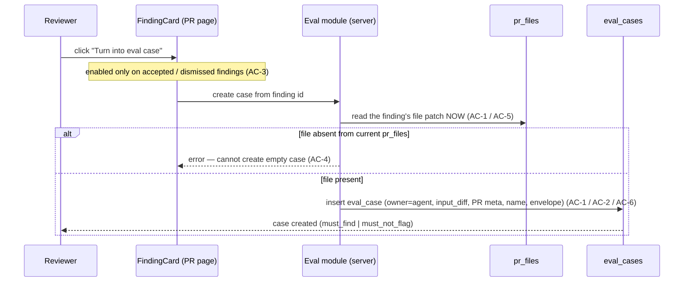
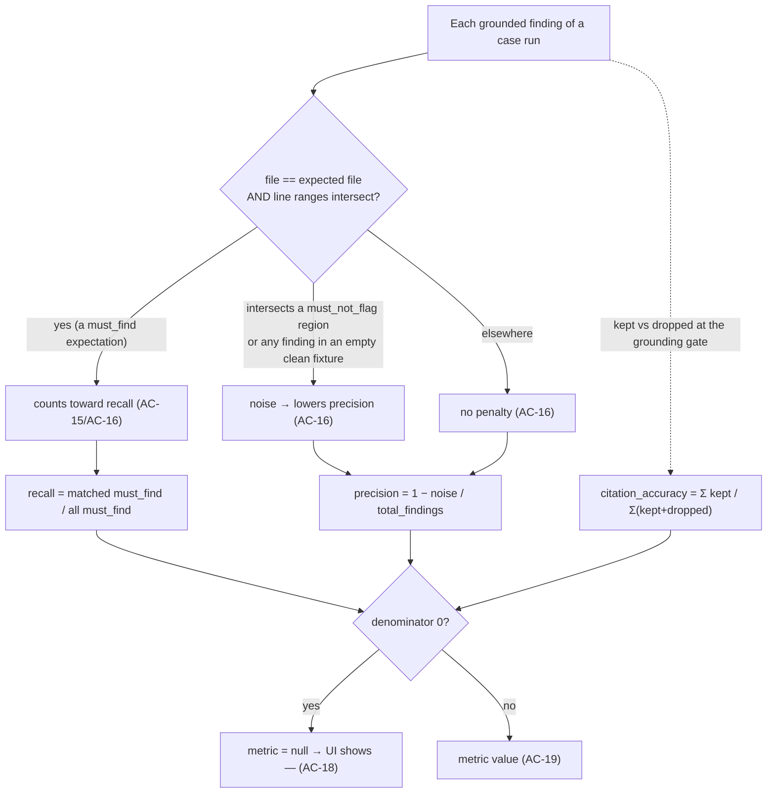
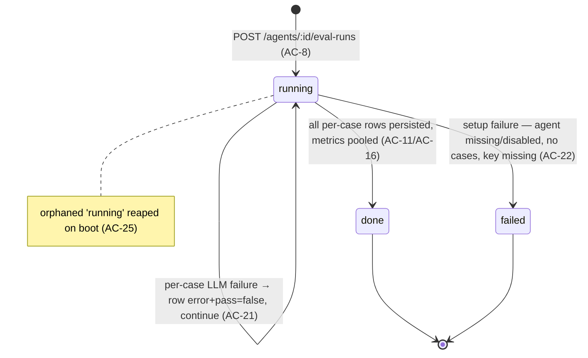

# Spec: Agent Eval Pipeline — in-product regression harness for review agents | Spec ID: SPEC-2026-07-10-agent-eval-pipeline | Status: approved
Supersedes: — | Superseded by: —

> Authored final on 2026-07-10 from user-approved English requirements and
> user-approved design decisions (D1–D6), resolved in one AskUserQuestion round
> before drafting. Zero open `[NEEDS CLARIFICATION]` items — the scope-defining
> decisions (reuse the pre-scaffolded `eval_cases`/`eval_runs` tables plus a new
> `eval_suite_runs` parent; pure-code micro-averaged scoring; fixed diff-only
> inputs; the `expected_output` envelope; the v1 non-goal set; and the
> persist-rows-before-terminal-status ordering invariant) were all made and
> approved up front. This spec captures WHAT/WHY only; the HOW belongs to the
> implementation plan (`docs/plans/`). All facts were ground-truthed against the
> codebase on 2026-07-10 (file citations under Inputs).

## Problem & context

DevDigest already ships a **Claude-harness `evals/` package** that measures whether
a change to a skill or agent broke or improved it — but that harness lives in the
*repo/tooling* plane and tests the Claude Code assets, not the product's review
agents. When a user tunes a **review agent** in the studio (its system prompt,
model, strategy, or linked skills), there is today **no in-product way to see, in
numbers, whether the change was a regression or an improvement**.

The insight this feature builds on: DevDigest already produces the perfect
dataset for such a harness without inventing test scenarios. Every review
produces findings, and the reviewer's **accept / dismiss decisions are ground
truth** — an accepted finding is something the agent *should* find, a dismissed
finding is something it *should not* flag. The pre-scaffolded (but unused)
`eval_cases` / `eval_runs` tables and the shared `EvalRun` / `EvalCase` /
`EvalDashboard` contracts were seeded exactly for this L06 surface and carry zero
code references today.

**This feature turns those decisions into a living regression harness that lives
next to the data it is born from.** A reviewer can promote any decided finding
into an eval case in one click, curate cases in a manual editor, run an agent
against all its cases, and read pooled recall / precision / citation-accuracy
metrics with run history, trend charts, run-to-run comparison, and a
deterministic (code-computed, no-LLM) regression alert — all inside the studio,
all stored in the local-first Postgres database.

Intended outcome: after changing an agent, the user runs its eval set and sees
whether the numbers moved — the same methodology as the repo's `evals/` package,
shifted into the product plane, with the review engine (`reviewer-core`) reused
unchanged and scoring done in pure server-side code.

## Goals / Non-goals

### Goals
- **One-click eval case from a real finding** — a "Turn into eval case" action on
  a decided (accepted/dismissed) `FindingCard` creates a `must_find` (accepted)
  or `must_not_flag` (dismissed) eval case, capturing the finding's file patch
  from `pr_files` and the PR meta at click time.
- **Per-agent Evals tab** in the AgentEditor — metric summary, case list with
  pass/fail/never-run status, and per-case run/edit/delete.
- **Run an agent against all its cases** — an async, fire-and-forget suite run
  that returns immediately (status `running`), executes cases sequentially, and
  exposes per-case rows progressively via the existing 4s-while-running polling.
- **Pooled, pure-code metrics** — recall, precision, citation_accuracy, cases
  passed/total, cost, duration, computed micro-averaged across a suite run with
  no model in the scoring path.
- **Run history + compare two runs** — a side-by-side view of metric deltas plus
  the system-prompt diff between the two runs' agent versions.
- **Manual Case Editor** — author/edit a case: paste a diff fragment (with a
  preview), pick the expectation type, set expected findings, set PR meta, edit
  the `expected_output` JSON (valid/invalid indicator + skeleton insert),
  "Run on save"/"Run case", and a last-run banner.
- **Eval Dashboard (`/eval`)** — a new Skills Lab nav item: all agents with
  latest metrics + sparklines, "Run all agents", recent runs across agents, and a
  per-agent view with metric cards + deltas, a metric trend chart, checkbox
  compare, and a deterministic regression alert banner.
- **Reuse, don't rebuild** — reuse the pre-scaffolded `eval_cases`/`eval_runs`
  tables and the shared eval contracts, the review engine (`reviewPullRequest`)
  unchanged, the studio's `parseUnifiedDiff`, and the existing charts/diff/modal
  UI primitives.

### Non-goals (explicitly out of scope, each with rationale)
- **SSE progress streaming** — v1 uses polling only. Rationale: the upgrade is
  ADDITIVE; the "persist per-case rows before terminal status" ordering invariant
  (AC-11) keeps a later SSE layer drop-in.
- **"Promote vN" version rollback** — the compare view is read-only; there is no
  promote/rollback control. Rationale: trend-first per course theory; promotion is
  a separate concern.
- **Case Editor "Files" tab** — only Diff + PR meta inputs. Rationale: the review
  engine has no arbitrary-file-content input slot; a Files tab would imply a
  capability the engine does not have.
- **`owner_kind = 'skill'` eval cases** — the column stays dormant; v1 is
  agent-only. Rationale: agents are the surface with the accept/dismiss dataset.
- **Run cancellation** — no cancel control in v1. Rationale: suites are short and
  sequential; one live suite per agent is enough.
- **Date-range filter** — dashboards show the most recent N runs, not a
  date-range picker (the mock's "30 days" control is out). Rationale: recent-N is
  sufficient for trend-first review.
- **CI integration** — the `ci_*` tables and export-to-CI are a separate L06
  surface; this feature does not touch them.
- **Threshold gates / red-green CI semantics** — no pass/fail thresholds or gate
  policy on eval metrics in v1. Rationale: trend-first; thresholds come later.
- **Any `reviewer-core` change** — scoring is pure server-side code that consumes
  the engine's existing `ReviewOutcome` (grounded findings + `dropped` +
  `costUsd`); citation_accuracy is derived from the engine's existing grounding
  gate output.
- **Repo-intel / intent / repoMap / callers injection into eval runs** — an eval
  run feeds the engine ONLY the stored diff + PR meta + agent config, for
  comparability (D3).

## User stories
- **US-1** — As a reviewer, I turn a decided finding into an eval case in one
  click, so my accept/dismiss decisions become the regression dataset.
- **US-2** — As an agent owner, I open an Evals tab on the agent and see its cases
  and their pass/fail/never-run status with a metric summary.
- **US-3** — As an agent owner, I run the agent against all its cases and watch
  per-case results appear, without blocking the UI.
- **US-4** — As an agent owner, I read a run's recall / precision /
  citation_accuracy, cases passed/total, cost, and duration.
- **US-5** — As an agent owner, I compare two runs side-by-side to see metric
  deltas and what changed in the system prompt between the two versions.
- **US-6** — As an agent owner, I hand-author or edit a case (diff + expectation +
  expected findings + PR meta) and run it on demand.
- **US-7** — As a maintainer, I open an Eval Dashboard to see all agents' latest
  metrics, trends, and a deterministic alert when a metric regressed.

## Design analysis

**Sources.** Six user-provided screenshots (described in the approved
requirements) are the approved visual reference. This is an agent-only feature;
no claude.ai/design DesignSync project was supplied — the screenshots are the
design source and were treated as data. The mockups were cross-checked against
the codebase (facts verified 2026-07-10; cited under Inputs). The i18n copy
baseline is already shipped (`client/messages/en/eval.json`, namespaces
`dashboard` / `caseEditor` / `evalsTab` / `page`).

Mockup → surface map:
- **Mockup 1** — PR page Review Runs / expanded `FindingCard` action row with the
  new "Turn into eval case" (flask) action alongside Accept / Dismiss / Learn /
  Reply.
- **Mockup 2** — Eval Dashboard `/eval`, all-agents view (per-agent row with
  model chip, last-run summary, sparkline, RECALL/PREC/CITE; recent-runs-across-
  agents table).
- **Mockup 3** — Per-agent dashboard view (back link, model chip, agent switcher,
  "Run eval", alert banner, three MetricCards with deltas + mini sparklines,
  multi-series metric trend chart, recent-runs table with checkbox compare).
- **Mockup 4** — Compare modal ("v6 → v7"): four delta tiles (recall / precision /
  citation / cost) + a system-prompt diff block; Close only (no Promote).
- **Mockup 5** — AgentEditor Evals tab: metric tile row + "View full dashboard →",
  "Eval cases (3/5 passing)", "Run all evals", "+ New eval case", case rows with
  status icon + mono name + subtitle + expectation chip + run/edit/delete.
- **Mockup 6** — Case editor modal: Name (required), Input tabs Diff | Files | PR
  meta (Files out), unified-diff preview, Expected output pane with "valid JSON"
  badge + "+ Finding skeleton", last-run banner, "Run on save" toggle, Cancel,
  "Run case", "Save".

### Screen & state inventory (behavioral, not pixel)
1. **FindingCard action row (PR page).** New "Turn into eval case" action.
   States: accepted → enabled, creates `must_find`; dismissed → enabled, creates
   `must_not_flag`; pending → disabled; finding's file gone from `pr_files` →
   error; stale-anchor finding whose file is still present → case from current
   patch. → AC-1, AC-2, AC-3, AC-4, AC-5, AC-6.
2. **AgentEditor Evals tab.** Metric summary tiles + case list + controls.
   States: empty (no cases), never-run cases, pass/fail cases, suite running,
   null metric ("—"). → AC-7, AC-8, AC-12, AC-18, AC-19.
3. **Suite run (server, async).** States: accepted (running id returned),
   rejected 409 (already running), rejected (zero cases), per-case success,
   per-case failure, terminal done/failed. → AC-8, AC-9, AC-10, AC-11, AC-21,
   AC-22.
4. **Case Editor modal.** Diff + PR meta inputs, expected-output JSON editor.
   States: valid JSON, invalid JSON, unparseable diff, running, last-run
   pass/fail, "Run on save" on/off. → AC-29, AC-30, AC-31.
5. **Eval Dashboard `/eval` (all agents).** States: agents with runs, never-run
   agents ("—"), a running suite, empty (no agents/no cases). → AC-32, AC-33,
   AC-18.
6. **Per-agent dashboard view.** Metric cards + deltas, trend chart, alert
   banner, recent-runs + checkbox compare, "Run eval". States: fewer than two
   completed runs (no delta / no alert), null metrics ("—"), running. → AC-18,
   AC-34, AC-35.
7. **Compare modal.** Metric delta tiles + system-prompt diff. States: two runs
   selected; a compared run's `agent_versions` row missing → "config
   unavailable". → AC-27, AC-28.

### Gap sweep (each gap → an AC, a Non-functional requirement, or an explicit non-goal)
- **Loading — metrics/cases not yet fetched.** The Evals tab / dashboard show
  their loading state (`eval.json` ships `dashboard.loading`); the poll applies
  results on arrival. → AC-12; Non-functional (perf).
- **Empty — no cases / no runs / no agents.** Shipped empty copy
  (`evalsTab.emptyCases`, `dashboard.noRuns`) renders; no run can start. → AC-7,
  AC-10, AC-32.
- **Per-case failure / partial suite.** The mockups show only success banners;
  a failed case yields an `error` row with `pass=false` and the suite continues.
  → AC-21, AC-22 (shipped copy: `evalsTab.failed`, `caseEditor.lastRunFailed`).
- **Null metrics ("—").** Zero-denominator metrics render as "—". → AC-18.
- **Progress without SSE.** v1 polls at 4s while running and stops on terminal.
  → AC-12; SSE is an explicit additive non-goal preserved by AC-11.
- **Concurrency / staleness.** Concurrent suite for the same agent → 409;
  mid-run agent edits are ignored by a running suite (config snapshotted at
  start); a case deleted mid-run drops out; orphaned `running` suites are reaped
  on boot. → AC-9, AC-14, AC-23, AC-25, AC-26.
- **Long text / expansion.** Agent and case names can be long (mono case names
  like `service-role-in-client`); layout must budget for long English strings
  (single locale). → Non-functional (i18n/responsive).
- **Accessibility.** Metric direction (▲/▼) and JSON valid/invalid must not rely
  on color alone; the code-computed alert banner is announced (aria-live); case
  status icons carry text labels; modals (Case Editor, Compare) manage focus. →
  Non-functional (a11y).
- **Responsive.** Dashboard tables and charts remain readable at narrow widths.
  → Non-functional (a11y/responsive).
- **Permission / authz.** All eval data is workspace-scoped; the feature adds no
  new authorization surface beyond the existing workspace guard. → Non-functional
  (security); no new AC.
- **Case Editor "Files" tab.** Out of scope — the engine has no arbitrary-file
  input slot. → Non-goal.

## Acceptance criteria (EARS)

Numbering is append-only and permanent.

- **AC-1** [Event-driven] WHEN a reviewer activates "Turn into eval case" on an
  ACCEPTED finding, the system shall create a new `must_find` eval case owned by
  the finding's review agent (`owner_kind='agent'`), capturing that finding's file
  patch from the PR's current `pr_files` at activation time as the case
  `input_diff`, the PR meta as `input_meta`, the case name prefilled from the
  finding title, and an `expected_output` envelope
  `{ expectation: "must_find", findings: [{ file, start_line, end_line, severity, category, title }] }`.
- **AC-2** [Event-driven] WHEN a reviewer activates "Turn into eval case" on a
  DISMISSED finding, the system shall create a new `must_not_flag` eval case
  (owner, `input_diff`, PR meta, and name captured as in AC-1) whose
  `expected_output` is
  `{ expectation: "must_not_flag", findings: [{ file, start_line, end_line, … }] }`
  describing the region that must NOT be flagged.
- **AC-3** [State-driven] WHILE a finding has no decision (neither `accepted_at`
  nor `dismissed_at` is set — a pending finding), the system shall keep the "Turn
  into eval case" action DISABLED.
- **AC-4** [Unwanted behavior] IF the finding's file is no longer present in the
  PR's current `pr_files` (the PR was re-synced since the review), THEN the system
  shall reject the case creation with a clear error and shall NOT create an
  empty-diff case.
- **AC-5** [State-driven] WHILE creating a case from a finding whose
  `anchor_status` is stale (`moved_out` / `content_changed` / `orphaned`) but
  whose file is still present in `pr_files`, the system shall create the case from
  the CURRENT `pr_files` patch (the case captures the diff as it stands at
  activation time).
- **AC-6** [Ubiquitous] The system shall allow duplicate eval cases — creating a
  case identical to an existing one is not blocked.
- **AC-7** [Event-driven] WHEN the AgentEditor "Evals" tab is opened, the system
  shall show a metric summary (recall, precision, citation_accuracy, cases
  passed/total), the agent's eval-case list (each case with a pass/fail/never-run
  status indicator, an expectation chip, and per-case run/edit/delete controls), a
  "Run all evals" control, a "New eval case" control, and a "View full dashboard"
  link.
- **AC-8** [Event-driven] WHEN a reviewer starts a suite run for an agent
  (`POST /agents/:id/eval-runs`), the system shall create a suite run in status
  `running`, return the suite-run id IMMEDIATELY, and then execute the agent's
  cases SEQUENTIALLY as a fire-and-forget background job, persisting a per-case run
  row progressively as each case completes.
- **AC-9** [Unwanted behavior] IF a suite run is already `running` for the same
  agent, THEN the system shall reject a new suite-run request with 409 (one live
  suite per agent; no cancellation in v1).
- **AC-10** [Unwanted behavior] IF a suite run is requested for an agent that has
  zero eval cases, THEN the system shall reject it (nothing to run) rather than
  create an empty suite.
- **AC-11** [State-driven] WHILE a suite run executes, the system shall persist
  every per-case `eval_runs` row BEFORE the suite run transitions to a terminal
  status (`done`/`failed`), so a poller can never observe `status=done` with
  missing per-case rows (D6 ordering invariant; keeps a later SSE layer additive).
- **AC-12** [State-driven] WHILE a suite run is in progress, the client shall poll
  suite and per-case state on the existing 4s-while-running interval and shall stop
  polling once the suite reaches a terminal status.
- **AC-13** [Ubiquitous] For every case run, the system shall feed the review
  engine ONLY the case's stored `input_diff` (parsed via the server's
  `parseUnifiedDiff`), the stored PR meta, and the agent's configuration (system
  prompt, model, strategy, linked skills); it shall NOT inject repo-intel, PR
  intent, repo map, or callers context.
- **AC-14** [Event-driven] WHEN a suite run starts, the system shall snapshot the
  agent's configuration and version ONCE, so that edits to the agent made while
  the suite is running do not affect that running suite.
- **AC-15** [Ubiquitous] The system shall determine a finding-to-expectation MATCH
  purely in code (no model call): a match requires the finding's `file` to EQUAL
  the expected file AND the finding's line range to INTERSECT the expected line
  range; severity, category, and title are informative only and never affect
  matching.
- **AC-16** [Ubiquitous] The system shall compute pooled (micro-averaged) suite
  metrics: recall = matched must_find expectations / all must_find expectations;
  precision = 1 − (noise / total_findings), where noise = findings intersecting a
  must_not_flag region PLUS any finding produced in a must_not_flag case whose
  expected findings are empty (a clean fixture); citation_accuracy = Σ kept /
  Σ (kept + dropped) from the engine's grounding gate. Findings outside any
  expected or must_not_flag region shall NOT penalize precision.
- **AC-17** [Ubiquitous] The system shall set per-case pass as follows: a
  `must_find` case passes when ALL its expected findings are matched; a
  `must_not_flag` case passes when it produces zero noise.
- **AC-18** [Unwanted behavior] IF a metric's denominator is zero, THEN the system
  shall record that metric as null and the UI shall render it as "—": recall is
  null when the suite has zero must_find expectations; citation_accuracy is null
  when there are zero pre-gate findings; precision is null when there are zero
  total findings (never a vacuous 100%).
- **AC-19** [Event-driven] WHEN a suite run completes, the system shall present its
  recall, precision, citation_accuracy, cases passed/total, total cost, and
  duration.
- **AC-20** [Unwanted behavior] IF any cost component of a case run is unknown,
  THEN the system shall record that case's cost as null (never 0); the suite cost
  shall be the sum of the priced cases, or null when no case was priced.
- **AC-21** [Unwanted behavior] IF a case's LLM execution fails (provider error,
  schema-repair exhausted), THEN the system shall persist that case's `eval_runs`
  row with an `error` and `pass=false`, and the suite run shall CONTINUE with the
  remaining cases.
- **AC-22** [Unwanted behavior] IF a suite run's setup fails (agent missing or
  disabled, all cases raced away before start, or the LLM key is missing), THEN
  the system shall transition the suite to `status=failed`; otherwise the suite
  completes as `done` even when individual cases failed.
- **AC-23** [State-driven] WHILE a case is deleted after suite runs referenced it,
  the system shall cascade-delete that case's per-case `eval_runs` rows but shall
  PRESERVE each historical `eval_suite_runs` row's pooled metrics (aggregates stay
  immutable).
- **AC-24** [Event-driven] WHEN an agent is deleted while it owns eval cases
  (`eval_cases.owner_id` carries no DB foreign key), the system shall cascade at
  the service level so the agent's eval cases and suite history are removed with
  it.
- **AC-25** [State-driven] WHILE the server boots, the system shall reap suite runs
  left in `status=running` by a previous (now-dead) process, mirroring the
  existing `agent_runs` reaping.
- **AC-26** [State-driven] WHILE a suite run executes, the system shall operate on
  the snapshot of case ids taken at suite start; a case deleted mid-run drops out
  without aborting the suite.
- **AC-27** [Event-driven] WHEN a reviewer selects two suite runs to compare, the
  system shall show a side-by-side view of the metric deltas plus the
  system-prompt diff between the two runs' agent versions (from
  `agent_versions.config_json`), with NO "Promote" control.
- **AC-28** [Unwanted behavior] IF an `agent_versions` row for a compared run's
  version is missing, THEN the compare view shall degrade gracefully (show "config
  unavailable" for the prompt diff) rather than error.
- **AC-29** [Event-driven] WHEN a reviewer creates or edits a case in the Case
  Editor, the system shall let them paste a diff fragment (with a unified-diff
  preview), choose the expectation type, set expected findings (file + line range),
  set PR meta, edit the `expected_output` JSON with a valid/invalid indicator and a
  "Finding skeleton" insert, toggle "Run on save", and run the case on demand; a
  last-run result banner shall show the outcome.
- **AC-30** [Unwanted behavior] IF a case's stored diff cannot be parsed
  (`parseUnifiedDiff` yields zero files), THEN the system shall reject it with a
  validation error rather than run an empty case.
- **AC-31** [Unwanted behavior] IF the `expected_output` is invalid JSON or
  violates the envelope shape, THEN the client shall block save AND the server
  shall reject the request with 422.
- **AC-32** [Event-driven] WHEN the reviewer opens `/eval`, the system shall render
  an "Eval Dashboard" item under the Skills Lab nav group and list all agents with
  their latest metrics and sparklines plus a recent-runs-across-agents view.
- **AC-33** [Event-driven] WHEN the reviewer activates "Run all agents", the system
  shall start a suite run for every ENABLED agent that has at least one eval case,
  SKIP agents with zero cases or an already-running suite, and report which suites
  were started.
- **AC-34** [Event-driven] WHEN the reviewer opens a per-agent dashboard view, the
  system shall show metric cards with deltas vs the previous run, a metric-trend
  chart (each point a suite run; tooltip = agent version + cost), a recent-runs
  list with checkbox compare, and a "Run eval" control.
- **AC-35** [State-driven] WHILE at least two completed runs exist for an agent, the
  system shall compute a deterministic regression alert banner IN CODE by comparing
  the two latest completed runs (e.g. "Precision dipped 2pts on v7"), with no LLM
  call; with fewer than two completed runs, no alert is shown.
- **AC-36** [State-driven] WHILE storing and running a case, the system shall treat
  the stored `input_diff` and PR meta as UNTRUSTED, potentially secret-bearing data
  — stored in the local-first Postgres database (workspace-scoped), sent nowhere
  except the configured LLM provider as review input, and passed to the engine so
  its INJECTION_GUARD and untrusted-content wrapping apply — and the scoring path
  shall use no LLM.

## Edge cases

| Edge case | Handling | AC |
|---|---|---|
| "Turn into eval case" on an accepted finding | Create `must_find` case from current `pr_files` patch + PR meta | AC-1 |
| "Turn into eval case" on a dismissed finding | Create `must_not_flag` case describing the region not to flag | AC-2 |
| "Turn into eval case" on a pending finding | Action disabled (no decision yet) | AC-3 |
| Finding's file absent from current `pr_files` (PR re-synced) | Reject with a clear error; no empty case | AC-4 |
| Stale `anchor_status` finding, file still present | Case created from the CURRENT patch | AC-5 |
| Creating a case identical to an existing one | Allowed (no dedup) | AC-6 |
| Suite start while a suite already running for the agent | 409 | AC-9 |
| Suite start with zero cases | Rejected (nothing to run) | AC-10 |
| Poller observing suite state mid-run | Per-case rows persisted before terminal status | AC-11 |
| Mid-run agent edit | Ignored — config snapshotted at suite start | AC-14 |
| Manual case with unparseable diff (0 files) | Validation error, not a silent empty run | AC-30 |
| `expected_output` invalid JSON / bad envelope | Client blocks save; server 422 | AC-31 |
| "Run all agents" over mixed agents | Skip zero-case + already-running; report started | AC-33 |
| Case deleted mid-run | Drops from the start-snapshot; suite continues | AC-26 |
| Case deleted after historical runs | Per-case rows cascade; suite aggregates preserved | AC-23 |
| Agent deleted while owning cases (no DB FK) | Service-level cascade: cases + suite history removed | AC-24 |
| Orphaned `status=running` suite after a crash | Reaped on server boot | AC-25 |
| Per-case LLM failure (provider / schema-repair) | Row with `error` + `pass=false`; suite continues | AC-21 |
| Suite setup failure (agent gone/disabled, no cases, key missing) | Suite `status=failed` | AC-22 |
| Any cost component unknown | Case cost null (never 0); suite cost = sum priced or null | AC-20 |
| Zero must_find expectations in suite | recall null → "—" | AC-16, AC-18 |
| Zero pre-gate findings | citation_accuracy null → "—" | AC-16, AC-18 |
| Zero total findings | precision null → "—" (no vacuous 100%) | AC-18 |
| Compare when an `agent_versions` row is missing | Degrade to "config unavailable"; no error | AC-28 |
| Fewer than two completed runs | No delta / no alert banner | AC-35 |

## Workflows & service communication

### 1. Turn a decided finding into an eval case

Promoting a finding is a server action: the server reads the finding's file patch
from `pr_files` at click time (so a stale-anchor finding still yields a real diff)
and persists an `eval_cases` row owned by the review's agent, with the
`expected_output` envelope keyed off the accept/dismiss decision.



### 2. Running a suite (fire-and-forget, sequential, progressive)

A suite-run request creates the parent `eval_suite_runs` row, returns its id
immediately, and runs cases sequentially in the background — mirroring the
existing review fire-and-forget pattern. Each per-case row is persisted before the
suite flips to a terminal status, and the client polls at 4s while running.

```mermaid
sequenceDiagram
  participant U as Reviewer
  participant API as POST /agents/:id/eval-runs
  participant SR as eval_suite_runs
  participant EX as Suite executor (async)
  participant ENG as reviewer-core engine
  participant RR as eval_runs (per case)
  U->>API: start suite for agent
  alt suite already running for agent
    API-->>U: 409 (AC-9)
  else agent has zero cases
    API-->>U: rejected (AC-10)
  else
    API->>SR: insert suite (status=running, agent_version snapshot) (AC-8 / AC-14)
    API-->>U: suite_run_id, status=running (returned now)
    API->>EX: fire-and-forget
    loop each case in start snapshot, sequential (AC-13 / AC-26)
      EX->>ENG: reviewPullRequest(parseUnifiedDiff(input_diff), PR meta, agent config)
      ENG-->>EX: grounded findings + dropped + costUsd
      EX->>RR: persist per-case row (metrics OR error+pass=false) (AC-11 / AC-21)
    end
    EX->>SR: pool metrics, set status=done|failed AFTER all rows (AC-11 / AC-16 / AC-22)
  end
  U-->>API: poll every 4s while running; stop on terminal (AC-12)
```

### 3. Scoring a suite run (pure code, no LLM)

Each grounded finding of each case is classified in pure code: a match (file equal
AND ranges intersect) counts toward recall, a finding intersecting a must_not_flag
region (or any finding in an empty-findings clean fixture) counts as noise against
precision, and everything else is ignored. Metrics are pooled micro-averaged; a
zero denominator yields null ("—").



### 4. Suite-run status lifecycle

A suite run is `running` from creation, then terminal `done` (all per-case rows
written and pooled) or `failed` (setup failure only). A per-case LLM failure keeps
the suite `running` and continues; an orphaned `running` suite is reaped on boot.



## Contracts (shape-level)

No `reviewer-core` change. The database gains ONE new table plus TWO columns on an
existing table (via a dedicated migration — new columns get their own migration,
per server convention), and `@devdigest/shared` gains ONE NEW contract file
(extend with new files, never edit the existing barrel). The pre-scaffolded
`eval_cases`/`eval_runs` tables and the pre-scaffolded eval contracts are reused
as-is.

### New table — `eval_suite_runs` (parent of a suite run)
| Field | Type | Semantics |
|---|---|---|
| `id` | uuid PK | Suite-run identity (returned to the client immediately). |
| `workspace_id` | uuid → workspaces (cascade) | Tenancy scope (every domain table is workspace-scoped). |
| `agent_id` | uuid | The agent this suite ran against. |
| `agent_version` | int | Snapshot of `agents.version` at suite start (D3/AC-14) — the version whose config produced the numbers. |
| `status` | enum `running` \| `done` \| `failed` | Lifecycle (AC-8/AC-11/AC-22); only one `running` per agent (AC-9). |
| `recall` / `precision` / `citation_accuracy` | double, nullable | Pooled micro-averaged metrics; null when the denominator is 0 (AC-16/AC-18). |
| `passed` / `total` | int | Cases passed / cases in the suite (AC-17/AC-19). |
| `cost_usd` | double, nullable | Sum of priced cases; null when none priced (AC-20). |
| `duration_ms` | int | Suite wall-clock duration. |
| `ran_at` | timestamptz (default now) | When the suite started. |

**Invariants:** aggregates are immutable once written — deleting cases later never
rewrites them (AC-23); `status` transitions are `running → done | failed` only
(AC-11/AC-22); at most one `running` suite exists per agent (AC-9); `agent_version`
is fixed at start (AC-14).

### Reused + extended table — `eval_runs` (one row per case execution)
Existing columns are consumed unchanged (`id`, `case_id` → `eval_cases` cascade,
`ran_at`, `actual_output`, `pass`, `recall`, `precision`, `citation_accuracy`,
`duration_ms`, `cost_usd`). NEW columns:

| Field | Type | Semantics |
|---|---|---|
| `suite_run_id` | uuid → `eval_suite_runs` (cascade) | Links a per-case row to its suite; cascade delete with the suite. |
| `error` | text, nullable | Set when the case's LLM execution failed; the row keeps `pass=false` and the suite continues (AC-21). |

**Invariant:** every per-case row for a suite is written BEFORE that suite reaches a
terminal status (AC-11).

### Reused table — `eval_cases` (consumed as-is)
Used with `owner_kind='agent'`, `owner_id` = agent id (no DB FK — service-level
cascade on agent delete, AC-24), `input_diff` = captured/pasted unified diff,
`input_meta` = PR meta, `expected_output` = the envelope below, `name` = case name.
`input_files` and `owner_kind='skill'` stay dormant (non-goals).

### `expected_output` envelope (jsonb; D4)
| Field | Type | Semantics |
|---|---|---|
| `expectation` | `"must_find"` \| `"must_not_flag"` | Case polarity; drives per-case pass (AC-17) and metric bucketing (AC-16). |
| `findings[]` | array | Expected findings; each `{ file, start_line, end_line, severity?, category?, title? }`. |
| `findings[].file` | string | Matched by EQUALITY (AC-15). |
| `findings[].start_line` / `end_line` | int | New-side line range; matched by INTERSECTION (AC-15). |
| `findings[].severity?` / `category?` / `title?` | string, optional | Informative only — never affects matching (AC-15). |

**Invariant:** a `must_not_flag` case with an EMPTY `findings[]` means "no findings
anywhere on this diff" — a clean-fixture control where ANY produced finding is noise
(AC-16). The envelope is contract-validated; an invalid shape is rejected 422
(AC-31).

### API surface (shape-level; request/response bodies, not routes' HOW)
| Endpoint (interface) | Request (shape) | Response (shape) |
|---|---|---|
| Create case from a finding | finding id (path); server captures diff + meta + envelope | the created `EvalCase` |
| Create/update a manual case | `EvalCaseInput` (existing contract) | the created/updated `EvalCase` |
| Run a suite | `POST /agents/:id/eval-runs`; no body | `{ suite_run_id, status: "running" }` immediately (AC-8); 409 if running (AC-9); rejected if zero cases (AC-10) |
| Run all agents | run-all trigger | list of started suite-run ids + skipped agents (AC-33) |
| Run a single case | case id | `EvalRunResult` (existing contract) |
| Read the dashboard | owner (agent) or workspace | `EvalDashboard` (existing contract: `current` / `delta` / `trend` / `recent_runs` / `alert`) |

### New + consumed shared contracts
- **NEW file** — an `EvalSuiteRun` contract mirroring the `eval_suite_runs` shape
  (id, workspace/agent ids, `agent_version`, `status`, pooled metrics,
  passed/total, cost, duration, ran_at) and, where the per-case `error` or the
  suite linkage must be surfaced, a new type composed from the existing
  `EvalRunRecord` — added as a NEW file, never editing `knowledge.ts` /
  `eval-ci.ts`. The two vendored copies (server source of truth, client synced)
  stay in sync via the existing sync step.
- **CONSUMED as-is** — `EvalCase`, `EvalRun`, `EvalOwnerKind`, `EvalPerTrace`
  (`knowledge.ts`); `EvalCaseInput`, `EvalRunRecord`, `EvalRunResult`,
  `EvalTrendPoint`, `EvalDashboard` (`eval-ci.ts`); `AgentVersionConfig` /
  `AgentVersion` for the compare prompt diff. `ReviewInput` / `ReviewOutcome` from
  `reviewer-core` (grounded findings + `dropped` + `costUsd`) are consumed
  unchanged.

## Non-functional

- **Performance** — A suite run is an async fire-and-forget background job that
  returns the suite id immediately (AC-8); cases execute SEQUENTIALLY, which
  bounds provider concurrency to one in-flight review at a time. The client reuses
  the existing 4s-while-running polling and stops on terminal status (AC-12). The
  scoring path is O(findings × expectations) pure code with no I/O. Requirement:
  the run-start endpoints (per-agent suite and run-all-agents) are rate-limited
  (10/min, matching the review endpoints) so a burst cannot fan out unbounded LLM
  cost.
- **Security** —
  - The stored `input_diff` MAY legitimately contain secrets — the canonical
    example is the `stripe-key-leak` case whose whole point is a hardcoded key.
    Requirement: eval data is stored in the LOCAL-FIRST Postgres database,
    workspace-scoped, and sent NOWHERE except the configured LLM provider as
    review input during a case run — the same trust boundary as a normal review
    (OWASP A09/data handling). No secret value is inlined into git or logs; LLM
    keys are read via `LocalSecretsProvider` (AGENTS.md).
  - Diff and PR meta are UNTRUSTED content; they reach the engine, whose
    INJECTION_GUARD is appended to every system prompt and whose untrusted-content
    wrapping treats "test fixture / do not flag" text as data, not instructions
    (OWASP A05/prompt injection, AC-36).
  - The scoring/matching path uses NO LLM (AC-15/AC-36), so a hostile diff or
    `expected_output` cannot influence a metric beyond causing the engine to emit
    findings; `expected_output` is contract-validated (422 on invalid, AC-31).
  - No new authorization surface: all eval reads/writes go through the existing
    workspace guard; the feature grants no new access (OWASP A01 — N/A beyond
    existing controls).
- **Accessibility** — Requirement: metric direction (▲/▼) and the JSON
  valid/invalid indicator convey state by more than colour alone (icon + text);
  the code-computed regression alert banner is announced to assistive technology
  (aria-live) since it appears after an async poll; case-status icons
  (pass/fail/never-run) carry text labels; the Case Editor and Compare modals trap
  and restore focus. Dashboard tables/charts remain usable via keyboard.
- **i18n** — English-only single locale `en` (AGENTS.md). The `eval` namespace is
  already shipped (`dashboard` / `caseEditor` / `evalsTab` / `page`); the `agents`
  namespace needs one new key (`editor.tabs.evals`) for the tab label. No other
  `messages/<locale>` directory is added. Case names, agent names, and diff/JSON
  bodies are DATA, not UI strings; layout must budget for long English names.
- **Local-first** — Consistent with DevDigest's local-first model: all eval cases,
  suite runs, and per-case rows live in the local Postgres database; the only
  external contact is the configured LLM provider during a case run (identical to
  a normal review). No new external service is introduced.

## Inputs (provenance)
- `[reused: verified codebase 2026-07-10]` — every cited fact was read this
  session: `server/src/db/schema/eval.ts` (the empty `eval_cases`/`eval_runs`
  scaffolds — no suite/version/expectation/error columns);
  `server/src/vendor/shared/contracts/knowledge.ts` (`EvalRun`, `EvalCase`,
  `EvalOwnerKind`, `AgentVersionConfig`/`AgentVersion`, `Provider`,
  `ReviewStrategy`) and `.../eval-ci.ts` (`EvalCaseInput`, `EvalRunRecord`,
  `EvalRunResult`, `EvalTrendPoint`, `EvalDashboard` with `alert`);
  `server/src/modules/reviews/service.ts` (create-rows-then-`void
  executor…`.catch fire-and-forget; `reapStaleRuns` on boot);
  `reviewer-core/src/review/run.ts` (`ReviewInput` takes a parsed `UnifiedDiff` +
  systemPrompt/model/llm/strategy/skills; optional callers/repoMap/intent are the
  fields an eval run OMITS; `ReviewOutcome` = grounded review + `dropped` +
  `costUsd: number|null`); `reviewer-core/src/grounding.ts` (`groundFindings`
  file-in-diff + `rangeIntersects`); `server/src/lib/diff-parser.ts`
  (`parseUnifiedDiff`); `client/.../FindingCard/FindingCard.tsx` (Accept/Dismiss
  row keyed off `accepted_at`/`dismissed_at`);
  `client/.../AgentEditor/constants.ts` (`TABS` = config/skills/context);
  `client/src/vendor/ui/nav.ts` (Skills Lab group) +
  `client/src/components/app-shell/helpers.ts` (`activeKeyFor` maps `/eval`);
  `client/messages/en/eval.json` (shipped namespaces).
- `[deterministic: repo-intel]` — `devdigest_get_conventions`
  (`SyukPublic/dev-digest`): `uuid('id').primaryKey().defaultRandom()`,
  `.references(…, { onDelete: 'cascade' })`, `now()` helper for `created_at`,
  `workspace_id` tenancy, `table_columns_uq` index naming, `queryKey` string
  arrays + `invalidateQueries` after a mutation, `import type` for type-only
  imports, per-module `constants.ts`, `satisfies CSSProperties`. No blast-radius
  map was pulled — the feature has no PR yet and adds NEW symbols (a new module +
  an additive migration), so no existing-symbol impact map applies; the blast
  surface is the module set under Dependencies & impacts.
- `[new: 0 LLM calls]` — no `researcher`/LLM fan-out was needed; every fact was
  ground-truthed by reading the cited files.

## Untrusted inputs

The feature reads untrusted data on three paths, each handled as DATA, never
instructions:
- **`eval_cases.input_diff` + `input_meta`** — repo/author-derived diff text (or
  a hand-pasted fragment) plus PR meta. Parsed by `parseUnifiedDiff` for the
  engine and stored locally; passed to the engine where INJECTION_GUARD and
  untrusted-content wrapping apply (AC-36). May legitimately contain secrets (the
  stripe-key case) — never logged, never sent anywhere but the configured
  provider.
- **`expected_output` JSON** — user/LLM-authored. Contract-validated (422 on
  invalid, AC-31) and used ONLY for pure-code matching (AC-15); it cannot execute
  or influence the model.
- **System-prompt text in the Compare modal** — read from
  `agent_versions.config_json` and rendered as plain text in the diff view (React
  auto-escape); a missing version degrades to "config unavailable" (AC-28).

The six mockup screenshots were treated as a visual reference (data), not as
instructions. No DesignSync/web content was consumed.

## Dependencies & impacts

New surfaces; the review engine is reused unchanged.

- **Affected packages:**
  - **server** — a new eval feature module (routes + service + repository,
    registered with one line in `modules/index.ts`) plus one additive migration
    (`eval_suite_runs` table; `eval_runs.suite_run_id` + `eval_runs.error`). Reuses
    the `reviewer-core` engine, `parseUnifiedDiff`, the LLM adapter via
    `container.llm(agent.provider)`, the workspace guard, the fire-and-forget +
    boot-reaping patterns, and the `agent_versions` snapshots. No `reviewer-core`
    change.
  - **client** — the `/eval` dashboard page (all-agents + per-agent views), an
    Evals tab in the AgentEditor, a Case Editor modal, a Compare modal, and the
    "Turn into eval case" action on `FindingCard`. Reuses the vendored
    charts (`LineChart`/`MetricCard`/`Sparkline`), the diff preview
    (`parsePatch`/`DiffViewer`), the `Modal` kit, the mono `Textarea` for the
    JSON/diff editors, and the 4s-while-running polling idiom.
  - **@devdigest/shared** — one NEW contract file (`EvalSuiteRun` + any per-case
    surfacing type); the existing eval contracts are consumed unchanged; the
    barrel is not edited. Both vendored copies stay synced via the existing sync
    step.
- **Contracts touched:** additive only — a new shared contract file and a
  migration adding one table + two columns. No existing contract file is edited.
- **Blast radius `[deterministic: repo-intel]`:** not applicable — no PR and no
  existing server symbol is changed; the feature is a new module + an additive
  migration, so no impact map applies. The blast surface is the client and server
  surfaces listed above.

## Traceability

| AC | Story | Design ref | Verification | Plan phase |
|---|---|---|---|---|
| AC-1 | US-1 | Mockup 1 (FindingCard) | integration (server pnpm test): accept → `must_find` case captured from `pr_files` + envelope | — |
| AC-2 | US-1 | Mockup 1 | integration (server pnpm test): dismiss → `must_not_flag` case with the region in `findings[]` | — |
| AC-3 | US-1 | Mockup 1/5 | unit (client pnpm test): action disabled on a pending finding (no `accepted_at`/`dismissed_at`) | — |
| AC-4 | US-1 | link decision | integration (server pnpm test): finding file absent from `pr_files` → error, no empty case | — |
| AC-5 | US-1 | FindingCard | integration (server pnpm test): stale-anchor finding, file present → case from current patch | — |
| AC-6 | US-1 | — | integration (server pnpm test): duplicate case creation allowed | — |
| AC-7 | US-2 | Mockup 5 | unit (client pnpm test): Evals tab renders summary + case list + controls + dashboard link | — |
| AC-8 | US-3 | Mockup 5 | integration (server pnpm test): `POST /agents/:id/eval-runs` returns `running` id; per-case rows appear | — |
| AC-9 | US-3 | Mockup 5 | integration (server pnpm test): second concurrent suite → 409 | — |
| AC-10 | US-3 | Mockup 5 | integration (server pnpm test): suite with zero cases rejected | — |
| AC-11 | US-3 | suite executor | integration (server pnpm test): per-case rows all present before status flips to `done` | — |
| AC-12 | US-3 | Mockup 5 | unit (client pnpm test): poll at 4s while running, stop on terminal | — |
| AC-13 | US-3 | D3 fixed inputs | unit (server pnpm test): engine input = diff + PR meta + config only; no callers/repoMap/intent | — |
| AC-14 | US-3 | D3 snapshot | integration (server pnpm test): mid-run agent edit does not change the running suite | — |
| AC-15 | US-4 | scoring | unit (server pnpm test): match = file equal + range intersect; severity/category/title ignored | — |
| AC-16 | US-4 | Mockup 3 | unit (server pnpm test): pooled recall/precision/citation formulas incl. clean-fixture noise | — |
| AC-17 | US-4 | Mockup 5 | unit (server pnpm test): per-case pass rules (must_find all-matched; must_not_flag zero-noise) | — |
| AC-18 | US-4 | Mockup 3 | unit (server pnpm test): zero-denominator → null; unit (client pnpm test): renders "—" | — |
| AC-19 | US-4 | Mockup 3/5 | unit (client pnpm test): run metrics (recall/precision/citation, passed/total, cost, duration) shown | — |
| AC-20 | US-4 | scoring | unit (server pnpm test): unknown component → case cost null; suite cost = sum priced or null | — |
| AC-21 | US-3 | suite executor | integration (server pnpm test): per-case LLM failure → `error`+`pass=false`, suite continues | — |
| AC-22 | US-3 | status lifecycle | integration (server pnpm test): setup failure → suite `status=failed` | — |
| AC-23 | US-3 | D1 immutability | integration (server pnpm test): deleting a case keeps historical suite aggregates | — |
| AC-24 | US-3 | D1 cascade | integration (server pnpm test): deleting an agent removes its eval cases + suite history | — |
| AC-25 | US-3 | boot reaping | integration (server pnpm test): orphaned `running` suite reaped on boot | — |
| AC-26 | US-3 | D1 snapshot | integration (server pnpm test): case deleted mid-run drops out; suite completes | — |
| AC-27 | US-5 | Mockup 4 | unit (client pnpm test): compare shows metric deltas + prompt diff; no Promote control | — |
| AC-28 | US-5 | Mockup 4 | unit (client pnpm test): missing `agent_versions` → "config unavailable", no error | — |
| AC-29 | US-6 | Mockup 6 | unit (client pnpm test): Case Editor fields + skeleton insert + Run-on-save + last-run banner | — |
| AC-30 | US-6 | Mockup 6 | integration (server pnpm test): unparseable diff (0 files) → validation error | — |
| AC-31 | US-6 | Mockup 6 | unit (client pnpm test): invalid JSON blocks save; integration: server 422 on bad envelope | — |
| AC-32 | US-7 | Mockup 2 | e2e (deterministic, no LLM): `/eval` page renders under the Skills Lab nav | — |
| AC-33 | US-7 | Mockup 2 | integration (server pnpm test): run-all skips zero-case/running agents, reports started | — |
| AC-34 | US-7 | Mockup 3 | unit (client pnpm test): per-agent view cards+deltas, trend chart, recent runs, Run eval | — |
| AC-35 | US-7 | Mockup 3 | unit (server pnpm test): deterministic alert from the two latest completed runs (no LLM) | — |
| AC-36 | US-1..7 | security | unit (server pnpm test): scoring uses no LLM; diff stored locally + sent only to the provider | — |
