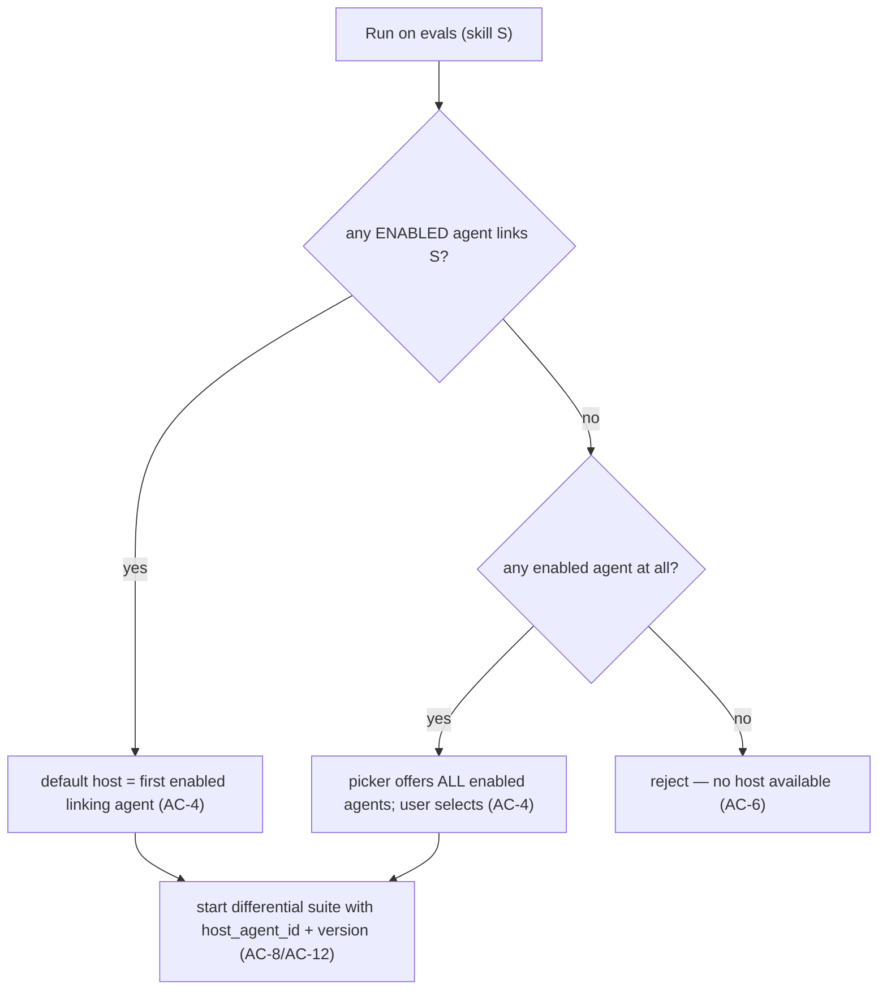
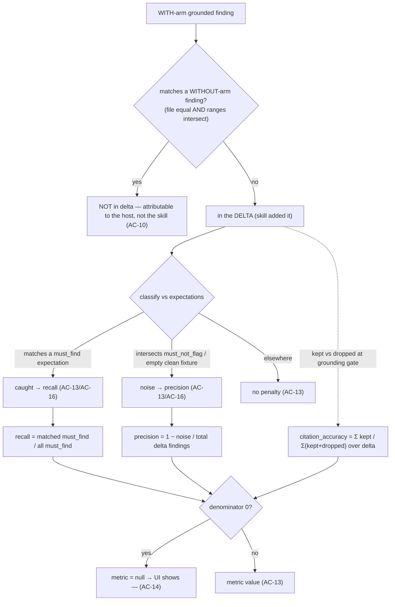

# Spec: Skill Eval Pipeline — differential (delta) evaluation of review skills | Spec ID: SPEC-2026-07-12-skill-eval-differential | Status: approved
Supersedes: — | Superseded by: —

> Authored final on 2026-07-12 from user-approved English requirements and
> user-approved design decisions (embedded below under "User-approved
> decisions"), resolved with the user before drafting. Zero open
> `[NEEDS CLARIFICATION]` items — the scope-defining decisions (three
> user-visible surfaces; the DIFFERENTIAL two-arm execution model; run-time
> host-agent resolution; delta-set metric semantics) were all made and approved
> up front. This is a NEW spec; it BUILDS ON the shipped L06 Agent Eval Pipeline
> (`SPEC-2026-07-10-agent-eval-pipeline.md`, Status approved) and does NOT
> restate its acceptance criteria — where behavior is inherited it is cited as
> "mirrors L06 AC-N". This spec captures WHAT/WHY only; the HOW (table vs column
> mechanics, migrations, code) belongs to the implementation plan
> (`docs/plans/`). All facts were ground-truthed against the codebase on
> 2026-07-12 (file citations under Inputs).

## Problem & context

L06 shipped an **in-product regression harness for review AGENTS**: a reviewer
turns accept/dismiss decisions into eval cases, runs an agent against its cases,
and reads pooled recall / precision / citation-accuracy with trend, compare, and
a code-computed regression alert (`SPEC-2026-07-10-agent-eval-pipeline.md`). The
data model was deliberately seeded owner-generic — `eval_cases.owner_kind` is a
`skill | agent` enum — but the `'skill'` owner was left **dormant**: the service
throws `"Only agent eval cases are supported"`, and `EVAL_OWNER_AGENT` carries the
comment *"the 'skill' owner stays dormant"* (both in `server/src/modules/eval/`).

The gap: a DevDigest **skill** (a rubric body injected into an agent's review) has
no in-product way to answer *"does this skill actually earn its place — does it
catch what it claims and add no noise?"*. A skill cannot be run alone: it has no
model, no system prompt, no strategy. It only has meaning **as a delta on a host
agent's review**.

This feature activates the dormant `'skill'` owner via a **DIFFERENTIAL execution
model**. To evaluate a skill on a case, the harness picks a **host agent** and runs
that host's review **twice** over the case's stored diff + PR meta — once WITHOUT
the skill (baseline arm) and once WITH the skill added to the host's linked skills
— then scores the **delta**: the findings the skill *caused* (present in the WITH
arm, absent from the WITHOUT arm). must_find findings must appear in the delta (the
skill caught them); must_not_flag findings must not (the skill added no noise).

Intended outcome: the same trend-first, pure-code methodology as L06, shifted from
"is this AGENT better?" to "is this SKILL pulling its weight?", reusing L06's
engine path, contracts, scoring primitives, dashboard idioms, and the owner-generic
`eval_cases` / `eval_runs` tables — adding only the skill-suite parent shape, a new
shared contract file, and the two-arm executor.

## User-approved decisions (embedded — not re-opened)

- **UD-1 (scope).** Three user-visible additions, parallel to the existing agent
  surface: (a) an **"Evals" tab on the SkillEditor page**, analogous to the
  AgentEditor Evals tab; (b) the **Eval Dashboard (`/eval`) split into two tabs** —
  "Agents" (current functionality, moved verbatim) and "Skills" (the analogous
  per-skill dashboard); (c) **skill eval cases are first-class**
  (`owner_kind='skill'`), managed from the SkillEditor Evals tab.
- **UD-2 (execution model = DIFFERENTIAL).** A skill is not executable alone. To run
  a skill eval case: pick a host agent, run its review twice over the case's stored
  `input_diff` + PR meta — WITHOUT this skill (baseline arm) and WITH this skill
  added to the host's linked skills (deduped) — then compute the DELTA finding set =
  findings present in the WITH arm but absent from the WITHOUT arm.
- **UD-3 (host agent).** Chosen at run time via a host-agent picker. Default host =
  the first ENABLED agent that links this skill; if zero agents link it, the picker
  offers all enabled agents. WITH arm = host config + this skill appended/deduped;
  WITHOUT arm = host config with this skill removed — so the delta is attributable to
  exactly this one skill. Capture host agent id + host agent version + skill version
  on the suite run for reproducibility/compare.
- **UD-4 (metric semantics on the DELTA).** must_find findings MUST appear in the
  delta; must_not_flag findings MUST NOT. recall / precision / citation_accuracy are
  computed over the delta set (same nullable-when-zero-denominator rule as L06
  AC-18). Per-case pass mirrors L06 AC-17 but is scored against the delta.

## Goals / Non-goals

### Goals
- **Activate the dormant `'skill'` owner** — skill eval cases become first-class,
  authored/curated in the owner-neutral Case Editor (`owner_kind='skill'`).
- **Skill Evals tab in the SkillEditor** — a new tab, analogous to the AgentEditor
  Evals tab: delta-metric summary, case list with pass/fail/never-run status +
  expectation chips (severity·category), per-case run/edit/delete, a "Run on evals"
  control carrying a host-agent picker, "New eval case", and a "View full dashboard"
  link.
- **Differential (two-arm) execution** — a skill suite run executes each case as a
  WITHOUT arm and a WITH arm on the chosen host, computes the delta finding set, and
  scores the delta with L06's pure-code matcher (no LLM in scoring).
- **Delta-scored metrics** — recall / precision / citation_accuracy / pass over the
  delta, with L06's nullable-when-zero-denominator rule and immutable pooled
  aggregates.
- **Reproducibility snapshot** — each skill suite run captures skill_id +
  skill_version + host_agent_id + host_agent_version, and snapshots the skill body +
  host config once at start so mid-run edits do not leak.
- **`/eval` Agents | Skills tab split** — the Agents tab preserves the current
  all-agents + per-agent dashboards VERBATIM; a new Skills tab mirrors them for
  skills (all-skills overview + per-skill dashboard: delta metric cards, trend,
  recent runs, checkbox compare, code-computed regression alert).
- **Delta view + skill compare** — surface the findings attributable to a skill for a
  case run; compare two skill suite runs with metric deltas + the SKILL BODY diff +
  each run's host, flagging a host/version change as a confounder.
- **Reuse, don't rebuild** — reuse L06's fire-and-forget suite pattern, 4s-while-
  running polling, boot reaping, pure-code matcher/scorer, the owner-neutral Case
  Editor / `EvalCaseListItem` / `EvalCaseInput` / `EvalExpectedOutput`, the engine
  (`reviewPullRequest`) unchanged, and the dashboard UI primitives.

### Non-goals (each with rationale)
- **Any `reviewer-core` change.** The differential run invokes the existing engine
  twice with different `skills[]`; scoring is pure server-side code consuming the
  engine's existing `ReviewOutcome`. Rationale: the engine already takes a resolved
  `skills` list; nothing in the engine needs to know about deltas.
- **Promoting a finding into a SKILL case ("Turn into eval case" for skills).** A
  finding is produced by an agent; DevDigest does not track which linked skill
  authored a given finding, so a finding cannot be attributed to one skill. Skill
  cases are authored manually. Rationale: no ground-truth attribution exists; the
  finding-promotion flow stays agent-only (L06 AC-1/AC-2 unchanged).
- **SkillEditor "Stats" / "Versions" tab work.** The design mockup shows
  Config/Context/Preview/Evals/Stats/Versions; this spec adds ONLY the Evals tab.
  Versions already ships; Stats is out. Rationale: scoped to the eval surface.
- **Changing the Agents surface.** The `/eval` Agents tab is the current behavior
  moved verbatim into a tab; no agent-side metric, contract, or route changes.
  Rationale: L06 is shipped and approved.
- **SSE progress streaming / run cancellation / date-range filters / threshold
  gates / CI integration.** Inherited as non-goals from L06 (v1 polls at 4s; recent-N,
  not date range; trend-first, no gates). Rationale: identical to L06's rationale;
  the skill surface adds no reason to change them.
- **Repo-intel / intent / repoMap / callers injection into eval runs.** Both arms
  feed the engine ONLY the stored diff + PR meta + host config, for comparability
  (mirrors L06 AC-13).
- **Running a skill against multiple hosts in one suite / cross-host aggregation.**
  One host per suite run; the host is captured for reproducibility. Rationale: the
  delta must be attributable to exactly one skill on exactly one host config; mixing
  hosts confounds the delta.

## User stories
- **US-1** — As a skill owner, I open an Evals tab on the skill and see its cases and
  their pass/fail/never-run status with a delta-metric summary.
- **US-2** — As a skill owner, I hand-author or edit a skill eval case (diff +
  expectation + expected findings + PR meta) and run it on demand.
- **US-3** — As a skill owner, I pick a host agent and run the skill against all its
  cases differentially, and read the delta recall / precision / citation / cases
  passed, cost, and duration.
- **US-4** — As a skill owner, I inspect a case's result and see exactly which
  findings the skill ADDED (the delta), classified as caught (must_find) or noise
  (must_not_flag).
- **US-5** — As a maintainer, I open the `/eval` Skills tab and see all skills' latest
  delta metrics, trends, and a deterministic alert when a skill regressed.
- **US-6** — As a skill owner, I compare two skill suite runs and see metric deltas,
  the skill-body diff between the two versions, and each run's host — with a warning
  when the host changed.
- **US-7** — As a maintainer, I still use the Agents tab of `/eval` exactly as before
  (the split does not change agent behavior).

## Design analysis

**Sources.** A user-provided design mockup (described in the approved requirements)
showing a **skill detail with tabs Config / Context / Preview / Evals / Stats /
Versions**, a **"Run on evals"** control, and **skill eval cases** with **MUST FIND /
MUST NOT FLAG** expectations plus **severity·category chips** (e.g. `CRITICAL·security`,
`WARNING·bug`) and an **"N/M passing"** count. No claude.ai/design DesignSync project
was supplied; the mockup is the design source and was treated as DATA, not
instructions. The L06 six-mockup reference and shipped `eval` i18n namespace are the
parallel baseline (the skill surface mirrors the agent surface visually). **Stats and
Versions tabs are OUT OF SCOPE** for this spec (Evals tab only).

Mockup → surface map:
- **Skill detail tabs** → the SkillEditor `TABS` list (today `config / context /
  preview / versions`) gains an `evals` entry (FlaskConical icon), mirroring the
  AgentEditor `TABS` which already carries `{ key: "evals", icon: "FlaskConical" }`.
  → AC-1.
- **"Run on evals" control** → the Evals-tab run trigger, which carries a **host-agent
  picker** (the skill-specific addition, absent on the agent surface). → AC-3, AC-6,
  AC-7, AC-8.
- **Skill eval cases with MUST FIND / MUST NOT FLAG + severity·category chips + "N/M
  passing"** → the case list reuses `EvalCaseListItem` and the L06 case-row layout
  (status icon + text label, mono name, subtitle, expectation chip); the chip carries
  the expectation and expected-finding count, and expected findings carry the
  severity·category informative fields. → AC-1, AC-2.

### Screen & state inventory (behavioral, not pixel)
1. **SkillEditor Evals tab.** Delta-metric summary tiles + case list + controls +
   host picker. States: empty (no cases), never-run cases, pass/fail cases, suite
   running, null metric ("—"), no host available. → AC-1, AC-2, AC-6, AC-14, AC-17.
2. **Host-agent picker.** States: default preselected (first enabled agent linking
   the skill), all-enabled fallback (zero agents link the skill), no enabled agent
   (run disabled). → AC-3, AC-6.
3. **Differential suite run (server, async).** States: accepted (running id
   returned), rejected 409 (skill suite already running), rejected (zero cases),
   rejected (no/gone/disabled host), per-case two-arm success, per-case failure,
   terminal done/failed. → AC-7, AC-8, AC-18, AC-19, AC-20.
4. **Delta computation / scoring.** States: non-empty delta (matched / noise /
   ignored), empty delta (skill added nothing), clean-fixture control. → AC-9,
   AC-10, AC-12, AC-13, AC-15.
5. **Delta view (per-case result).** States: delta findings present (caught vs noise
   chips), empty delta, per-case error. → AC-11, AC-29.
6. **`/eval` Skills tab — all-skills overview.** States: skills with runs, never-run
   skills ("—"), a running suite, empty (no skills / no cases). → AC-22, AC-23,
   AC-14.
7. **Per-skill dashboard view.** Delta metric cards + deltas, trend chart, alert
   banner, recent-runs + checkbox compare, "Run eval" + host picker. States: fewer
   than two completed runs (no delta / no alert), null metrics ("—"), running. →
   AC-14, AC-25, AC-26.
8. **Skill compare modal.** Metric delta tiles + skill-body diff + host info. States:
   two runs selected; a compared run's `skill_versions` row or host agent missing →
   degrade; hosts differ → confounder warning. → AC-27, AC-28.

### Gap sweep (each gap → an AC, a Non-functional requirement, or an explicit non-goal)
- **Loading — metrics/cases not yet fetched.** The Evals tab / dashboard show their
  loading state (reuse L06 `dashboard.loading`); the poll applies results on arrival.
  → AC-14; Non-functional (perf).
- **Empty — no cases / no runs / no skills.** Empty copy renders; no run can start
  (AC-19). → AC-1, AC-19, AC-23.
- **No host available.** A skill that no enabled agent can host cannot be run — the
  run control is disabled with a reason; the server rejects. → AC-6.
- **Per-case failure (either arm) / partial suite.** A failed case yields an `error`
  row with `pass=false` and the suite continues (mirrors L06 AC-21). → AC-20.
- **Empty delta / baseline == with.** Recorded as an empty delta; must_not_flag →
  pass, must_find → recall 0 / fail (when it has must_find expectations). → AC-15.
- **Null metrics ("—").** Zero-denominator delta metrics render as "—" (mirrors L06
  AC-18). → AC-14.
- **Doubled cost.** A differential run is two LLM passes per case; the cost tile /
  budget must reflect this. → AC-17; Non-functional (perf/cost).
- **Skill / host version change between runs.** The trend tooltip and compare surface
  skill version + host id/version; a host change is flagged as a confounder. → AC-25,
  AC-26, AC-27.
- **Accessibility.** Metric direction (▲/▼), delta caught/noise classification, and
  JSON valid/invalid must not rely on colour alone; the code-computed alert banner is
  announced (aria-live); the host picker is keyboard-operable and labelled; case
  status icons carry text labels; modals trap/restore focus. → Non-functional (a11y).
- **Responsive / long text.** Skill and case names can be long (mono case names);
  dashboard tables/charts remain readable at narrow widths (single locale `en`). →
  Non-functional (a11y/responsive/i18n).
- **Permission / authz.** All skill eval data is workspace-scoped; the feature adds no
  new authorization surface beyond the existing workspace guard. → Non-functional
  (security); no new AC.
- **Cascade on skill / host delete.** Deleting a skill cascades its cases + suite
  history at the service level (no DB FK on `owner_id`); deleting a host agent does
  NOT delete skill suites (historical aggregates immutable; compare degrades). →
  AC-30, AC-31.
- **Promote-finding-to-skill-case, Stats/Versions tabs, SSE, cancel, thresholds.**
  Out of scope. → Non-goals.

## Acceptance criteria (EARS)

Numbering is append-only and permanent. Behavior inherited from L06 is cited as
"mirrors L06 AC-N" and is NOT restated.

### Skill Evals tab + first-class skill cases
- **AC-1** [Event-driven] WHEN the SkillEditor "Evals" tab is opened (the SkillEditor
  `TABS` list gains an `evals` entry with the FlaskConical icon), the system shall
  show a delta-metric summary (recall, precision, citation_accuracy, cases
  passed/total over the delta), the skill's eval-case list (each case with a
  pass/fail/never-run status indicator, an expectation chip carrying the
  expectation + expected-finding count, and per-case run/edit/delete controls), a
  "Run on evals" control that carries a host-agent picker (AC-3), a "New eval case"
  control, and a "View full dashboard" link to the `/eval` Skills tab for this skill.
- **AC-2** [Event-driven] WHEN a reviewer creates or edits a skill eval case, the
  system shall reuse the owner-neutral Case Editor with `owner_kind='skill'` and
  `owner_id` = the skill id, using the SAME `expected_output` envelope
  (`{ expectation: "must_find" | "must_not_flag", findings: [{ file, start_line,
  end_line, severity?, category?, title? }] }`), the same diff + PR meta inputs,
  valid/invalid JSON indicator, "Finding skeleton" insert, "Run on save", and
  last-run banner as L06 (mirrors L06 AC-29); an unparseable diff (0 files) is
  rejected (mirrors L06 AC-30) and an invalid envelope is rejected 422 (mirrors L06
  AC-31).
- **AC-3** [Ubiquitous] The system shall make skill eval cases first-class: the eval
  service shall ACCEPT `owner_kind='skill'` on create/update (lifting the current
  `"Only agent eval cases are supported"` guard for skills), validating that
  `owner_id` names an existing skill in the workspace.

### Host-agent resolution
- **AC-4** [Event-driven] WHEN the host-agent picker is opened for a skill, the system
  shall default the host to the FIRST ENABLED agent that links this skill; IF zero
  agents link this skill, the picker shall offer ALL enabled agents for selection.
- **AC-5** [Ubiquitous] For a differential run the system shall build the WITHOUT arm
  as the host's enabled linked skills MINUS the skill under evaluation, and the WITH
  arm as that same set PLUS the skill under evaluation (deduped), so the ONLY
  difference between the two arms is exactly this one skill — regardless of whether
  the skill was already linked to the host.
- **AC-6** [Unwanted behavior] IF no enabled agent is available to host the skill
  (zero enabled agents exist), OR the chosen host agent is missing/deleted or
  disabled at run start, THEN the system shall reject the run with a clear error and
  shall NOT start an empty suite.
- **AC-7** [Ubiquitous] The skill under evaluation shall be injected into the WITH arm
  REGARDLESS of its own `enabled` flag (the eval measures the skill's contribution,
  including before it is enabled); the host's OTHER linked skills follow the existing
  enabled filter.

### Differential run + delta
- **AC-8** [Event-driven] WHEN a reviewer starts a skill suite run
  (`POST /skills/:id/eval-runs` with a chosen `host_agent_id`), the system shall
  create a skill suite run in status `running`, return the suite-run id IMMEDIATELY,
  and execute the skill's cases SEQUENTIALLY as a fire-and-forget background job,
  persisting a per-case run row BEFORE the suite transitions to a terminal status
  (mirrors L06 AC-8 fire-and-forget, AC-11 ordering invariant, AC-12 4s-while-running
  polling).
- **AC-9** [Ubiquitous] For each case the system shall run the HOST agent's review
  TWICE over the case's stored `input_diff` (parsed via `parseUnifiedDiff`) + stored
  PR meta: a WITHOUT arm (skills per AC-5) and a WITH arm (skills per AC-5) — feeding
  the engine ONLY the diff + PR meta + host config, never repo-intel / PR intent /
  repo map / callers (mirrors L06 AC-13).
- **AC-10** [Ubiquitous] The system shall compute the DELTA finding set purely in code
  (no model call) = the WITH-arm grounded findings that MATCH NO WITHOUT-arm finding,
  where a match requires `file` EQUALITY AND line-range INTERSECTION (reusing L06
  AC-15's match notion); severity, category, and title are informative only.
- **AC-11** [Event-driven] WHEN a case completes, the system shall persist that case's
  delta-scored metrics and the delta findings (the WITH-arm findings attributable to
  the skill) as the per-case `eval_runs` row, so the delta view (AC-29) can render
  what the skill added.
- **AC-12** [Event-driven] WHEN a skill suite starts, the system shall snapshot ONCE
  the skill's body + version and the host agent's config + version, so edits to the
  skill or host made while the suite runs do not affect that running suite (mirrors
  L06 AC-14). The captured `skill_version` + `host_agent_version` identify the exact
  inputs that produced the numbers (AC-16).

### Delta-set metric semantics
- **AC-13** [Ubiquitous] The system shall compute pooled (micro-averaged) suite
  metrics OVER THE DELTA SET: recall = matched must_find expectations found in the
  delta / all must_find expectations; precision = 1 − (delta noise / total delta
  findings), where delta noise = delta findings intersecting a must_not_flag region
  PLUS any delta finding produced for a must_not_flag case whose expected `findings[]`
  is empty (a clean fixture); citation_accuracy = Σ kept / Σ (kept + dropped) over the
  WITH-arm grounding-gate outcomes for findings attributable to the skill (the delta).
  Delta findings outside any expected or must_not_flag region shall NOT penalize
  precision (mirrors L06 AC-16, applied to the delta).
- **AC-14** [Unwanted behavior] IF a delta metric's denominator is zero, THEN the
  system shall record that metric as null and the UI shall render it as "—": recall
  null when the suite has zero must_find expectations; precision null when the delta
  has zero total findings; citation_accuracy null when the delta has zero pre-gate
  findings (never a vacuous 100%) — mirrors L06 AC-18 over the delta.
- **AC-15** [State-driven] WHILE the WITH arm produces the same findings as the
  WITHOUT arm for a case (an EMPTY delta — the skill added nothing), the system shall
  record an empty delta; a `must_not_flag` case then PASSES (the skill added no
  noise), and a `must_find` case FAILS with recall 0 when it carries must_find
  expectations (the skill caused none).
- **AC-16** [Ubiquitous] The system shall set per-case pass over the delta: a
  `must_find` case passes when ALL its expected findings are matched in the delta; a
  `must_not_flag` case passes when the delta contributes zero noise (mirrors L06 AC-17
  over the delta).

### Suite shape + cost + lifecycle
- **AC-17** [Ubiquitous] The system shall persist on each skill suite run: `skill_id`,
  `skill_version`, `host_agent_id`, `host_agent_version`, status
  (`running`|`done`|`failed`), the pooled nullable delta metrics
  (recall/precision/citation_accuracy), passed/total, `cost_usd`, `duration_ms`, and
  `ran_at` — the aggregates being IMMUTABLE once written (mirrors L06 AC-23).
- **AC-18** [Ubiquitous] The suite `cost_usd` shall be the sum of BOTH arms' priced
  case costs (a differential run is TWO LLM passes per case, so cost is roughly
  doubled versus an agent suite of the same cases); any unknown cost component makes
  that case's cost null (never 0), and the suite cost is the sum of priced cases or
  null when none priced (mirrors L06 AC-20).
- **AC-19** [Unwanted behavior] IF a skill suite is already `running` for the same
  skill, THEN the system shall reject a new suite-run request with 409 (one live
  suite per skill; no cancellation in v1) — mirrors L06 AC-9.
- **AC-20** [Unwanted behavior] IF a skill suite is requested for a skill that has zero
  eval cases, THEN the system shall reject it (mirrors L06 AC-10).
- **AC-21** [Unwanted behavior] IF EITHER arm's LLM execution fails for a case
  (provider error, schema-repair exhausted), THEN the system shall persist that
  case's row with an `error` and `pass=false` and CONTINUE the suite; IF suite setup
  fails (skill missing, host missing/disabled, zero cases, LLM key missing), THEN the
  suite shall transition to `status=failed` (mirrors L06 AC-21/AC-22).
- **AC-22** [State-driven] WHILE the server boots, the system shall reap skill suite
  runs left in `status=running` by a previous (now-dead) process, mirroring the
  existing suite reaping (mirrors L06 AC-25).

### `/eval` Agents | Skills split + per-skill dashboard
- **AC-23** [Event-driven] WHEN `/eval` is opened, the system shall present two tabs —
  "Agents" (the existing all-agents overview and per-agent dashboard, behavior
  UNCHANGED) and "Skills" (the analogous per-skill surface) — defaulting to Agents.
- **AC-24** [Event-driven] WHEN the Skills tab all-skills overview is opened, the
  system shall list every skill with its latest delta metrics, per-metric sparklines,
  and last-run summary, plus a "Run all skills" control and a recent-skill-runs view.
- **AC-25** [Event-driven] WHEN "Run all skills" is activated, the system shall start a
  differential suite for every skill that has at least one eval case AND a resolvable
  default host (the first enabled agent linking it), SKIP skills with zero cases, no
  resolvable host, or an already-running skill suite, and report which suites started
  and which were skipped with a reason (mirrors L06 AC-33).
- **AC-26** [Event-driven] WHEN a per-skill dashboard view is opened, the system shall
  show delta metric cards with deltas vs the previous run, a metric-trend chart (each
  point a skill suite run; tooltip = skill version + host agent version + cost), a
  recent-runs list with checkbox compare, and a "Run eval" control carrying the
  host-agent picker (mirrors L06 AC-34).
- **AC-27** [State-driven] WHILE at least two completed skill suite runs exist for a
  skill, the system shall compute a deterministic regression alert banner IN CODE
  from the two latest completed runs (surfacing the skill/host version, e.g.
  "Precision dipped 3pts on skill v4"), with no LLM call; with fewer than two
  completed runs, no alert is shown (mirrors L06 AC-35).

### Skill compare + delta view
- **AC-28** [Event-driven] WHEN a reviewer compares two skill suite runs, the system
  shall show side-by-side metric deltas PLUS the SKILL BODY diff between the two runs'
  skill versions (from `skill_versions.body`) AND each run's `host_agent_id` /
  `host_agent_version`, flagging when the host differs between the two runs (a
  confounder for the comparison), with NO "Promote" control.
- **AC-29** [Unwanted behavior] IF a `skill_versions` row for a compared run's version
  is missing, OR a compared run's host agent is gone, THEN the compare view shall
  degrade gracefully (show "body unavailable" / "host unavailable") rather than error
  (mirrors L06 AC-28).
- **AC-30** [Event-driven] WHEN a reviewer inspects a case's latest skill-suite
  result, the system shall present the DELTA findings (those attributable to the
  skill) with severity·category chips, each classified as caught (matched a must_find
  expectation) or noise (intersected a must_not_flag region / clean fixture), so it is
  visible WHAT the skill added.

### Cascade / security
- **AC-31** [Event-driven] WHEN a skill is deleted while it owns eval cases
  (`eval_cases.owner_id` carries no DB foreign key), the system shall cascade at the
  service level so the skill's eval cases and skill suite history are removed with it
  (mirrors L06 AC-24); deleting a CASE cascades its per-case `eval_runs` rows but
  PRESERVES historical skill-suite aggregates (mirrors L06 AC-23).
- **AC-32** [State-driven] WHILE a host agent is deleted after hosting skill suite runs
  (`host_agent_id` carries no DB foreign key), the system shall PRESERVE historical
  skill-suite aggregates (immutable), let a running suite (config snapshotted at
  start, AC-12) continue, and degrade compare/reproducibility for that run to "host
  unavailable" (AC-29) — deleting a host agent shall NOT delete skill suites.
- **AC-33** [State-driven] WHILE storing and running a skill case, the system shall
  treat the stored `input_diff`, PR meta, and the skill body as UNTRUSTED,
  potentially secret-bearing data — stored in the local-first Postgres database
  (workspace-scoped), sent NOWHERE except the configured LLM provider as review input
  during the two arms, and passed to the engine so its INJECTION_GUARD and
  untrusted-content wrapping apply — and the delta/scoring path shall use no LLM
  (mirrors L06 AC-36).

## Edge cases

| Edge case | Handling | AC |
|---|---|---|
| Skill linked by zero agents | Picker offers ALL enabled agents; user selects a host | AC-4 |
| Skill already linked to the host | WITH arm dedups (no double injection); WITHOUT arm removes it | AC-5 |
| Skill never linked to the host | WITH arm adds it; WITHOUT arm is host as-is (skill absent) | AC-5 |
| Skill under eval is disabled | Injected into the WITH arm regardless of `enabled` (measure-before-enable) | AC-7 |
| No enabled agent to host | Run rejected (nothing to host) | AC-6 |
| Chosen host missing/deleted/disabled at run start | Run rejected with a clear error | AC-6 |
| Empty delta (baseline == with) | must_not_flag → pass; must_find → recall 0 / fail | AC-15 |
| must_not_flag with empty `findings[]` (clean-diff control) | ANY delta finding is noise → precision penalty; pass only if delta empty | AC-13, AC-16 |
| Delta metric with zero denominator | Recorded null → UI "—" | AC-14 |
| Either-arm LLM failure for a case | Row `error` + `pass=false`; suite continues | AC-21 |
| Suite setup failure (skill/host gone, no cases, key missing) | Suite `status=failed` | AC-21 |
| Second concurrent skill suite for the same skill | 409 | AC-19 |
| Skill suite with zero cases | Rejected | AC-20 |
| Orphaned `status=running` skill suite after a crash | Reaped on boot | AC-22 |
| Skill / host version change between two runs (compare) | Skill-body diff + host shown; host change flagged as confounder | AC-27, AC-28 |
| `skill_versions` row / host agent missing on a compared run | Degrade to "body unavailable" / "host unavailable" | AC-29 |
| Skill deleted while owning cases (no DB FK) | Service-level cascade: cases + skill-suite history removed | AC-31 |
| Case deleted after historical skill runs | Per-case rows cascade; skill-suite aggregates preserved | AC-31 |
| Host agent deleted after hosting runs (no DB FK) | Skill suites preserved; compare degrades; not cascaded | AC-32 |
| Fewer than two completed skill runs | No delta / no alert banner | AC-27 |

## Workflows & service communication

### 1. Host-agent resolution (run time)

The host is resolved when the run is triggered: the default is the first enabled
agent that links the skill, and when no agent links it the picker offers all enabled
agents; if none are available the run is refused.



### 2. Differential suite run (two arms per case → delta)

A skill suite-run request captures the host, creates the running parent, returns its
id immediately, and runs each case twice on the host — WITHOUT then WITH the skill —
persisting a per-case delta row before the suite flips terminal; the client polls at
4s while running (all inherited from L06's fire-and-forget pattern).

```mermaid
sequenceDiagram
  participant U as Reviewer
  participant API as POST /skills/:id/eval-runs
  participant SR as skill suite run (parent)
  participant EX as Differential executor (async)
  participant ENG as reviewer-core engine
  participant RR as eval_runs (per case, delta-scored)
  U->>API: start suite for skill + host_agent_id
  alt suite already running for skill
    API-->>U: 409 (AC-19)
  else zero cases / no host / host gone
    API-->>U: rejected (AC-6 / AC-20)
  else
    API->>SR: insert running (skill_version + host_agent_version snapshot) (AC-8/AC-12/AC-17)
    API-->>U: suite_run_id, status=running (returned now)
    API->>EX: fire-and-forget
    loop each case, sequential (AC-9)
      EX->>ENG: review WITHOUT skill (host enabled skills − S)
      ENG-->>EX: baseline findings
      EX->>ENG: review WITH skill (baseline set + S, deduped)
      ENG-->>EX: with findings + dropped + costUsd (both arms)
      EX->>RR: delta = with − baseline; score delta; persist row (AC-10/AC-11/AC-13)
    end
    EX->>SR: pool delta metrics, cost = sum(both arms), status=done|failed AFTER all rows (AC-13/AC-17/AC-18/AC-21)
  end
  U-->>API: poll every 4s while running; stop on terminal (mirrors L06 AC-12)
```

### 3. Delta computation + scoring (pure code, no LLM)

Each WITH-arm finding that matches no baseline finding enters the delta; a delta
finding is then classified as caught (matches a must_find expectation → recall),
noise (intersects a must_not_flag region or lands on an empty clean fixture →
precision), or ignored; a zero denominator yields null ("—").



## Contracts (shape-level)

No `reviewer-core` change. The owner-generic `eval_cases` and `eval_runs` tables are
reused as-is (`eval_runs.suite_run_id` links a per-case row to its suite parent;
`eval_runs.error` + delta-scored metric columns are reused). `@devdigest/shared` gains
ONE NEW contract file (extend with new files; never edit the barrel or L06's
`eval-suite.ts` / `eval-ci.ts` / `knowledge.ts`). The `expected_output` envelope,
`EvalExpectation`, `EvalExpectedFinding`, `EvalExpectedOutput`, `EvalCaseInput`,
`EvalCaseListItem`, `EvalNullableMetrics`, and `EvalMetricDelta` are reused UNCHANGED.

### Skill suite-run shape (new)
A skill suite run needs the skill + host identity that the L06 agent suite shape does
not carry. `eval_suite_runs` today is agent-typed (`agent_id`, `agent_version`, no
`owner_kind`). **Migration mechanics are the planner's call** — either nullable skill
columns + an owner discriminator on `eval_suite_runs`, or a sibling
`eval_skill_suite_runs` table — subject to: (a) existing agent suite rows stay valid;
(b) new columns get their own migration (server rule); (c) per-case `eval_runs` rows
must still link to their suite parent. The REQUIRED shape:

| Field | Type | Semantics |
|---|---|---|
| `id` | uuid PK | Skill suite-run identity (returned immediately). |
| `workspace_id` | uuid → workspaces (cascade) | Tenancy scope. |
| `skill_id` | uuid | The skill under evaluation (no DB FK — service-level cascade on skill delete, AC-31). |
| `skill_version` | int | Snapshot of `skills.version` at suite start (AC-12/AC-17). |
| `host_agent_id` | uuid | The host agent whose config ran both arms (no DB FK — AC-32). |
| `host_agent_version` | int | Snapshot of the host `agents.version` at start (AC-12/AC-17). |
| `status` | enum `running`\|`done`\|`failed` | Lifecycle (AC-8/AC-21); one `running` per skill (AC-19). |
| `recall` / `precision` / `citation_accuracy` | double, nullable | Pooled delta metrics; null when the denominator is 0 (AC-13/AC-14). |
| `passed` / `total` | int | Cases passed / cases in the suite (AC-16/AC-17). |
| `cost_usd` | double, nullable | Sum of BOTH arms' priced cases; null when none priced (AC-18). |
| `duration_ms` | int | Suite wall-clock duration (both arms). |
| `ran_at` | timestamptz (default now) | When the suite started. |

**Invariants:** aggregates immutable once written (AC-31); `status` transitions
`running → done | failed` only; at most one `running` per skill (AC-19);
`skill_version` + `host_agent_version` fixed at start (AC-12).

### Reused table — `eval_runs` (per-case, delta-scored)
Reused UNCHANGED for skill suites: `suite_run_id` links the per-case row to the skill
suite parent; `actual_output` holds the DELTA findings (the WITH-arm findings
attributable to the skill, AC-11/AC-30); `pass`/`recall`/`precision`/
`citation_accuracy`/`duration_ms`/`cost_usd` hold the delta-scored values; `error`
holds an either-arm failure (AC-21). Whether both arms' raw outputs are also persisted
for the delta view is a planner detail (AC-11 requires the delta itself be available).

### Reused table — `eval_cases` (skill owner activated)
Used with `owner_kind='skill'`, `owner_id` = skill id (no DB FK — service-level
cascade on skill delete, AC-31), `input_diff` = pasted unified diff, `input_meta` =
PR meta, `expected_output` = the L06 envelope, `name` = case name.

### New shared contracts (NEW file; mirror L06 `eval-suite.ts` pattern)
Added as a NEW file (e.g. `eval-skill-suite.ts`), never editing existing exports:
- **`EvalSkillSuiteRun`** — a persisted skill suite-run row: `id`, `workspace_id`,
  `skill_id`, `skill_version`, `host_agent_id`, `host_agent_version`, optional
  display names (`skill_name?`, `host_agent_name?`), `status`, nullable delta
  metrics, `passed`/`total`, nullable `cost_usd`, `duration_ms`, `ran_at`.
- **`EvalSkillSuiteRunAccepted`** — `{ suite_run_id, status }` (may reuse L06's
  `EvalSuiteRunAccepted` if identical).
- **`RunAllSkillsResult`** — `{ started: [{ skill_id, suite_run_id }], skipped:
  [{ skill_id, reason: 'no_cases' | 'no_host' | 'already_running' }] }` (AC-25).
- **`EvalSkillSuiteTrendPoint`** — a trend point: `suite_run_id`, `ran_at`,
  `skill_version`, `host_agent_id`, `host_agent_version`, nullable metrics,
  `pass_rate`, `cost_usd` (AC-26).
- **`EvalSkillDashboard`** — per-skill aggregate: `skill_id`, `skill_name`,
  `cases_total`, `current` (nullable delta metrics + passed/total + cost), `delta`
  (`EvalMetricDelta`), `trend` (`EvalSkillSuiteTrendPoint[]`), `recent_runs`
  (`EvalSkillSuiteRun[]`), nullable `alert` (AC-26/AC-27).
- **`EvalSkillSummary`** + **`EvalSkillsWorkspaceDashboard`** — all-skills overview:
  per-skill `current` (`EvalNullableMetrics`), `sparklines`, `last_run`, plus
  `recent_runs` across skills (AC-24).
- **`EvalSkillCompareResult`** — `run_a`, `run_b` (`EvalSkillSuiteRun`), `delta`
  (recall/precision/citation/cost, each nullable), `skill_body_a` / `skill_body_b`
  (nullable → "body unavailable"), each run's host id/version, and a
  `host_changed` flag (AC-28/AC-29).
- **`EvalSkillCaseDelta`** (or a field on the per-case record) — the delta findings
  for a case run with a caught/noise classification, for the delta view (AC-30).

`EvalCaseListItem` (owner-neutral), `EvalCaseInput` (carries `owner_kind`),
`EvalExpectedOutput` / `EvalExpectation` / `EvalExpectedFinding`,
`EvalNullableMetrics`, and `EvalMetricDelta` are CONSUMED as-is.

### API surface (shape-level; request/response shapes, not routes' HOW)
| Endpoint (interface) | Request (shape) | Response (shape) |
|---|---|---|
| Create/update a skill case | `EvalCaseInput` with `owner_kind='skill'` | the created/updated `EvalCase` (AC-2/AC-3) |
| List a skill's cases | skill id | `EvalCaseListItem[]` (reused, AC-1) |
| Run a skill suite | `POST /skills/:id/eval-runs`, body `{ host_agent_id }` | `{ suite_run_id, status: "running" }` (AC-8); 409 if running (AC-19); rejected on zero cases / no host (AC-6/AC-20) |
| Run all skills | run-all trigger | `RunAllSkillsResult` (AC-25) |
| Run a single skill case | case id + `{ host_agent_id }` | a delta-scored single-case result (AC-9/AC-13) |
| Read the skill suite detail | suite id | suite + per-case delta rows (progressive, AC-8/AC-11) |
| Read the per-skill dashboard | skill id | `EvalSkillDashboard` (AC-26) |
| Read the all-skills dashboard | workspace | `EvalSkillsWorkspaceDashboard` (AC-24) |
| Compare two skill suite runs | two run ids | `EvalSkillCompareResult` (AC-28) |

## Non-functional

- **Performance / cost** — A skill suite run is an async fire-and-forget background
  job that returns its id immediately (AC-8); cases run SEQUENTIALLY, bounding
  provider concurrency. Each case is TWO engine passes (baseline + with), so a skill
  suite costs roughly DOUBLE an agent suite over the same cases — the cost tile
  reflects the sum of both arms (AC-18) and the run control communicates this before a
  run. Requirement: the run-start endpoints (per-skill suite, run-all-skills,
  single-skill-case) reuse `EVAL_RUN_RATE_LIMIT` (10/min, matching the review + L06
  endpoints) so a burst cannot fan out unbounded LLM cost — noting each call is a
  2×-per-case fan-out. The client reuses the existing 4s-while-running polling and
  stops on terminal status. The delta + scoring path is O(with-findings ×
  baseline-findings + delta-findings × expectations) pure code with no I/O.
- **Security** —
  - The stored `input_diff` MAY legitimately contain secrets (the canonical
    `stripe-key-leak` fixture); the skill body is ALSO untrusted content.
    Requirement: skill eval data is stored in the local-first Postgres database,
    workspace-scoped, and sent NOWHERE except the configured LLM provider as review
    input during the two arms — the same trust boundary as a normal review (OWASP
    A09/data handling). No secret value is inlined into git or logs; LLM keys are read
    via `LocalSecretsProvider` (AGENTS.md).
  - Diff, PR meta, AND the skill body are UNTRUSTED; they reach the engine, whose
    INJECTION_GUARD is appended to every system prompt and whose untrusted-content
    wrapping treats "test fixture / do not flag" text as data, not instructions
    (OWASP A05/prompt injection, AC-33).
  - The delta computation and scoring path use NO LLM (AC-10/AC-33), so a hostile
    diff, skill body, or `expected_output` cannot influence a metric beyond causing
    the engine to emit findings; `expected_output` is contract-validated (422 on
    invalid, AC-2 via L06 AC-31).
  - No new authorization surface: all skill eval reads/writes go through the existing
    workspace guard (OWASP A01 — N/A beyond existing controls).
- **Accessibility** — Requirement: metric direction (▲/▼), the delta caught/noise
  classification, and the JSON valid/invalid indicator convey state by more than
  colour alone (icon + text); the code-computed regression alert banner is announced
  (aria-live) since it appears after an async poll; the host-agent picker is
  keyboard-operable and labelled; case-status icons carry text labels; the Case Editor
  and Compare modals trap and restore focus; dashboard tables/charts remain usable via
  keyboard.
- **i18n** — English-only single locale `en` (AGENTS.md). The `eval` namespace is
  reused; the `skills` namespace needs one new key for the Evals tab label
  (`editor.tabs.evals`), plus new keys for the host picker, "Run on evals", the delta
  view, the Skills dashboard tab, and skill-compare copy (added under the existing
  `messages/en/` — no other `messages/<locale>` directory). Skill names, case names,
  host names, and diff/JSON/skill-body bodies are DATA, not UI strings; layout must
  budget for long English names.
- **Local-first** — Consistent with DevDigest's local-first model: all skill eval
  cases, skill suite runs, and per-case delta rows live in the local Postgres
  database; the only external contact is the configured LLM provider during the two
  arms of a case run. No new external service is introduced.

## Inputs (provenance)
- `[reused: L06]` — `SPEC-2026-07-10-agent-eval-pipeline.md` (approved): the
  fire-and-forget suite pattern, 4s polling, boot reaping, the pure-code matcher +
  scorer (AC-15/AC-16/AC-17/AC-18), the `expected_output` envelope, the null-metric
  rule, compare + regression-alert idioms, and the owner-neutral Case Editor /
  `EvalCaseListItem`.
- `[reused: verified codebase 2026-07-12]` — every cited fact was read this session:
  `server/src/db/schema/eval.ts` (owner-generic `eval_cases` with the `skill|agent`
  enum; `eval_suite_runs` agent-typed with `agent_id`/`agent_version`, no
  `owner_kind`; `eval_runs.suite_run_id` + `eval_runs.error`);
  `server/src/modules/eval/service.ts` (`createCase` throws
  `"Only agent eval cases are supported"`; `resolveSnapshot` builds skills from
  `agents.linkedSkills(id).filter(enabled)` as `SkillInput{ body, trusted }` — the
  exact WITH-arm hook; `startSuite`/`runAllAgents`/`beginSuite` fire-and-forget;
  `compareRuns`/`systemPromptForRun`; `cascadeAgentDelete`; `reapStaleSuites`);
  `server/src/modules/eval/constants.ts` (`EVAL_RUN_RATE_LIMIT` 10/min;
  `EVAL_OWNER_AGENT` "the 'skill' owner stays dormant"; `RECENT_RUNS_LIMIT`);
  `server/src/vendor/shared/contracts/eval-suite.ts` (`EvalSuiteRun`,
  `EvalSuiteRunAccepted`, `RunAllResult`, `EvalCaseListItem`, `EvalExpectedOutput`,
  `EvalExpectation`, `EvalNullableMetrics`, `EvalMetricDelta`, `EvalAgentDashboard`,
  `EvalCompareResult`) and `.../knowledge.ts` (`EvalOwnerKind`, `EvalCase`) +
  `.../eval-ci.ts` (`EvalCaseInput`, `EvalRunRecord`); `reviewer-core/src/review/run.ts`
  (`ReviewInput.skills?: SkillInput[]`; `reviewPullRequest`);
  `server/src/db/schema/skills.ts` (`skills.enabled`/`version`/`body`/`source`;
  `skill_versions.body`) + `.../agents.ts` (`agents.enabled`/`version`; `agent_skills`
  link, `agent_versions.config_json`); `client/src/app/skills/[id]/.../SkillEditor/constants.ts`
  (TABS = config/context/preview/versions) + `client/src/app/agents/[id]/.../AgentEditor/constants.ts`
  (TABS includes `{ key:"evals", icon:"FlaskConical" }`); `client/src/app/eval/page.tsx`
  (thin `?agent=` route → AllAgentsView / AgentDashboardView); `client/src/lib/hooks/eval.ts`
  (`useAgentEvalCases`, `useEvalDashboard`, `anyRunning(recent_runs)`,
  `useRunningCaseIds`, `EVAL_POLL_MS`); `client/INSIGHTS.md` (CaseEditor owner-neutral
  2026-07-12; running signal from `recent_runs` not `last_run` 2026-07-11).
- `[deterministic: repo-intel]` — `devdigest_get_conventions`
  (`SyukPublic/dev-digest`): `uuid('id').primaryKey().defaultRandom()`,
  `.references(…, { onDelete: 'cascade' })`, `now()` helper for `created_at`,
  `workspace_id` tenancy, `table_columns_uq` index naming, `queryKey` string arrays +
  `invalidateQueries` after a mutation, `import type` for type-only imports, per-module
  `constants.ts`. No blast-radius map was pulled — there is no PR yet and the feature
  adds NEW symbols (a new skill-suite shape + shared file + executor branch) plus an
  additive migration, so no existing-symbol impact map applies; the blast surface is
  the module set under Dependencies & impacts.
- `[new: 0 LLM calls]` — no `researcher`/LLM fan-out was needed; every fact was
  ground-truthed by reading the cited files.

## Untrusted inputs

The feature reads untrusted data on four paths, each handled as DATA, never
instructions:
- **`eval_cases.input_diff` + `input_meta`** (skill owner) — hand-pasted diff text +
  PR meta. Parsed by `parseUnifiedDiff` for both arms and stored locally; passed to
  the engine where INJECTION_GUARD and untrusted-content wrapping apply (AC-33). May
  legitimately contain secrets — never logged, never sent anywhere but the configured
  provider.
- **The skill body under evaluation** — user/LLM-authored rubric text injected into
  the WITH arm as a `SkillInput` (with its `trusted` flag per source). It is untrusted
  model input; the engine's wrapping applies. It is rendered as plain text in the
  compare skill-body diff (React auto-escape).
- **`expected_output` JSON** — user-authored. Contract-validated (422 on invalid, via
  L06 AC-31) and used ONLY for pure-code delta matching (AC-10/AC-13); it cannot
  execute or influence the model.
- **Host system-prompt / config text** — read from `agents` / `agent_versions` for the
  host arms; a missing host degrades to "host unavailable" in compare (AC-29).

The design mockup was treated as a visual reference (data), not instructions. No
DesignSync/web content was consumed.

## Dependencies & impacts

New surfaces; the review engine is reused unchanged (invoked twice per case).

- **Affected packages:**
  - **server** — the existing eval module extended: accept `owner_kind='skill'` on
    case create/update; a skill-suite parent shape (new columns or sibling table +
    one additive migration); a differential executor branch that runs both arms and
    computes the delta with the existing scorer; skill-dashboard / compare / run-all
    aggregates; host resolution; a service-level skill-delete cascade + boot reaping
    for skill suites. Reuses `reviewer-core`, `parseUnifiedDiff`, the LLM adapter,
    `agents.linkedSkills`, the workspace guard, and the L06 fire-and-forget +
    reaping patterns. No `reviewer-core` change.
  - **client** — an Evals tab in the SkillEditor (with a host-agent picker), the
    `/eval` Agents|Skills tab split (Agents verbatim), a Skills all-skills overview +
    per-skill dashboard, a skill Compare modal (skill-body diff + host), and a delta
    view. Reuses the vendored charts / diff preview / `Modal` kit, the owner-neutral
    Case Editor, and the 4s-while-running polling idiom (`anyRunning(recent_runs)`).
  - **@devdigest/shared** — one NEW contract file (skill-suite + dashboard + compare +
    delta shapes); L06's eval contracts are consumed unchanged; the barrel is not
    edited. Both vendored copies stay synced via the existing sync step.
- **Contracts touched:** additive only — a new shared contract file and a migration
  adding the skill-suite shape (columns or a sibling table). No existing contract file
  is edited; the L06 `eval_cases`/`eval_runs` tables are reused as-is.
- **Blast radius `[deterministic: repo-intel]`:** not applicable — no PR yet; the eval
  service's `createCase` guard is widened (behavioral) and NEW symbols + an additive
  migration are added. The blast surface is the client and server surfaces above.

## Traceability

| AC | Story | Design ref | Verification | Plan phase |
|---|---|---|---|---|
| AC-1 | US-1 | Mockup (skill tabs / cases) | unit (client pnpm test): SkillEditor Evals tab renders summary + case list + host picker + controls + dashboard link | — |
| AC-2 | US-2 | Mockup (case editor) | unit (client pnpm test): Case Editor with `owner_kind='skill'`; integration (server pnpm test): skill case create/update, 422 on bad envelope | — |
| AC-3 | US-2 | — | integration (server pnpm test): service accepts `owner_kind='skill'`; validates skill owner exists | — |
| AC-4 | US-3 | Mockup ("Run on evals") | unit (client pnpm test): default host = first enabled linking agent; all-enabled fallback when none link | — |
| AC-5 | US-3 | UD-2/UD-3 | unit (server pnpm test): WITHOUT = enabled linked − S; WITH = that + S deduped; single-skill diff | — |
| AC-6 | US-3 | host resolution | integration (server pnpm test): no host / gone / disabled host → run rejected | — |
| AC-7 | US-3 | UD-3 | unit (server pnpm test): disabled skill under eval still injected into the WITH arm | — |
| AC-8 | US-3 | Mockup / suite executor | integration (server pnpm test): `POST /skills/:id/eval-runs` returns running id; per-case rows appear before terminal | — |
| AC-9 | US-3 | differential model | unit (server pnpm test): two engine passes per case; engine input = diff + PR meta + host config only | — |
| AC-10 | US-4 | delta scoring | unit (server pnpm test): delta = WITH − WITHOUT by file-equal + range-intersect; severity/category ignored | — |
| AC-11 | US-4 | delta view | integration (server pnpm test): per-case row stores delta-scored metrics + delta findings | — |
| AC-12 | US-3 | UD-3 snapshot | integration (server pnpm test): mid-run skill/host edit does not change the running suite; version captured | — |
| AC-13 | US-3 | delta scoring | unit (server pnpm test): pooled delta recall/precision/citation incl. clean-fixture noise | — |
| AC-14 | US-3 | Mockup (metrics) | unit (server pnpm test): zero-denominator delta metric → null; unit (client): renders "—" | — |
| AC-15 | US-4 | empty delta | unit (server pnpm test): empty delta → must_not_flag pass, must_find recall 0 / fail | — |
| AC-16 | US-3 | UD-4 | unit (server pnpm test): per-case pass over the delta (must_find all-matched; must_not_flag zero-noise) | — |
| AC-17 | US-3 | suite shape | integration (server pnpm test): suite persists skill/host id+version + immutable delta aggregates | — |
| AC-18 | US-3 | cost | unit (server pnpm test): suite cost = sum of both arms' priced cases; unknown component → null | — |
| AC-19 | US-3 | concurrency | integration (server pnpm test): second concurrent skill suite → 409 | — |
| AC-20 | US-3 | empty suite | integration (server pnpm test): skill suite with zero cases rejected | — |
| AC-21 | US-3 | failure handling | integration (server pnpm test): either-arm failure → row error+pass=false, suite continues; setup failure → failed | — |
| AC-22 | US-3 | boot reaping | integration (server pnpm test): orphaned running skill suite reaped on boot | — |
| AC-23 | US-5, US-7 | Mockup (/eval split) | e2e (deterministic, no LLM): `/eval` shows Agents + Skills tabs; Agents unchanged | — |
| AC-24 | US-5 | Mockup (dashboard) | unit (client pnpm test): all-skills overview lists skills + delta metrics + sparklines + run-all | — |
| AC-25 | US-5 | run-all | integration (server pnpm test): run-all-skills skips no-case/no-host/running, reports started+skipped | — |
| AC-26 | US-5 | Mockup (per-skill) | unit (client pnpm test): per-skill cards+deltas, trend (skill+host tooltip), recent runs, Run eval + picker | — |
| AC-27 | US-5 | regression alert | unit (server pnpm test): deterministic alert from two latest completed skill runs (no LLM) | — |
| AC-28 | US-6 | Mockup (compare) | unit (client pnpm test): skill compare shows metric deltas + skill-body diff + host; flags host change | — |
| AC-29 | US-6 | compare degrade | unit (client pnpm test): missing `skill_versions` / host → "body/host unavailable", no error | — |
| AC-30 | US-4 | delta view | unit (client pnpm test): delta findings rendered with severity·category + caught/noise classification | — |
| AC-31 | US-1..6 | cascade | integration (server pnpm test): deleting a skill removes its cases + skill-suite history; case delete preserves aggregates | — |
| AC-32 | US-6 | host delete | integration (server pnpm test): deleting a host agent preserves skill suites; compare degrades | — |
| AC-33 | US-1..6 | security | unit (server pnpm test): delta/scoring uses no LLM; diff + skill body stored locally + sent only to the provider | — |
