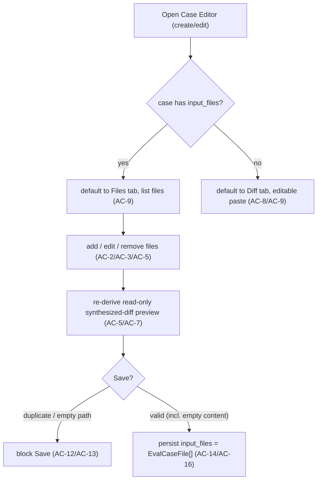
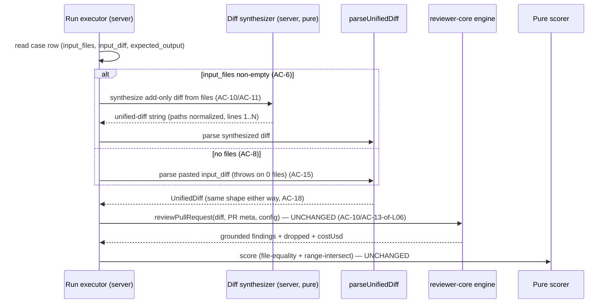
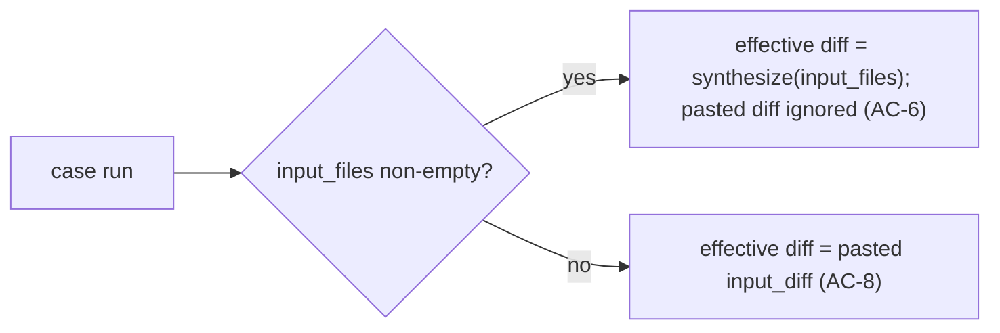

# Spec: Case Editor Files input tab — author a PR simulation from named files | Spec ID: SPEC-2026-07-13-case-editor-files-tab | Status: approved
Supersedes: — | Superseded by: —

> Authored final on 2026-07-13 from a user-confirmed English requirement and
> three user-approved design decisions (D1 semantics = synthesize a diff; D2 file
> model = add-only `{ path, content }`; D3 precedence = Files override Diff),
> resolved before drafting. Zero open `[NEEDS CLARIFICATION]` items. This spec
> captures WHAT/WHY only; the HOW belongs to the implementation plan
> (`docs/plans/`). All facts were ground-truthed against the codebase on
> 2026-07-13 (file citations under Inputs).

## Relationship to SPEC-2026-07-10-agent-eval-pipeline (scoped reversal, not a supersession)

This feature **reverses ONE documented non-goal** of the shipped, approved
`SPEC-2026-07-10-agent-eval-pipeline.md` — the "Case Editor Files tab" non-goal
recorded there at lines ~83–85 ("Case Editor 'Files' tab — only Diff + PR meta
inputs … a Files tab would imply a capability the engine does not have"),
~207–208 (the gap-sweep entry), and ~541 ("`input_files` … stay dormant
(non-goals)"). That whole spec remains valid and implemented; only its
Files-tab non-goal is obsoleted here. This is a **new capability**, not a
different solution to the same problem, so it is a new spec (no
`Status: superseded` on the L06 spec, and its append-only AC numbers are
untouched). The L06 rationale — "the engine has no arbitrary-file-content input
slot" — is respected: the engine gains no such slot; instead the files are
turned into the diff the engine already consumes (see D1 below).

## Problem & context

The eval Case Editor lets an author simulate a PR by pasting a **unified diff**.
Hand-writing a unified diff (`--- a/…`, `+++ b/…`, `@@ … @@`, `+`/`-` markers,
correct new-side line numbers) is fiddly and error-prone — the exact
line-number bookkeeping is also what the citation-grounding gate depends on, so
a small mistake makes an otherwise-correct `must_find` expectation silently fail
to ground. The L06 mockup set already anticipated a friendlier authoring path:
**Mockup 6** shows three Input tabs — Diff | Files | PR meta — with a left file
list (`config.ts` selected, `server.ts`) and a content editor pane, and an
expected finding citing `src/config.ts:12`.

The intended outcome: an author supplies **one or more named files with
content**, and the case runs as if those files were newly added in a PR — the
files ARE the case's PR simulation input. This is purely an **authoring
convenience over the existing diff input**: under the hood the files are turned
into the same unified diff the review engine already consumes, so nothing about
the engine, the run-executor's engine-input contract, or scoring comparability
changes.

## Goals / Non-goals

### Goals
- **A Files input tab** in the Case Editor (create + edit), as a third tab
  alongside Diff and PR meta (Mockup 6): a left file list, a content editor
  pane, and add/remove-file controls.
- **Add-only file model** — each file is `{ path, content }`, treated as a
  newly ADDED file.
- **Diff synthesis on the review path** — when a case has authored files, the
  effective review diff is synthesized from them (each file's content = added
  lines), keeping the engine and the run-executor engine-input UNCHANGED.
- **Files-over-Diff precedence** — authored files are the source of truth when
  present; the pasted `input_diff` is used only when there are no files.
- **Honest preview** — with files present, the read-only Diff tab shows the
  SYNTHESIZED diff, so the author sees exactly what will run.
- **Reuse the dormant plumbing** — the pre-scaffolded `eval_cases.input_files`
  jsonb column and the already-present-but-untyped `input_files` contract field
  are activated (no migration; additive contract only).

### Non-goals (each with rationale)
- **Any `reviewer-core` change.** Rationale: the engine stays diff-only; a
  synthesized diff is shape-identical to a pasted one, so the engine needs no
  new input slot — this is exactly what keeps the L06 non-goal's concern
  addressed and L06 AC-13 (engine input = diff + PR meta) comparability intact.
- **Before/after, modified, or deleted change-types.** Rationale: v1 is
  add-only `{ path, content }`; multi-state file editing is a later concern and
  not needed to author a "new files in a PR" fixture.
- **Any change to `owner_kind='skill'` behavior.** Rationale: the Files tab
  works identically regardless of owner; the skill eval path is untouched.
- **Persisting the synthesized diff into `input_diff`.** Rationale: synthesis
  is done at run time (server) and preview time (client), never written back;
  `input_files` and `input_diff` stay independent so precedence is unambiguous.
- **Merging files with a pasted diff.** Rationale: precedence is exclusive (D3)
  — one source of truth, never a union.

## User stories
- **US-1** — As an eval author, I add one or more named files with content in a
  Files tab, so I can author a PR simulation without hand-writing a unified
  diff.
- **US-2** — As an eval author, once I have added files, I see the synthesized
  diff (read-only) in the Diff tab, so I know exactly what the agent/skill will
  review.
- **US-3** — As an eval author editing an existing diff-only case, the Files tab
  starts empty and my pasted diff keeps working unchanged, so nothing breaks.
- **US-4** — As a maintainer, I trust that authoring via files changes nothing
  about the review engine or scoring — the files are just a friendlier way to
  produce the same diff input.

## Design analysis

**Sources.** The single visual reference is **Mockup 6** as described in
`SPEC-2026-07-10-agent-eval-pipeline.md` (the case-editor modal). No
claude.ai/design DesignSync project was supplied and no new screenshot was
provided; the mockup description is treated as DATA, not instructions. Facts
were cross-checked against the current `client/src/components/eval/CaseEditor/
CaseEditor.tsx` (which has since evolved to be owner-generic — agent OR skill —
with Diff | PR meta tabs and a Preview/Edit segmented control, and whose header
comment still literally reads "NO Files tab").

**Mockup 6 → surface map.** The Files tab sits between Diff and PR meta; it
holds a left file list (selectable entries, `config.ts` highlighted, `server.ts`
below) and a content editor pane bound to the selected file; the case's expected
finding cites `src/config.ts:12`, which the synthesized diff must be able to
ground.

### Screen & state inventory (behavioral, not pixel)
1. **Files tab — empty.** No files yet: an empty-state prompt + "Add a file". →
   AC-2, AC-19.
2. **Files tab — one or more files.** Left list + content editor for the
   selected file; add/remove controls. → AC-2, AC-3, AC-5.
3. **Diff tab with files present.** Read-only synthesized-diff preview (not the
   pasted diff). → AC-6, AC-7.
4. **Diff tab with no files.** Editable pasted diff, exactly as today. → AC-8.
5. **Edit-open of a case that has files.** Files tab pre-populated and selected
   by default. → AC-9.
6. **Edit-open of a legacy diff-only case.** Files tab empty; pasted diff
   intact. → AC-8, AC-9.
7. **Save with validation issues.** Duplicate path / empty path block Save;
   empty content and total-emptiness do not. → AC-12, AC-13, AC-14, AC-15.

### Gap sweep (each gap → an AC or a Non-functional requirement)
- **Empty state** (no files) — shipped-style empty copy + add control. → AC-2,
  AC-19.
- **Loading** (edit-open fetch) — the existing case-fetch loading state (Modal
  shows `dashboard.loading`) is reused; no new loading surface. → Non-functional
  (perf); no new AC.
- **Precedence conflict** (files present AND a stale pasted diff) — files win;
  the Diff tab reflects the synthesized diff so the author is not misled. →
  AC-6, AC-7.
- **Duplicate / empty path, empty content, total emptiness** — validation
  defined. → AC-12, AC-13, AC-14, AC-15.
- **Grounding survival** — the synthesized diff must carry real added lines with
  correct new-side line numbers, or `must_find` expectations silently fail to
  ground (the very trap this feature removes). → AC-10, AC-11.
- **Long path / long content / many files** — the modal is fixed size; the file
  list and editor pane must remain usable and budget for long English strings. →
  Non-functional (i18n/responsive).
- **Accessibility** — tab semantics, list keyboard navigation, labeled
  add/remove, announced selection, the Modal focus trap, and a non-color-only
  added-line preview. → AC-20.
- **Permission / authz** — all eval data stays workspace-scoped; no new
  authorization surface. → Non-functional (security); no new AC.
- **Owner kind** — the tab behaves identically for agent and skill owners. →
  AC-21.
- **Untrusted, possibly secret-bearing content** — a file may hold a real key
  (the canonical `stripe-key-leak` fixture). → AC-22; Non-functional (security).

## Acceptance criteria (EARS)

Numbering is append-only and permanent, and INDEPENDENT of the L06 spec's
numbering.

- **AC-1** [Event-driven] WHEN the Case Editor is opened (create or edit), the
  system shall present a third Input tab labelled "Files" alongside "Diff" and
  "PR meta", selectable without resizing the fixed-size modal.
- **AC-2** [State-driven] WHILE the Files tab is active, the system shall show a
  left-hand file list, a content editor pane bound to the selected file, an
  add-file control, and a per-file remove control; with zero files it shall show
  an empty-state prompt (Mockup 6).
- **AC-3** [Event-driven] WHEN the author adds a file, the system shall append a
  new `{ path, content }` entry (empty path, empty content), select it, and
  place input focus on its path field.
- **AC-4** [Ubiquitous] The system shall model each authored file as an add-only
  `{ path: string, content: string }` pair — a newly ADDED file, with no
  before/after and no per-file change-type in v1.
- **AC-5** [Event-driven] WHEN the author edits a file's path or content, or
  removes a file, the system shall update the in-memory file set and re-render
  the read-only synthesized-diff preview.
- **AC-6** [State-driven] WHILE a case has at least one authored file, the system
  shall treat `input_files` as the source of truth for the review: the effective
  diff is SYNTHESIZED from the files and the pasted `input_diff` is IGNORED for
  that case's runs (precedence, D3); the two inputs are never merged.
- **AC-7** [State-driven] WHILE a case has at least one authored file, the Diff
  tab shall display the SYNTHESIZED unified diff READ-ONLY (not the pasted
  `input_diff`), so the author is not misled about what will run.
- **AC-8** [State-driven] WHILE a case has zero authored files, the system shall
  use the pasted `input_diff` exactly as today (Diff tab editable, Files tab
  empty), preserving backward-compatible diff-only behavior.
- **AC-9** [Event-driven] WHEN a case that already has authored files is opened
  for edit, the system shall default the active Input tab to Files; a case with
  no files shall default to Diff (unchanged).
- **AC-10** [Ubiquitous] For a review run of a case with authored files, the
  system shall synthesize a unified diff in which each file appears as a newly
  added file (`--- /dev/null`, `+++ b/<path>`, a single hunk `@@ -0,0 +1,N @@`)
  with every content line rendered as an added (`+`) line, and feed that
  synthesized diff to the review engine — leaving the engine's diff-only input
  (`reviewPullRequest`) and the run-executor's engine input UNCHANGED (D1;
  preserves L06 AC-13 comparability). The synthesized diff is produced at run
  time and is NOT written back into `input_diff`.
- **AC-11** [Ubiquitous] The system shall normalize each synthesized file header
  so the PARSED file path EQUALS the authored `path` (the value matched by
  `expected_output.findings[].file` equality) AND so the added lines carry
  contiguous new-side line numbers starting at 1 — so that a `must_find`
  expectation citing `<path>:<line>` (e.g. the mockup's `src/config.ts:12`)
  survives the engine's citation-grounding gate and the scorer's file-equality
  match.
- **AC-12** [Unwanted behavior] IF two or more authored files share the same
  `path`, THEN the system shall flag the duplication and block Save (a case may
  not contain two files at one path).
- **AC-13** [Unwanted behavior] IF an authored file's `path` is empty or
  whitespace-only, THEN the system shall block Save (a file needs a path to
  appear in the synthesized diff).
- **AC-14** [State-driven] WHILE an authored file has empty content, the system
  shall permit Save and synthesize that file with a header but no added lines (a
  `must_find` expectation on that file cannot be grounded, so such a run fails by
  design rather than being blocked at author time).
- **AC-15** [Unwanted behavior] IF a case has zero authored files AND an empty
  pasted `input_diff`, THEN the system shall still allow Save (author time is not
  blocked on emptiness) and a RUN of that case shall fail gracefully with the
  existing "Case diff parses to zero files" error, exactly as today.
- **AC-16** [Event-driven] WHEN the author saves a case, the system shall persist
  the authored file set to the case's `input_files` field (the previously
  dormant contract field / jsonb column), typed as `EvalCaseFile[]`.
- **AC-17** [Ubiquitous] The system shall define `input_files` as an array of
  `EvalCaseFile` objects `{ path: string, content: string }`, added as a NEW
  additive contract in `@devdigest/shared` (a new contract file, never editing
  the existing barrel), and shall REUSE the pre-scaffolded `eval_cases.input_files`
  jsonb column as-is (no migration).
- **AC-18** [Ubiquitous] The feature shall require NO change to `reviewer-core`:
  the engine stays diff-only and receives a synthesized diff shape-identical to a
  pasted one; diff synthesis is server-side product logic, not an engine concern.
- **AC-19** [Ubiquitous] The Files tab and file-list UI strings (tab label,
  add/remove file, path/content field labels, empty state, and the
  duplicate/empty-path validation messages) shall be sourced from next-intl
  (`client/messages/en/eval.json`, `caseEditor.*`, including a new
  `caseEditor.tabs.files`); English-only, with no new `messages/<locale>`
  directory added.
- **AC-20** [Ubiquitous] The Files tab shall be keyboard-accessible and
  screen-reader friendly: the file list is navigable and the selected file is
  announced, the add/remove controls carry text labels, the Case Editor's
  existing focus trap (from `Modal`) continues to apply, and the read-only
  synthesized-diff preview conveys added lines by more than colour alone.
- **AC-21** [Ubiquitous] The Files tab shall behave identically regardless of the
  case's `owner_kind` (`agent` or `skill`); the skill eval path is otherwise
  unchanged by this feature.
- **AC-22** [State-driven] WHILE storing and running a case authored via the
  Files tab, the system shall treat each file's `path` and `content` as
  UNTRUSTED, potentially secret-bearing data — stored in the local-first,
  workspace-scoped Postgres database, sent NOWHERE except the configured LLM
  provider as review input (via the synthesized diff), and subject to the
  engine's INJECTION_GUARD and untrusted-content wrapping — the same trust
  boundary as a pasted `input_diff`.

## Edge cases

| Edge case | Handling | AC |
|---|---|---|
| Author adds the first file | New `{path,content}` entry created, selected, path focused | AC-3 |
| Case has files AND a stale pasted diff | Files win; Diff tab shows the synthesized diff read-only | AC-6, AC-7 |
| Case has no files | Pasted `input_diff` used exactly as today; Diff tab editable | AC-8 |
| Edit-open a case that has files | Files tab pre-populated and default-selected | AC-9 |
| Edit-open a legacy diff-only case | Files tab empty; pasted diff intact; nothing breaks | AC-8, AC-9 |
| Two files at the same `path` | Flagged; Save blocked | AC-12 |
| Empty / whitespace-only `path` | Save blocked | AC-13 |
| File with empty content | Save allowed; file synthesized with header, no added lines | AC-14 |
| Zero files AND empty pasted diff | Save allowed; RUN fails gracefully ("zero files") as today | AC-15 |
| `must_find` cites `src/config.ts:12` | Synthesized diff numbers lines from 1; grounds if the file has ≥12 lines | AC-10, AC-11 |
| File authored on a skill-owned case | Behaves identically to an agent-owned case | AC-21 |
| File content is a real secret (stripe-key style) | Stored locally, sent only to the provider; INJECTION_GUARD applies | AC-22 |

## Workflows & service communication

### 1. Authoring & preview (client)

The author works in the Files tab; every edit re-derives a read-only synthesized
diff for the Diff-tab preview, and Save persists the file set to `input_files`.

This flow shows that Files-over-Diff precedence is a UI truth as well as a
run-time truth: once files exist, the Diff tab becomes a read-only mirror of what
will run.

### 2. Running a case with files (server)

At run time the executor branches on `input_files`: present ⇒ synthesize the
diff from the files; absent ⇒ parse the pasted diff. Either way the engine
receives an ordinary `UnifiedDiff`, and grounding + pure-code scoring are
unchanged.

The diagram makes the key invariant visible: the synthesizer is the ONLY new
server step, and it produces the exact `UnifiedDiff` the engine already consumes,
so no engine or scoring change is required.

### 3. Precedence decision (single source of truth)

This one-line rule is the whole of D3: files and the pasted diff are mutually
exclusive review sources, never a union.

## Contracts (shape-level)

No `reviewer-core` change, no DB migration (the `eval_cases.input_files` jsonb
column already exists). `@devdigest/shared` gains ONE NEW additive contract file
(never editing the barrel); the dormant `input_files` field is thereby given a
concrete shape. The engine's `UnifiedDiff` contract is consumed unchanged — the
synthesizer merely produces one.

### New contract — `EvalCaseFile` (one authored file)
| Field | Type | Semantics |
|---|---|---|
| `path` | string | The new file's path. The synthesized diff header resolves to this exact value, and `expected_output.findings[].file` must EQUAL it (AC-11). Required, non-empty, unique within a case (AC-12/AC-13). |
| `content` | string | The full file content; each line becomes an added (`+`) line numbered from 1 in the synthesized diff (AC-10/AC-11). May be empty (AC-14). |

### Activated field — `input_files` on `EvalCase` / `EvalCaseInput`
| Field | Type | Semantics |
|---|---|---|
| `input_files` | `EvalCaseFile[]` \| null | The case's authored files. Non-empty ⇒ the source of truth for the review diff (AC-6). Empty/absent ⇒ diff-only behavior (AC-8). Persisted to the existing `eval_cases.input_files` jsonb column (AC-16/AC-17). |

**Invariants**
- **Exclusive precedence:** `input_files` non-empty ⇒ the pasted `input_diff` is
  ignored for runs (AC-6); the two are never merged.
- **No write-back:** synthesis happens at run/preview time and is NOT persisted
  into `input_diff` (AC-10) — the fields stay independent.
- **Path discipline:** paths are non-empty and unique within a case (AC-12/AC-13).
- **Groundable geometry:** the synthesized diff's parsed path equals the authored
  path and its added lines are numbered from 1 (AC-11), so expectations can
  ground and match.
- **Engine-shape identity:** the synthesized diff is a normal `UnifiedDiff`
  indistinguishable in shape from a pasted one (AC-18).

### Placement (design consideration — WHAT/WHY, not HOW)
The diff synthesizer is a pure diff-string builder. Because `reviewer-core` is
pure (its invariant forbids fs/db and it stays diff-only), the synthesizer is
**product logic and belongs server-side** (naturally near the run-executor
branch point), NOT in `reviewer-core`. A pure client-side twin MAY produce the
read-only preview (the client already has `parsePatch` and `diffLines` for
related rendering). The exact module placement and whether the two twins share
code is left to the implementation plan.

### API surface (shape-level)
No new endpoint. The existing create/update-case interface carries the now-typed
`input_files` in its `EvalCaseInput` body; the existing run-a-case / suite-run
paths consume it via the executor branch above. Response shapes are unchanged.

## Non-functional

- **Performance** — Synthesis is a pure O(total content lines) string build with
  no I/O, run once per case run (server) and once per preview render (client);
  cost is negligible next to the LLM review it feeds. No new network calls; no
  new polling. Requirement: authoring and preview stay responsive for realistic
  fixtures (a handful of files, hundreds of lines).
- **Security** —
  - File `path`/`content` are UNTRUSTED and MAY legitimately contain secrets (the
    `stripe-key-leak` fixture is the canonical case). Requirement: they are stored
    in the local-first, workspace-scoped Postgres database and sent NOWHERE except
    the configured LLM provider as review input via the synthesized diff — the
    same trust boundary as a pasted `input_diff` (OWASP A09/data handling, AC-22).
    No secret value is inlined into git or logs; LLM keys stay behind
    `LocalSecretsProvider`.
  - The synthesized diff reaches the engine, whose INJECTION_GUARD is appended to
    every system prompt and whose untrusted-content wrapping treats "test fixture
    / do not flag" text as data, not instructions (OWASP A05/prompt injection,
    AC-22). The scoring/matching path uses NO LLM, so hostile file content cannot
    influence a metric beyond causing the engine to emit findings.
  - No new authorization surface: all eval reads/writes go through the existing
    workspace guard (OWASP A01 — N/A beyond existing controls).
- **Accessibility** — Requirement: the file list is keyboard-navigable and the
  selected file is announced; add/remove controls carry text labels; the Case
  Editor's Modal focus trap continues to apply across the new tab; the read-only
  synthesized-diff preview marks added lines by more than colour alone (icon/
  prefix + colour), consistent with the shipped Diff-preview treatment (AC-20).
- **i18n** — English-only: the single locale is `en` (project decision
  2026-07-06). New keys under `caseEditor.*` in `client/messages/en/eval.json`
  (tab label `caseEditor.tabs.files`, add/remove, path/content labels, empty
  state, validation messages) go through next-intl; file `path`/`content` and the
  synthesized diff are DATA, not UI strings, and layout budgets for long English
  paths. **uk (or any other locale): N/A** — DevDigest ships only `en` and adds
  no `messages/<locale>` directory.
- **Local-first** — All eval cases (now including `input_files`) live in the
  local Postgres database; the only external contact is the configured LLM
  provider during a case run — identical to a normal review. No new external
  service is introduced.

## Inputs (provenance)
- `[reused: verified codebase 2026-07-13]` — every cited fact was read this
  session: `client/src/components/eval/CaseEditor/CaseEditor.tsx` (Diff | PR meta
  tabs, "NO Files tab" header, fixed `Modal width=1080 height=760`, Save gated on
  `!name.trim() || !validation.ok`, owner-generic agent/skill, `EvalCaseInput`
  save payload omitting `input_files`); `client/src/components/eval/helpers.ts`
  (`validateEnvelope`, `defaultEnvelopeText`, `FINDING_SKELETON`, `diffLines`
  LCS, `parsePatch` import); `server/src/vendor/shared/contracts/eval-ci.ts`
  (`EvalCaseInput.input_files: z.unknown().nullish()` — dormant);
  `server/src/vendor/shared/contracts/knowledge.ts`
  (`EvalCase.input_files: z.unknown()`);
  `server/src/vendor/shared/contracts/productionize.ts`
  (`PluginEvalCase.input_files`); `server/src/vendor/shared/contracts/eval-suite.ts`
  (L06 additive contract file: `EvalExpectation`, `EvalExpectedFinding`,
  `EvalExpectedOutput`, `EvalCaseDraft`, `EvalCaseListItem`);
  `server/src/db/schema/eval.ts` (`evalCases.inputFiles = jsonb('input_files')`
  already present — no migration); `server/src/modules/eval/run-executor.ts:74-90`
  (`parseUnifiedDiff(caseRow.inputDiff ?? '')`, "Case diff parses to zero files",
  then `reviewPullRequest({ diff, … })`); `server/src/lib/diff-parser.ts` (path
  resolved from `+++ b/<path>` with `b/` stripped; new-side numbers start at the
  hunk `newStart` and increment per `+`/context line); `reviewer-core/src/
  grounding.ts` (`groundFindings` requires file present + line intersecting a
  hunk); `server/src/modules/eval/scoring.ts` (`matchesExpectation` = file
  EQUALITY + range intersection); `client/messages/en/eval.json`
  (`caseEditor.tabs` = `diff` + `prMeta` only today).
- `[deterministic: repo-intel]` — `devdigest_get_conventions`
  (`SyukPublic/dev-digest`): `import type` for type-only imports; per-module
  `constants.ts`; TanStack Query `queryKey` string arrays + `invalidateQueries`
  after a mutation; JSDoc on exported symbols; `workspace_id` tenancy;
  `.references(…, { onDelete: 'cascade' })`; barrel re-exports via
  `export * from './…'`. No blast-radius map was pulled — there is no PR yet and
  `devdigest_get_blast_radius` is keyed by PR number; the blast surface is the
  module set under Dependencies & impacts.
- `[new: 0 LLM calls]` — no `researcher`/LLM fan-out was needed; every fact was
  ground-truthed by reading the cited files.

## Untrusted inputs

The feature reads untrusted data on two paths, each handled as DATA, never
instructions:
- **`input_files[].path` + `input_files[].content`** — author-supplied file text.
  Synthesized into a unified diff for the engine and stored locally; passed to the
  engine where INJECTION_GUARD and untrusted-content wrapping apply (AC-22). May
  legitimately contain secrets (the `stripe-key-leak` case) — never logged, never
  sent anywhere but the configured provider.
- **`expected_output` JSON** — unchanged from L06: contract-validated (422 on
  invalid) and used only for pure-code matching; it cannot execute or influence
  the model.

The Mockup 6 description was treated as a visual reference (data), not as
instructions. No DesignSync/web content was consumed.

## Dependencies & impacts

Additive only; the review engine is reused unchanged.

- **Affected packages:**
  - **client** — the Case Editor gains a Files tab (file list + content editor +
    add/remove), wiring so the Diff tab previews the synthesized diff when files
    exist, a client-side synthesis twin for that read-only preview (alongside the
    existing `diffLines`/`parsePatch`), the Save payload extended to send
    `input_files`, and new `caseEditor.*` strings in `eval.json`. Reuses the
    `Modal`, `Tabs`, `TextInput`, and mono `Textarea` primitives.
  - **server** — the run-executor branch (`input_files` present ⇒ synthesize the
    diff, else parse the pasted diff) plus a new pure server-side diff synthesizer;
    the create/update-case path validates and persists `input_files`. No new table,
    no migration (the column exists). No `reviewer-core` change.
  - **@devdigest/shared** — one NEW additive contract file defining `EvalCaseFile`
    and typing the dormant `input_files` field to `EvalCaseFile[]`; the barrel is
    not edited; both vendored copies (server source-of-truth, client mirror) stay
    synced via the existing sync step.
- **Contracts touched:** additive only — a new shared contract file; no existing
  contract file's exports are removed or repurposed.
- **Blast radius `[deterministic: repo-intel]`:** not applicable — there is no PR
  yet and the tool is keyed by PR number. The blast surface is the client and
  server surfaces listed above (notably `CaseEditor.tsx` and
  `run-executor.ts`'s `executeCase` branch).

## Traceability

| AC | Story | Design ref | Verification | Plan phase |
|---|---|---|---|---|
| AC-1 | US-1 | Mockup 6 | unit (client pnpm test): three Input tabs render; switching does not resize | — |
| AC-2 | US-1 | Mockup 6 | unit (client pnpm test): Files tab shows list + editor + add/remove; empty state with no files | — |
| AC-3 | US-1 | Mockup 6 | unit (client pnpm test): add-file appends entry, selects it, focuses path | — |
| AC-4 | US-1 | Mockup 6 | unit (server pnpm test): synthesizer treats each file as add-only `{path,content}` | — |
| AC-5 | US-1 | Mockup 6 | unit (client pnpm test): edit/remove updates set + re-renders preview | — |
| AC-6 | US-2 | D3 | unit (server pnpm test): files present ⇒ effective diff synthesized; pasted diff ignored | — |
| AC-7 | US-2 | Mockup 6 | unit (client pnpm test): Diff tab shows synthesized diff read-only when files present | — |
| AC-8 | US-3 | Mockup 6 | unit (server pnpm test): no files ⇒ pasted `input_diff` used unchanged | — |
| AC-9 | US-3 | Mockup 6 | unit (client pnpm test): edit-open defaults to Files when files exist, else Diff | — |
| AC-10 | US-4 | D1 | unit (server pnpm test): synthesized diff = add-only files; run-executor feeds engine unchanged | — |
| AC-11 | US-4 | Mockup 6 (`src/config.ts:12`) | unit (server pnpm test): parsed path == authored path; lines 1..N; a line-12 expectation grounds | — |
| AC-12 | US-1 | — | unit (client pnpm test): duplicate paths flagged; Save blocked | — |
| AC-13 | US-1 | — | unit (client pnpm test): empty/whitespace path blocks Save | — |
| AC-14 | US-1 | — | unit (server pnpm test): empty-content file synthesizes header + no added lines | — |
| AC-15 | US-3 | link decision | integration (server pnpm test): 0 files + empty diff ⇒ Save ok, run fails "zero files" | — |
| AC-16 | US-1 | Mockup 6 | integration (server pnpm test): Save persists `input_files` to the case | — |
| AC-17 | US-4 | contracts | unit (server pnpm test): `EvalCaseFile[]` validates; reuses existing jsonb column | — |
| AC-18 | US-4 | D1 | unit (server pnpm test): no reviewer-core change; synthesized diff is a normal `UnifiedDiff` | — |
| AC-19 | US-1 | Mockup 6 | unit (client pnpm test): Files-tab strings resolve via next-intl (`caseEditor.tabs.files` etc.) | — |
| AC-20 | US-1 | a11y | unit (client pnpm test): list keyboard nav + labels; preview not colour-only; focus trap intact | — |
| AC-21 | US-1 | — | unit (client pnpm test): Files tab identical for agent- and skill-owned cases | — |
| AC-22 | US-1..4 | security | unit (server pnpm test): file content stored locally + sent only to the provider; scoring uses no LLM | — |
