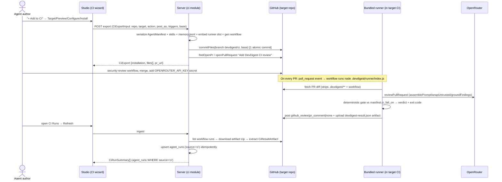
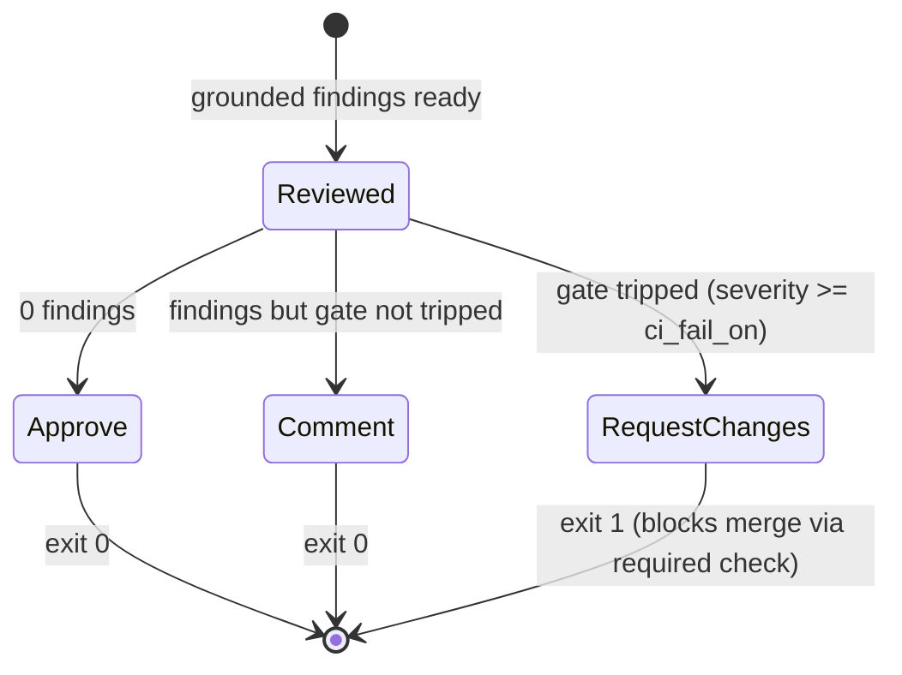
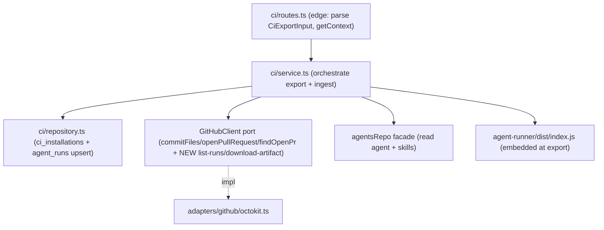

# Spec: Export to CI | Spec ID: SPEC-2026-07-14-export-to-ci | Status: approved
Supersedes: — | Superseded by: —

## Problem & context

DevDigest agents are debugged in the studio against sample and eval cases. But the
value only lands when a debugged agent runs where the real pull requests live — in
the target repository's own CI, on every PR, automatically. Today an agent is a
studio-only artifact: a config (model + system prompt + linked skills + settings)
with no path out of the local app.

"Export to CI" gives an agent that path. It serializes the agent config to a YAML
manifest `.devdigest/agents/<slug>.yaml`, validated by **one shared Zod schema**
(`AgentManifest`) used by BOTH the studio serializer and the CI runner — one
contract, two consumers, so the artifact is byte-identical and CI never runs a
"slightly different prompt". The export opens a pull request in the target repo that
adds a **self-contained** GitHub Actions workflow plus the agent bundle under
`.devdigest/`. On every PR the committed bundled runner executes the exact same
`reviewer-core` engine the studio uses — grounding gate included — computes a
deterministic verdict against the agent's `ci_fail_on`, and posts structured
findings. Results flow back into the studio via a pull-on-refresh ingest (the only
viable channel for a local-first studio behind a PAT with no inbound webhooks).

The intended outcome: a single "Add to CI" action turns a validated studio agent
into a reviewed, self-contained PR check in a real repository, with its runs visible
back in the studio — without introducing a GitHub App, an external marketplace
action, or an inbound network dependency.

This is DevDigest course lab L07. The consumer side (the `agent-runner` package) and
most shared contracts already exist (L06 scaffolding); this feature builds the
studio-side export + workflow generation, the ingest, and the two new UI surfaces on
top of them.

## Goals / Non-goals

### Goals
- Serialize an agent to `.devdigest/agents/<slug>.yaml` via the shared `AgentManifest`
  schema so studio and runner validate the identical artifact.
- Generate a 6-file, self-contained CI bundle (manifest, one skill file per linked
  skill, an empty `memory.jsonl` placeholder, the committed bundled runner, and the
  GitHub Actions workflow) and open a reviewed PR that adds it.
- Make the export idempotent: re-export re-commits to branch `devdigest/ci` and
  reuses the open PR.
- Generate a security-minimal workflow (least-privilege permissions, secrets from
  repo Secrets, fork-safe trigger).
- Ingest CI run results back into the studio (pull-on-refresh + auto-refresh),
  idempotently, and surface them on a new CI Runs page and per-agent CI history.
- Expose the full four-value "Fail CI on" gate control on both the Config tab and the
  new CI tab.

### Non-goals
- **Building or modifying the `agent-runner` package** — it is already implemented,
  tested, and ncc-bundled. This feature depends only on its published contract and
  its `dist/index.js` output.
- **CircleCI, Jenkins, and Generic CLI targets** — shown as cards but DISABLED stubs;
  not implemented in this feature.
- The wizard does **not** create/verify GitHub Secrets, does **not** configure branch
  protection, and does **not** merge the export PR.
- **No inbound webhooks** — ingest is pull-based only.
- The multi-agent review service, the "Run Review ▾" dropdown, and the PR feed/stream
  are untouched.
- The `ci_runs` table and the `CiRun` contract (L06 scaffolding) are **retired** by
  this feature (see Contracts) — no new code consumes them.

## User stories

- **US-1** — As an agent author, from the agent's CI tab I click "Add to CI" and a
  4-step Export wizard (Target → Preview → Configure → Install) walks me through
  exporting the agent to a target repo.
- **US-2** — As a repo maintainer, the export opens a PR (atomic commit to branch
  `devdigest/ci`) rather than pushing to the default branch, so the reviewer config
  is code-reviewed like any other change.
- **US-3** — As a security-conscious maintainer, the generated workflow is
  self-contained (the runner is committed in the same PR; no external/marketplace
  action) and least-privilege, so I can read exactly what will run.
- **US-4** — As an agent author, a CI Runs page lists runs ingested from GitHub — PR,
  repo, agent, status/verdict, findings, cost, duration, and a link to the Actions
  job.
- **US-5** — As an agent author, the agent's CI tab shows per-repo installations
  (status + workflow version), the agent's CI run history, and the "Fail CI on"
  selector.
- **US-6** — As a platform owner, the exported manifest is validated by the SAME
  `AgentManifest` Zod schema in studio and runner, so the artifact is byte-identical
  and cannot drift between the two consumers.
- **US-7** — As a maintainer, I can complete the end-to-end flow: pass the wizard → PR
  opened → security-review the workflow → merge → add the OpenRouter secret → open a
  test PR → agent findings appear → set "Fail CI on" to block → a CRITICAL finding
  yields REQUEST_CHANGES + a non-zero check that branch protection blocks (no GitHub
  App) → back in the studio, CI Runs shows the ingested run.

## Design analysis

**Source of design.** The mockups for the five screens are **not on disk**
(`docs/specs/assets/` holds only `.gitkeep`); DesignSync was therefore not consulted.
The authoritative design is the textual screen inventory supplied with the feature
brief, referenced below by screen label (N12 / N13 / CI tab). The existing i18n
strings in `client/messages/en/ci.json` are a second, partial design source (they
predate this feature and contain known drift — flagged under Non-functional → i18n).

**Screen & state inventory.**

- **N12 — Export wizard** (modal "Export to CI", subtitle "Run `<Agent>` automatically
  on pull requests", 4 steps in the `ExportWizardSteps` stepper):
  - *Step 1 Target:* 4 cards — GitHub Actions (preselected, "recommended"), CircleCI,
    Jenkins, Generic CLI. Only GitHub Actions is enabled; the other three are disabled
    stubs. → AC-24, AC-25.
  - *Step 2 Preview:* left "FILES TO CREATE" list; right an editable text editor for
    the selected file ("editable" badge). Six files. → AC-2, AC-6, AC-26.
  - *Step 3 Configure:* trigger chips (opened on / synchronize on / reopened
    optional-off); "Post results as" radios (GitHub review recommended / PR comment /
    None); "No GitHub App needed" block-merge hint. → AC-19, AC-27.
  - *Step 4 Install:* two cards ("Open a PR with these files" recommended / "Copy files
    as a zip" degraded); Install button; docs link. → AC-11, AC-28.
- **N13 — CI Runs page** at `/ci-runs` (new GLOBAL sidebar section): title/subtitle,
  "auto-refresh on" indicator + "Refresh" button, filters (last 7 days / all agents /
  all repos / all statuses / all sources), table, empty state. → AC-33..AC-39.
- **CI tab** (agent editor, new tab): header buttons ("Update CI config", "+ Add to
  CI"), "CI deployment · Active in N repos", "Fail CI on" segmented control,
  per-repo installation rows + "+ Add repository", CI run history. → AC-29..AC-32.

**Gap sweep — states the design does not fully show, and where each went:**

| Gap | Screen | Disposition |
|---|---|---|
| Loading state while the 6 files generate | N12 Step 2 | AC-26 (uses `exportWizard.generating`) |
| In-flight state during Install (commit + open PR) | N12 Step 4 | AC-10 (uses `exportWizard.installing`) |
| Error when `GITHUB_TOKEN` unset | N12 Install / N13 Refresh | AC-43 |
| Error when the runner bundle is unavailable server-side | N12 Step 2/4 | AC-44 |
| Agent has zero linked skills (no skill files) | N12 Step 2 | AC-5 |
| Empty state (no CI runs yet) | N13 | AC-36 |
| Duplicate rows on repeated Refresh | N13 | AC-38 (idempotent ingest) |
| "Running" status for an in-progress Actions job | N13 status column | AC-34 (status enum incl. `running`) |
| Fork-PR run (secrets withheld) | generated workflow | AC-17 |
| Long English repo/PR titles, long system prompts in the YAML editor | N12/N13 | [NEEDS CLARIFICATION #1] left as tuning; text must wrap/truncate, budget for long English strings |
| a11y: modal focus trap, stepper keyboard order, aria-live for generating/installing/refresh | N12/N13 | Non-functional → a11y |
| Table columns Agent / Duration / Trace-link not present in current `ci.json` strings | N13 | Non-functional → i18n (copy additions) + AC-34 |

No design screen or state was silently dropped: each is covered by an AC or recorded
as a Non-functional requirement or the single minor clarification.

## Acceptance criteria (EARS)

One EARS pattern tag per AC. Numbering is append-only and permanent; a removed AC
keeps its ID and line, marked in place.

### A. Export & manifest serialization

- **AC-1** [Event-driven] WHEN the user activates "+ Add to CI" on an agent's CI tab,
  the system shall open the 4-step Export wizard positioned at Step 1 (Target).
- **AC-2** [Event-driven] WHEN the wizard reaches Step 2 (Preview), the system shall
  generate a bundle of six files: `.devdigest/agents/<slug>.yaml`, one
  `.devdigest/skills/<slug>.md` per linked skill, `.devdigest/memory.jsonl` (empty
  placeholder), `.devdigest/runner/index.js` (the bundled runner), and
  `.github/workflows/devdigest-review.yml`.
- **AC-3** [Ubiquitous] The system shall serialize the agent's config — name,
  provider, model, system_prompt, skills (slugs), strategy, ci_fail_on — into
  `.devdigest/agents/<slug>.yaml` conforming to the shared `AgentManifest` schema.
- **AC-4** [Ubiquitous] The serialized manifest shall round-trip through the single
  shared `AgentManifest` Zod schema so that the YAML the studio writes validates
  unchanged in the CI runner (one contract, two consumers — no format drift).
- **AC-5** [State-driven] WHILE the agent has zero linked skills, the system shall
  still emit a valid manifest (`skills: []` or omitted) and emit no skill files, and
  the manifest shall validate against `AgentManifest` (whose `skills` normalizes a
  missing/null value to `[]`).
- **AC-6** [Event-driven] WHEN the user edits an editable file's contents in Step 2
  (the workflow and the manifest are editable), the system shall carry the edited
  contents through to Install.
- **AC-45** [Ubiquitous] The system shall serialize each linked skill's body to
  `.devdigest/skills/<slug>.md`, one file per skill, matching the slugs listed in the
  manifest's `skills` array.

### B. Install / pull request (open_pr and files)

- **AC-7** [Event-driven] WHEN the user activates Install with `action=open_pr`, the
  system shall write all bundle files in ONE atomic commit to branch `devdigest/ci`
  in the target repo (creating the branch from `base` if missing, otherwise
  fast-forwarding it) and open a pull request titled "Add DevDigest CI review".
- **AC-8** [Unwanted behavior] IF an open PR already exists whose head is
  `devdigest/ci`, THEN the system shall reuse that PR (re-commit onto the branch, no
  second PR) so that re-export is idempotent.
- **AC-9** [Ubiquitous] The system shall never commit bundle files directly to the
  base branch and shall never auto-merge the export PR.
- **AC-10** [Event-driven] WHEN an `open_pr` export succeeds, the system shall persist
  a `CiInstallation` (agent_id, repo, target_type, installed_at) and return a
  `CiExport` (`installation`, `files[]`, `pr_url`), and the UI shall show a success
  notification carrying the PR link.
- **AC-11** [Optional feature] WHERE the user selects "Copy files as a zip"
  (`action=files`), the system shall return/persist the generated files without
  opening a PR (the degraded, manual-install path).

### C. Workflow generation & security

- **AC-12** [Ubiquitous] The generated workflow's review step shall run
  `node .devdigest/runner/index.js` (the committed bundle) and shall reference NO
  external or marketplace action for the review itself (checkout/setup-node actions
  for environment setup are permitted).
- **AC-13** [Ubiquitous] The generated workflow shall trigger on `pull_request` with
  the types chosen in Step 3 (default `opened`, `synchronize`, `reopened`) and shall
  NOT use `pull_request_target`.
- **AC-14** [Ubiquitous] The generated workflow's `permissions` block shall grant only
  `contents: read` and `pull-requests: write` (least privilege; no broader scopes).
- **AC-15** [Ubiquitous] The generated workflow shall reference the OpenRouter
  credential as `${{ secrets.OPENROUTER_API_KEY }}` and shall never inline the key
  into the workflow or the manifest; `GITHUB_TOKEN` shall come from the
  Actions-provided token.
- **AC-16** [Ubiquitous] The generated workflow shall pass the chosen `post_as` to the
  runner via the environment variable `DEVDIGEST_POST_AS: <value>`; `post_as` shall
  NOT be added to `AgentManifest` (which stays frozen) and the runner shall require no
  change (it already reads `DEVDIGEST_POST_AS`, default `github_review`).
- **AC-17** [Unwanted behavior] IF a PR originates from a fork, THEN — relying on
  documented GitHub Actions behavior that repo secrets are withheld from
  `pull_request`-triggered workflows on fork PRs — the run shall never receive repo
  secrets, so it either runs without the OpenRouter key (degrades) or does not run
  the review; the runner additionally flags a fork head as informational.
- **AC-18** [Ubiquitous] The runner shall treat the PR diff and the PR title/body/
  comments as untrusted DATA wrapped by reviewer-core's `wrapUntrusted()` +
  `INJECTION_GUARD`, and shall never trigger an action from comment text (existing
  runner contract; the workflow must not weaken it).
- **AC-19** [Ubiquitous] The wizard's Step 3 block-merge hint shall present the "No
  GitHub App needed" guidance: to block merges, set "Fail CI on" so the run exits
  non-zero, then add a required status check in the repo's GitHub branch protection.

### D. Deterministic gate & verdict (runner contract — reused; stated for the acceptance narrative)

- **AC-20** [Event-driven] WHEN the runner completes a grounded review, the system
  shall compute the posted GitHub event and the process exit code deterministically
  from the grounded findings versus `manifest.ci_fail_on`
  (`SEV_RANK`/`FAIL_ON_MIN_RANK` via `gateTriggered`/`countBlockers`), ignoring the
  model's self-reported verdict.
- **AC-21** [State-driven] WHILE `ci_fail_on = critical` (the default) and at least one
  CRITICAL finding survives grounding, the runner shall post REQUEST_CHANGES and exit
  non-zero, so a configured required status check blocks the merge.
- **AC-22** [Unwanted behavior] IF any hard failure occurs in the runner (invalid
  manifest, missing skill file, unresolvable CI context, diff-fetch error, or LLM/
  model-call error), THEN the runner shall post nothing, write no artifact, and exit
  non-zero (never a synthetic review).
- **AC-23** [State-driven] WHILE the "Fail CI on" control is shown, the system shall
  expose all four `CiFailOn` values (never | critical | warning | any) on both the CI
  tab and the Config tab, and both controls shall write the same `agents.ci_fail_on`
  field.

### E. Export wizard UI (N12)

- **AC-24** [Event-driven] WHEN Step 1 (Target) renders, the system shall show four
  target cards with GitHub Actions preselected and badged "recommended", and CircleCI,
  Jenkins, and Generic CLI rendered as disabled stubs.
- **AC-25** [Unwanted behavior] IF the user attempts to select or continue with a
  disabled target (CircleCI/Jenkins/Generic CLI), THEN the wizard shall not advance
  and shall keep GitHub Actions as the effective target.
- **AC-26** [State-driven] WHILE Step 2 (Preview) is active, the system shall show the
  file list on the left and the selected file's contents in an editor on the right,
  badging editable files "editable" and showing a generating indicator until the
  bundle is ready.
- **AC-27** [State-driven] WHILE Step 3 (Configure) is active, the system shall present
  trigger chips (`opened` on, `synchronize` on, `reopened` optional/off) and "Post
  results as" radios (GitHub review — recommended and the only option that yields a
  verdict; PR comment; None — exit code only).
- **AC-28** [State-driven] WHILE Step 4 (Install) is active, the system shall present
  the two install cards (open PR — recommended; copy zip — degraded), an "Install"
  footer action, and a "GitHub Action setup docs" link.

### F. Agent CI tab (screen C)

- **AC-29** [State-driven] WHILE the agent editor's CI tab is active, the system shall
  render header actions "Update CI config" and "+ Add to CI" (the latter opening the
  wizard) and a "CI deployment · Active in N repos" summary.
- **AC-30** [State-driven] WHILE the CI tab is active, the system shall render the
  "Fail CI on" segmented control (all four values) with a description explaining that
  a finding at or above the chosen severity exits non-zero and that a required status
  check blocks merges.
- **AC-31** [State-driven] WHILE the agent has one or more CI installations, the CI tab
  shall list per-repo rows (repo name, target badge, last-run status badge, relative
  time, workflow version) plus an "+ Add repository" affordance.
- **AC-32** [State-driven] WHILE the CI tab is active, the system shall show the
  agent's CI run history sourced from `agent_runs WHERE source='ci'` for that agent,
  reusing the existing run/trace UI.

### G. CI Runs page & ingest (N13)

- **AC-33** [Ubiquitous] The system shall provide a `/ci-runs` page reachable from a
  new "GLOBAL" sidebar section item "CI Runs".
- **AC-34** [State-driven] WHILE the CI Runs page renders rows, each row shall show
  Timestamp, Pull request (# + title, linking to the PR), Agent, Source (CI provider,
  e.g. "GitHub Actions"), Duration, Findings (severity-colored counts), Cost, Status
  (Succeeded / No findings / Failed / Running), and a per-row "Trace" link to the
  Actions job / run detail.
- **AC-35** [Ubiquitous] The CI Runs list shall read `agent_runs WHERE source='ci'` and
  offer filters: last 7 days, all agents, all repos, all statuses, and all sources.
- **AC-36** [State-driven] WHILE no CI runs exist, the page shall show the empty state
  ("No CI runs yet…").
- **AC-37** [Event-driven] WHEN the user activates Refresh (or the auto-refresh timer
  fires), the system shall ingest by (a) listing the review workflow's runs for each
  installed repo, (b) downloading each run's artifact zip, and (c) extracting
  `devdigest-result.json` validated as `CiResultArtifact`.
- **AC-38** [Ubiquitous] Ingest shall upsert an `agent_runs` row with `source='ci'`
  idempotently, deduplicated by the Actions run id / artifact identity, so repeated
  refreshes create no duplicate rows.
- **AC-39** [State-driven] WHILE the auto-refresh toggle is on, the page shall
  periodically re-run the ingest.

### H. Data model & contracts

- **AC-40** [Ubiquitous] The system shall extend `agent_runs` via a NEW migration with
  the columns a CI run needs and lacks today: `pr_number` (int, GitHub PR number),
  `repo` (text, "owner/name"), `github_url` (text, Actions-job URL), and
  `ci_installation_id` (uuid, referencing `ci_installations`, nullable).
- **AC-41** [Ubiquitous] The system shall retire the L06-scaffolded `ci_runs` table and
  the `CiRun` contract (no new code reads or writes them); CI runs are read from
  `agent_runs WHERE source='ci'` and surfaced through a new CI-runs list DTO
  (`CiRunSummary`, or `RunSummary` extended with the CI fields).
- **AC-42** [Ubiquitous] The system shall add GitHub adapter port methods to list a
  repo's workflow runs for the review workflow and to download a run's artifact zip;
  the existing `ci_installations` table and the `CiInstallation` / `CiExport` /
  `CiExportInput` / `CiFile` contracts shall be kept.

### I. Configuration & failure modes

- **AC-43** [Unwanted behavior] IF `GITHUB_TOKEN` is unset (so `container.github()`
  throws `ConfigError`), THEN both export and ingest shall surface a clear,
  actionable error and shall not crash silently or persist a partial installation.
- **AC-44** [Unwanted behavior] IF the built `agent-runner/dist/index.js` is not
  available to the server at export time, THEN the export shall fail with a clear
  "runner bundle missing — build agent-runner" error rather than committing an empty
  or partial `.devdigest/runner/index.js`.

## Edge cases

Each is mapped to an AC or explicitly scoped out.

1. **No `GITHUB_TOKEN`** — export and ingest fail with a clear error → AC-43.
2. **Missing `OPENROUTER_API_KEY` repo secret at run time** — the wizard does not
   verify or add it; the workflow references it; if absent the run degrades/fails in
   the target CI (not in the studio) → AC-15 (+ note the wizard's secret hint copy).
3. **Fork PR** — repo secrets withheld under `pull_request`; run degrades or is guarded
   off; never receives secrets → AC-17.
4. **Re-export / idempotency** — re-commit to `devdigest/ci`, reuse the open PR → AC-8.
5. **Agent with 0 skills** — valid manifest, no skill files → AC-5.
6. **Disabled targets** (CircleCI/Jenkins/Generic CLI) — cards shown, cannot advance;
   not implemented → AC-25, and Non-goals.
7. **Ingest dedupe** — repeated Refresh upserts, no duplicate `agent_runs` rows →
   AC-38.
8. **Runner bundle missing at export** — export fails clearly, commits nothing → AC-44.
9. **Empty `memory.jsonl`** — an empty placeholder file is committed (memory is a
   future lab); the runner tolerates it → AC-2 (placeholder is part of the bundle).
10. **A running / in-progress Actions job** — surfaced as status "Running"; its
    artifact may not exist yet, so ingest simply produces or updates a `running` row
    and completes it on a later refresh → AC-34, AC-38, AC-39.
11. **`action=files` (copy zip)** — no PR opened; user installs manually → AC-11.
12. **Untrusted PR content attempting prompt injection** — wrapped as data; no action
    from comment text → AC-18.

## Workflows & service communication

### End-to-end: export → run → ingest

This diagram shows the two halves of the feature — the studio-side export that opens a
reviewed PR, and the pull-based ingest that brings each CI run's result back — with the
runner (already built) running the same `reviewer-core` engine inside the target repo's
CI in between.

### Deterministic verdict from the grounding gate

This state diagram shows how the runner turns grounded findings into a GitHub event and
exit code deterministically against `ci_fail_on` — the only path by which a review
blocks a merge, and the reason no GitHub App is needed.

### Onion placement of the new server work

This flow shows the new `ci` module following the established Onion layering — a thin
route parses the contract and delegates to a service, which reaches external systems
only through the `GitHubClient` port and shared facades, with DB access confined to the
module repository.

## Contracts (shape-level)

All contracts live in `@devdigest/shared` (extend with a NEW file; never edit the
barrel). Field tables below are shape-level — no implementation code.

### Reused as-is (existing `contracts/eval-ci.ts`, `knowledge.ts`, `findings.ts`)

- **`AgentManifest`** (frozen — the one contract, two consumers): `name` (non-empty),
  `provider` (default `openrouter`), `model` (non-empty), `system_prompt`, `skills`
  (string[]; missing/null normalized to `[]`), `strategy`
  (`auto|single-pass|map-reduce`, default `auto`), `ci_fail_on` (`CiFailOn`, default
  `critical`). Invariant: **no `post_as` field** — `post_as` is delivered to the runner
  via the workflow env `DEVDIGEST_POST_AS`, not the manifest.
- **`CiFile`** `{ path, contents, editable (default true) }`.
- **`CiTarget`** `gha | circle | jenkins | cli` (only `gha` implemented).
- **`CiExportInput`** `{ repo ("owner/name"), target (default gha), action
  (open_pr|files, default open_pr), post_as (github_review|pr_comment|none, default
  github_review), triggers (default [opened, synchronize, reopened]), base (default
  main) }`.
- **`CiInstallation`** `{ id, agent_id, repo, target_type, installed_at }` (kept).
- **`CiExport`** `{ installation, files[], pr_url (nullable) }` (kept).
- **`CiResultArtifact`** `{ findings_count, critical?, warning?, suggestion?, cost_usd
  (nullable), duration_ms?, agent, version?, pr_number? }` — the ingest input, parsed
  with `safeParse` (untrusted).
- **`CiRunStatus`** `succeeded | failed | no_findings | running` (kept for UI status).
- Gate types (reviewer-core, reused): `SEV_RANK {SUGGESTION:1, WARNING:2, CRITICAL:3}`,
  `FAIL_ON_MIN_RANK {never:+Inf, critical:3, warning:2, any:1}`.

### New — `agent_runs` columns (new migration; "new columns = their own migration")

| Column | Shape | Semantics |
|---|---|---|
| `pr_number` | int, nullable | Raw GitHub PR number of the reviewed PR. |
| `repo` | text, nullable | Target repo "owner/name". |
| `github_url` | text, nullable | Actions-job / run-detail URL (the "Trace" link). |
| `ci_installation_id` | uuid, nullable, FK → `ci_installations` (on delete set null) | Links the run to its installation. |

Invariants: these are additive and nullable (existing `source='local'` rows keep
NULLs); `source` remains the enum `['local','ci']`; `cost_usd` stays null-for-unknown
(never a 0 sentinel).

### New — CI-runs list DTO (`CiRunSummary`)

The CI Runs page and per-agent CI history need a row DTO for `agent_runs WHERE
source='ci'`. It carries the `RunSummary` fields (run_id, agent_id, agent_name,
provider, model, status, error, duration_ms, cost_usd, findings_count, grounding,
score, blockers, ran_at) plus the CI-specific fields:

| Field | Shape | Semantics |
|---|---|---|
| `source` | string | CI provider label / source (e.g. "ci"/"GitHub Actions"). |
| `repo` | string, nullable | "owner/name". |
| `pr_number` | int, nullable | PR number (row shows "#123 · title"). |
| `github_url` | string, nullable | Link to the Actions job. |
| `ci_installation_id` | string, nullable | Installation link. |

Whether this is a distinct `CiRunSummary` schema or `RunSummary` extended with these
fields is a plan-level decision; the required shape is fixed here.

### New — GitHub adapter port methods (interface `GitHubClient`)

Shape-level (exact signatures are the planner's call; direction and purpose fixed
here):

| Method (intent) | Input | Output (shape) | Semantics |
|---|---|---|---|
| list workflow runs | repo, workflow file/name | array of `{ run_id, status/conclusion, pr_number, html_url, created_at }` | The review workflow's runs, for ingest. |
| download run artifact | repo, run_id (+ artifact name) | the artifact bytes / extracted `devdigest-result.json` text | Source of the `CiResultArtifact`. |

These join the existing (implemented, previously dormant) write methods
`openPullRequest`, `commitFiles` (one atomic commit; create-or-fast-forward branch;
idempotent), and `findOpenPr` — for which this feature is the **first production
consumer**.

### Retired — `ci_runs` table + `CiRun` contract

The L06-scaffolded `ci_runs` table and its `CiRun` Zod contract are retired: no code in
this feature reads or writes them; CI runs live in `agent_runs` (`source='ci'`).
Physical drop of the table vs. leaving it empty-and-unused is a migration decision for
the planner; from the contract's standpoint `CiRun` is deprecated and unreferenced.

## Non-functional

- **Performance** — Export is a single atomic commit + at most one PR call; no
  per-file round trips. Ingest is bounded by the CI Runs filter (default "last 7 days")
  and by dedup upserts, and must page GitHub workflow-run listings within GitHub API
  rate limits. Auto-refresh polls on an interval (see i18n `runs.autoRefresh`): the
  interval is **30s** and the ingest lookback window is **7 days** (matching the page's
  default filter), deliberately longer than the 4000ms while-running convention to
  respect GitHub API rate limits. These values are tunable but fixed here as the default.
- **Security** — This feature adds a lethal-trifecta exfiltration surface: the agent
  reads an untrusted diff AND the workflow can write to a (potentially public) PR.
  Mitigations are hard ACs: least-privilege `permissions` (contents:read,
  pull-requests:write only — AC-14); OpenRouter key only from repo Secrets, never
  inlined (AC-15); fork PRs get no secrets via `pull_request` not `pull_request_target`
  (AC-17); untrusted diff + PR title/body/comments wrapped by
  `wrapUntrusted()`/`INJECTION_GUARD`, no action from comment text (AC-18); the
  reviewer-adding PR is security-reviewed by a human, never merged blindly (US-3,
  US-7); secrets are never logged or written to the artifact/comments (runner
  contract). The workflow references NO external marketplace action (AC-12), removing a
  supply-chain vector. The exported YAML editor content the user commits goes to the
  user's own repo (their intent), but the server must still confirm the manifest
  round-trips `AgentManifest` before committing (AC-4).
- **Accessibility** — Wizard modal must trap focus and restore it on close; the
  `ExportWizardSteps` stepper must be keyboard-navigable with a clear current-step
  indication; "generating…"/"installing…"/"refreshing…" async transitions must be
  announced via `aria-live`; severity-colored finding counts must not rely on color
  alone (include the count/label) and must meet contrast; the CI Runs auto-refresh
  update should be announced non-disruptively.
- **i18n** — English-only (single `en` locale; never add another `messages/<locale>/`).
  All strings via next-intl `messages/en/ci.json`. Required copy corrections (flagged,
  see Inline proposals): (a) `exportWizard.blockMergeDesc` is STALE ("Requires a GitHub
  App…") and must become the "No GitHub App needed" guidance per AC-19; (b) the
  `runs.table` strings lack `agent`, `duration`, and a `trace` link label needed by
  AC-34, and `runs.filters` lacks `allSources` needed by AC-35 — additions required;
  (c) `publishDialog.*` describes an earlier, simpler dialog — the 4-step wizard
  (`exportWizard.*`) is authoritative, and the CI-tab button labels should align to the
  mockups ("Update CI config" / "+ Add to CI") rather than `ciTab.publish`/`update`.
- **Local-first** — The server reaches GitHub only through the injected `GitHubClient`
  port (PAT-backed), constructed in the composition root; it throws `ConfigError` when
  `GITHUB_TOKEN` is unset, and export/ingest degrade with a clear error (AC-43). No
  inbound webhooks; ingest is pull-only. LLM-generated review content remains English
  (`DEFAULT_CONTENT_LANGUAGE`).

## Inputs (provenance)

- `[reused]` — verified codebase facts supplied by the launching agent and independently
  re-confirmed by direct reads this session: `contracts/eval-ci.ts` (all CI contracts),
  `db/schema/runs.ts` (`agent_runs`), `db/schema/agents.ts` (`ci_fail_on`),
  `db/schema/ci.ts` (`ci_installations` + `ci_runs`), `adapters.ts` (`GitHubClient`
  interface + payload shapes), `reviewer-core/src/output/to-review.ts` (gate
  constants), `contracts/trace.ts` (`RunSummary`), `client/messages/en/ci.json`,
  `agent-runner/README.md` + `CLAUDE.md` + `insights/INSIGHTS.md` (runner contract +
  the `post_as` cross-track gap).
- `[deterministic: repo-intel]` — the `mcp__devdigest-mcp__devdigest_get_blast_radius`
  / `devdigest_get_conventions` tools were **not provisioned in this session** (not a
  :3001 outage — the MCP tools were absent from the toolset). Rather than fabricate
  coverage, blast radius and conventions below were grounded by direct code reads of the
  files above (e.g. confirming `server/src/modules/ci/` does not yet exist and the
  `GitHubClient` write methods have no production caller). Flagged in the report.
- `[new: 0 LLM calls]` — no `researcher` delegation was needed; all facts were on disk.

## Untrusted inputs

- **PR diff + PR title/body/comments** (read by the runner in the target CI): DATA, not
  instructions — wrapped by reviewer-core's `wrapUntrusted()` + `INJECTION_GUARD` via
  `assemblePrompt`; no action is triggered from comment text (AC-18). Enforced in the
  already-built runner; the generated workflow must not weaken it.
- **`devdigest-result.json` artifact + GitHub workflow-run/PR metadata** (read by the
  studio during ingest): DATA — parsed with `CiResultArtifact.safeParse`; malformed or
  hostile artifact content must be rejected/ignored, never trusted as control input.
- **User-edited workflow / manifest YAML** (Step 2): the user's own content destined for
  the user's own repo (user intent, not third-party). The server must still validate the
  manifest round-trips `AgentManifest` before committing (AC-4); the workflow text is
  committed as authored but the security ACs constrain the server-generated default.
- Design mockups: not on disk; the textual design brief was treated as description, not
  instruction.

## Dependencies & impacts

- **New server module** `server/src/modules/ci/` (routes + service + repository),
  registered with one line in `modules/index.ts` (mirrors the `agents` module).
  Confirmed absent today.
- **DB**: new migration extending `agent_runs` (AC-40); retirement of `ci_runs` /
  `CiRun` (AC-41). `ci_installations` kept.
- **GitHub adapter**: new port methods (list workflow runs, download artifact) on
  `GitHubClient` + its octokit impl + `MockGitHubClient` (AC-42). Blast radius: the
  write methods `openPullRequest` / `commitFiles` / `findOpenPr` are implemented but
  currently **dormant** — this feature is their first production consumer.
- **Runner bundle**: the server embeds `agent-runner/dist/index.js` at export time — a
  build/packaging dependency (AC-2, AC-44). `agent-runner` itself is not modified.
- **reviewer-core**: unchanged; its deterministic gate is reused by the runner.
- **Client**: new "CI" tab in the agent editor (`VALID_TABS` gains `ci`; body switch +
  tab registry, mirroring `EvalsTab`); new `/ci-runs` page under a new "GLOBAL" sidebar
  section; new `client/src/lib/hooks/ci.ts` + `api.ts` calls; reuse of
  `RunRow`/`RunHistory`/`RunCostBadge`/findings badges; the `ci_fail_on` selector is
  already live on the Config tab and is added to the CI tab.
- **Shared contracts**: a new file for `CiRunSummary` and the new adapter method
  types; barrel untouched; `AgentManifest` stays frozen.

## Traceability

| AC | Story | Design ref | Verification | Plan phase |
|---|---|---|---|---|
| AC-1 | US-1 | CI tab / N12 | e2e (deterministic): click "+ Add to CI" opens wizard at Step 1 | — |
| AC-2 | US-1 | N12 Step 2 | unit (server ci service): 6-file bundle generated | — |
| AC-3 | US-6 | — | unit (server): serialize agent → AgentManifest-valid YAML | — |
| AC-4 | US-6 | — | unit (shared/agent-runner parity): YAML round-trips AgentManifest | — |
| AC-5 | US-6 | N12 Step 2 | unit (server): 0-skill agent → valid manifest, no skill files | — |
| AC-6 | US-1 | N12 Step 2 | e2e: edited editable file content carried to Install | — |
| AC-7 | US-2 | N12 Step 4 | integration (mock GitHub): one atomic commit to devdigest/ci + PR | — |
| AC-8 | US-2 | N12 Step 4 | integration (mock GitHub): existing open PR reused, no duplicate | — |
| AC-9 | US-2 | N12 Step 4 | integration: no commit to base, no auto-merge | — |
| AC-10 | US-2 | N12 Step 4 | integration + e2e: CiInstallation persisted, PR link toast | — |
| AC-11 | US-2 | N12 Step 4 | unit (server): action=files returns files, no PR | — |
| AC-12 | US-3 | generated workflow | unit (server): workflow runs node .devdigest/runner/index.js, no marketplace action | — |
| AC-13 | US-3 | generated workflow | unit (server): pull_request (not _target), chosen types | — |
| AC-14 | US-3 | generated workflow | unit (server): permissions = contents:read + pull-requests:write only | — |
| AC-15 | US-3 | generated workflow | unit (server): secrets.OPENROUTER_API_KEY referenced, never inlined | — |
| AC-16 | US-3 | generated workflow | unit (server): DEVDIGEST_POST_AS env set; manifest has no post_as | — |
| AC-17 | US-3 | generated workflow | unit (server): pull_request trigger → fork PRs get no secrets (documented behavior) | — |
| AC-18 | US-3 | runner contract | unit (agent-runner, existing): wrapUntrusted/INJECTION_GUARD applied | — |
| AC-19 | US-3, US-7 | N12 Step 3 | unit (client i18n): block-merge hint = "No GitHub App needed" copy | — |
| AC-20 | US-7 | runner contract | unit (agent-runner, existing): deterministic verdict vs ci_fail_on | — |
| AC-21 | US-7 | runner contract | unit (agent-runner/reviewer-core, existing): CRITICAL → REQUEST_CHANGES + exit 1 | — |
| AC-22 | US-7 | runner contract | unit (agent-runner, existing): hard failure → no post, no artifact, exit 1 | — |
| AC-23 | US-5 | CI tab / Config tab | unit (client): 4 CiFailOn values on both tabs write ci_fail_on | — |
| AC-24 | US-1 | N12 Step 1 | e2e: 4 target cards, gha preselected+recommended, 3 disabled | — |
| AC-25 | US-1 | N12 Step 1 | e2e: disabled target cannot advance | — |
| AC-26 | US-1 | N12 Step 2 | e2e: file list + editable editor, "editable" badge, generating state | — |
| AC-27 | US-1 | N12 Step 3 | e2e: trigger chips + post_as radios defaults | — |
| AC-28 | US-1 | N12 Step 4 | e2e: two install cards + Install + docs link | — |
| AC-29 | US-5 | CI tab | e2e: header actions + "Active in N repos" | — |
| AC-30 | US-5 | CI tab | e2e: Fail CI on segmented control + description | — |
| AC-31 | US-5 | CI tab | e2e: per-repo installation rows + Add repository | — |
| AC-32 | US-5 | CI tab | integration + e2e: CI run history = agent_runs source='ci' for agent | — |
| AC-33 | US-4 | N13 / sidebar | e2e: /ci-runs reachable from GLOBAL "CI Runs" | — |
| AC-34 | US-4 | N13 | e2e: row columns incl. PR link, Agent, Source, Dur., Findings, Cost, Status, Trace | — |
| AC-35 | US-4 | N13 | integration: list from agent_runs source='ci' + filters incl. all sources | — |
| AC-36 | US-4 | N13 | e2e: empty state shown when no CI runs | — |
| AC-37 | US-4 | N13 | integration (mock GitHub): Refresh lists runs → downloads artifact → extracts CiResultArtifact | — |
| AC-38 | US-4 | N13 | integration: repeated Refresh upserts, no duplicate agent_runs rows | — |
| AC-39 | US-4 | N13 | e2e: auto-refresh toggle re-runs ingest on interval | — |
| AC-40 | US-4 | — | integration (server): migration adds pr_number/repo/github_url/ci_installation_id | — |
| AC-41 | US-4 | — | unit (server): CI runs read from agent_runs; ci_runs/CiRun unreferenced | — |
| AC-42 | US-4 | — | unit (server): GitHubClient has list-runs + download-artifact; MockGitHubClient parity | — |
| AC-43 | US-2, US-4 | N12/N13 | integration: no GITHUB_TOKEN → clear error, no partial install | — |
| AC-44 | US-1 | N12 Step 2/4 | unit (server): missing runner bundle → clear error, nothing committed | — |
| AC-45 | US-6 | N12 Step 2 | unit (server): one skill file per linked skill | — |

## Resolved clarifications

1. **Ingest cadence & lookback (resolved).** Auto-refresh poll interval = **30s**;
   ingest lookback/paging window = **7 days** (matches the page's default filter).
   Chosen longer than the 4000ms while-running convention to respect GitHub API rate
   limits. Baked into the Performance NFR; tunable in implementation without changing
   any AC.
