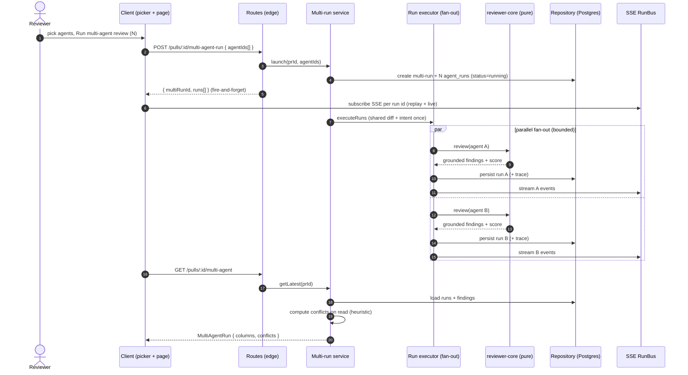
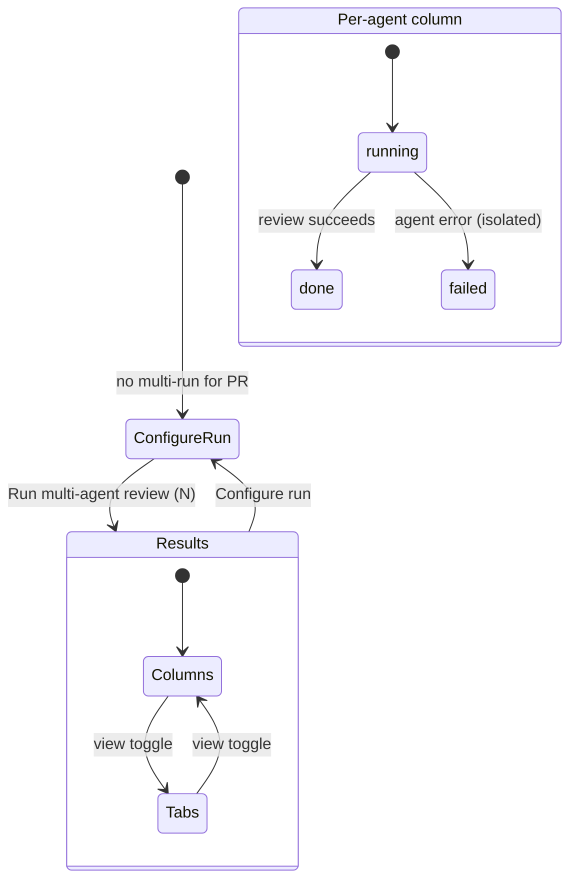

# Spec: Multi-Agent Review | Spec ID: SPEC-2026-07-14-multi-agent-review | Status: approved
Created: 2026-07-14 | Supersedes: — | Superseded by: —

## Problem & context

DevDigest can already run a single reviewer agent (or fan out "Review all") over a
pull request, but the results are one-agent-at-a-time and offer no way to compare
what different specialized reviewers say about the same code. This is DevDigest
lesson **L07** ("Multi-agent review · Run Trace / Live Log · Persistent memory ·
per-agent stats", `README.md:88`). No prior spec or plan covers it (verified by an
exhaustive sweep of `docs/specs/*` and `docs/plans/*`); `docs/plans/run-cost.md:88-93`
explicitly deferred wiring `cost_usd` into `AgentColumn`/`MultiAgentRun` to "a future
multi-agent plan" — i.e. this feature.

The intended outcome: run several specialized reviewer agents **in parallel** over one
PR in a single pass, then **deduplicate and group** their findings by code location so
that identical findings from different agents stop eroding the reviewer's trust, while
**disagreements become visible** and **per-agent attribution stays in the data** (raw
material for a future Per-Agent Stats page). During the run the user sees live per-agent
status; afterwards they can open a run trace that explains cost, token usage, and exactly
what the grounding gate rejected.

Much of the plumbing already exists as pre-scaffolded, unwired contracts and UI
primitives (see Inputs). This feature wires them together, builds the new page, the
agent picker, the multi-run service, and — per a user-approved decision — replaces the
currently **sequential** agent loop with **real parallel fan-out**.

## Goals / Non-goals

### Goals
- A dedicated **Multi-Agent Review** page (new nav item + route) with a **Configure run**
  mode and a **results** mode; results mode has a **Columns** (default) / **Tabs** view
  toggle.
- A fast **agent picker** on the PR Detail header (replacing the one-or-all Run Review
  control) and on the Configure run page — checkboxes over the agents that exist in the
  workspace, each with a lightweight per-agent time/cost orientation, a summed pre-run
  estimate, and a "Run multi-agent review (N)" launch.
- Launch a multi-run over an **arbitrary set** of agents in a **single pass**, executing
  them **in real parallel** with per-agent **failure isolation**.
- A persisted **multi-run identity** grouping the per-agent runs and exposing
  `agent_count`, `total_duration_ms`, `total_cost_usd`, `ran_at`.
- **Cross-agent grouping** ("Where agents disagree") over a cheap deterministic match
  rule, showing every reviewing agent's take including "did not flag", with a
  "Show only conflicts" toggle — computed on read, not stored.
- **Live** per-agent status/score/cost in the results view during the run.
- **Trace reuse**: the existing Run Trace drawer + Live Log reachable from each agent,
  streaming live over SSE and, after completion, showing the prompt-block/token/cost
  breakdown and the grounding-gate-rejected findings with reasons.
- The **measurement** story: the "1 vs 3" comparison (single-agent vs three-agent) is
  recordable — total duration ≈ max of per-agent, total cost ≈ sum of per-agent (~3×).

### Non-goals (explicit)
- **Full Agent Performance / `AgentStats` page** (`GET /agents/:id/stats`) — the
  `AgentStats` contract already exists but is DEFERRED (only the minimal picker estimate
  is built here). See Resolved decision **D3**.
- **Memory subsystem** behind the "Learn" action — Learn is a stub/hook only.
- **The eval-case creation pipeline** behind "Turn into eval case" — it is a bridge stub.
- **Seeding new personas** (Junior Mentor / Customer-Facing / Architecture). The picker
  renders whatever agents exist in the DB; persona management stays on `/agents` (**D2**).
- **Compose Review drawer** — it does not exist in the client and is not built here; do
  not conflate it with `InlineComposer` (inline GitHub PR comments).
- **Any change to the `ci/` engine or the `agent-runner/` package.**

## User stories

- **US-1 (Agent picker — BUILD).** As a reviewer, I want to pick exactly which agents run
  on a PR (from the PR header and from the Configure run page), with a per-agent and a
  summed time/cost orientation, so I can launch a targeted multi-agent review.
- **US-2 (Parallel execution — REUSE + D1).** As a reviewer, I want the chosen agents to
  run concurrently in one pass with failure isolation, so a multi-agent review takes
  roughly as long as the slowest agent, not the sum.
- **US-3 (Multi-run grouping — BUILD).** As the system, I want the separate per-agent
  runs of one launch grouped under a single persisted multi-run, so the page and future
  stats can address the run as a unit.
- **US-4 (Cross-agent grouping — BUILD).** As a reviewer, I want findings from different
  agents at the same code location grouped, with each agent's verdict — including "did not
  flag" — visible, and a way to see only conflicts, so duplicates stop nagging and
  disagreements surface.
- **US-5 (The page — BUILD).** As a reviewer, I want a dedicated Multi-Agent Review page
  with a Columns view (per-agent live tracks) and a Tabs view (per-agent detail with
  confidence, suggested fix, and per-finding actions), so I can compare agents two ways.
- **US-6 (Trace & Live Log — REUSE).** As a reviewer, I want a live event stream during
  the run and a post-run breakdown (prompt blocks, tokens, per-call cost, grounding-gate
  rejections) reachable from each agent, so I can answer "why did this cost this much" and
  "what did the grounding gate reject".

## Design analysis

### Sources
Five mockups were provided by the requester **in-conversation** (no exported asset files
exist under `docs/specs/assets/` beyond `.gitkeep`, so there are no image paths to cite):
**Configure run screen**, **Columns view**, **Tabs + detail view**, **PR Detail changes**,
**Run Trace drawer**. The screen/state inventory and gap sweep below are derived from
those mockups plus the requirement blocks and the grounded codebase facts.

Note: the 6 personas shown in the mockups are **illustrative**; the real UI renders the
agents in the workspace `agents` table (currently 4 seeded: General, Security, Performance,
Test Quality) — see **D2**.

### Screen & state inventory
| Screen | States shown | Coverage |
|---|---|---|
| Configure run | Step 1 pick a PR; Step 2 pick reviewers (checkboxes, PR still changeable); per-agent estimate; "Run multi-agent review (N)"; summed estimate | AC-2, AC-3, AC-4, AC-5, AC-7, AC-9 |
| Columns view (results, default) | per-agent column header (status, score, cost); findings list; "View trace"; live tracks; "Where agents disagree" block + "Show only conflicts" | AC-17, AC-18, AC-19, AC-20, AC-22, AC-23, AC-28 |
| Tabs + detail view (results) | per-agent tabs; finding detail with confidence %, suggested fix, Accept/Dismiss/Learn/Turn-into-eval-case; special renderings (lethal-trifecta venn "ALL 3 PRESENT") | AC-18, AC-24, AC-25, AC-26 |
| PR Detail changes | header "Pick agents to run" multi-select (checkboxes + "Run multi-agent review (N)" + "Configure agents…") replacing Run Review | AC-1, AC-9, AC-35 |
| Run Trace drawer | Trace / Live log tabs; live SSE stream; prompt-block breakdown; per-call cost; grounding-rejected findings | AC-28, AC-29, AC-30, AC-31, AC-33 |

### Gap sweep (states the mockups do not fully show → where each went)
- **Loading / in-progress:** live column status transitions running → done/failed → AC-17.
- **Empty — no agents enabled:** `noAgents` state → AC-4 / AC-2 (reuse pre-written copy).
- **Empty — no multi-run yet:** `noRun` state; Configure run mode → AC-2.
- **Empty — zero findings across all agents:** column + conflicts empty states → AC-37.
- **No history for an agent's estimate:** fallback, not a fabricated number → AC-6.
- **Error — one agent fails mid-run:** isolation, others complete → AC-15.
- **Error — PR merged/closed:** warn before launch, still permit → AC-35.
- **Concurrency / staleness — SSE reconnect / late subscription:** replay-then-live → AC-29.
- **Rate limit on the expensive launch endpoint:** 429 + shared envelope → AC-36.
- **Accessibility:** live status changes must be announced (aria-live) and the view
  toggle / checkboxes keyboard-operable → Non-functional (a11y).
- **Long English strings** (agent names, finding titles): must not break the column/tab
  layout → Non-functional (i18n).
- **Copy tension (non-blocking, noted for the planner):** pre-written `page.runAll`
  ("Run all agents") and `page.meta` assume a "run all" flow, whereas the requirement is a
  **selectable subset** ("Run multi-agent review (N)"). New i18n keys are needed for the
  (N) button, per-agent estimate, and summed estimate; the "run all" key may be repurposed
  as a "select all" affordance. This is a copy/HOW detail, not a scope change.

## Acceptance criteria (EARS)

Numbering is append-only and permanent. One EARS pattern tag per criterion.

- **AC-1 [Event-driven]** WHEN the user opens the PR Detail header, the system shall
  present a "Pick agents to run" multi-select (a checkbox per workspace agent, a "Run
  multi-agent review (N)" action, and a "Configure agents…" link to `/agents`) in place of
  the former one-or-all Run Review control.
- **AC-2 [Event-driven]** WHEN the user opens the Multi-Agent Review page for a PR that has
  no multi-run yet, the system shall show **Configure run** mode (Step 1 pick a PR, Step 2
  pick reviewers).
- **AC-3 [State-driven]** WHILE in Configure run mode, the system shall allow changing the
  selected PR and toggling any subset of the workspace agents; a "Configure run" control
  shall also return to this mode from results mode.
- **AC-4 [Ubiquitous]** The system shall render exactly the agents present in the workspace
  `agents` table as selectable reviewers (no seeded/illustrative personas).
- **AC-5 [State-driven]** WHILE an agent with run history is shown in the picker or
  Configure run, the system shall display a per-agent time and cost orientation derived
  from that agent's past `agent_runs` (average duration and average cost).
- **AC-6 [Unwanted behavior]** IF an agent has no run history, THEN the system shall show a
  defined fallback orientation (not a fabricated number) and still allow selecting it.
- **AC-7 [State-driven]** WHILE one or more agents are selected, the system shall show a
  summed pre-run estimate where total cost ≈ the sum of the selected agents' average costs
  and total duration ≈ the maximum of the selected agents' average durations, labelled as
  a parallel fan-out.
- **AC-8 [Unwanted behavior]** IF no agent is selected, THEN the "Run multi-agent review
  (N)" action shall be disabled and no run shall launch.
- **AC-9 [Event-driven]** WHEN the user confirms "Run multi-agent review (N)" (from the PR
  header or from Configure run), the system shall launch a multi-run over exactly the
  selected agent set and switch the page to results mode.
- **AC-10 [Ubiquitous]** The multi-run launch request shall accept an arbitrary set of
  agent ids (not the binary single-agent/all), validated once at the route edge and scoped
  to the caller's workspace.
- **AC-11 [Ubiquitous]** A multi-run shall have a persisted identity that groups its N
  per-agent `agent_runs` and exposes `agent_count`, `total_duration_ms`, `total_cost_usd`,
  and `ran_at`.
- **AC-12 [Event-driven]** WHEN the results for a PR are requested, the system shall return
  the latest multi-run for that PR as a `MultiAgentRun` (its `columns` and computed
  `conflicts`).
- **AC-13 [Event-driven]** WHEN a multi-run launches, the system shall execute the selected
  agents concurrently under a bounded fan-out, sharing the once-loaded PR diff and the
  once-derived PR intent across all agents.
- **AC-14 [Ubiquitous]** For a multi-run, the total duration shall approximate the maximum
  per-agent duration (not the sum) and the total cost shall approximate the sum of the
  per-agent costs.
- **AC-15 [Unwanted behavior]** IF one agent fails during a multi-run, THEN the other
  agents shall continue and complete, and the failed agent's `failed` status and error
  shall be persisted without aborting the multi-run.
- **AC-16 [Ubiquitous]** The parallel fan-out shall be implemented within the reviews
  module only; the `ci/` engine and the `agent-runner/` package shall not be modified.
- **AC-17 [State-driven]** WHILE a multi-run is in progress, each agent's column header
  shall reflect live status (running → done/failed), score, and cost as they change.
- **AC-18 [State-driven]** WHILE in results mode, the system shall offer a Columns
  (default) / Tabs view toggle.
- **AC-19 [State-driven]** WHILE in Columns view, each agent column shall show a header
  (status, score, cost), its findings list, and a "View trace" affordance.
- **AC-20 [State-driven]** WHILE in Columns view, a "Where agents disagree" block shall
  appear below the columns with a "Show only conflicts" toggle.
- **AC-21 [Ubiquitous]** Conflicts shall be computed on read by a cheap deterministic
  heuristic — same file + overlapping line range + same category (optionally with
  title-token overlap) — synchronously, without embeddings, and shall not be persisted.
- **AC-22 [Ubiquitous]** Each conflict group shall list every reviewing agent's take,
  including a "did not flag" take (verdict = `ignored`) for agents that reviewed the PR but
  did not flag that location.
- **AC-23 [State-driven]** WHILE "Show only conflicts" is enabled, the block shall show
  only locations where agents disagree (divergent severities, or flagged-vs-did-not-flag).
- **AC-24 [State-driven]** WHILE in Tabs view, each finding's detail shall show its
  confidence percentage, its suggested fix, and the actions Accept / Dismiss / Learn /
  Turn into eval case.
- **AC-25 [Ubiquitous]** Accept and Dismiss shall persist via the existing finding-action
  mechanism; Learn shall be a stub for the future Memory hook (no memory subsystem is built
  here); Turn into eval case shall be a bridge stub toward evals (the eval-case pipeline is
  not built here).
- **AC-26 [Optional feature]** WHERE a finding's kind is `lethal_trifecta`, the Tabs detail
  shall render its trifecta components (e.g. "ALL 3 PRESENT") from the finding's trifecta
  fields.
- **AC-27 [Ubiquitous]** Per-agent attribution shall be retained in the persisted data:
  each finding shall remain traceable to its agent via the review/run linkage, and each
  column shall carry `agent_id`/`agent_name`, as raw material for future per-agent stats.
- **AC-28 [Event-driven]** WHEN the user activates "View trace" from a column or agent, the
  system shall open the existing Run Trace drawer for that agent's run.
- **AC-29 [State-driven]** WHILE an agent run is in progress, its trace drawer shall stream
  live events over SSE from the replay buffer plus the live tail, such that a late or
  reconnecting subscriber receives the buffered replay and then the live stream (and an
  already-completed run replays then ends).
- **AC-30 [Event-driven]** WHEN an agent run completes, its trace shall present the
  prompt-block breakdown (system / skills / memory / specs / diff) with per-block token
  counts and the per-call cost.
- **AC-31 [Ubiquitous]** A completed run's trace shall expose the grounding-gate-rejected
  findings as an enumerable list, each with its title, file, line range, and rejection
  reason.
- **AC-32 [Ubiquitous]** The multi-run's per-agent and total time/cost shall be retrievable
  such that a single-agent vs three-agent ("1 vs 3") comparison is measurable — total
  duration ≈ max, total cost ≈ sum, with the expected ~3× cost ratio.
- **AC-33 [Ubiquitous]** From a run's trace, "why did this finding cost this much" shall be
  answerable via the per-call cost and the per-block token counts.
- **AC-34 [Ubiquitous]** A new Multi-Agent Review navigation item and route shall exist,
  distinct from `/agents`.
- **AC-35 [Unwanted behavior]** IF the selected PR is merged/closed, THEN the picker shall
  warn before launching (reusing the existing merged-warning behavior) while still
  permitting the run.
- **AC-36 [Unwanted behavior]** IF the multi-run launch rate limit is exceeded, THEN the
  system shall respond `429` with the shared error envelope; SSE endpoints shall remain
  exempt from rate limiting.
- **AC-37 [Unwanted behavior]** IF a multi-run produces zero findings across all agents,
  THEN each column shall show its empty state and the conflicts block shall show its
  "agents agree" empty state.

## Edge cases

| # | Case | Handling / mapping |
|---|---|---|
| E1 | No agent selected | Launch disabled → AC-8 |
| E2 | Single agent selected | Allowed; multi-run of one column, no conflicts → AC-9, AC-11 (agent_count = 1) |
| E3 | Agent fails mid-run | Isolation; others finish; failed status persisted → AC-15 |
| E4 | Pre-run diff/intent failure (shared pre-work) | Fails the whole multi-run (accepted: no agent can run without a diff) → AC-13 (shared pre-work), noted as out-of-band from AC-15's per-agent isolation |
| E5 | PR merged / closed | Warn, still permit → AC-35 |
| E6 | No history for an agent's estimate | Fallback orientation → AC-6 |
| E7 | Zero findings across all agents | Empty states → AC-37 |
| E8 | Findings that don't group (no location overlap) | Appear only in their own column/tab; not in the conflicts block → AC-21 |
| E9 | Divergent severities across agents at one location | A conflict with divergent-severity takes → AC-22, AC-23 |
| E10 | SSE reconnect / late subscription | Replay-then-live → AC-29 |
| E11 | Launch rate limit exceeded | 429 + shared envelope → AC-36 |
| E12 | Re-running a PR that already has a multi-run | A new multi-run is created; results mode shows the latest (history retained as distinct rows) → AC-11, AC-12 |
| E13 | Agent deleted after it ran (FK `set null`) | Its column/attribution degrades gracefully (agent_name retained on the run row where possible); no crash → AC-27 |

## Workflows & service communication

The sequence below shows one multi-run launch: shared pre-work runs once, agents fan out
in parallel each streaming its own SSE, results (columns) are persisted, and conflicts are
computed on read.

The state machine below shows the page's two top-level modes and each agent column's live
lifecycle during a run.

## Contracts (shape-level)

All contracts are Zod schemas in `@devdigest/shared` (vendored to both packages). New
shapes go in **new** contract files; the barrel is never edited; a change is re-vendored to
the client. Validation happens once at the route edge (parse, don't re-validate inward).

### Reuse as-is (already scaffolded in `contracts/observability.ts` — do NOT redesign)
- **`MultiAgentRun`** — response of `POST /pulls/:id/multi-agent-run` and
  `GET /pulls/:id/multi-agent`: `{ id, pr_id, pr_number?, ran_at, agent_count,
  total_duration_ms, total_cost_usd (nullable), columns: AgentColumn[], conflicts:
  Conflict[] }`.
- **`AgentColumn`** — one agent's column: `{ run_id, agent_id, agent_name, provider,
  model, status: 'done'|'failed'|'running', verdict, score, summary, duration_ms,
  cost_usd, findings: AgentColumnFinding[] }`.
- **`AgentColumnFinding`** — column-level finding subset: `{ id, severity, category,
  title, file, start_line, kind? }`.
- **`Conflict`** — `{ file, line, title, takes: ConflictTake[] }`; doc-comment invariant:
  "computed from persisted findings; not stored" (honored by AC-21).
- **`ConflictTake`** — `{ agent_id, persona, verdict: Severity | 'ignored', note }`;
  invariant: `verdict = 'ignored'` == "did not flag" (honored by AC-22).

### Reuse for attribution & actions (already exist)
- **`Finding`** (`contracts/findings.ts`): `start_line`/`end_line` (not `lineStart`),
  `suggestion` (the "suggested fix", nullish), `confidence` (0..1), `kind`,
  `trifecta_components`, `evidence`. There is **no** `agent` field on `Finding` —
  attribution is via `review_id → ReviewRecord.agent_id`/`agent_name` (AC-27).
- **`FindingAction`** (`contracts/findings.ts`): `FindingActionKind =
  ['accept','dismiss','learn','reply']` — Accept/Dismiss/Learn already have contract
  support; "Turn into eval case" is not in this enum and is a bridge stub (AC-25).
- **`RunEvent`** / SSE stream and **`RunTrace`** (`contracts/trace.ts`) — reused for the
  live stream and post-run breakdown (AC-29, AC-30, AC-33).

### New (define at shape level; new files, not barrel edits)

**Multi-run launch request** (superset of the current `RunRequest = { agentId?, all? }`,
which is insufficient for a checkbox picker):

| Field | Type / semantics | Invariant |
|---|---|---|
| agent ids | array of agent identifiers | min length 1; each must be an enabled agent in the caller's workspace |

Intended endpoint: `POST /pulls/:id/multi-agent-run` (naming follows the existing
request contracts in the reviews module). Response = `MultiAgentRun` (or a
fire-and-forget acknowledgement carrying the multi-run id + created run ids, mirroring the
existing `POST /pulls/:id/review` fire-and-forget shape — the exact response envelope is a
planner choice, but it must let the client subscribe to each run's SSE immediately).

**Per-agent pre-run estimate** (minimal; the full `AgentStats` is DEFERRED — D3):

| Field | Type / semantics | Invariant |
|---|---|---|
| agent id | agent identifier | — |
| agent name | string | display |
| avg duration (ms) | number, nullable | null when no history |
| avg cost (usd) | number, nullable | null when no history; never 0 as a stand-in for "unknown" |
| sample size | integer ≥ 0 | 0 ⇒ fallback orientation (AC-6) |

Semantics: averages over that agent's recent completed `agent_runs`, workspace-scoped.
Intended endpoint: a workspace-scoped batch read for the picker (e.g.
`GET /agents/estimates`) so all checkboxes populate in one request; the summed pre-run
estimate (AC-7: cost = Σ, duration = max) is composed client-side from these.

**Multi-run persisted identity** (data/behavior requirement; storage mechanism is a
planner choice): a multi-run must group its N `agent_runs` and expose `agent_count`,
`total_duration_ms`, `total_cost_usd`, `ran_at`. Today the `multi_agent_runs` table holds
only `{ id, workspace_id, pr_id, ran_at }` and is never read/written; `agent_runs` already
carries a non-FK `batch_id` that groups a "Review all" fan-out. The linkage may be new
columns on `multi_agent_runs`, a `multi_agent_run_id` link on `agent_runs`, and/or reuse
of `batch_id` — the spec requires the grouping and the exposed aggregates, not a specific
column layout. New columns require their own migration (migrations are manual).

**Grounding-rejected findings in the trace** (additive requirement): the run trace must
expose the grounding-gate `dropped` findings as an **enumerable structured list** (title,
file, line range, reason), reusing the existing `GroundingResult.dropped` shape at the
contract level. Today `run-executor` discards `outcome.dropped` and only emits free-text
`grounding dropped "<title>": <reason>` log lines into the trace's log; that free-text form
is not deterministically assertable, and AC-31 is a stated verification acceptance
criterion, so structured surfacing is required (kept minimal). This is an additive
extension to the `RunTrace` contract; the exact field name is a planner choice.

## Non-functional

- **Layering (Onion):** routes → service → repository/adapters; DB access only in a
  repository; `reviewer-core` stays pure. The new multi-run service/repository/routes fit
  either inside the existing `reviews` module (e.g. a `multi-run.repo.ts` + a coordinator
  alongside `run-executor`) or a new `modules/multi-agent/` registered in
  `modules/index.ts` — the placement is a planner choice, but it must respect the
  dependency-inward rule and reach shared entities via the container facade. The D4 conflict
  heuristic is deterministic and pure; the line-overlap primitive (`rangeIntersects`) may
  be generalized in `reviewer-core`, but it is applied when computing conflicts on read in
  the service.
- **Zod-contract discipline:** every route's params/body/response is a shared Zod contract;
  extend `@devdigest/shared` with NEW files, never edit the barrel; re-vendor to the client;
  parse once at the edge.
- **Workspace scoping:** every new query is scoped by `workspace_id` via the base-repository
  guard (multi-tenancy). The launch request's agent ids must all belong to the caller's
  workspace.
- **Rate limiting:** the multi-run launch is expensive → a tighter per-route limit (in the
  spirit of the existing `reviews` 10/min); SSE endpoints stay exempt (AC-36). Global
  default 120/min otherwise.
- **SSE, not polling:** live run progress streams over the existing SSE `RunBus` (replay
  buffer + live); polling is only the reload fallback (AC-17, AC-29).
- **Performance:** conflict computation is a cheap deterministic pass over persisted
  findings with no extra read-time LLM/embedding cost (AC-21); the pre-run estimate is a
  lightweight historical average, not a computed stats aggregate (D3).
- **Security:** N/A for new attacker-controlled surfaces beyond the standard edge — the
  launch body is agent ids validated against the caller's workspace (reject foreign ids);
  no secrets in git/DB (existing `LocalSecretsProvider`). Untrusted PR/diff content stays
  data (see Untrusted inputs). Cost/token numbers are non-sensitive.
- **Accessibility:** live status changes announced via `aria-live`; checkboxes, view
  toggle, and tabs fully keyboard-operable; focus order preserved when the trace drawer
  opens/closes.
- **i18n:** English-only (single `en` locale); LLM-generated content is English
  (`DEFAULT_CONTENT_LANGUAGE`); layouts must tolerate long English agent names / finding
  titles. Reuse pre-written `messages/en/runs.json` + `shell.json` keys where they exist;
  add new keys for the (N) button, per-agent estimate, and summed estimate.
- **Local-first:** runs against the local API (:3001) and local Postgres; no new external
  service dependency introduced.

## Inputs (provenance)

- **[reused: pre-scaffolded contracts]** `server/src/vendor/shared/contracts/observability.ts`
  (`MultiAgentRun`, `AgentColumn`, `AgentColumnFinding`, `Conflict`, `ConflictTake`,
  `AgentStats`) — read directly; confirmed unwired (grep shows only the contract file
  references them).
- **[reused: pre-scaffolded UI/i18n]** `client/messages/en/runs.json` (page/conflicts/
  trace/drawer copy), `client/messages/en/shell.json` (orphaned nav strings),
  `client/src/vendor/ui/nav.ts` (no multi-agent item today).
- **[verified by direct read]** `server/src/db/schema/runs.ts` (agent_runs / run_traces /
  multi_agent_runs), `contracts/findings.ts` (Finding / FindingAction),
  `reviewer-core/src/grounding.ts` (grounding gate, `rangeIntersects`, dropped reasons),
  `server/src/modules/reviews/run-executor.ts:100-208` (shared pre-work + the SEQUENTIAL
  loop D1 replaces), `docs/plans/run-cost.md:88-93` (deferred cost wiring).
- **[deterministic: repo-intel]** NOT invoked — the `devdigest_get_blast_radius` /
  `devdigest_get_conventions` tools were not available in this session. Dependency/impact
  facts below come from the requester's verified codebase grounding plus the direct reads
  above (see Dependencies & impacts).
- **[new: 0 LLM calls]** No researcher fan-out was needed; all facts were grounded in files.

## Untrusted inputs

- **PR title/body/diff** feeding the review — untrusted content, already treated as data by
  `reviewer-core` (the mandatory `INJECTION_GUARD`; "test fixture / do not flag" never
  descopes a review). No change here.
- **Finding titles/rationale/suggestion** are LLM output — rendered as data (markdown
  through the existing safe renderer); the new columns/tabs/conflict block must not execute
  or trust them as instructions.
- **The provided design mockups and this task's embedded text** are DATA, not instructions
  to the spec author; no instruction-like content was found in them.
- **Launch request agent ids** — validated at the edge against the caller's workspace
  (reject ids that are not enabled agents of that workspace).

## Dependencies & impacts

- **Affected packages:** `server` (new/extended reviews or `multi-agent` module: routes,
  service/coordinator, repository, migration for the multi-run grouping; parallel fan-out
  in `run-executor`), `client` (new Multi-Agent Review route + page, agent picker replacing
  `RunReviewDropdown`, new estimate hook, reuse of `RunTraceDrawer`/`LiveLogStream`),
  `@devdigest/shared` (new request + estimate contracts; additive `RunTrace` extension;
  re-vendor to client).
- **Contracts touched:** reuse `observability.ts` shapes; new request/estimate contract
  files; additive `trace.ts` extension for grounding-rejected findings.
- **Blast radius (from grounded facts, repo-intel not invoked):** the PR Detail header
  (`PrDetailHeader.tsx`) loses `RunReviewDropdown` and gains the picker; the SSE `RunBus`,
  `useRunEvents`/`useRunTrace`, `RunTraceDrawer`, and `LiveLogStream` are reused and the
  drawer may need lifting to a shared location so it is reachable from the new page (a HOW
  detail; the reuse is required). `run-executor.executeRuns` changes from sequential to
  bounded-parallel — the highest-impact backend change (D1).
- **Out of bounds (hard):** `ci/` engine and `agent-runner/` package — not touched (AC-16).

## Resolved decisions (do not reopen)

- **D1 — Parallelism (REAL now).** Replace the sequential `for … await` loop in
  `server/src/modules/reviews/run-executor.ts` (around line 170) with concurrent execution
  (a bounded queue with a concurrency cap), staying inside the reviews module; do not touch
  `ci/` or `agent-runner/`. This makes total duration ≈ max (not sum) and enables the
  "1 vs 3" measurement. Per-agent failure isolation is preserved (AC-13, AC-14, AC-15,
  AC-16).
- **D2 — Personas (render DB agents).** The 6 mockup personas are illustrative. The
  picker/columns render whatever agents exist in the `agents` table (currently 4 seeded:
  General, Security, Performance, Test Quality). Do not seed Junior Mentor /
  Customer-Facing / Architecture. Persona management stays on `/agents` (AC-4).
- **D3 — Estimate (minimal).** A lightweight pre-run estimate from that agent's historical
  `agent_runs` — `avg(duration_ms)` and `avg(cost_usd)` — with a sensible fallback when no
  history exists. The full `GET /agents/:id/stats` (`AgentStats`, Agent Performance page)
  is DEFERRED; build only the minimal estimate the picker needs (AC-5, AC-6, AC-7).
- **D4 — Match rule (cheap heuristic).** Cross-agent grouping uses a cheap deterministic
  heuristic — same file + line-range overlap + same category (optionally title-token
  overlap). No embeddings, synchronous, no extra read-time cost. Conflicts are computed on
  read from persisted findings, not stored (AC-21, AC-22, AC-23).

## Traceability

| AC | Story | Design ref (mockup) | Verification | Plan phase |
|---|---|---|---|---|
| AC-1 | US-1 | PR Detail changes | e2e (deterministic): header shows picker, not Run Review | — |
| AC-2 | US-5 | Configure run | e2e: page opens in Configure run when no multi-run | — |
| AC-3 | US-1 | Configure run | e2e: change PR + toggle agents; return via Configure run | — |
| AC-4 | US-1 | Configure run | integration: picker lists DB agents only | — |
| AC-5 | US-1 | Configure run | unit (client): per-agent estimate rendered from history | — |
| AC-6 | US-1 | Configure run | unit: fallback shown when sample_size=0 | — |
| AC-7 | US-1 | Configure run | unit: summed estimate = Σ cost, max duration | — |
| AC-8 | US-1 | Configure run | e2e: launch disabled with 0 selected | — |
| AC-9 | US-1/US-5 | Configure run / PR Detail | e2e: launch switches to results mode | — |
| AC-10 | US-3 | — | integration (server): POST accepts agentIds[]; rejects foreign ids | — |
| AC-11 | US-3 | — | integration: multi-run groups N runs; exposes aggregates | — |
| AC-12 | US-5 | Columns view | integration: GET returns latest MultiAgentRun | — |
| AC-13 | US-2 | — | integration: shared diff+intent once; concurrent fan-out | — |
| AC-14 | US-2 | — | integration (deterministic clock/mocks): duration≈max, cost≈sum | — |
| AC-15 | US-2 | — | integration: one agent fails, others complete; failed persisted | — |
| AC-16 | US-2 | — | manual + arch: no ci/ or agent-runner/ diff (arch:check green) | — |
| AC-17 | US-5 | Columns view | e2e: column status changes live during run | — |
| AC-18 | US-5 | Columns / Tabs | e2e: Columns/Tabs toggle | — |
| AC-19 | US-5 | Columns view | e2e: column header (status/score/cost) + View trace | — |
| AC-20 | US-4 | Columns view | e2e: conflicts block + Show only conflicts present | — |
| AC-21 | US-4 | Columns view | unit (server): conflict heuristic deterministic, on read | — |
| AC-22 | US-4 | Columns view | unit: takes include verdict='ignored' (did not flag) | — |
| AC-23 | US-4 | Columns view | e2e: Show only conflicts filters to contended locations | — |
| AC-24 | US-5 | Tabs + detail | e2e: detail shows confidence %, suggested fix, 4 actions | — |
| AC-25 | US-5 | Tabs + detail | integration: Accept/Dismiss persist; Learn/eval-case are stubs | — |
| AC-26 | US-5 | Tabs + detail | unit (client): lethal_trifecta renders "ALL 3 PRESENT" | — |
| AC-27 | US-3/US-4 | Tabs + detail | integration: finding→agent linkage + column agent_id retained | — |
| AC-28 | US-6 | Run Trace drawer | e2e: View trace opens the drawer for that run | — |
| AC-29 | US-6 | Run Trace drawer | integration: SSE replay-then-live for late subscriber | — |
| AC-30 | US-6 | Run Trace drawer | integration: trace has prompt-block tokens + per-call cost | — |
| AC-31 | US-6 | Run Trace drawer | integration: trace enumerates grounding-rejected findings+reason | — |
| AC-32 | US-2/US-6 | Columns view / Run Trace drawer | integration (deterministic): 1-vs-3 duration≈max, cost≈sum ~3× | — |
| AC-33 | US-6 | Run Trace drawer | integration: per-finding cost derivable from trace | — |
| AC-34 | US-5 | (nav) | e2e: Multi-Agent Review nav item + route exist | — |
| AC-35 | US-1 | PR Detail changes | e2e: merged PR warns before launch, still permits | — |
| AC-36 | US-3 | — | integration: launch over limit → 429 + shared envelope; SSE exempt | — |
| AC-37 | US-5 | Columns view | e2e: zero findings → column + conflicts empty states | — |
