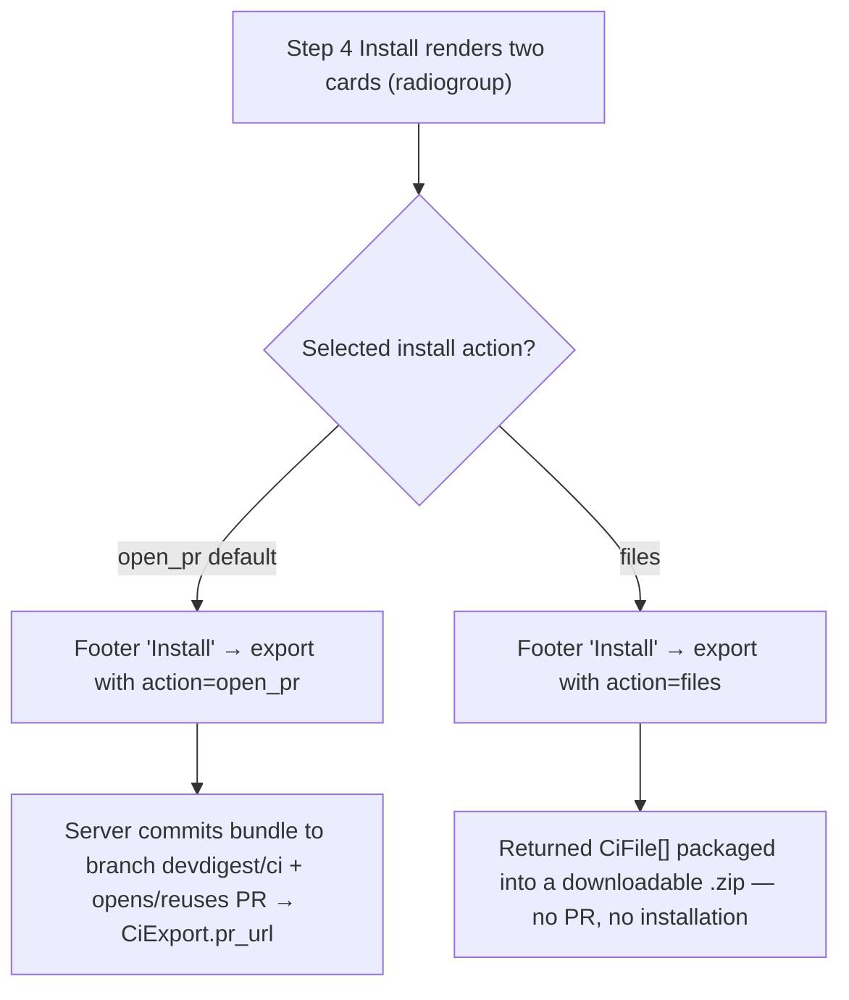
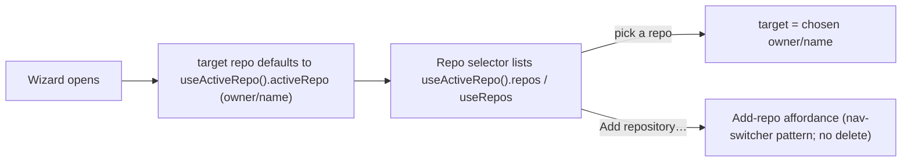

# Spec: Export to CI — post-ship fixes | Spec ID: SPEC-2026-07-15-export-to-ci-fixes | Status: approved
Supersedes: — | Superseded by: —
Corrects: `docs/specs/SPEC-2026-07-14-export-to-ci.md` (SPEC-2026-07-14-export-to-ci) — this
spec captures a batch of post-implementation fixes to the shipped "Export to CI" feature
(course lab L07). The parent stays `approved` and in force; this spec refines a subset of its
acceptance criteria and adds new ones. It does NOT supersede the parent.

## Problem & context

"Export to CI" (SPEC-2026-07-14-export-to-ci) shipped: the CI tab, the 4-step Export wizard,
workflow generation, and the pull-based ingest are all live. Since then the mockups were
committed to disk (`docs/specs/assets/SPEC-2026-07-14-export-to-ci/`), and comparing the
implementation against the authoritative frames surfaced a batch of small but user-visible
defects and two intentional design deviations that must be pinned so they are not "fixed" back:

- **CI tab header + gate panel drift from the mockup.** The heading reads "Continuous
  Integration" with the "Active in N repos" pill on its own row
  (`CiTab.tsx:33-49`); the mockup (`agent-editor-ci-01.png`) shows "CI deployment" with the
  pill inline. The gate is labelled "CI gate" (borrowed from the shared `agents` namespace,
  `FailOnControl.tsx:19,38`) and its description squeezes to one-word-per-line at normal CI-tab
  width because `failOnRow` is a flex row with a `flex:1` hint fighting a `flexShrink:0`
  segmented control (`styles.ts:23-25`).
- **Export wizard Step 1 makes the author retype what the app already knows.** The target repo
  starts empty (`ExportWizard.tsx:41`) and is a free-text `TextInput` (`TargetStep.tsx:26-28`),
  even though the shell already tracks the active repo (`repo-context.tsx:58`,
  `useActiveRepo`) and other screens (Conventions) preselect it.
- **Export wizard Step 4 has a dead card.** Both install cards are inert `
`s
  (`InstallStep.tsx:44-50`) and the footer hard-codes `action:"open_pr"`
  (`ExportWizard.tsx:71-81`); there is no install-action state, so "Copy files as a zip" cannot
  be selected and the degraded manual-install path (parent AC-11) is unreachable from the UI.
- **A designed-but-undocumented prerequisite trips first-time exporters.** Export requires the
  gitignored `agent-runner/dist/index.js`; its absence raises the parent AC-44 "runner bundle
  not found" error — correct, designed behaviour that reads like a bug without a doc note.

The intended outcome: the CI tab and wizard match the approved design, the two intentional
deviations from the mockup are recorded as hard requirements, and the manual-install path works.

## Goals / Non-goals

### Goals
- Bring the CI tab header + "Fail CI on" panel in line with `agent-editor-ci-01.png`: heading
  copy, inline "Active in N repos" pill, gate label, gate description, and a stacked layout that
  keeps the description readable at normal width.
- Decouple the CI tab's gate label + description from the Config tab by giving the CI tab its own
  `ci`-namespace i18n keys, leaving the Config tab on the shared `agents` keys.
- Pre-fill the Export wizard's target repo with the shell's active repo and replace the free-text
  input with a repo selector modelled on the app-shell nav repo switcher.
- Wire Step 4 so both install cards are real, keyboard-accessible radio choices and "Copy files
  as a zip" produces a downloadable archive of the generated bundle (Variant A).
- Document the `cd agent-runner && pnpm build` export prerequisite (non-blocking, doc-only).

### Non-goals
- **Do NOT modify the Config tab's gate label or description** — they stay on the shared
  `agents.config.ciFailOn` / `config.ciFailOnHint` keys and read "CI gate".
- **Do NOT reduce the gate to three values / short labels.** The mockup's 3-segment
  "Critical / Warning+ / Never" control is intentionally NOT adopted; all four `CiFailOn` values
  with their verbose labels are required (parent AC-23). Pinned as AC-48.
- **Do NOT change `agent-runner` behaviour or the `AgentManifest` contract** — both are frozen
  (parent Non-goals / AC-4).
- **Do NOT touch the ingest or the CI Runs page** (`/ci-runs`) in this batch.
- No new shared Zod contract: `action=files` already exists on `CiExportInput`; the zip path
  reuses it.
- The repo selector adds an "Add repository…" affordance but NO delete/trash affordance
  (unlike the nav switcher) — removing a repo from inside the export wizard is out of scope.

## User stories

- **US-F1** — As an agent author, the CI tab header and gate panel match the approved mockup
  (heading "CI deployment", inline "Active in N repos" pill, "Fail CI on" label with a clear
  one-line description), so the tab reads as designed. (fixes 1, 2, 4)
- **US-F2** — As an agent author, the gate keeps all four fail-on options with their explanatory
  labels (never reduced to three), and the description stays readable at any CI-tab width.
  (fixes 3, 5)
- **US-F3** — As an agent author, when I open the Export wizard the target repo is pre-filled with
  the repo I'm working in, and I pick the target from a repo selector (with "Add repository…")
  instead of typing `owner/name`. (fixes 6, 7)
- **US-F4** — As an agent author, at Install I can choose "Copy files as a zip" and actually get a
  downloadable archive of the generated bundle, or choose "Open a PR" — both cards are real,
  keyboard-accessible choices. (fix 8)
- **US-F5** — As a new contributor, the docs tell me to build the agent-runner bundle before
  exporting, so I understand the "runner bundle not found" error is a missing build step, not a
  bug. (fix 9)

## Design analysis

**Sources (correcting the parent).** The parent spec recorded the mockups as "not on disk";
they ARE now committed at `docs/specs/assets/SPEC-2026-07-14-export-to-ci/`. This spec is grounded
in the on-disk frames, read directly this session (DesignSync was not needed — the frames are
local PNGs):

- `agent-editor-ci-01.png` — **authoritative** for the CI tab header + "Fail CI on" gate control
  (populated 2-repo state).
- `agent-editor-ci-02.png` — same CI tab with the "Run Review ▾" dropdown open; corroborates the
  header + gate layout.
- `add-ci-export-step-1.png` — Export wizard Step 1 (Target): the four target-provider cards.
- `add-ci-export-step-4.png` — Export wizard Step 4 (Install): the two install cards + footer.
- `add-ci-export-step-2.png`, `add-ci-export-step-3.png`, `runs-01.png` — out of this batch's
  scope (Preview/Configure/Runs unchanged).

**Screen & state inventory (what the frames show).**

- **CI tab** (`agent-editor-ci-01/02.png`): heading **"CI deployment"** with a green
  "Active in 2 repos" pill **inline** on the same row; header actions "Update CI config" +
  "+ Add to CI" on the right. A "Fail CI on" panel: bold label **"Fail CI on"** and description
  "Exit non-zero when a finding at or above this severity lands. Pair with a required status check
  to block merges." on the left, a segmented control on the right. Per-repo installation rows
  (`acme/payments-api`, `acme/billing-worker`, each "GitHub Actions · succeeded · Nm ago") and a
  dashed "+ Add repository" row.
- **Wizard Step 1** (`add-ci-export-step-1.png`): four target cards (GitHub Actions recommended +
  selected, CircleCI, Jenkins, Generic CLI). The frame shows **no repo control** — see gap sweep.
- **Wizard Step 4** (`add-ci-export-step-4.png`): "Open a PR with these files" card (recommended,
  shown selected with an accent border) and "Copy files as a zip" card ("add them manually"); an
  "Install" footer button and a "GitHub Action setup docs →" link.

**Gap sweep — states/behaviours the frames do NOT fully resolve, and where each went:**

| Gap | Frame | Disposition |
|---|---|---|
| Repo selector for Step 1 is not depicted in the frame | `add-ci-export-step-1.png` | Introduced from the app-shell nav-switcher pattern → AC-51, AC-52 |
| No active repo / empty repos list when the wizard opens | Step 1 | AC-51 (fall back to unselected) + AC-52 ("Add repository…" always offered) |
| The gate control shows 3 short segments, but 4 verbose values are required | `agent-editor-ci-01.png` | Intentional deviation, pinned → AC-48 |
| Step-4 frame shows the PR card selected, but both cards are inert in code | `add-ci-export-step-4.png` | Both made selectable radios → AC-53 |
| Long English gate description collapses to one-word-per-line at narrow width (frame is wide, hides it) | `agent-editor-ci-01.png` | Stacked layout → AC-50 |
| a11y of the install radio cards + repo dropdown (keyboard, aria) | Steps 1/4 | AC-53 + Non-functional → a11y |
| Step-4 body copy says "5 generated files" while the bundle is 6 files (parent AC-2) | `add-ci-export-step-4.png` | Pre-existing copy drift, OUT of this batch — accepted, not silently fixed |

No frame element in scope was dropped: each maps to an AC or a Non-functional requirement, or is
explicitly recorded as out of this batch.

## Acceptance criteria (EARS)

One EARS pattern tag per AC. Numbering **continues the L07 lineage** from the parent (which ended
at AC-45) so every AC-ID across the Export-to-CI family stays globally unique; a fix that modifies
shipped behaviour cites the parent AC it "refines". Append-only and permanent.

### A. CI tab — header + Fail-CI-on panel

- **AC-46** [State-driven] *(refines AC-29)* WHILE the agent editor's CI tab is active, the system
  shall render the section heading text "CI deployment" with the "Active in {n} repos" status pill
  placed inline in the header row (not on a separate row below it), matching
  `agent-editor-ci-01.png`.
- **AC-47** [State-driven] *(refines AC-30)* WHILE the CI tab's Fail-CI-on control is shown, the
  system shall label it "Fail CI on" sourced from a NEW `ci`-namespace i18n key (e.g.
  `ci.ciTab.failOn.label`), and the Config tab's gate control shall remain unchanged, labelled
  "CI gate" from `agents.config.ciFailOn`.
- **AC-48** [State-driven] *(refines AC-23, AC-30)* WHILE the CI tab's Fail-CI-on control is shown,
  the system shall expose ALL FOUR `CiFailOn` values (`never | critical | warning | any`) with
  their verbose labels sourced from `agents.config.ciFailOnOptions` ("Never block — comment only" /
  "Block on critical (recommended)" / "Block on warning or critical" / "Block on any finding") and
  shall NOT reduce the control to the mockup's three short segments.
- **AC-49** [State-driven] *(refines AC-30)* WHILE the CI tab's Fail-CI-on control is shown, the
  system shall render, from a NEW `ci`-namespace i18n key (e.g. `ci.ciTab.failOn.hint`), the
  description "Exit non-zero when a finding at or above this severity lands. Pair with a required
  status check to block merges.", and the Config tab shall keep its existing
  `agents.config.ciFailOnHint` description unchanged.
- **AC-50** [State-driven] *(new behaviour — layout defect)* WHILE the CI tab is rendered at the
  studio's normal CI-tab width, the Fail-CI-on panel shall stack the label + description
  full-width above the segmented control (vertical layout), so the description renders as normal
  wrapped prose and never collapses to one word per line.

### B. Export wizard — Step 1 Target (repo source)

- **AC-51** [Event-driven] *(refines AC-24)* WHEN the Export wizard opens, the system shall default
  the target repository to the shell's active repo (`useActiveRepo().activeRepo`, as `owner/name`);
  IF no active repo is resolvable, the target shall start unselected rather than blank-and-typed.
- **AC-52** [State-driven] *(refines AC-24)* WHILE Step 1 (Target) is active, the system shall
  present the target repository as a repo selector fed by the shell repo list
  (`useActiveRepo().repos` / `useRepos`), modelled on the app-shell nav repo switcher, including an
  "Add repository…" affordance, and shall NOT render a delete/trash affordance inside the wizard
  and shall NOT present the target repo as a free-text field.

### C. Export wizard — Step 4 Install (wire "Copy files as a zip", Variant A)

- **AC-53** [State-driven] *(refines AC-28)* WHILE Step 4 (Install) is active, the system shall
  render both install cards ("Open a PR with these files" and "Copy files as a zip") as mutually
  exclusive, selectable radio options — keyboard-operable with `radiogroup`/`radio` semantics and
  `aria-checked`, "Open a PR" selected by default — and the footer "Install" action shall send the
  currently selected install action (`open_pr` or `files`).
- **AC-54** [Optional feature] *(refines AC-11)* WHERE the user has selected "Copy files as a zip"
  (`action=files`) and activates Install, the system shall produce a downloadable archive (`.zip`)
  containing every generated bundle file (each `CiFile` as `path` → `contents`, edits from Step 2
  included) and shall open no pull request and persist no installation for that action.

### D. Documentation (non-blocking)

- **AC-55** [Optional feature] *(new — doc-only, non-blocking)* WHERE the export-time prerequisite
  is documented, the relevant README/onboarding shall state that `cd agent-runner && pnpm build`
  must be run to produce the gitignored `agent-runner/dist/index.js`, and shall note that the
  parent AC-44 "runner bundle not found" error is designed behaviour (a missing build step), not a
  bug. This AC is satisfied outside this spec's write boundary (a docs edit at implementation time).

## Edge cases

Each maps to an AC or is explicitly scoped out.

1. **No active repo / empty repos list when the wizard opens** — target starts unselected; the
   selector still offers "Add repository…" → AC-51, AC-52.
2. **User toggles zip → back to PR** — the install action is a single-select radio state; the
   footer sends the last-selected action → AC-53.
3. **`action=files` with a zero-file bundle** — cannot occur (the bundle always contains at least
   the manifest + workflow, parent AC-2); if it somehow did, no archive is offered — accepted.
4. **Long English gate description at narrow CI-tab width** — stacked layout prevents per-word
   collapse → AC-50.
5. **Config tab must stay identical** — CI-tab copy lives in the `ci` namespace only; the shared
   `agents` keys are untouched → AC-47, AC-49, and Non-goals.
6. **Mockup shows 3 gate segments** — intentionally not adopted; four verbose values kept → AC-48.
7. **Runner bundle missing at export** — parent AC-44 error is designed; the prerequisite is now
   documented → AC-55.
8. **Zip must carry no secret** — the archive is the same server-generated bundle as the PR path;
   `OPENROUTER_API_KEY` is referenced by the workflow, never inlined (parent AC-15 still holds) →
   Non-functional → security.

## Workflows & service communication

### Step 4 — install-action selection (fix 8)

This flow shows the new install-action state: today the footer always sends `open_pr`; after the
fix the user's radio choice drives either the existing PR path or the manual-install zip path,
both of which reuse the already-shipped `action` field on `CiExportInput`.

### Step 1 — where the target repo comes from (fixes 6, 7)

This flow shows the Step-1 change from a free-text field to a preselected, list-backed repo
selector that reuses the same active-repo mechanism the rest of the studio already uses.

## Contracts (shape-level)

**No new or changed shared Zod contract.** All four `CiFailOn` values, `CiExportInput`
(`action: 'open_pr' | 'files'`, already present), `CiExportRequest` (`+ files: CiFile[]`), `CiFile`
(`{ path, contents, editable }`), and the frozen `AgentManifest` are reused as-is. The zip path
(AC-54) packages the `CiFile[]` returned by the existing `action=files` export.

### i18n copy contract (the actual surface of change)

Per client convention (UI strings via next-intl; English-only `en`), the CI-tab copy moves to /
adds `ci`-namespace keys; the Config tab keys are untouched.

| Key | Namespace | Value | Change |
|---|---|---|---|
| `ci.ciTab.heading` | `ci` | "CI deployment" | changed from "Continuous Integration" (AC-46) |
| `ci.ciTab.failOn.label` | `ci` | "Fail CI on" | NEW (AC-47) |
| `ci.ciTab.failOn.hint` | `ci` | "Exit non-zero when a finding at or above this severity lands. Pair with a required status check to block merges." | NEW (AC-49) |
| `agents.config.ciFailOn` | `agents` | "CI gate" | UNCHANGED — Config tab only (AC-47) |
| `agents.config.ciFailOnHint` | `agents` | (existing) | UNCHANGED — Config tab only (AC-49) |
| `agents.config.ciFailOnOptions.*` | `agents` | four verbose labels | UNCHANGED — shared by BOTH tabs for the option labels (AC-48) |

Invariants: the "Active in {n} repos" pill and the install-card copy currently live in the local
`CI_TAB_COPY` constant (`CiTab/constants.ts`); migrating them to `ci.json` keys is recommended (to
honour the "strings via next-intl" convention) but the required copy/behaviour above is fixed here
regardless of where the pill/zip-card strings finally resolve.

### Install-action UI state (shape-level, client-only)

| Field | Shape | Semantics |
|---|---|---|
| install action | `'open_pr' \| 'files'` | Selected Step-4 radio; defaults to `open_pr`; drives the `action` sent on Install (AC-53). |

## Non-functional

- **Performance** — N/A: the changes are client-side copy/layout plus reuse of the existing
  `action=files` export. Archive assembly (AC-54) is bounded by the small bundle (≤ 6 files) and
  adds no network round-trip beyond the export call the wizard already makes.
- **Security** — The zip (AC-54) contains the same server-generated bundle as the PR path
  (manifest + one skill file per skill + `memory.jsonl` + committed runner + workflow), destined
  for the user's own machine. It must carry NO secret: `OPENROUTER_API_KEY` is referenced by the
  workflow and never inlined (parent AC-15 still holds); `GITHUB_TOKEN` is never written to the
  bundle. The repo selector renders repo names from the studio's own `/repos` API (server-owned
  data) through React's default JSX escaping — no new untrusted-input surface. Confidence: no HIGH
  finding; this batch adds no new exfiltration path over the shipped feature.
- **Accessibility** — Install cards (AC-53) must be a true `radiogroup` of `radio`s: arrow-key
  navigable, `aria-checked` reflecting selection, a visible focus ring, and selection not conveyed
  by colour/border alone (include the "recommended" text label). The repo selector (AC-52) must be
  keyboard-operable and labelled, mirroring the nav switcher's dropdown semantics. The stacked
  Fail-CI-on layout (AC-50) must preserve a natural reading order (label → description →
  control).
- **i18n** — English-only (single `en` locale; never add another `messages/<locale>/`). New CI-tab
  keys live in `messages/en/ci.json`; the Config tab's `agents`-namespace keys are unchanged
  (AC-47, AC-49). All new copy via next-intl.
- **Local-first** — Unchanged: export still reaches GitHub only through the injected
  `GitHubClient` port; the zip path (AC-54) touches no network beyond the existing export request
  and produces a local download. N/A new local-first surface.

## Inputs (provenance)

- `[reused]` — verified this session by direct reads: the parent spec
  `SPEC-2026-07-14-export-to-ci.md`; `client/.../CiTab/CiTab.tsx`, `_components/FailOnControl.tsx`,
  `_components/Installations.tsx`, `styles.ts`, `constants.ts`; the wizard
  `ExportWizard.tsx`, `steps/TargetStep.tsx`, `steps/InstallStep.tsx`, `ExportWizard/styles.ts`;
  `client/messages/en/ci.json`; `client/src/lib/repo-context.tsx` (`useActiveRepo`),
  `client/src/vendor/ui/shell/RepoSwitcher.tsx` + `shell/types.ts`, `client/src/lib/hooks/core.ts`
  (`useRepos`/`useAddRepo`); `conventions/.../ConventionsListView.tsx` (active-repo preselect
  precedent); `server/src/vendor/shared/contracts/eval-ci.ts` + `contracts/ci-runs.ts`
  (`CiExportInput.action`, `CiExportRequest.files`, `CiFile`); `server/package.json` (`fflate`
  `^0.8.2` already present).
- `[deterministic: repo-intel]` — `devdigest_get_conventions("SyukPublic/dev-digest")` succeeded
  (API on :3001 reachable). Relevant rules honoured by this batch: `satisfies CSSProperties` on
  style objects; `import type` for type-only imports; React Query `queryKey` as string arrays +
  `invalidateQueries` after mutations; a per-module `constants.ts`. `devdigest_get_blast_radius`
  is **not applicable**: it keys off a PR number, and this is a pre-implementation fixes batch with
  no PR yet — impact was grounded by the direct reads above instead (flagged in the report).
- `[new: 0 LLM calls]` — no `researcher` delegation needed; every fact was on disk.
- **Design assets are now on disk** at `docs/specs/assets/SPEC-2026-07-14-export-to-ci/` (this
  corrects the parent spec's "not on disk" note); the frames were read directly, so DesignSync was
  not consulted.

## Untrusted inputs

- **Repo list from `/repos`** (rendered by the Step-1 selector): studio-owned server data, not
  third-party — DATA, rendered via React JSX escaping. No new trust boundary.
- **Step-2 user edits carried into the zip** (AC-54): the user's own content destined for the
  user's own machine (user intent); the server still re-validates the manifest round-trips
  `AgentManifest` before the PR path commits (parent AC-4) — the zip path is a local download of
  the same validated/edited bundle.
- **No new external/untrusted input** is introduced by this batch beyond what the parent already
  wraps (PR diff / artifact JSON, handled in the runner and ingest — untouched here).

## Dependencies & impacts

- **Client (primary surface)** — CI tab: `CiTab.tsx` (heading + inline pill), `FailOnControl.tsx`
  (CI-tab label/hint from the `ci` namespace; keep 4 values), `CiTab/styles.ts` (`failOnRow` →
  column), `CiTab/constants.ts` (`CI_TAB_COPY`). Wizard: `TargetStep.tsx` +
  `ExportWizard.tsx` (repo default + selector), `InstallStep.tsx` + `ExportWizard.tsx` (install
  action state + zip). i18n: `client/messages/en/ci.json` (new `ci.ciTab.failOn.*`, changed
  `ci.ciTab.heading`).
- **Shared contracts** — none changed; `CiExportInput.action` / `CiExportRequest.files` / `CiFile`
  reused; `AgentManifest` frozen.
- **Server** — not required for the wizard fixes. The zip (AC-54) can be assembled from the
  returned `CiFile[]`; whether the archive is built in the browser or via a small server endpoint
  (the server already depends on `fflate`, as used by skill-import) is a plan-level decision, not a
  requirement here.
- **Docs (AC-55)** — a README/onboarding note; outside this spec's write boundary, done at
  implementation time.
- **Blast radius** `[deterministic: repo-intel]` — N/A (no PR to key on); confined by direct reads
  to the client files above, one i18n file, and (optionally) one server zip endpoint. The Config
  tab, ingest, CI Runs page, `agent-runner`, and all Zod contracts are untouched.

## Traceability

| AC | Story | Design ref | Verification | Plan phase |
|---|---|---|---|---|
| AC-46 | US-F1 | assets/SPEC-2026-07-14-export-to-ci/agent-editor-ci-01.png | unit (client `pnpm test`): CI tab renders "CI deployment" + inline "Active in N repos" pill | — |
| AC-47 | US-F1 | agent-editor-ci-01.png | unit (client): CI tab shows "Fail CI on"; Config tab still shows "CI gate" | — |
| AC-48 | US-F2 | agent-editor-ci-01.png | unit (client): four segments with the verbose `agents.config.ciFailOnOptions` labels rendered | — |
| AC-49 | US-F1 | agent-editor-ci-01.png | unit (client i18n): CI-tab hint = new copy; Config-tab hint unchanged | — |
| AC-50 | US-F2 | agent-editor-ci-01.png | unit (client): `failOnRow` stacks (column) + manual visual at normal width | — |
| AC-51 | US-F3 | add-ci-export-step-1.png | unit (client): wizard opens with target repo prefilled from active repo | — |
| AC-52 | US-F3 | add-ci-export-step-1.png | e2e (deterministic) + unit (client): Step 1 shows a repo selector with "Add repository…", no free-text, no trash | — |
| AC-53 | US-F4 | add-ci-export-step-4.png | e2e (deterministic): both cards selectable as radios (keyboard + aria-checked); footer sends chosen action | — |
| AC-54 | US-F4 | add-ci-export-step-4.png | unit (client) + integration: `action=files` yields a zip of the CiFile[], no PR, no installation | — |
| AC-55 | US-F5 | — | manual (doc review): README/onboarding notes `cd agent-runner && pnpm build` and the designed AC-44 error | — |
