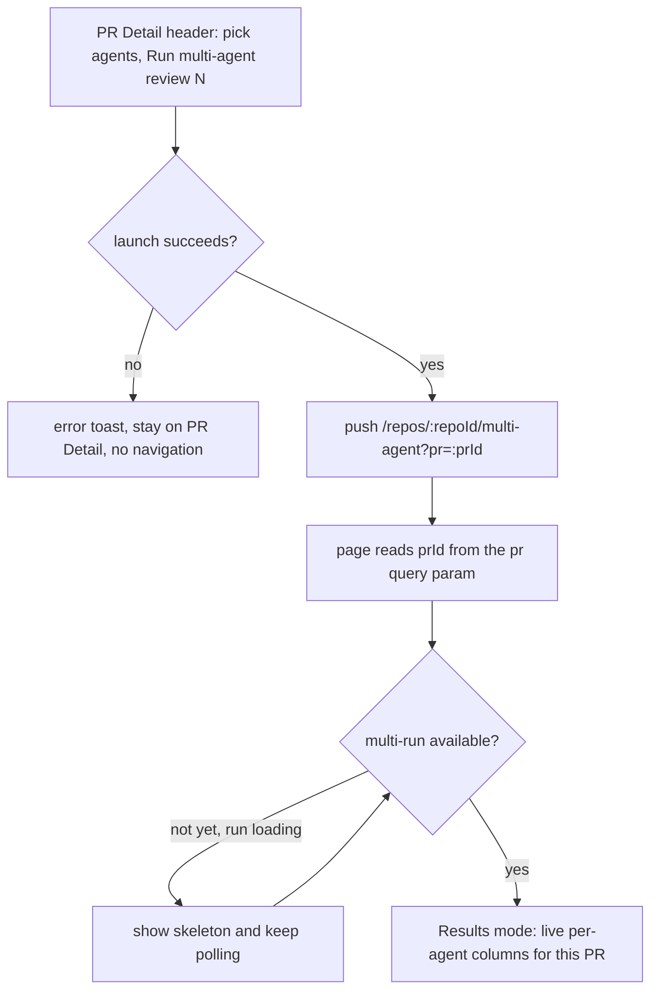
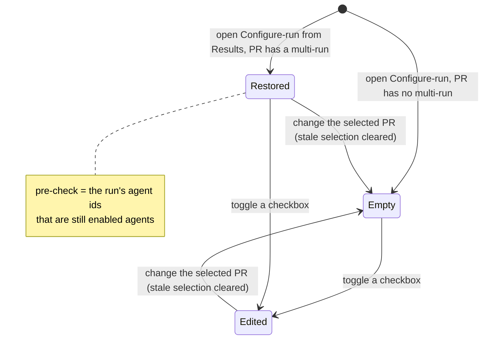

# Spec: Multi-Agent Review — Follow-up Fixes | Spec ID: SPEC-2026-07-15-multi-agent-review-fixes | Status: approved
Created: 2026-07-15 | Supersedes: — | Superseded by: —

## Problem & context

The L07 Multi-Agent Review feature is already specified, approved, and implemented
(`docs/specs/SPEC-2026-07-14-multi-agent-review.md`). Hands-on use of the shipped UI
surfaced four **client-only** defects that make the feature feel broken even though the
backend, contracts, and data flow are correct. This spec is a **follow-up bug-fix /
refinement** on top of SPEC-2026-07-14; it is a **separate document** — its acceptance
criteria are numbered fresh from AC-1 (it does NOT extend the 07-14 numbering).

The four defects, each verified against the current code (file:line in *Inputs*):

1. **Nav placement is wrong.** The "Multi-Agent Review" item sits in the `WORKSPACE`
   nav section, but the design mock (`pr-review-empty-01.png`) places it in the
   `GLOBAL` section (with CI Runs). The `GLOBAL` section already exists and
   `activeKeyFor` already highlights `multi-agent`, so this is a pure relocation.
2. **Configure-run does not restore the run's selected agents.** Opening "Configure
   run" from Results mode renders the reviewer picker with an empty selection, so the
   agents that already ran are not pre-checked — the user has to re-pick from scratch.
3. **The PR Detail "Run Review" picker lists disabled agents.** It renders *all*
   workspace agents, unlike the Configure-run page, which lists only enabled agents.
4. **Launching from PR Detail lands on an empty Configure-run screen.** After a
   successful launch the picker navigates to the multi-agent page *without* the `?pr=`
   query param, so the page opens in Configure-run mode with no PR and no agents
   selected (the reported `step-01` → `step-02` regression) instead of showing the live
   Results for the run that was just launched.

Intended outcome: the shipped Multi-Agent Review experience matches the design and
behaves coherently — the nav item is in the right section, re-configuring a run starts
from the agents that ran, the PR-header picker offers the same enabled-only agent set as
the Configure page, and launching from the PR header lands the user on the live Results
for that PR. **Scope is strictly the `client/**` package** — no server, no shared
contract, and no database change is required; every fix edits an existing client file.

## Goals / Non-goals

### Goals
- Move the existing Multi-Agent Review nav item from `WORKSPACE` to `GLOBAL`, above
  CI Runs, with all of its attributes unchanged (Fix 1).
- When re-entering Configure-run mode for a PR that already has a multi-run, pre-select
  the agents that were part of that run (Fix 2).
- Make the PR Detail agent picker list only **enabled** agents, matching the Configure-run
  page, across selection, count, select/clear, launch, and the empty state (Fix 3).
- After a launch from the PR Detail picker, navigate to the Multi-Agent Review page **for
  that PR** so it opens in **Results** mode (live during the run), never on an empty
  Configure form (Fix 4).

### Non-goals (explicit)
- **No server / contract / DB change.** No new or altered `@devdigest/shared` contract,
  route, hook, migration, or schema; the existing `MultiAgentRun` / `AgentColumn` shapes
  and the `client/src/lib/hooks/multi-agent.ts` + `agents.ts` hooks are reused as-is.
- **No new nav items.** Do NOT add Memory or Agent Performance items — they are not in
  `NAV` today; only `activeKeyFor` carries future-scaffolded keys for them. The `SHORTCUTS`
  "g m" entry stays exactly as-is.
- **No new i18n copy** is expected; reuse existing `messages/en/*` keys. Add a key only if
  a fix genuinely introduces new user-visible copy (none is anticipated).
- **No re-design of Multi-Agent Review behavior** beyond the four fixes — Columns/Tabs,
  conflicts, trace drawer, parallel fan-out, estimates, and all SPEC-2026-07-14 acceptance
  criteria are unchanged. Do not widen scope.
- **No new client store** — state stays in TanStack Query + local component state; no
  ad-hoc `fetch` (data goes through the existing hooks / `lib/api.ts`).

## User stories

- **US-1 (Nav placement).** As a reviewer, I want Multi-Agent Review to appear in the
  GLOBAL section (as the design shows), so workspace-wide surfaces are grouped consistently
  and the nav matches the mock.
- **US-2 (Restore selection).** As a reviewer re-configuring an already-reviewed PR, I want
  the agents that already ran to be pre-checked, so I can adjust the set instead of
  reselecting everything from scratch.
- **US-3 (Enabled-only picker).** As a reviewer on the PR Detail header, I want the agent
  picker to offer only enabled agents — the same set the Configure-run page shows — so I
  cannot launch a disabled agent.
- **US-4 (Land on Results).** As a reviewer launching from the PR header, I want to land on
  the live Results for the PR I just launched, not an empty Configure form, so I can watch
  the run I started.

## Design analysis

### Sources
The three mockups provided by the requester are stored under
`docs/specs/assets/SPEC-2026-07-15-multi-agent-review-fixes/` and cited by relative path:
- **[`pr-review-empty-01.png`](assets/SPEC-2026-07-15-multi-agent-review-fixes/pr-review-empty-01.png)**
  — sidebar showing "Multi-Agent Review" under `GLOBAL` (Fix 1).
- **[`step-01-pr-details.png`](assets/SPEC-2026-07-15-multi-agent-review-fixes/step-01-pr-details.png)**
  — PR Detail header with the agent picker, from which the user launches (Fix 3, Fix 4 origin).
- **[`step-02-multy-agents-config.png`](assets/SPEC-2026-07-15-multi-agent-review-fixes/step-02-multy-agents-config.png)**
  — the empty Configure-run screen the user *wrongly* lands on today after launching from
  `step-01` (the Fix 4 regression being corrected).

The mockups and this task's embedded text are treated as **data**, not instructions (see
*Untrusted inputs*).

### Screen & state inventory
| Screen / surface | States shown | Coverage |
|---|---|---|
| Sidebar navigation | GLOBAL section lists Multi-Agent Review (above CI Runs); active-highlight on `/multi-agent`; "g m" shortcut | AC-1, AC-2, AC-3 |
| Configure-run mode (Step 2 reviewer picker) | Fresh PR (empty selection); revisited PR with a multi-run (agents pre-checked); PR changed (selection reset) | AC-4, AC-5, AC-6, AC-7 |
| PR Detail header picker | Enabled agents only; empty state when no enabled agents; count / select / clear / launch over the enabled subset | AC-8, AC-9, AC-10 |
| Multi-Agent page after launch | Loading/skeleton while the run has not yet returned → live Results for the PR | AC-11, AC-12, AC-13 |

### Gap sweep (states the mockups do not fully show → where each went)
- **Transient loading** — the just-launched multi-run GET has not yet returned a row →
  skeleton, not the empty Configure form → AC-12.
- **Empty — no enabled agents** in the PR-header picker → AC-10.
- **Disabled agent that previously ran** — an agent in the run that is now disabled cannot
  be shown or pre-checked → AC-5 (silently omitted).
- **Stale selection across PRs** — changing the selected PR in Configure-run must not carry
  the previous PR's selection → AC-7.
- **Fresh PR (no multi-run)** — Configure-run must still start with an empty selection
  (preserve current behavior) → AC-6.
- **Accessibility** — the moved nav item keeps its active-state and focus order; pre-checked
  and enabled-only checkboxes stay keyboard-operable with a correct checked state →
  Non-functional (a11y).
- **i18n / long English strings** — no new copy; existing agent-name/label layouts unchanged
  → Non-functional (i18n).

## Acceptance criteria (EARS)

Numbering is append-only and permanent within THIS document; it starts fresh at AC-1 and is
independent of SPEC-2026-07-14. One EARS pattern tag per criterion.

### Fix 1 — Nav placement (WORKSPACE → GLOBAL)
- **AC-1 [Ubiquitous]** The Multi-Agent Review navigation item shall reside in the `GLOBAL`
  nav section positioned **above** CI Runs, and shall no longer appear in the `WORKSPACE`
  section, retaining its existing `key` (`multi-agent`), label ("Multi-Agent Review"),
  icon (`Users`), href (`/repos/:repoId/multi-agent`), and `gKey` (`m`).
- **AC-2 [State-driven]** WHILE the active route matches a `/multi-agent` path, the system
  shall render the Multi-Agent Review item (now in `GLOBAL`) as the active nav item, via the
  existing unchanged `activeKeyFor` behavior.
- **AC-3 [Ubiquitous]** The relocation shall not add any Memory or Agent Performance nav
  item, and the "g m" keyboard shortcut shall remain mapped to Multi-Agent Review.

### Fix 2 — Configure-run restores the run's selected agents
- **AC-4 [Event-driven]** WHEN the user enters Configure-run mode for a PR that already has a
  multi-run, the system shall pre-select (check) the agents that were part of that run,
  identified by the run's per-agent `agent_id`s.
- **AC-5 [State-driven]** WHILE restoring a run's selection, the system shall pre-select only
  the intersection of the run's `agent_id`s with the currently-**enabled** workspace agents;
  an agent that ran but is now disabled shall be silently omitted (it is not listed, so it
  cannot be pre-checked).
- **AC-6 [Event-driven]** WHEN Configure-run opens for a PR that has no existing multi-run,
  the reviewer picker shall start with an empty selection (current behavior preserved).
- **AC-7 [Unwanted behavior]** IF the user changes the selected PR while in Configure-run
  mode, THEN the picker shall not carry a stale selection from the previously-selected PR;
  the selection shall reset or reload sensibly for the newly-selected PR.

### Fix 3 — PR Detail picker lists only enabled agents
- **AC-8 [Ubiquitous]** The PR Detail "Run Review" agent picker shall list only **enabled**
  workspace agents (disabled agents excluded), matching the Configure-run page's enabled-only
  behavior.
- **AC-9 [Ubiquitous]** The picker's selection count, its select/clear affordances, its
  "Run multi-agent review (N)" launch, and the agent-id set sent on launch shall all operate
  over the enabled subset only.
- **AC-10 [State-driven]** WHILE the set of enabled agents is empty, the picker shall show
  its "no agents" empty state, computed over the enabled subset (not over all agents).

### Fix 4 — Launching from PR Detail lands on Results (not empty Configure)
- **AC-11 [Event-driven]** WHEN a launch from the PR Detail picker succeeds, the system shall
  navigate to the Multi-Agent Review page **for that PR** — carrying the PR id as the `pr`
  query param (`/repos/:repoId/multi-agent?pr=:prId`) — rather than to the page with no `pr`
  param.
- **AC-12 [State-driven]** WHILE the just-launched multi-run has not yet been returned by the
  read, the destination page shall show its loading/skeleton state (and keep polling), and
  shall NOT display the empty Configure-run form.
- **AC-13 [Event-driven]** WHEN the multi-run for that PR becomes available, the page shall
  resolve to **Results** mode for that PR (live per-agent columns during the run), not to
  Configure-run mode.

## Edge cases

| # | Case | Handling / mapping |
|---|---|---|
| E1 | Active route is under `/multi-agent` after the nav move | Item still highlights via existing `activeKeyFor` (no rewiring) → AC-2 |
| E2 | Configure-run entered from Results for a PR with a multi-run | Pre-check the run's agents (intersection with enabled) → AC-4, AC-5 |
| E3 | An agent that ran is now disabled | Omitted from the list and from the restored pre-selection → AC-5 |
| E4 | Configure-run opened for a PR with no multi-run | Empty selection (unchanged) → AC-6 |
| E5 | User switches the selected PR mid-configure | No stale selection carried across PRs → AC-7 |
| E6 | Workspace has zero enabled agents (PR-header picker) | Enabled-only "no agents" empty state → AC-10 |
| E7 | Launch succeeds but the multi-run GET has not returned yet | Skeleton on the destination, not the empty Configure form → AC-12 |
| E8 | Launch fails (mutation error) | Existing error toast; user stays on PR Detail; no navigation → out of scope of the fix (unchanged existing behavior) |
| E9 | Runs still `running` at the destination | Existing polling / live Results render the in-progress run — acceptable and desired → AC-13 |

## Workflows & service communication

Both fixes are client-side flows (no service-communication change). The flowchart below shows
the corrected Fix 4 launch path: after a successful launch the picker forwards the PR id as
`?pr=`, the destination reads it, shows a skeleton while the run has not yet returned, and
resolves to live Results — never the empty Configure form.

The state diagram below shows the Fix 2 selection seeding in Configure-run mode: a PR with a
multi-run opens pre-checked (the run's agents that are still enabled), a fresh PR opens empty,
and changing the PR clears any stale selection.

## Contracts (shape-level)

**No new or changed shared contracts.** These fixes consume existing shapes as-is:

- **`MultiAgentRun`** (`observability.ts`) — `{ id, pr_id, pr_number?, ran_at, agent_count,
  total_duration_ms, total_cost_usd, columns: AgentColumn[], conflicts: Conflict[] }`.
- **`AgentColumn`** (`observability.ts`) — its `agent_id` field is the identifier used to
  restore the Configure-run selection (Fix 2). Semantics: each column's `agent_id` names an
  agent that participated in the run.
- **Agent list** (`useAgents`) — each agent carries an `enabled` flag; "enabled agents" is
  `agents.filter(a => a.enabled)`, the same predicate the Configure-run page already applies
  (Fix 3).
- **Launch input** (`useLaunchMultiAgentRun`) — `{ prId, agentIds }`; unchanged. Fix 4 changes
  only the post-launch client navigation target, not the request or response.

Derived (client-side, no persisted shape) — the **restored selection** for Configure-run:

| Input | Type / source | Rule |
|---|---|---|
| run agent ids | `run.columns[].agent_id` (from `useMultiAgentRun`) | the agents that ran |
| enabled agents | `useAgents().filter(enabled)` | the currently-selectable set |
| restored selection | set of agent ids | `run agent ids` ∩ `enabled agent ids` (AC-5) |

*Non-binding design note for the planner (HOW, not a requirement):* the page has the run in
hand when "Configure run" is clicked from Results, so the restored set can be threaded to the
picker (e.g. an `initialAgentIds` prop) and used to seed component state at mount; the exact
threading is a planner choice. AC-4/AC-5/AC-7 state only the behavior.

## Non-functional

- **Layering (Onion):** N/A — client-only; no server/service/repository/contract/DB change.
- **State & data access:** TanStack Query only; **no new store** (React Context stays limited
  to the active repo). All data flows through the existing hooks (`useMultiAgentRun`,
  `useAgents`, `useLaunchMultiAgentRun`, `useAgentEstimates`) and `lib/api.ts`; **no ad-hoc
  fetch**. Repo-intel confirms the client's React-Query conventions (array `queryKey`,
  `invalidateQueries` after a mutation) — honored by the reused hooks.
- **Zod-contract discipline:** N/A — no new contract, no barrel edit, nothing re-vendored.
- **Accessibility:** the relocated nav item keeps its active state and focus order; the
  pre-checked (Fix 2) and enabled-only (Fix 3) checkboxes remain fully keyboard-operable with
  an accurate `checked` state and unchanged accessible names.
- **i18n:** English-only (single `en` locale). No new user-visible copy is expected; reuse
  existing `messages/en/*` keys. If any genuinely new copy is required it goes in
  `messages/en/*` (English only) — none is anticipated for these fixes.
- **Performance:** N/A — no new network calls; the enabled-agent filter and the run∩enabled
  intersection are trivial in-memory operations over small lists. Fix 4 reuses the page's
  existing polling/skeleton (no new polling introduced).
- **Security:** N/A for new attacker-controlled surfaces. The `prId` forwarded as `?pr=` is
  the same internal identifier the page and `useMultiAgentRun` already consume (not free-text
  user input). Launch agent ids are still validated server-side at the unchanged launch edge.
  Untrusted PR/finding content continues to be rendered as data (see *Untrusted inputs*).
- **Local-first:** unchanged — runs against the local API (:3001) and local Postgres; no new
  external dependency.

## Inputs (provenance)

- **[verified by direct read]** every defect fact was confirmed against current code:
  - `client/src/vendor/ui/nav.ts` — `multi-agent` item is in `WORKSPACE` at `:26`; the
    `GLOBAL` section exists at `:45-49` with only `ci-runs` (`:47`); the "g m" shortcut is at
    `SHORTCUTS[:76]`.
  - `client/src/components/app-shell/helpers.ts` — `activeKeyFor` highlights `multi-agent` for
    `/multi-agent` paths at `:28`; future-scaffolded `memory` / `agent-performance` keys exist
    only here (`:36-37`), NOT in `NAV`.
  - `client/src/app/repos/[repoId]/multi-agent/_components/ConfigureRun/ConfigureRun.tsx` —
    filters enabled agents at `:40`; initializes `selected` to an empty `Set` at `:47`;
    `selectAll` operates over `enabledAgents` (`:56-58`).
  - `client/src/app/repos/[repoId]/multi-agent/page.tsx` — reads `prId` from `search.get("pr")`
    at `:35`; `useMultiAgentRun(prId)` at `:41`; `inResults = !configuring && prId != null &&
    run != null` at `:51`; `runLoading` skeleton at `:78`; "Configure run" sets
    `configuring=true` at `:104`.
  - `client/src/app/repos/[repoId]/pulls/[number]/_components/AgentPicker/AgentPicker.tsx` —
    `const all = agents ?? []` (no enabled filter) at `:62`; `handleLaunch` pushes
    `/repos/${repoId}/multi-agent` without `?pr=` at `:84-94`; empty state over `all` at
    `:136-137`.
  - `client/src/app/repos/[repoId]/pulls/[number]/_components/PrDetailHeader/PrDetailHeader.tsx`
    — passes `prId` (the same identifier the page/hooks consume) into `AgentPicker` at `:84-90`.
  - `client/src/vendor/shared/contracts/observability.ts` — `AgentColumn.agent_id` at `:34-49`;
    `MultiAgentRun` at `:74-86`.
  - `client/src/lib/hooks/multi-agent.ts` — `useLaunchMultiAgentRun`, `useAgentEstimates`, and
    `useMultiAgentRun` (polls while any column is `running`, `:64-65`); `useAgents` in
    `client/src/lib/hooks/agents.ts`. No new hooks needed.
- **[deterministic: repo-intel]** `devdigest_get_conventions` (`SyukPublic/dev-digest`)
  confirmed the relevant client conventions honored by the reused code: React-Query
  `queryKey`-as-array and `invalidateQueries` after a mutation (`client/src/lib/hooks/agents.ts`),
  `import type` for type-only imports, and `satisfies CSSProperties` on style objects.
  `devdigest_get_blast_radius` is **not applicable** — it maps a specific pull request's
  changed symbols, and this is a pre-implementation spec with no PR; the dependency/impact
  facts below come from the direct reads above.
- **[new: 0 LLM calls]** No researcher fan-out was needed; all facts are grounded in files.

## Untrusted inputs

- **PR title/body/diff and finding content** rendered on these screens are remote/LLM-origin
  data and are already treated as data by the existing components; these fixes do not change
  that handling and introduce no new rendering of untrusted content.
- **The `prId` forwarded as `?pr=`** is the same internal identifier already used by the page
  and `useMultiAgentRun` — not free-text user input — so it adds no new trust surface.
- **The design mockups and this task's embedded text** are DATA, not instructions to the spec
  author; no instruction-like content was found in them.

## Dependencies & impacts

- **Affected package:** `client` **only**. No `server`, no `@devdigest/shared`, no DB/migration.
- **Existing files edited (no new production files, no new hooks/contracts):**
  - `client/src/vendor/ui/nav.ts` — relocate the `multi-agent` item WORKSPACE → GLOBAL (Fix 1).
  - `client/src/app/repos/[repoId]/multi-agent/_components/ConfigureRun/ConfigureRun.tsx` and
    `.../multi-agent/page.tsx` — seed the picker's selection from the run's agent ids (Fix 2).
  - `client/src/app/repos/[repoId]/pulls/[number]/_components/AgentPicker/AgentPicker.tsx` —
    filter to enabled agents (Fix 3) and navigate with `?pr=${prId}` after launch (Fix 4).
- **Unchanged:** `helpers.ts` `activeKeyFor` (already handles `/multi-agent`); the `SHORTCUTS`
  "g m" entry; all hooks/contracts.
- **Existing tests to align (planner/test concern, not a code change to production):**
  `client/src/vendor/ui/shell/Sidebar.test.tsx` (nav structure),
  `.../ConfigureRun/ConfigureRun.test.tsx` (restore selection),
  `.../AgentPicker/AgentPicker.test.tsx` (enabled-only + post-launch navigation),
  `.../multi-agent/page.test.tsx` (Results-vs-Configure resolution / skeleton).
- **Blast radius:** `[deterministic: repo-intel]` not applicable (no PR to map — see Inputs).

## Resolved decisions (do not reopen)

- **RD1 — Nav (Fix 1).** Move the existing `multi-agent` item from `WORKSPACE` to `GLOBAL`,
  positioned **above** `ci-runs` (order in GLOBAL: Multi-Agent Review, then CI Runs). Keep its
  `key`, `label`, `icon: "Users"`, `href`, and `gKey: "m"` unchanged. Do NOT add Memory /
  Agent Performance items (they do not exist in `NAV`; only `activeKeyFor` has the
  future-scaffolded keys). The `SHORTCUTS` "g m" entry stays as-is.
- **RD2 — Restore selection (Fix 2).** When Configure-run is opened for a PR that already has a
  multi-run, pre-check the intersection of the run's `agent_id`s with the currently-enabled
  agents. An agent that ran but is now disabled is silently omitted (it is not listed).
  *Design note (ordering assumption):* the run is already loaded when "Configure run" is clicked
  from Results, so seeding the selection at mount from the run is sufficient; changing the PR
  must still clear/reload the selection so no stale selection carries across a different PR.
- **RD3 — Enabled-only picker (Fix 3).** The PR Detail picker lists only enabled agents,
  matching the Configure-run page; selection count, select/clear, launch, and the empty state
  all operate over the enabled subset.
- **RD4 — Land on Results (Fix 4).** After a successful launch from the PR Detail picker, push
  `/repos/:repoId/multi-agent?pr=:prId`. While the just-launched runs are still `running`, the
  page's existing skeleton + polling show live Results — this is acceptable and desired; the
  fix must not leave the user on an empty Configure screen. The transient window where the
  multi-run GET has not yet returned shows loading, and the destination resolves to Results
  (not Configure) once the run is available.

## Traceability

| AC | Story | Design ref (mockup) | Verification | Plan phase |
|---|---|---|---|---|
| AC-1 | US-1 | [pr-review-empty-01.png](assets/SPEC-2026-07-15-multi-agent-review-fixes/pr-review-empty-01.png) | unit (client pnpm test) — Sidebar: multi-agent under GLOBAL above CI Runs, gone from WORKSPACE | — |
| AC-2 | US-1 | [pr-review-empty-01.png](assets/SPEC-2026-07-15-multi-agent-review-fixes/pr-review-empty-01.png) | unit (client pnpm test) — active highlight on `/multi-agent` (activeKeyFor unchanged) | — |
| AC-3 | US-1 | [pr-review-empty-01.png](assets/SPEC-2026-07-15-multi-agent-review-fixes/pr-review-empty-01.png) | unit (client pnpm test) — no Memory/Agent-Performance item added; "g m" shortcut present | — |
| AC-4 | US-2 | — | unit (client pnpm test) — ConfigureRun pre-checks the run's agents when opened with a multi-run | — |
| AC-5 | US-2 | — | unit (client pnpm test) — restored selection = run agent ids ∩ enabled (disabled-but-ran omitted) | — |
| AC-6 | US-2 | — | unit (client pnpm test) — no multi-run → empty selection | — |
| AC-7 | US-2 | — | unit (client pnpm test) — changing PR does not carry stale selection | — |
| AC-8 | US-3 | [step-01-pr-details.png](assets/SPEC-2026-07-15-multi-agent-review-fixes/step-01-pr-details.png) | unit (client pnpm test) — AgentPicker lists only enabled agents | — |
| AC-9 | US-3 | [step-01-pr-details.png](assets/SPEC-2026-07-15-multi-agent-review-fixes/step-01-pr-details.png) | unit (client pnpm test) — count/select/clear/launch payload over enabled subset | — |
| AC-10 | US-3 | [step-01-pr-details.png](assets/SPEC-2026-07-15-multi-agent-review-fixes/step-01-pr-details.png) | unit (client pnpm test) — enabled-set empty → "no agents" empty state | — |
| AC-11 | US-4 | [step-01-pr-details.png](assets/SPEC-2026-07-15-multi-agent-review-fixes/step-01-pr-details.png) / [step-02-multy-agents-config.png](assets/SPEC-2026-07-15-multi-agent-review-fixes/step-02-multy-agents-config.png) | unit (client pnpm test) — successful launch pushes `/multi-agent?pr=:prId` | — |
| AC-12 | US-4 | [step-02-multy-agents-config.png](assets/SPEC-2026-07-15-multi-agent-review-fixes/step-02-multy-agents-config.png) | unit (client pnpm test) — page shows skeleton (not empty Configure) while run not yet returned | — |
| AC-13 | US-4 | [step-02-multy-agents-config.png](assets/SPEC-2026-07-15-multi-agent-review-fixes/step-02-multy-agents-config.png) | unit (client pnpm test) — page resolves to Results mode once the run is available | — |
