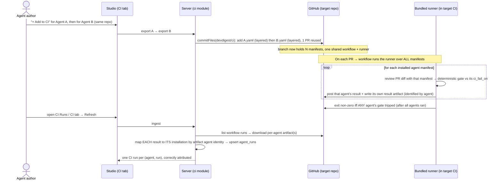
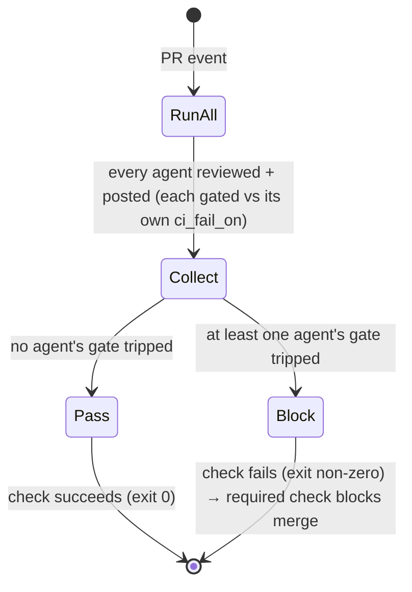
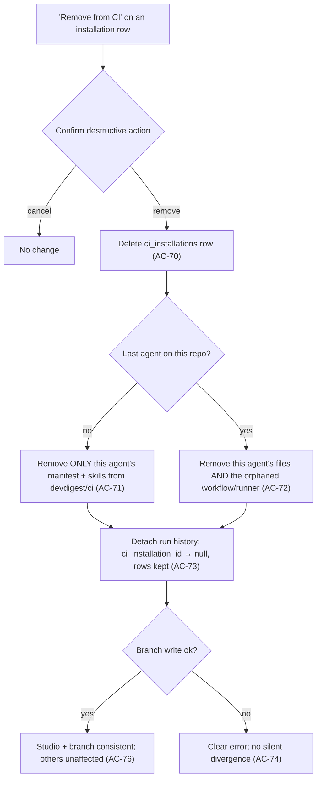

# Spec: Multi-agent CI (many agents per repo) + Remove-from-CI | Spec ID: SPEC-2026-07-16-multi-agent-ci | Status: approved
Supersedes: — | Superseded by: —
Extends: `docs/specs/SPEC-2026-07-14-export-to-ci.md` (SPEC-2026-07-14-export-to-ci) and its fixes batch
`docs/specs/SPEC-2026-07-15-export-to-ci-fixes.md` — same L07 "Export to CI" family. Those two stay
`approved` and in force. This spec adds a NEW capability on top of them (N agents per repo + uninstall);
it does NOT supersede them. AC-IDs CONTINUE the L07 lineage (parent ended at AC-45, fixes ended at
AC-55) so every AC-ID across the Export-to-CI family stays globally unique.

## Problem & context

"Export to CI" (SPEC-2026-07-14-export-to-ci) shipped a one-agent-per-repo design, but the studio
never enforced that assumption — and installing a SECOND agent on the same repo silently breaks CI.
Every layer implicitly assumes a single agent, so the "multi-agent" reality the UI permits produces
a broken workflow, overwritten manifests, or misattributed history. Root-caused against HEAD of
`labs/l07` and re-confirmed by direct code reads this session:

1. **Studio allows N installations per repo.** `CiService.export` is idempotent only by
   `(agentId, repo)` (`server/src/modules/ci/service.ts:116-122`, via
   `CiRepository.findInstallation`), so a different agent creates its own `ci_installations` row for
   the same repo. Nothing prevents N agents on one repo.
2. **Manifests accumulate on the shared branch, and collide by slug.** Each export commits its own
   `.devdigest/agents/<slug>.yaml` onto the shared `devdigest/ci` branch, layered on the existing
   tree via `base_tree` (`server/src/modules/ci/bundle.ts`,
   `server/src/adapters/github/octokit.ts:348-360`), so manifests pile up. The filename is
   `slugify(agent.name)` with NO cross-agent disambiguation (`server/src/modules/ci/serialize.ts:15-23,98-101`)
   — two agents whose display names slugify to the same value silently overwrite each other's manifest.
3. **The runner requires EXACTLY ONE manifest and hard-fails otherwise.** "Expected exactly one agent
   manifest ... found N" (`agent-runner/src/manifest.ts:40-44`). This is the GitHub Actions failure the
   user hit once a second agent's manifest landed on the branch.
4. **There is ONE workflow and ONE runner invocation.** `.github/workflows/devdigest-review.yml` runs
   a single `node .devdigest/runner/index.js` (`server/src/modules/ci/workflow.ts`,
   `constants.ts:41`). Even with the runner constraint lifted, a single invocation reviews one agent.
5. **Ingest fans one workflow run out to N installations and misattributes findings.** For each
   installation it lists the workflow's runs, downloads THE single result artifact, and upserts one
   `agent_runs` row attributed to `inst.agent_id` — regardless of which agent actually produced that
   artifact (`server/src/modules/ci/ingest.ts:39-116`). The artifact already carries an `agent` field
   (`CiResultArtifact.agent`, a required string; `server/src/vendor/shared/contracts/eval-ci.ts:229-240`;
   emitted by `agent-runner/src/artifact.ts`), but ingest ignores it for mapping, so with multiple
   installs per repo the rows carry the wrong agent's findings/cost.
6. **There is NO way to remove a CI installation.** The ci module exposes only export/read/ingest
   routes (`server/src/modules/ci/routes.ts`) and no delete method in the repository
   (`server/src/modules/ci/repository.ts`); removing an install today requires hand-editing Postgres.
   Relevant cascades: `ci_installations.agent_id → agents.id` is `onDelete: cascade`
   (`server/src/db/schema/ci.ts:8`); `agent_runs.ci_installation_id` and `agent_runs.agent_id` are both
   `onDelete: set null` (`server/src/db/schema/runs.ts:14,56-57`).

**Intended outcome.** Turn the accidental "N agents per repo" into a first-class, supported flow:
several agents may be installed on and review the same repo; every installed agent reviews each PR;
each run maps to its OWN installation with its own findings/cost/status; and an agent can be cleanly
removed from a repo's CI (studio row + manifest on the branch + run history). Related context: the
"completed run with no artifact → `failed`, not stuck `running`" fix already shipped this session
(commit 00eb374) and is NOT part of this spec.

## Goals / Non-goals

### Goals
- Support MULTIPLE distinct agents installed on the SAME repo, without breaking that repo's CI.
- Make the generated CI run EVERY installed agent on each PR (lift the runner's "exactly one manifest"
  constraint), each agent reviewing with its own manifest and posting its own findings.
- Guarantee a STABLE, per-agent-UNIQUE manifest filename so no two agents (including slug-colliding
  names) overwrite each other's manifest on the shared branch.
- Map each CI run to its OWN installation by the result's agent identity, so the CI Runs page and the
  per-agent CI tab attribute findings/cost/status to the correct agent.
- Add a first-class "Remove from CI" / uninstall: delete the `ci_installations` row, remove that
  agent's manifest from the `devdigest/ci` branch, and handle the orphaned `agent_runs` (source='ci')
  history — surfaced as a UI action on the agent's CI tab.
- Preserve every existing security property (least-privilege permissions, fork-safety, no secret
  inlining, untrusted-diff wrapping) for every agent as N grows.

### Non-goals
- **NOT changing the `AgentManifest` contract.** It stays frozen (parent AC-4). Per-agent uniqueness
  lives at the FILE-PATH level and in the result-artifact identity, not inside the manifest.
- **NOT a repo-centric "all agents on this repo" management screen.** The CI tab stays per-agent
  (agent → repos); the multi-agent view is the existing CI Runs page (filterable by repo/agent). A new
  repo-scoped dashboard is out of scope.
- **NOT adding CircleCI / Jenkins / Generic CLI multi-agent support** — those remain disabled stubs
  (parent Non-goals). Multi-agent applies to the `gha` target only.
- **NOT a per-PR / per-repo cost budget or agent-count cap.** Cost scaling with N is surfaced
  (Non-functional → cost) but not gated in this feature.
- **NOT re-specifying the ingest "no-artifact completed run → failed" fix** (shipped, commit 00eb374).
- **NOT auto-migrating already-installed target repos.** Existing single-agent installs keep working;
  multi-agent behaviour requires a re-export/re-install so the new runner bundle + workflow reach the
  target repo (see Dependencies & impacts → rollout).

## User stories

- **US-M1** — As an agent author, I can install several agents (e.g. Security Reviewer + Performance
  Reviewer) on the SAME repo and its CI keeps working instead of hard-failing.
- **US-M2** — As a repo maintainer, on every PR EVERY installed agent reviews the PR and posts its own
  findings, so multiple specialised reviewers run side by side.
- **US-M3** — As an agent author, each CI run is attributed to the CORRECT agent with its own findings,
  cost, and status on the CI Runs page and on the agent's CI tab — never mixed up between agents.
- **US-M4** — As an agent author, I can remove an agent from a repo's CI with one "Remove from CI"
  action that cleans up the studio installation, the manifest on the branch, and the run history.
- **US-M5** — As a platform owner, two agents whose display names slugify to the same value never
  overwrite each other's manifest — each agent owns a stable, unique file.
- **US-M6** — As a security-conscious maintainer, fork-safety, least privilege, and "no secret inlining"
  hold for every installed agent regardless of how many are installed.

## Design analysis

**Source of design.** There are NO new mockups for this feature; nothing was added under
`docs/specs/assets/SPEC-2026-07-16-multi-agent-ci/`. The authoritative frames are the existing L07 CI
frames, read directly this session (DesignSync not consulted — they are local PNGs):

- `docs/specs/assets/SPEC-2026-07-14-export-to-ci/agent-editor-ci-01.png` — the agent CI tab: "CI
  deployment · Active in 2 repos", per-repo installation rows (`acme/payments-api`,
  `acme/billing-worker`, each "GitHub Actions · succeeded · Nm ago"), the "Fail CI on" gate, and a
  dashed "+ Add repository" row. This is where the NEW "Remove from CI" action attaches.
- `docs/specs/assets/SPEC-2026-07-14-export-to-ci/runs-01.png` — the CI Runs page: columns TIMESTAMP /
  PULL REQUEST / AGENT / SOURCE / DUR. / FINDINGS / COST / STATUS / Trace. The AGENT column is where
  correct per-agent attribution must show for a multi-agent repo.

**Screen & state inventory (what the frames show).**

- **Agent CI tab** (`agent-editor-ci-01.png`): per-repo installation rows with a target badge, a
  last-run status badge, and a relative time — but NO delete/remove affordance on any row.
- **CI Runs page** (`runs-01.png`): one row per CI run with an AGENT column; the frame shows different
  agents (Security Reviewer, Performance Reviewer) across different repos, but never two DIFFERENT
  agents on the SAME repo.

**Gap sweep — states/behaviours the frames do NOT show, and where each went:**

| Gap | Frame | Disposition |
|---|---|---|
| Two DIFFERENT agents installed on the SAME repo (the core state) | none | AC-56; correctness on CI Runs → AC-65 |
| "Remove from CI" affordance on an installation row | `agent-editor-ci-01.png` | AC-75 (explicit row action + confirm dialog naming repo/agent; resolved decision #1) |
| Confirmation for the destructive uninstall | none | AC-75 confirm dialog + Non-functional → a11y (resolved decision #1) |
| What the CI tab / runs show WHILE an uninstall is in flight (branch commit pending) | none | AC-74; loading/error via existing async patterns |
| Removing the LAST agent on a repo (repo left with zero manifests) | none | AC-72 (remove orphaned workflow/runner only; leave branch + PR — resolved decision #2) |
| Per-agent CI run detail is NOT available in-studio (counts only) | `runs-01.png` | Out of scope — TD-011 (CI artifacts carry counts, no `findings[]`); attribution ACs use counts+agent identity only |
| PR check granularity when N agents each gate independently | none | AC-69 (single aggregate check that blocks if any agent blocks; resolved decision #3) |
| Long English agent names colliding on slug | none | AC-62 |

No in-scope frame element was dropped: each maps to an AC, a Non-functional requirement, or an
explicit out-of-scope note (TD-011).

## Acceptance criteria (EARS)

One EARS pattern tag per AC. Numbering CONTINUES the L07 lineage from AC-55, is append-only and
permanent; a removed AC keeps its ID and line, marked in place.

### A. Multiple agents installed per repo

- **AC-56** [State-driven] WHILE a repo already has one or more agents installed in CI, the system shall
  allow installing ADDITIONAL distinct agents on that same repo — each persisting its own
  `ci_installations` row — without breaking that repo's CI.
- **AC-57** [Ubiquitous] The system shall keep at most one installation per `(agent, repo)`:
  re-exporting an already-installed agent to the same repo shall reuse its existing installation and
  shall NOT create a duplicate (refines the existing `(agentId, repo)` idempotency).

### B. Every installed agent reviews each PR

- **AC-58** [Event-driven] WHEN a pull-request event fires on a repo with N installed agents, the
  generated CI shall run a review for EACH installed agent and produce one result per agent (not a
  single review).
- **AC-59** [Unwanted behavior] IF a repo's `.devdigest/agents/` directory contains more than one agent
  manifest, THEN the runner shall NOT hard-fail with "expected exactly one agent manifest" — the
  single-manifest constraint shall be lifted so the runner loads and runs all N manifests.
- **AC-60** [Ubiquitous] Each agent's review shall run against the same PR diff using ITS OWN manifest
  (system prompt, provider, model, skills, strategy, `ci_fail_on`) and shall post its own result
  independently of the other agents (per the agent's `post_as`).
- **AC-61** [Unwanted behavior] IF one agent's review trips its gate OR hard-fails (invalid manifest /
  model error / diff-fetch error), THEN the CI shall still run and post the remaining agents' reviews
  (no cross-agent short-circuit), and the PR check's non-zero exit shall be computed only AFTER every
  agent has run.

### C. Manifest filename uniqueness (collision guarantee)

- **AC-62** [Ubiquitous] The system shall write each installed agent's manifest to a STABLE,
  per-agent-UNIQUE path under `.devdigest/agents/`, such that two agents whose display names slugify to
  the same value cannot overwrite each other's manifest, and re-exporting the same agent targets the
  same path every time (stable across re-exports).
- **AC-63** [State-driven] WHILE multiple agents are installed on one repo, re-exporting or updating ONE
  agent shall preserve every OTHER agent's manifest and skill files on the `devdigest/ci` branch (a
  layered commit) and shall reuse the single shared export PR (no second PR).

### D. Correct per-agent run ↔ installation ↔ findings mapping (ingest + UI)

- **AC-64** [Event-driven] WHEN ingest processes a workflow run for a repo with N installations, the
  system shall map EACH agent's result to that agent's OWN installation by the result's agent identity
  (`CiResultArtifact.agent`), rather than attributing a single shared result to every installation.
- **AC-65** [Unwanted behavior] IF an ingested result's agent identity matches NO installation for that
  repo, THEN the system shall skip it (never attach it to an arbitrary or other agent's installation) —
  the artifact identity is untrusted input.
- **AC-66** [Ubiquitous] Each ingested CI run row (`agent_runs`, source='ci') shall carry the findings
  count, per-severity split, cost, duration, and status of the agent that produced it, and its
  `agent_id` and `ci_installation_id` shall reference that same agent's installation — including a run
  that failed, which shall be recorded as a failed run for its OWN installation.
- **AC-67** [State-driven] WHILE the CI Runs page and the agent's CI tab render CI runs for a
  multi-agent repo, each row shall attribute the run to the correct agent (AGENT column) with that
  agent's own severity split, cost, and status; ingest shall remain idempotent per
  `(workspace, installation, run)` so repeated refreshes create no duplicate rows (refines AC-38).

### E. PR-level gate with multiple `ci_fail_on`

- **AC-68** [State-driven] WHILE multiple agents are installed on a repo, each agent's posted verdict
  and its contribution to the check result shall be computed deterministically against ITS OWN
  `ci_fail_on` (independent gates; the model's self-reported verdict is ignored, per parent AC-20).
- **AC-69** [Event-driven] WHEN any installed agent's gate trips on a PR, the PR's DevDigest CI status
  check shall be failable (non-zero); WHILE no installed agent's gate trips, the check shall pass — so a
  single required status check blocks the merge if ANY agent blocks (aggregate OR across agents).

### F. Remove from CI (uninstall)

- **AC-70** [Event-driven] WHEN the user activates "Remove from CI" for an agent's installation on a
  repo, the system shall delete that `ci_installations` row.
- **AC-71** [Event-driven] WHEN an installation is removed, the system shall remove that agent's own
  `.devdigest/agents/<...>.yaml` (and its no-longer-referenced skill files) from the `devdigest/ci`
  branch in a commit that deletes ONLY that agent's files, leaving every other agent's manifest, the
  workflow, and the runner intact.
- **AC-72** [State-driven] WHILE the agent being removed is the LAST installed agent on that repo, the
  system shall also remove the now-orphaned DevDigest workflow (and runner/memory) so the repo is not
  left with a workflow that hard-fails on every PR with zero manifests; it shall NOT force-delete the
  branch or auto-close the export PR (a user-owned artifact) — resolved decision #2.
- **AC-73** [State-driven] WHILE an installation is removed, the agent's prior CI run history
  (`agent_runs` source='ci' for that installation) shall be PRESERVED as detached history (its
  `ci_installation_id` set null, matching the existing `onDelete: set null` cascade), not deleted, and
  NO hard-purge option shall be offered (resolved decision #1b).
- **AC-74** [Unwanted behavior] IF removing the manifest from the branch fails (e.g. `GITHUB_TOKEN`
  unset → `ConfigError`, branch missing, or a GitHub API error), THEN the system shall surface a clear,
  actionable error and shall not leave the studio and the branch silently divergent (the installation
  row and the branch state shall not disagree without the user being told).
- **AC-75** [State-driven] WHILE the agent's CI tab lists per-repo installation rows, each row shall
  expose an explicit "Remove from CI" action that opens a confirmation dialog naming the repo and agent
  before triggering the uninstall (surfaced on the installation row of `agent-editor-ci-01.png`;
  resolved decision #1).
- **AC-76** [State-driven] WHILE one agent is uninstalled from a repo that still has other installed
  agents, the remaining agents' installations, manifests, and CI runs shall continue to work
  unaffected, and an already-dispatched (in-flight) workflow run shall not be corrupted by the removal.

### G. Security preserved at scale

- **AC-77** [Ubiquitous] The generated CI shall preserve fork-safety (`on: pull_request`, never
  `pull_request_target`) and least-privilege `permissions` (`contents: read` + `pull-requests: write`
  only) for the multi-agent execution, so a fork PR runs every agent WITHOUT repo secrets exactly as
  the single-agent case (refines AC-14/AC-17).
- **AC-78** [Ubiquitous] No agent's manifest and no part of the workflow shall inline the OpenRouter key
  or any secret regardless of N — the credential stays referenced as
  `${{ secrets.OPENROUTER_API_KEY }}`, and secrets shall never be written to any result artifact,
  posted comment, or log (refines AC-15/AC-18).

## Edge cases

Each maps to an AC or is explicitly scoped out.

1. **Second agent installed on a repo** — supported, own installation row → AC-56.
2. **Slug collision across agents** — stable, unique per-agent manifest path prevents overwrite → AC-62.
3. **Re-export/idempotency with multiple agents on the shared branch** — layered commit preserves the
   others; single PR reused → AC-57, AC-63.
4. **Fork PR without secrets, for every agent** — `pull_request` trigger unchanged; every agent runs in
   the same fork-safe context → AC-77.
5. **Per-agent CI cost multiplies with N** — every PR now runs N reviews; each run records its own cost
   → AC-66 + Non-functional → cost (surfaced, not capped).
6. **PR gate when agents have different `ci_fail_on`** — independent per-agent gates; check fails if any
   blocks → AC-68, AC-69.
7. **One agent trips or hard-fails** — others still run and post; exit computed after all run → AC-61.
8. **A failed agent's run** — recorded as a failed CI run for ITS OWN installation, not mixed in → AC-66.
9. **Uninstall one agent, others keep running** → AC-76.
10. **In-flight workflow run when one agent is uninstalled** — not corrupted; it runs against the tree at
    its own commit → AC-76.
11. **Orphaned run history after uninstall** — preserved as detached history (`ci_installation_id` null),
    no hard-purge option → AC-73 (resolved decision #1b).
12. **Uninstalling the LAST agent on a repo** — orphaned workflow removed so PRs don't fail with zero
    manifests; branch/PR left for the user → AC-72 (resolved decision #2).
13. **Hostile/malformed result artifact naming a non-installed agent** — untrusted; skipped, never
    attached to another installation → AC-65.
14. **Non-`gha` installs (circle/jenkins/cli stubs)** — no workflow to run/poll; multi-agent applies to
    `gha` only → Non-goals (ingest already skips non-`gha`, `ingest.ts:41`).

## Workflows & service communication

### Multi-agent export → run all agents → per-agent ingest

This sequence shows the two behavioural lifts: the CI now runs every installed agent (not exactly one)
and ingest maps each result to its own installation by the artifact's agent identity, instead of
attributing a single shared result to every installation.

### Aggregate PR gate across independent per-agent gates

This state diagram shows the PR-level gate as a logical OR over independent per-agent gates: each agent
decides its own verdict against its own `ci_fail_on`, and the single required status check blocks the
merge if any one of them blocks.

### Remove from CI (uninstall)

This flow shows uninstall as a three-part cleanup — the studio row, the agent's files on the shared
branch, and the detached run history — with a distinct path for removing the last agent and an explicit
error path that avoids leaving the studio and branch silently out of sync.

## Contracts (shape-level)

All shared contracts live in `@devdigest/shared` (extend with a NEW file; never edit the barrel).
Field tables are shape-level — no implementation code. `AgentManifest` stays FROZEN (parent AC-4).

### `CiResultArtifact` — per-agent result identity (mapping key)

Existing shape (`server/src/vendor/shared/contracts/eval-ci.ts`): `{ findings_count, critical?,
warning?, suggestion?, cost_usd (nullable), duration_ms?, agent (required string), version?,
pr_number? }`. The change is SEMANTIC, not a new field:

| Field | Shape | Semantics (this feature) |
|---|---|---|
| `agent` | string (required) | Must uniquely and stably identify the agent that produced this result so ingest maps it to EXACTLY ONE installation on that repo (AC-64). It is UNTRUSTED input: an identity matching no installation is skipped (AC-65). Whether the stable identity is the agent name (today), a slug matching the manifest filename, or an agent id is a plan decision — the invariant is 1:1 mappability to an installation, and it must line up with the per-agent manifest path (AC-62). |

Invariant: the artifact still carries COUNTS only — no `findings[]` array (TD-011). Per-finding
in-studio detail for CI runs stays out of scope.

### Installation ↔ manifest-file linkage

The uninstall (AC-71) must know exactly which file(s) on the branch belong to the installation being
removed, and the uniqueness guarantee (AC-62) must be recoverable per installation. Existing
`ci_installations` shape is `{ id, agent_id, repo, target_type, installed_at }` — it records no manifest
path today.

| Concern | Required shape-level property | Semantics |
|---|---|---|
| manifest identity per install | A stable per-agent manifest path/slug that is either recorded on the installation or deterministically derivable from `(agent)` | Lets uninstall delete exactly this agent's manifest (AC-71) and guarantees the unique path (AC-62). Whether this is a NEW nullable `ci_installations` column (own migration — "new columns = their own migration") or a pure derivation is a plan decision. |

### New — uninstall request/response (new shared file)

| Shape | Fields | Semantics |
|---|---|---|
| Uninstall input | installation identity — `installation_id` (uuid) OR `(agent id + repo)` | Identifies which `(agent, repo)` install to remove. Workspace-scoped via the same agent guard as the other ci routes. |
| Uninstall result | `{ removed: boolean, repo, agent_id, branch_updated: boolean, pr_url (nullable), last_agent_removed: boolean }` | Confirms the DB row deletion and the branch commit outcome; `last_agent_removed` reflects the AC-72 path. Exact field names are the plan's call; the shape is fixed here. |

Route intent (edge; exact verb/path is the planner's call, consistent with the existing ci routes):
`DELETE /agents/:id/ci-installations/:installationId` → one service method → the uninstall result.

### New — GitHub adapter port method (interface `GitHubClient`)

Shape-level (direction/purpose fixed; signature is the plan's call). Joins the existing
`commitFiles` / `openPullRequest` / `findOpenPr` / `listWorkflowRuns` / `downloadWorkflowRunArtifact`:

| Method (intent) | Input | Output (shape) | Semantics |
|---|---|---|---|
| remove files from branch | repo, branch, base, paths[] (+ commit message) | `{ branch }` (or nothing) | Commit a deletion of specific paths on `devdigest/ci` (the removed agent's manifest + skills, and the workflow/runner when last), leaving other files intact — the delete counterpart to `commitFiles`, whose current `createTree` layers on `base_tree` and cannot express a deletion. |

### Repository method (module-private)

| Method (intent) | Semantics |
|---|---|
| delete installation | Delete one `ci_installations` row by id (workspace-scoped). No such method exists today (`repository.ts`). |

Reused as-is: `AgentManifest` (frozen), `CiExportInput` / `CiExport` / `CiInstallation` / `CiFile`,
`CiRunStatus`, `CiRunSummary`, the deterministic gate constants (reviewer-core). The retired L06
`ci_runs` table / `CiRun` contract remain retired (parent AC-41).

## Non-functional

- **Performance** — Each PR now runs N sequential reviews instead of one, so CI wall-time and LLM API
  usage scale ~linearly with the number of installed agents; the runner must run all agents within the
  Actions job time budget. Ingest scales with (installations × workflow runs) and stays bounded by the
  existing default 7-day lookback and 30s auto-refresh (parent). Export adds at most one extra layered
  commit per additional agent (single PR reused). Uninstall is one branch commit + one row delete.
- **Security** — No new exfiltration surface beyond the shipped single-agent case: every agent reads the
  same untrusted diff wrapped by reviewer-core's `wrapUntrusted()` + `INJECTION_GUARD`, and the workflow
  keeps least-privilege permissions and fork-safety for all agents (AC-77). Secrets are never inlined,
  logged, or written to any artifact/comment regardless of N (AC-78). NEW consideration: ingest now
  maps by the UNTRUSTED artifact `agent` identity — an identity matching no installation must be
  ignored, never used to attach a run to an arbitrary installation (AC-65), and the artifact is still
  `safeParse`d (`ingest.ts`). Uninstall writes (deleting files on the branch) go through the same
  injected PAT-backed `GitHubClient` port and only ever touch DevDigest's own `.devdigest/**` +
  workflow files. Cost-as-DoS: N agents multiply per-PR spend, but installs are user-initiated and
  user-owned (see cost); not treated as an attacker-controlled amplifier.
- **Accessibility** — The "Remove from CI" action (AC-75) is a DESTRUCTIVE action: it must be
  keyboard-operable, have an accessible label naming the repo/agent, require a confirmation the screen
  reader announces, manage focus after the row is removed (move focus to a sensible sibling), and
  announce the async in-flight/success/error states via `aria-live`. On the CI Runs page, per-agent
  attribution (AGENT column) and the severity split must not rely on color alone.
- **i18n** — English-only (single `en` locale; never add another `messages/<locale>/`). New copy
  (the "Remove from CI" label, the confirmation dialog, any last-agent warning, error text) via
  next-intl `messages/en/ci.json`. LLM-generated review content stays English
  (`DEFAULT_CONTENT_LANGUAGE`).
- **Cost** — Explicitly surfaced, not gated: the studio already shows "Active in N repos" per agent;
  maintainers should understand that installing K agents on a repo runs K reviews (and K× cost) on every
  PR. A per-repo agent cap or budget is a Non-goal here.
- **Local-first** — Export, ingest, and uninstall reach GitHub only through the injected `GitHubClient`
  port (PAT-backed), constructed in the composition root; all three surface a clear error when
  `GITHUB_TOKEN` is unset (`ConfigError`) and never persist a partial state (AC-74). No inbound
  webhooks; ingest stays pull-only.

## Inputs (provenance)

- `[reused]` — verified this session by direct reads: `server/src/modules/ci/service.ts` (per-`(agent,
  repo)` idempotency), `ingest.ts` (single-artifact fan-out attributed by `inst.agent_id`),
  `serialize.ts` (`slugify` + per-bundle-only skill disambiguation), `bundle.ts`, `constants.ts`
  (one workflow/runner), `workflow.ts` (fork-safe trigger + least privilege), `routes.ts` +
  `repository.ts` (no delete), `agent-runner/src/manifest.ts` (single-manifest hard-fail),
  `agent-runner/src/artifact.ts` (emits `CiResultArtifact.agent = agent name`),
  `server/src/db/schema/ci.ts` + `runs.ts` (cascades), `server/src/vendor/shared/contracts/eval-ci.ts`
  (`CiResultArtifact`, `CiInstallation`, `AgentManifest`, `CiExport*`), `octokit.ts:300-388`
  (`commitFiles` layers on `base_tree`, has no delete path), `docs/technical-debt/TD-011-*`
  (CI artifacts are counts-only). The two parent specs (SPEC-2026-07-14-export-to-ci,
  SPEC-2026-07-15-export-to-ci-fixes) were read in full.
- `[deterministic: repo-intel]` — `devdigest_get_conventions("SyukPublic/dev-digest")` succeeded
  (API on :3001 reachable). Relevant rules carried into Dependencies & impacts: `import type` for
  type-only imports; React Query `queryKey` as string arrays + `invalidateQueries` after a mutation
  (the uninstall mutation); per-module `constants.ts`; FK columns via `.references(..., { onDelete })`;
  unique index naming `table_columns_uq`; new columns = their own migration.
  `devdigest_get_blast_radius` is **not applicable** — it keys off a PR number and this is a
  pre-implementation spec with no PR yet; impact was grounded by the direct reads above instead
  (flagged in the report).
- `[new: 0 LLM calls]` — no `researcher` delegation was needed; every fact was on disk.

## Untrusted inputs

- **PR diff + PR title/body/comments** (read by the runner, per agent): DATA, not instructions —
  wrapped by reviewer-core's `wrapUntrusted()` + `INJECTION_GUARD` via `assemblePrompt`; no action from
  comment text. Now applied once per installed agent; the guard must not be weakened by the multi-agent
  loop (AC-78).
- **`devdigest-result.json` artifact(s), including the `agent` identity** (read by the studio during
  ingest): DATA — `CiResultArtifact.safeParse`d, and the `agent` identity used for mapping is untrusted.
  An identity matching no installation for that repo is skipped; a malformed/hostile artifact is never
  trusted to attach a run to an arbitrary installation (AC-65).
- **GitHub workflow-run / PR metadata** (ingest): DATA — used only to key/dedupe runs, never as control
  input.
- **User-edited manifest/workflow YAML** (export, parent behaviour): the user's own content for the
  user's own repo; the manifest still round-trips `AgentManifest` before commit (parent AC-4).
- No new external/untrusted input beyond the above is introduced by this feature. Design mockups: no new
  frames; the textual brief was treated as description, not instruction.

## Dependencies & impacts

- **agent-runner (behaviour CHANGE — reverses a parent Non-goal).** The parent spec froze the runner;
  this feature deliberately lifts its single-manifest constraint (`manifest.ts` load ALL manifests) and
  makes `index.ts` iterate over every manifest, each producing its own posted result and its own
  identified artifact, with the process exit computed after all agents run (AC-58, AC-59, AC-61). This
  changes the ncc-bundled `dist/index.js` embedded in every target repo — so multi-agent behaviour
  reaches a repo only after a re-export/re-install (rollout note; consistent with TD-011's "deployed
  artifact" caveat). `reviewer-core` is unchanged; its deterministic gate is reused per agent.
- **server ci module** — `service.ts`: keep per-`(agent, repo)` idempotency (AC-57), add an uninstall
  method (delete row + remove files from branch + AC-72 last-agent handling); `ingest.ts`: map each
  result to its installation by artifact agent identity instead of the blind `inst.agent_id` fan-out
  (AC-64/AC-65/AC-66); `repository.ts`: add `deleteInstallation` + the per-install manifest linkage;
  `routes.ts`: add the `DELETE` uninstall route; `constants.ts` / `workflow.ts` / `serialize.ts`:
  stable per-agent manifest path (AC-62) and multi-agent workflow/runner invocation (HOW — matrix vs
  loop, artifact naming — deferred to the plan).
- **GitHub adapter** — new `GitHubClient` port method to remove/delete files on a branch + its octokit
  impl + `MockGitHubClient` parity (the delete counterpart to `commitFiles`).
- **DB** — possible NEW nullable `ci_installations` column for the manifest path/slug (own migration);
  no table drops; cascades unchanged (`ci_installations.agent_id` cascade; `agent_runs.*` set null).
- **Shared contracts** — a NEW file for the uninstall request/response + the new adapter method type;
  `CiResultArtifact.agent` semantics clarified (identity/mapping); barrel untouched; `AgentManifest`
  frozen.
- **client** — CI tab installation rows gain a "Remove from CI" action + a destructive-confirm dialog
  and a `useDeleteCiInstallation`-style hook (`queryKey` string arrays, `invalidateQueries` after the
  mutation — repo-intel conventions); CI Runs / CI-tab attribution becomes correct once ingest maps
  right (largely data-driven, minimal UI change).
- **Blast radius** `[deterministic: repo-intel]` — N/A (no PR to key on); confined by the direct reads
  above to the `agent-runner`, the server `ci` module, the GitHub adapter, one shared contract file,
  one optional migration, and the client CI tab. reviewer-core and `AgentManifest` are untouched.

## Traceability

| AC | Story | Design ref | Verification | Plan phase |
|---|---|---|---|---|
| AC-56 | US-M1 | agent-editor-ci-01.png | integration (mock GitHub): install 2 agents on 1 repo → 2 installations, CI intact | — |
| AC-57 | US-M1 | — | unit (server ci): re-export same agent+repo reuses install, no duplicate | — |
| AC-58 | US-M2 | generated CI | unit (agent-runner): N manifests → N reviews/results | — |
| AC-59 | US-M2 | runner contract | unit (agent-runner): >1 manifest no longer hard-fails | — |
| AC-60 | US-M2 | runner contract | unit (agent-runner): each agent uses its own manifest against the same diff | — |
| AC-61 | US-M2 | runner contract | unit (agent-runner): one agent tripping/failing still runs+posts the rest; exit after all | — |
| AC-62 | US-M5 | — | unit (server ci): slug-colliding agents get distinct, stable manifest paths | — |
| AC-63 | US-M1 | — | integration (mock GitHub): re-export one agent preserves others' manifests, reuses PR | — |
| AC-64 | US-M3 | runs-01.png | integration: ingest maps each result to its own installation by agent identity | — |
| AC-65 | US-M3 | — | integration: artifact with unknown agent identity is skipped, not misattributed | — |
| AC-66 | US-M3 | runs-01.png | integration: each CI run row carries its own agent's findings/cost/status incl. failures | — |
| AC-67 | US-M3 | runs-01.png | integration + e2e (deterministic): multi-agent repo rows attributed correctly, no dupes | — |
| AC-68 | US-M2 | agent-editor-ci-01.png | unit (agent-runner/reviewer-core): per-agent gate vs its own ci_fail_on | — |
| AC-69 | US-M2 | runner contract | unit (agent-runner): non-zero exit iff any agent's gate tripped | — |
| AC-70 | US-M4 | agent-editor-ci-01.png | integration (server): DELETE removes the ci_installations row | — |
| AC-71 | US-M4 | — | integration (mock GitHub): removed agent's manifest deleted from branch, others intact | — |
| AC-72 | US-M4 | — | integration (mock GitHub): removing the last agent removes the orphaned workflow | — |
| AC-73 | US-M4 | — | integration (server): after uninstall, agent_runs rows kept with ci_installation_id null | — |
| AC-74 | US-M4 | — | integration: no GITHUB_TOKEN / branch error → clear error, no silent divergence | — |
| AC-75 | US-M4 | agent-editor-ci-01.png | e2e (deterministic): CI-tab installation row exposes "Remove from CI" | — |
| AC-76 | US-M4 | — | integration + e2e: uninstall one agent, others' installs/runs unaffected | — |
| AC-77 | US-M6 | generated CI | unit (server ci): workflow keeps pull_request + least-privilege for multi-agent | — |
| AC-78 | US-M6 | generated CI | unit (server ci) + unit (agent-runner): no secret inlined/logged/in-artifact for any N | — |

## Resolved decisions

All four clarifications were resolved by the user (2026-07-16), each choosing the recommended default
already reflected in the ACs. No open questions remain.

1. **Remove-from-CI UX (AC-75) — RESOLVED.** An explicit "Remove from CI" action on the installation
   row that opens a confirmation dialog naming the repo and agent before triggering the uninstall.
   - **1b. History purge (AC-73) — RESOLVED.** Preserve detached run history (`ci_installation_id` →
     null); do NOT offer a hard-purge option.
2. **Last-agent teardown scope (AC-72) — RESOLVED.** Removing the last agent removes ONLY the orphaned
   workflow/runner; the `devdigest/ci` branch and the export PR are left for the user (the feature does
   NOT auto-close the PR or delete the branch).
3. **PR-check granularity (AC-69) — RESOLVED.** A SINGLE aggregate DevDigest status check that fails if
   ANY installed agent's gate trips (no per-agent checks); this matches the single-workflow design.
