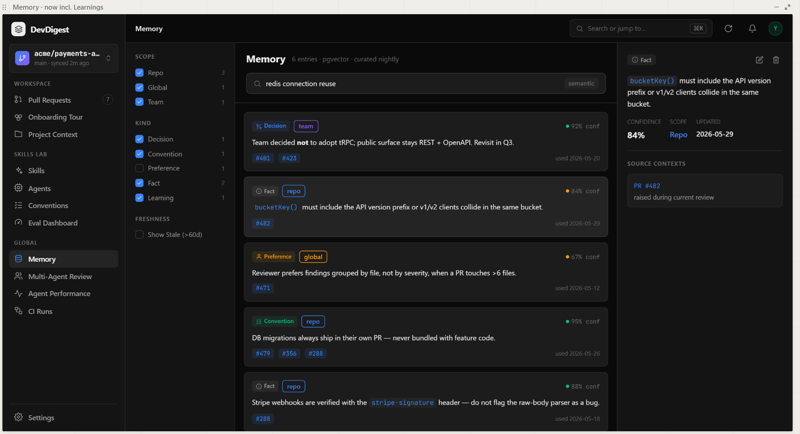
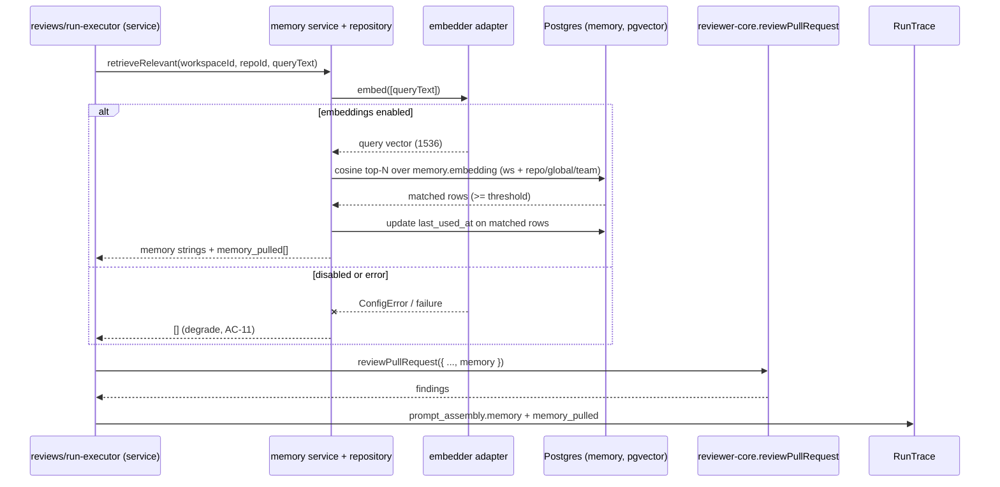
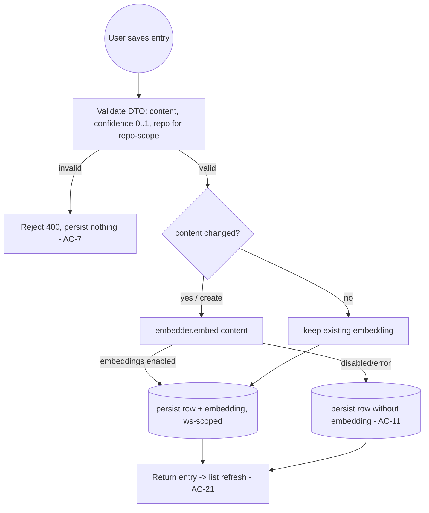

# Spec: Review Memory | Spec ID: SPEC-2026-07-16-review-memory | Status: approved
Supersedes: — | Superseded by: —

## Problem & context

DevDigest's AI reviewer re-derives the same context on every run: it has no
durable memory of the team's past decisions, conventions, preferences, or
learned facts. As a result it can re-flag a known non-issue (e.g. "the raw-body
parser looks like a bug" when the team already verified Stripe webhooks via the
`stripe-signature` header), or miss a standing rule (e.g. "DB migrations always
ship in their own PR"). Reviewers have to repeat the same corrections review
after review.

The database already carries an empty `memory` table
(`server/src/db/schema/knowledge.ts` L8-29) and a `MemoryItem` contract
(`server/src/vendor/shared/contracts/knowledge.ts` L106-113); the review engine
already *consumes* memory (`reviewer-core/src/prompt.ts` L117-120 renders a
`## Relevant memory` block from `memory?: string[]`, accepted by
`reviewPullRequest` — `reviewer-core/src/review/run.ts` L58-59). What is missing
is everything that *fills and manages* that memory: no server module writes it,
the studio executor calls `reviewPullRequest` without a `memory` argument and
hardcodes `memory_pulled: []` (`server/src/modules/reviews/run-executor.ts`
L357, L478), and there is no `/memory` studio page (the sidebar key `memory` is
reserved but unused — `client/src/components/app-shell/helpers.ts` L36).

This feature delivers the **Studio MVP** of Review Memory: a server `memory`
module (CRUD + semantic retrieval), a `/memory` studio page matching the
approved design, and injection of relevant memory into the prompt of local
studio reviews so the reviewer honors curated guidance. The intended outcome:
the team curates a small, high-signal memory that measurably shapes review
behavior, with full observability in the run trace.

## Goals / Non-goals

**Goals**
- A server `memory` feature module providing CRUD (list-with-filters, get-one,
  create, update, delete), workspace-scoped, modeled after
  `server/src/modules/conventions/`.
- Real pgvector semantic search over `memory.embedding` (embed the query via the
  embedder adapter; cosine similarity), with embeddings generated on create and
  on content-changing updates.
- A `/memory` studio page matching `assets/SPEC-2026-07-16-review-memory/memory-01.png`.
- Injection of relevant memory into **local (studio) reviews**: populate the
  `reviewPullRequest` `memory` input, record it in the run trace
  (`prompt_assembly.memory`, `memory_pulled`), and update `last_used_at` on the
  entries used.
- Seed the design's example entries via `pnpm db:seed`.

**Non-goals (out of scope — see Deferred)**
- Nightly auto-curation of memory from findings/decisions. The "curated nightly"
  header label is aspirational only; the `CuratorResult`/`CuratorMerge`
  scaffolding (`server/src/vendor/shared/contracts/observability.ts` L129-144)
  stays unused by this spec.
- The CI leg of memory: generating a non-empty `.devdigest/memory.jsonl` on
  export and making the ncc-bundled agent-runner read it (see "Correlation with
  TD-011").
- Any change to the reviewer-core engine's public contract — it already accepts
  `memory: string[]`; this spec only supplies it from the server.
- Real-time reactivity of the list to concurrent `last_used_at` changes (the
  list reflects state at fetch time; a refresh re-reads it).

## User stories

- **US-1** — As a maintainer, I want to see the team's curated review memory
  (with scope, kind, confidence, sources, and freshness) so I understand what
  standing guidance the AI reviewer should honor.
- **US-2** — As a maintainer, I want to create, edit, and delete memory entries
  so I can curate exactly what the reviewer knows.
- **US-3** — As a maintainer, I want to search memory semantically so I can find
  a relevant entry by meaning, not exact wording.
- **US-4** — As a reviewer, I want relevant memory injected automatically into
  local reviews so the reviewer applies our decisions/conventions/preferences
  and stops re-flagging known non-issues.
- **US-5** — As a maintainer, I want to filter by scope, kind, and freshness so
  I can triage stale or off-topic entries.

## Design analysis

**Source:** the approved screenshot
`assets/SPEC-2026-07-16-review-memory/memory-01.png` (single-state mockup of the
`/memory` page).

**Screen & state inventory (what the design shows)**
- **Header** — "Memory · N entries · pgvector · curated nightly", a semantic
  search box with a `semantic` affordance label. ("curated nightly" is an
  aspirational label only — see Deferred.)
- **Left filter rail** — SCOPE (Repo / Global / Team, each with a count); KIND
  (Decision / Convention / Preference / Fact / Learning, each with a count);
  FRESHNESS ("Show Stale (>60d)" toggle).
- **List cards** — kind badge + scope badge, confidence %, content (may contain
  inline code such as `bucketKey()` / `stripe-signature`), source PR chips
  (e.g. `#401` `#423`), and a "used <date>" (from `last_used_at`).
- **Right detail panel** — kind badge, edit (pencil) + delete (trash) actions,
  content, CONFIDENCE %, SCOPE, UPDATED date, and SOURCE CONTEXTS (e.g.
  "PR #482 — raised during current review").

**Gap sweep (states the design does NOT show → where each went)**
- Empty list (no entries at all) → **AC-18**.
- No search matches → **AC-19**.
- Loading state, and error state (incl. semantic search unavailable because
  embeddings are disabled) → **AC-20**.
- No entry selected (detail panel placeholder) → **AC-17**.
- Create affordance/form (the mockup shows only edit/delete on an existing
  entry; CRUD requires a create path) → **AC-21**.
- Delete confirmation → **AC-22**.
- Validation of create/edit input (content required, confidence 0..1,
  repo-scope needs a repo) → **AC-7**.
- Long / code-bearing content rendered safely (no HTML execution) → **AC-24**.
- Accessibility (labeled controls, keyboard operation, aria-live on async
  updates) → **AC-25**.
- Responsive behavior of the three-pane layout (rail / list / detail) →
  Non-functional (responsive).
- Exact "stale" threshold (design says >60d) → **60 days** (AC-16, decided).

## Acceptance criteria (EARS)

Numbering is append-only and stable. All parameters below are decided (no open
questions).

- **AC-1 [Event-driven]** — WHEN a client requests the memory list for the
  active workspace, the system shall return entries scoped to that workspace,
  with `repo`-scoped entries limited to the active repo and `global`/`team`
  entries always included, each carrying id, content, scope, kind, confidence,
  sources, updated_at, last_used_at, and repo_id.
- **AC-2 [Optional feature]** — WHERE scope and/or kind filters are supplied,
  the system shall return only entries matching the selected scope(s) and
  kind(s), and shall report per-facet counts for the rail.
- **AC-3 [Event-driven]** — WHEN a user submits a semantic search query, the
  system shall embed the query via the embedder adapter and return
  workspace-scoped entries ordered by cosine similarity to the query embedding.
- **AC-4 [Event-driven]** — WHEN a user creates a memory entry with valid
  fields, the system shall persist it workspace-scoped, generate and store its
  embedding from the content, and set created_at and updated_at.
- **AC-5 [Event-driven]** — WHEN a user edits a memory entry, the system shall
  persist the changes and update updated_at, regenerating the embedding when the
  content changed.
- **AC-6 [Event-driven]** — WHEN a user deletes a memory entry, the system shall
  remove it from the workspace so that it no longer appears in the list nor is
  eligible for review injection.
- **AC-7 [Unwanted behavior]** — IF a create/update request omits content, sets
  confidence outside 0..1, or uses scope `repo` without a repo association, THEN
  the system shall reject it with a validation error and persist nothing.
- **AC-8 [Unwanted behavior]** — IF a client reads, edits, or deletes a memory
  entry that is not in its workspace, THEN the system shall respond as
  not-found, granting no cross-tenant access.
- **AC-9 [Event-driven]** — WHEN a local (studio) review run starts, the system
  shall retrieve the most relevant workspace memory (repo-scoped to the PR's
  repo, plus global/team) by semantic similarity to a query derived from the PR,
  and inject the selected items as the `reviewPullRequest` `memory` input.
  *(decided: top-N = 5, cosine-similarity threshold ≈ 0.75.)*
- **AC-10 [Event-driven]** — WHEN memory is injected into a review, the system
  shall record the injected items in the run trace (`prompt_assembly.memory` and
  `memory_pulled`) and update `last_used_at` on each entry used.
- **AC-11 [Unwanted behavior]** — IF memory retrieval fails or embeddings are
  disabled (`EMBEDDINGS_ENABLED=false`), THEN the system shall run the review
  with no injected memory (empty `memory_pulled`) and shall not fail the review.
- **AC-12 [State-driven]** — WHILE no memory entry meets the similarity
  threshold, the system shall inject no memory and the review shall proceed
  unchanged (byte-identical prompt to the no-memory baseline).
- **AC-13 [Event-driven]** — WHEN the `/memory` page loads, the system shall
  render a header with the total entry count and the `pgvector` and
  `curated nightly` labels, a semantic search box, a filter rail (SCOPE + KIND
  with per-facet counts, and a freshness/stale toggle), and the entry list.
- **AC-14 [Event-driven]** — WHEN the list renders, each entry card shall show
  its kind badge, scope badge, confidence percentage, content (inline code
  rendered as code), source PR chips, and the last-used date.
- **AC-15 [Event-driven]** — WHEN a user selects an entry, the system shall show
  a detail panel with the kind badge, edit and delete actions, content,
  confidence %, scope, updated date, and source contexts (PR # + context text).
- **AC-16 [State-driven]** — WHILE the "Show Stale" toggle is on, the system
  shall show only entries whose `last_used_at` is older than the stale threshold
  or never used. *(decided threshold: 60 days.)*
- **AC-17 [State-driven]** — WHILE no entry is selected, the detail panel shall
  show an empty placeholder state.
- **AC-18 [Unwanted behavior]** — IF the workspace has no memory entries, THEN
  the page shall show an empty state prompting creation of the first entry.
- **AC-19 [Unwanted behavior]** — IF a semantic search returns no matches, THEN
  the page shall show a no-results state.
- **AC-20 [State-driven]** — WHILE a list or search request is in flight, the
  page shall show a loading state; IF the request errors (including semantic
  search being unavailable because embeddings are disabled), the page shall show
  an error state and keep the non-semantic filtered list usable.
- **AC-21 [Event-driven]** — WHEN a user activates create or edit, the system
  shall present a form for content, scope, kind, confidence, repo association
  (required for `repo` scope), and sources; on save it shall validate the input
  and reflect the change in the list without a full page reload.
- **AC-22 [Event-driven]** — WHEN a user activates delete, the system shall
  require confirmation before removing the entry.
- **AC-23 [Event-driven]** — WHEN the database seed runs, the system shall
  insert the design's example memory entries into the active workspace, covering
  all five kinds and the repo/global/team scopes.
- **AC-24 [Unwanted behavior]** — IF memory content contains markup or code,
  THEN the UI shall render it as text (escaped; inline code formatted safely)
  and shall never execute it.
- **AC-25 [Ubiquitous]** — The memory page controls (search box, filter toggles,
  edit/delete actions) shall be keyboard operable and labeled, and asynchronous
  list/detail/search updates shall be announced via an aria-live region.
- **AC-26 [Optional feature]** — WHERE a review is executed by multiple agents,
  the system shall inject the same retrieved memory into each agent's review via
  the same `reviewPullRequest` path (retrieval runs once per review and is shared
  across agents). *(decided: yes.)*

## Edge cases

- **Embeddings disabled** — create/update still persists the entry (no
  embedding); semantic search and review injection degrade to no-op (AC-11,
  AC-20). Mapped.
- **Entry created while embeddings disabled, then enabled** — the entry has no
  embedding and is invisible to semantic search until re-saved. Accepted;
  surfaced as an inline proposal (a backfill is a follow-up, not MVP).
- **Repo-scoped entry viewed with no active repo / a different repo selected** —
  repo-scoped entries are only listed for their own repo; global/team always
  show (AC-1). Mapped.
- **PR-less source** — `MemorySource.pr` is optional; a source may carry only a
  context string (no PR chip rendered) (AC-15). Mapped.
- **Content with inline code / long text** — rendered as escaped text/code, not
  executed (AC-24); long English strings wrap (Non-functional: responsive).
  Mapped.
- **Delete of an entry currently referenced by an in-flight review** — the
  review already captured its injected `memory_pulled` snapshot; deletion does
  not retroactively alter a completed trace. Accepted.
- **Concurrent `last_used_at` update during viewing** — the list is not
  real-time; a refresh reflects the new value (Non-goal). Accepted.
- **Confidence display** — stored as a 0..1 double, shown as a percentage; a
  malformed/absent confidence is rejected on write (AC-7). Mapped.

## Workflows & service communication

The sequence below shows a local studio review pulling relevant memory,
injecting it, and recording it — the retrieval is best-effort and never fails
the review (AC-9 to AC-12).

The create/update flow below shows embedding generation happening at write time
so the entry is immediately searchable and injectable (AC-4, AC-5).

## Contracts (shape-level)

A new **`Memory`** display/persisted shape is required, plus Create/Update DTOs
and a list query. These extend `contracts/knowledge.ts` as **new** exports,
back-compatible (the existing `MemoryItem` / `MemoryScope` / `MemoryKind` /
`MemorySource` are unchanged), following how `ConventionCandidate` was extended.
No implementation code here — shapes only.

**Memory (list/detail item)** — `MemoryItem` + identity/lifecycle fields:

| Field | Shape | Notes / invariants |
|---|---|---|
| id | string (uuid) | server-assigned |
| content | string | required, non-empty |
| scope | enum repo \| global \| team | from `MemoryScope` |
| kind | enum decision \| convention \| preference \| fact \| learning | from `MemoryKind` |
| confidence | number 0..1 | shown as % in UI |
| sources | MemorySource[] | each `{ pr?: int, context: string }` |
| repo_id | string (uuid) \| null | non-null iff scope = `repo` |
| updated_at | string (ISO) | server-maintained |
| last_used_at | string (ISO) \| null | null until first review use |

**CreateMemory (DTO)**

| Field | Shape | Notes |
|---|---|---|
| content | string | required |
| scope | MemoryScope | required |
| kind | MemoryKind | required |
| confidence | number 0..1 | required |
| sources | MemorySource[] | default `[]` |
| repo_id | string (uuid) \| null | required when scope = `repo`, else null |

**UpdateMemory (DTO)** — partial of CreateMemory; server destructures only known
fields (no mass-assignment); changing `content` triggers re-embedding.

**MemoryListQuery** — `scope?: MemoryScope[]`, `kind?: MemoryKind[]`,
`stale?: boolean`, `q?: string` (semantic query), `repo_id?` (active repo for
repo-scope filtering).

**Invariants**
- Embedding is a derived, server-owned 1536-dim vector — never client-supplied.
- Every read/write is workspace-scoped (tenancy guard); `repo`-scope requires a
  `repo_id`; `global`/`team` carry `repo_id = null`.
- Injected review memory is the plain content strings passed as
  `reviewPullRequest.memory: string[]`; the trace records `memory_pulled` as
  `{ pr?, text }[]` (matching `MemoryPulled` in `contracts/trace.ts` L88-92).

## Non-functional

- **Performance** — Memory retrieval for a review is best-effort and must not
  materially delay or fail a review run: one query embedding + one indexed
  cosine query, degrading to no-op on error/timeout (AC-11). The list query is
  bounded (top-N for search; full workspace list is small by design). The
  `memory_ws_idx` index already exists; an ANN/vector index is an
  implementation concern for the planner.
- **Security** — Every query scoped by `workspace_id` (A01/IDOR; AC-8). DTOs
  destructure only known fields, no `req.body` spread (A08 mass-assignment).
  Content is stored/queried via Drizzle parameterized queries (A05 injection).
  Content is rendered as escaped text/safe inline code in the UI, never via
  `dangerouslySetInnerHTML` (A05 stored XSS; AC-24). The OpenAI embeddings key
  comes only from `LocalSecretsProvider` and is gated by `EMBEDDINGS_ENABLED`;
  no secret is ever sent to the client. See "Untrusted inputs" for the
  trusted-vs-untrusted prompt distinction.
- **Accessibility** — Labeled search box and filter controls; keyboard-operable
  create/edit/delete; aria-live announcement of async list/detail/search updates
  (AC-25). Content and badges meet contrast in light and dark themes.
- **i18n** — English-only. The single locale is `en`; all UI strings go through
  next-intl (`messages/en/*`). No `uk` (or any other) locale — **N/A per project
  decision** (root `AGENTS.md` localization rule). LLM/embedding content is
  English (`DEFAULT_CONTENT_LANGUAGE`).
- **Local-first** — Data lives in local Postgres; embeddings depend on the
  local `EMBEDDINGS_ENABLED` config + `LocalSecretsProvider` key, and the whole
  feature degrades gracefully when embeddings are off (AC-11, AC-20).
- **Responsive** — The three-pane layout (rail / list / detail) must remain
  usable on a narrow viewport (panes collapse/stack rather than truncate); long
  English content wraps.

## Inputs (provenance)

- `[reused]` — `server/src/db/schema/knowledge.ts` (memory table),
  `server/src/vendor/shared/contracts/knowledge.ts` (MemoryItem family),
  `reviewer-core/src/prompt.ts` + `reviewer-core/src/review/run.ts` (`memory`
  consumption), `server/src/modules/reviews/run-executor.ts` (injection site),
  `server/src/vendor/shared/contracts/trace.ts` (`PromptAssembly.memory`,
  `MemoryPulled`), `server/src/platform/container.ts` (`embedder()` gating),
  `server/src/vendor/shared/adapters.ts` (`Embedder` interface),
  `server/src/modules/conventions/*` (module template),
  `client/src/lib/hooks/conventions.ts` + `client/src/app/conventions/*`
  (client template), `client/src/components/app-shell/helpers.ts` (reserved
  `memory` sidebar key).
- `[deterministic: repo-intel]` — `devdigest_get_conventions` (schema/hook/route
  conventions: `now()` helper, `uuid().primaryKey().defaultRandom()`, cascade
  FKs, React-Query `queryKey` arrays + `invalidateQueries`, per-module
  `constants.ts`).
- `[deterministic: repo-intel]` — `devdigest_get_blast_radius`: **not
  applicable** — this is a greenfield feature with no PR to map yet.
- `[new: 0 LLM calls]` — no researcher delegation was required; all facts were
  grounded in read files.

## Untrusted inputs

- **Memory content injected into the review prompt is TRUSTED by authorship.**
  It is authored by workspace curators via CRUD (and by the seed), not scraped
  from a PR at review time. reviewer-core renders it as plain bullets under
  `## Relevant memory` (no untrusted-data wrapper — `prompt.ts` L117-120),
  unlike untrusted skills/specs which are wrapped. This is intentional: curated
  memory such as "do not flag the raw-body parser as a bug" is *meant* to shape
  the review. The `INJECTION_GUARD` still governs the genuinely untrusted inputs
  (the diff, PR body) so a hostile PR cannot descope the review.
  - **Constraint carried forward:** if a FUTURE auto-curation path ingests
    PR-derived text into memory (Deferred), that text becomes untrusted and must
    be wrapped before injection. Out of scope here (manual CRUD + seed only).
- **Semantic search query / DTO fields** — user input to the DB, validated by
  Zod and executed via Drizzle parameterized queries; treated as data.
- **Rendered content** — treated as data in the UI (escaped; AC-24).

## Dependencies & impacts

- **New server module** `server/src/modules/memory/` (routes + service +
  repository + constants), registered with one line in
  `server/src/modules/index.ts` — no other module edited.
- **Touched (additively):** `server/src/modules/reviews/run-executor.ts`
  (supply `memory` + set `memory_pulled`/`prompt_assembly.memory` instead of the
  hardcoded empties); `server/src/vendor/shared/contracts/knowledge.ts` (new
  `Memory`/DTO exports — additive); `server/src/db/seed.ts` (example entries);
  `client/` (`/memory` route + `_components` + a `useMemory` hook family).
- **Reused adapters:** `container.embedder`; `memory` table + `memory_ws_idx`.
- **No engine change:** reviewer-core already accepts `memory: string[]`.
- **Blast radius:** not indexed for this change (no PR) — the planner should run
  `devdigest_get_blast_radius` once a PR exists.

## Correlation with TD-011

TD-011 ("CI Runs findings badge links out to the PR instead of an in-studio
popover") documents a root constraint that ALSO gates the deferred **CI leg** of
Review Memory: the agent-runner is an **ncc-bundled artifact**
(`.devdigest/runner/index.js`) already embedded in every installed target repo,
running entirely outside our server, DI graph, and Postgres. Memory ships in
that same bundle today as an **empty, non-editable placeholder**
(`server/src/modules/ci/bundle.ts` L69 — `{ path: MEMORY_PATH, contents: '',
editable: false }`; `MEMORY_PATH = '.devdigest/memory.jsonl'`,
`server/src/modules/ci/constants.ts` L40), and the agent-runner has **zero**
memory references — it does not read the file.

Making CI reviews memory-aware would therefore require (a) exporting a non-empty
`.devdigest/memory.jsonl`, and (b) changing the bundled runner to read it — the
same "re-ship a deployed artifact to every installed repo" problem TD-011
describes. Indirect link: because TD-011 means CI-run **findings are not
persisted locally**, any future memory auto-curation would have a CI blind spot
(it could not learn from CI reviews). **The studio leg specified here is
independent of TD-011** — it neither depends on nor resolves it.

## Traceability

| AC | Story | Design ref | Verification | Plan phase |
|---|---|---|---|---|
| AC-1 | US-1 | memory-01.png (list) | integration: list scoped by ws + active repo | — |
| AC-2 | US-5 | memory-01.png (rail) | integration: scope/kind filters + facet counts | — |
| AC-3 | US-3 | memory-01.png (search) | integration: query embedding → cosine order | — |
| AC-4 | US-2 | — | integration: create persists + embeds | — |
| AC-5 | US-2 | memory-01.png (pencil) | integration: update re-embeds on content change | — |
| AC-6 | US-2 | memory-01.png (trash) | integration: delete removes + excludes from inject | — |
| AC-7 | US-2 | — | unit (server pnpm test): DTO validation rejects | — |
| AC-8 | US-1 | — | integration: cross-workspace read/write → not-found | — |
| AC-9 | US-4 | — | integration: run injects top-N relevant memory | — |
| AC-10 | US-4 | — | integration: trace memory_pulled + last_used_at set | — |
| AC-11 | US-4 | — | integration: embeddings off → review runs, empty pull | — |
| AC-12 | US-4 | — | unit (reviewer-core pnpm test): no memory → baseline prompt | — |
| AC-13 | US-1 | memory-01.png (header+rail) | e2e (deterministic): page renders header/rail/list | — |
| AC-14 | US-1 | memory-01.png (cards) | e2e: card badges/conf/PR chips/used-date | — |
| AC-15 | US-1 | memory-01.png (detail) | e2e: detail panel fields + source contexts | — |
| AC-16 | US-5 | memory-01.png (freshness) | e2e: stale toggle filters by last_used_at | — |
| AC-17 | US-1 | memory-01.png (detail) | e2e: no selection → placeholder | — |
| AC-18 | US-2 | — | e2e: empty workspace → empty state | — |
| AC-19 | US-3 | — | e2e: no search matches → no-results state | — |
| AC-20 | US-1 | — | e2e: loading + error (embeddings off) states | — |
| AC-21 | US-2 | memory-01.png (pencil) | e2e: create/edit form validates + updates list | — |
| AC-22 | US-2 | memory-01.png (trash) | e2e: delete requires confirmation | — |
| AC-23 | US-1 | memory-01.png (list) | integration: seed inserts example entries | — |
| AC-24 | US-1 | memory-01.png (inline code) | unit (client pnpm test): content escaped, code safe | — |
| AC-25 | US-1 | memory-01.png | manual: keyboard + aria-live sweep | — |
| AC-26 | US-4 | — | integration: multi-agent run injects same memory | — |

## Deferred (explicitly out of scope)

- **Nightly auto-curation** — deriving/merging/pruning memory from findings and
  decisions. The `curated nightly` label and the `CuratorResult`/`CuratorMerge`
  contracts stay aspirational/unused.
- **CI leg** — non-empty `.devdigest/memory.jsonl` export + ncc-runner reading
  it (gated by the TD-011 root constraint above).
- **Embedding backfill** — re-embedding entries created while embeddings were
  disabled (proposed as a follow-up job).

## Decisions (previously open, now settled)

1. **Stale threshold** — 60 days (freshness cutoff for AC-16).
2. **Injection top-N and similarity threshold** — top-N = 5, minimum cosine
   similarity ≈ 0.75 (AC-9 / AC-12).
3. **Multi-agent memory injection** — yes; retrieval runs once per review and
   the same memory is injected into every agent via `reviewPullRequest` (AC-26).
