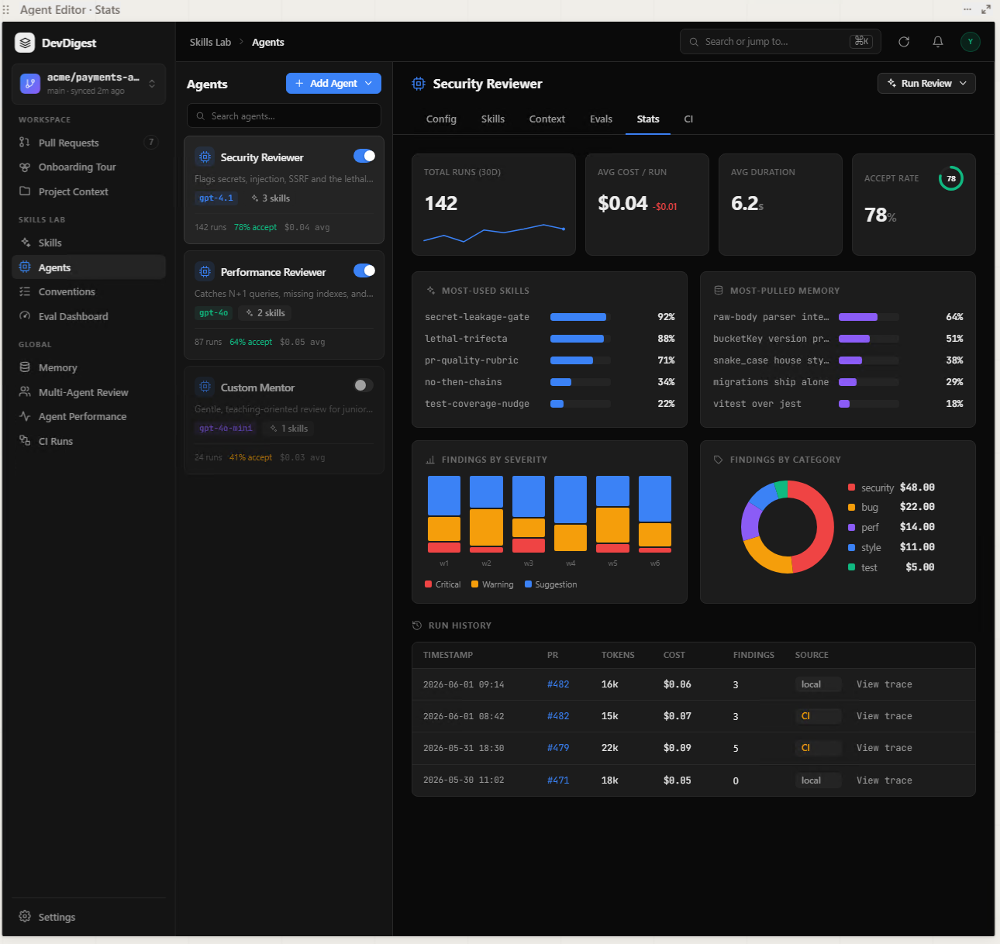
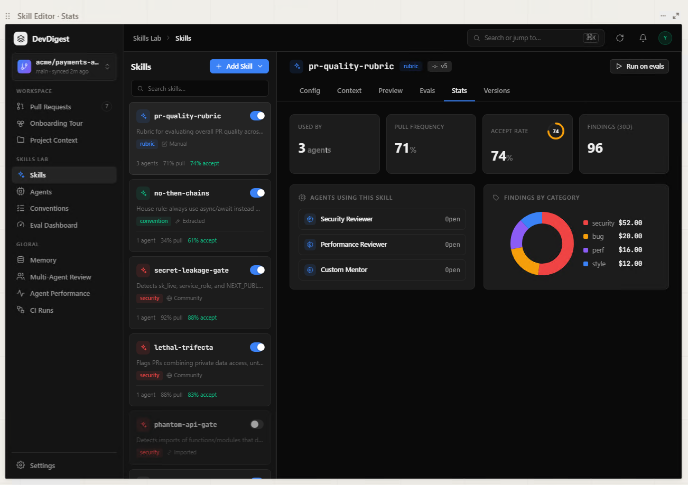
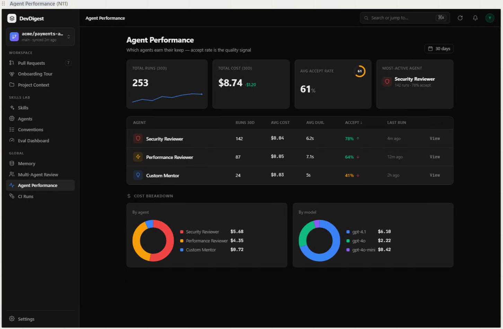
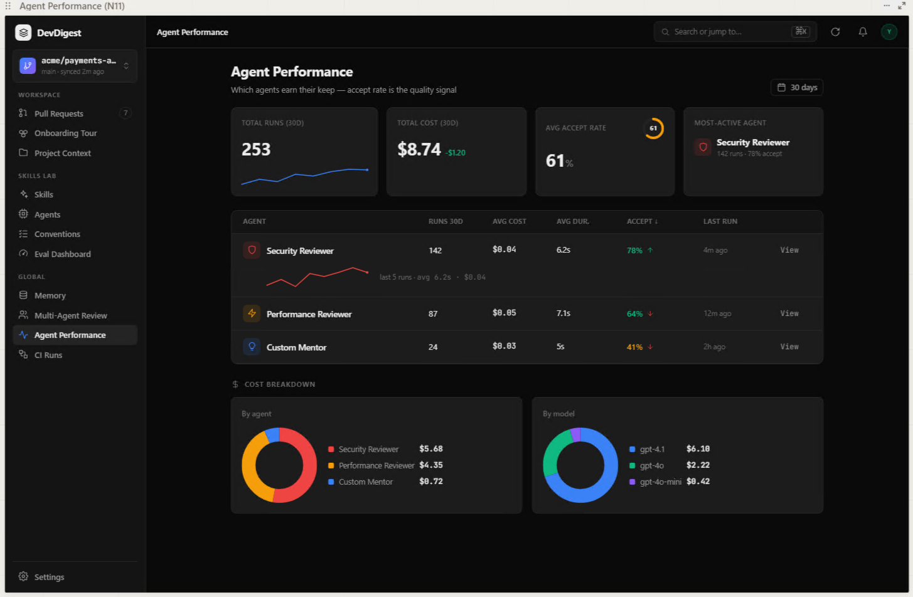
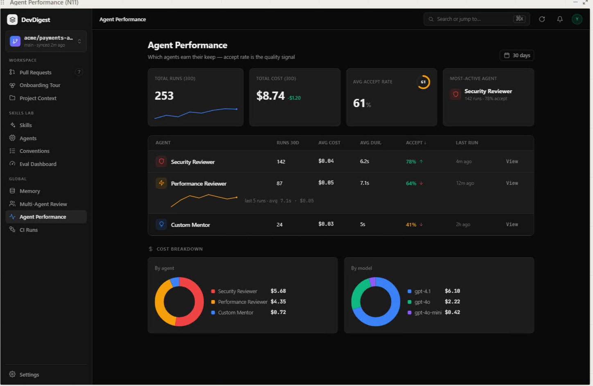
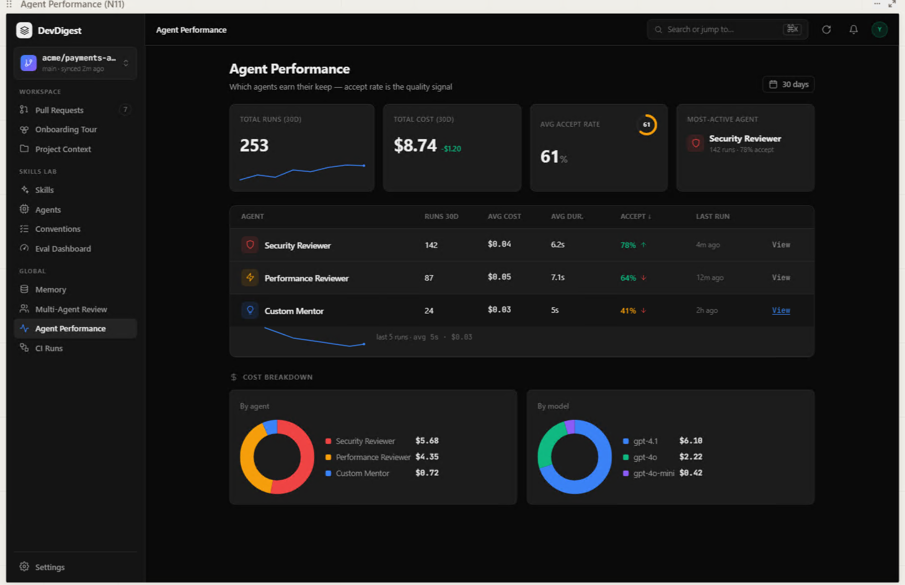
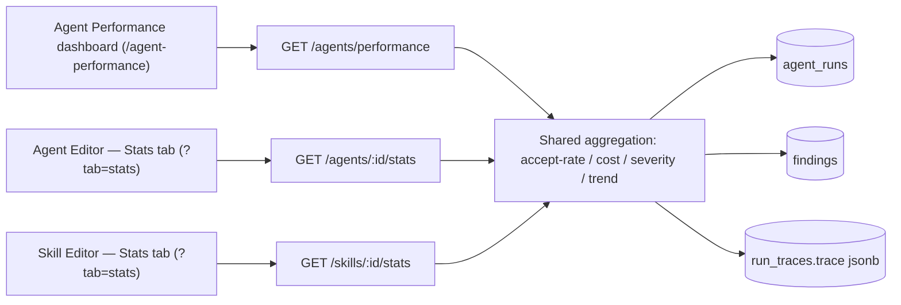
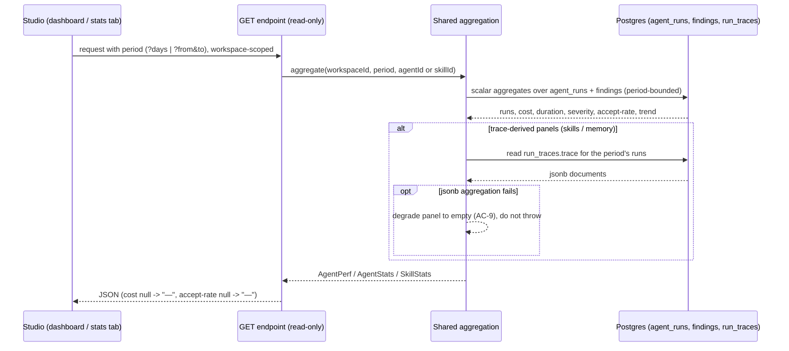

# Spec: Agent & Skill Stats + Agent Performance dashboard | Spec ID: SPEC-2026-07-17-agent-skill-stats-and-performance | Status: approved
Supersedes: — | Superseded by: —

## Problem & context

DevDigest can run many reviewer agents (each with linked skills) against pull
requests, but the studio gives no way to answer the two questions that decide
whether an agent (or a skill) is worth keeping: **is it useful, and what does it
cost?** Every review already persists the data needed to answer this — one row
per run in `agent_runs` (provider/model/duration/tokens/cost/status/source/
score/findings), the findings it produced in `findings` (with `accepted_at`/
`dismissed_at` acceptance signals), and a full `run_traces.trace` jsonb document
recording which skills and memory each run pulled — yet none of it is surfaced
back to the maintainer. Judgement today is anecdotal.

This feature adds three **read-only** analytics surfaces over that already-
persisted data:

1. a **Stats** tab in the Agent Editor (per-agent quality + cost + usage),
2. a **Stats** tab in the Skill Editor (per-skill usage + value), and
3. a global **Agent Performance** dashboard (compare all agents; accept-rate is
   the headline quality signal, cost shown as a breakdown).

The contract scaffolding for two of these already exists and is filled/extended
this lesson (L08), not recreated: `AgentStats`
(`server/src/vendor/shared/contracts/observability.ts`, comment
`GET /agents/:id/stats`) and `AgentPerf`/`AgentPerfRow`/`PerfCostSegment`
(`server/src/vendor/shared/contracts/productionize.ts`,
`GET /agents/performance`) — the routes are not implemented yet. The dashboard's
i18n strings already exist in `client/messages/en/agentPerformance.json`. There
is **no** `SkillStats` contract — it is a new contract this spec introduces.

Intended outcome: a maintainer can look at any agent, any skill, or the whole
fleet and decide, from real usage, which agents earn their keep and how much
they cost — with unknown costs shown honestly as "—", never "$0.00".

## Goals / Non-goals

**Goals**

- A per-agent **Stats** tab in the Agent Editor rendering summary cards,
  trace-derived Most-used-skills / Most-pulled-memory panels, findings-by-
  severity (weekly stacked) and findings-by-category (donut), and a run-history
  table — backed by an extended `AgentStats` from `GET /agents/:id/stats`.
- A per-skill **Stats** tab in the Skill Editor rendering summary cards, an
  "Agents using this skill" list, and a findings-by-category donut — backed by a
  **new** `SkillStats` contract from `GET /skills/:id/stats`.
- A global **Agent Performance** dashboard at `/agent-performance` (new GLOBAL
  nav item) rendering summary cards, a sortable agent table with row-expand
  trends, and two cost-breakdown donuts — backed by `AgentPerf` from
  `GET /agents/performance`.
- A unified **period selector** (default 30 days, plus 1 day, plus a custom
  date range) on all three surfaces; all three endpoints accept the same period
  query params.
- **One shared aggregation implementation** for accept-rate / cost / severity /
  trend math, used by both the dashboard and the per-agent Stats tab, so their
  numbers are identical for the same agent + period.
- Loading, empty, and error states on all three surfaces.

**Non-goals**

- **No new model / LLM / embedding calls.** All three surfaces read only
  persisted `agent_runs`, `findings`, and `run_traces` (hard constraint).
- **No writes / mutations.** These surfaces never create, edit, or delete runs,
  findings, traces, agents, or skills.
- **No schema change and no migration.** Every field consumed already exists.
- **Weekly Digest** (`Digest` / `DigestRunRequest` in `productionize.ts`) — out
  of scope.
- **Plugin export/import** (`PluginBundle` and friends in `productionize.ts`) —
  out of scope.
- **Nightly memory curator** (`CuratorResult` / `CuratorMerge` in
  `observability.ts`) — out of scope.
- **No change to the existing Eval Dashboard** (`/eval`).
- **No real-time/live updates** — each surface renders a fetch-time snapshot; a
  refresh re-reads the data.

## User stories

- **US-1** — As a maintainer, I want a per-agent Stats tab (runs, cost, duration,
  accept-rate, the skills/memory it actually pulls, and its findings) so I can
  judge whether that agent is useful and what it costs.
- **US-2** — As a maintainer, I want a global dashboard comparing all agents by
  accept-rate and cost so I can see which agents earn their keep.
- **US-3** — As a maintainer, I want a per-skill Stats tab (which agents use it,
  how often it is pulled, its accept-rate, and its findings) so I can judge a
  skill's value.
- **US-4** — As a maintainer, I want to scope every surface to a period (30 days,
  1 day, or a custom range) so I can compare recent vs. historical behavior.
- **US-5** — As a maintainer, I want to jump from a dashboard row straight to
  that agent's detailed Stats tab so I can drill down without hunting.
- **US-6** — As a maintainer, I want the dashboard and the per-agent Stats tab to
  agree (same math) and unknown costs shown as "—", so I trust the numbers.

## Design analysis

**Sources:** six approved screenshots in
`docs/specs/assets/SPEC-2026-07-17-agent-skill-stats-and-performance/` (the dashboard filenames use the spelling
"perfomance" verbatim).

### Surface 1 — Agent Editor → Stats tab

Selected agent "Security Reviewer"; the editor tab strip reads
Config / Skills / Context / Evals / **Stats** / CI (Stats is a new tab inserted
before CI). Contents:

- **4 summary cards** — TOTAL RUNS (30D) `142` with a Sparkline; AVG COST / RUN
  `$0.04` with a `-$0.01` period-over-period delta; AVG DURATION `6.2s`; ACCEPT
  RATE `78%` as a CircularScore.
- **MOST-USED SKILLS** — BarRow list with a percentage per skill
  (`secret-leakage-gate 92%`, `lethal-trifecta 88%`, …). Trace-derived.
- **MOST-PULLED MEMORY** — BarRow list with a percentage per memory item
  (`raw-body parser inte… 64%`, …; long text truncated). Trace-derived.
- **FINDINGS BY SEVERITY** — weekly stacked bars (`w1`…`w6`); legend
  Critical / Warning / Suggestion.
- **FINDINGS BY CATEGORY** — Donut. The `$` amounts in the mockup are a design
  placeholder; the real metric is **count/share** of findings per category.
- **RUN HISTORY** — table: TIMESTAMP, PR (link), TOKENS, COST, FINDINGS, SOURCE
  (`local`/`CI` badge), "View trace" action.

### Surface 2 — Skill Editor → Stats tab

Selected skill "pr-quality-rubric"; the editor tab strip reads
Config / Context / Preview / Evals / **Stats** / Versions (Stats is a new tab
inserted before Versions). Contents:

- **4 summary cards** — USED BY `3 agents`; PULL FREQUENCY `71%`; ACCEPT RATE
  `74%` as a CircularScore; FINDINGS (30D) `96`.
- **AGENTS USING THIS SKILL** — a list of linked agents, each with an "Open"
  action.
- **FINDINGS BY CATEGORY** — Donut (again by **count/share**; the `$` amounts are
  a placeholder).

### Surface 3 — Agent Performance dashboard

Global page, title "Agent Performance", subtitle "Which agents earn their keep —
accept rate is the quality signal"; a period control (`30 days`) top-right.

- **4 summary cards** — TOTAL RUNS (30D) `253` with a LineChart/Sparkline; TOTAL
  COST (30D) `$8.74` with a `-$1.20` period-over-period delta; AVG ACCEPT RATE
  `61%` as a CircularScore; MOST-ACTIVE AGENT `Security Reviewer` with
  `142 runs · 78% accept`.
- **Agent table** — columns AGENT, RUNS 30D, AVG COST, AVG DUR., ACCEPT (with a
  `↓` sort marker and a per-row `↑`/`↓` direction indicator), LAST RUN, and a
  "View" action. Default sort: accept-rate descending.
- **Row expand** — the three additional screenshots show one row at a time
  expanded (`agent-perfomance-02/03/04.png`), revealing a Sparkline of recent
  runs plus a caption `last 5 runs · avg <dur> · <cost>`.

- **COST BREAKDOWN** — two donuts: "By agent" and "By model".

### Gap sweep (states the design does NOT show → where each went)

- Loading (in-flight) state on any surface → **AC-5**.
- Error state (request failed) → **AC-6**.
- Unpriced runs (`cost_usd` null) rendered as "—", never "$0.00" → **AC-7**.
- Accept-rate undefined when no findings were acted on → "—" → **AC-8**.
- Trace jsonb aggregation failure (Most-used-skills / Most-pulled-memory) →
  panel degrades to empty, page keeps rendering → **AC-9**.
- Never-run agent / skill, or no runs in the selected period → empty state with
  "—" placeholders → **AC-18**.
- Custom range where `from > to` (or malformed ISO) → validation error →
  **AC-4**.
- CI vs. local run source distinction → badge + inclusion in aggregates →
  **AC-35**.
- Card sublabels currently read "(30D)"; when the period changes they must
  reflect the active period, not a hardcoded 30D → **AC-10** + Non-functional.
- Long agent / skill / memory names → truncated with an accessible full-text
  affordance → Non-functional (responsive) + **AC-23/24**.
- Accessibility (keyboard-operable period control, sortable headers, expandable
  rows, View actions; aria-live on async updates; accessible chart labels;
  contrast) → **AC-36** + Non-functional.
- Responsive reflow of cards / table / donuts on a narrow viewport →
  Non-functional (responsive).
- Permission / authz states → single workspace scope per request; no per-user
  roles in this app → Non-functional (security), **AC-2**.
- Concurrent updates / staleness while viewing → not real-time; a refresh
  re-reads (Non-goal) → Edge cases.

## Acceptance criteria (EARS)

Numbering is append-only and stable. All parameters below are decided (zero open
questions).

### Cross-cutting (all three surfaces)

- **AC-1 [Ubiquitous]** — All three surfaces shall compute their values solely
  from persisted `agent_runs`, `findings`, and `run_traces`, and shall make no
  new model, LLM, or embedding calls.
- **AC-2 [Ubiquitous]** — Every aggregation query shall be scoped to the active
  workspace; data from another workspace shall never appear in any surface.
- **AC-3 [Event-driven]** — WHEN an endpoint receives `?days=1` or `?days=30`, OR
  `?from=<iso>&to=<iso>`, the system shall bound every aggregate (including the
  trace-derived panels) to runs whose `ran_at` falls in that period; WHEN no
  period param is present, the system shall default to the last 30 days.
- **AC-4 [Unwanted behavior]** — IF a custom range has `from` after `to`, or
  either bound is not a valid ISO date, THEN the system shall reject the request
  with a validation error and compute no aggregates.
- **AC-5 [State-driven]** — WHILE a surface's data request is in flight, the UI
  shall show a loading state (skeletons) rather than empty or stale panels.
- **AC-6 [Unwanted behavior]** — IF a surface's data request errors, THEN the UI
  shall show an error state (using the `loadError` string) without breaking the
  surrounding page.
- **AC-7 [Unwanted behavior]** — IF a run's `cost_usd` is null (unpriced /
  failed / cancelled), THEN the UI shall render its cost as "—" and shall never
  substitute `0` or "$0.00" for unknown cost.
- **AC-8 [Unwanted behavior]** — IF an agent or skill has no acted findings in
  the period (`accepted + dismissed = 0`), THEN accept-rate shall be null and the
  UI shall render it as "—" (not `0%`).
- **AC-9 [Unwanted behavior]** — IF aggregating over `run_traces.trace` jsonb
  fails for any run in the period, THEN the affected trace-derived panel
  (Most-used skills / Most-pulled memory) shall degrade to an empty panel and the
  rest of the surface shall still render; the request shall not throw.
- **AC-10 [State-driven]** — WHILE any of the three surfaces is shown, a period
  control shall be present offering "30 days" (default), "1 day", and a custom
  date range, and the surface's period-scoped labels shall reflect the selected
  period rather than a hardcoded "30D".

### Agent Performance dashboard

- **AC-11 [Event-driven]** — WHEN a client requests `GET /agents/performance` for
  the active workspace and period, the system shall return an `AgentPerf`
  document with a summary block, one row per agent, and cost-by-agent and
  cost-by-model breakdowns.
- **AC-12 [Event-driven]** — WHEN the dashboard renders, it shall show four
  summary cards: Total runs (period) with a trend sparkline; Total cost (period)
  with a period-over-period delta; Avg accept-rate as a CircularScore; and
  Most-active agent (the agent with the most runs in the period) with its runs
  and accept-rate.
- **AC-13 [Event-driven]** — WHEN the agent table renders, each row shall show
  Agent, Runs (period), Avg cost, Avg duration, Accept-rate with an up/down
  direction indicator, Last run, and a "View" action.
- **AC-14 [State-driven]** — WHILE no other sort is chosen, the agent table shall
  default to accept-rate descending.
- **AC-15 [Event-driven]** — WHEN a user clicks a row or its "View" action, the
  system shall navigate to that agent's editor Stats tab.
- **AC-16 [Optional feature]** — WHERE a user expands an agent row, the system
  shall reveal a sparkline of that agent's recent runs and a caption of the form
  "last N runs · avg <duration> · <cost>".
- **AC-17 [Event-driven]** — WHEN the dashboard renders, it shall show two cost-
  breakdown donuts: cost by agent and cost by model.
- **AC-18 [Unwanted behavior]** — IF the workspace has no runs in the selected
  period, THEN each surface shall show an empty state (dashboard: the
  `empty.title` / `empty.body` copy; stats tabs: an equivalent empty state) with
  "—" placeholders instead of fabricated zeros.
- **AC-19 [Event-driven]** — WHEN the sidebar renders, it shall include a GLOBAL
  nav item keyed `agent-performance`, labeled "Agent Performance" (hardcoded
  English), routing to `/agent-performance`, using a line/pulse icon from the
  existing icon set distinct from `Activity` (which CI Runs uses) — e.g.
  `TrendingUp`.

### Agent Editor → Stats tab

- **AC-20 [Event-driven]** — WHEN the Agent Editor is opened with `?tab=stats`,
  the system shall show a "Stats" tab (positioned between Evals and CI) without
  altering the identity or order of the existing Config / Skills / Context /
  Evals / CI tabs.
- **AC-21 [Event-driven]** — WHEN a client requests `GET /agents/:id/stats` for
  the active workspace and period, the system shall return an extended
  `AgentStats` covering summary metrics, trace-derived most-used-skills and
  most-pulled-memory, findings-by-category, weekly findings-by-severity, and a
  run-history list.
- **AC-22 [Event-driven]** — WHEN the Agent Stats tab renders, it shall show four
  summary cards: Total runs (period) with a sparkline; Avg cost/run with a
  period-over-period delta; Avg duration; and Accept-rate as a CircularScore.
- **AC-23 [Event-driven]** — WHEN the Agent Stats tab renders, the "Most-used
  skills" panel shall show, as a BarRow list with percentages, the skills most
  frequently pulled across the period's runs, computed by aggregating
  `run_traces.trace` (workspace-scoped, period-bounded), with long names
  truncated safely.
- **AC-24 [Event-driven]** — WHEN the Agent Stats tab renders, the "Most-pulled
  memory" panel shall show, as a BarRow list with percentages, the memory items
  most frequently pulled across the period's runs, computed by aggregating
  `run_traces.trace` (workspace-scoped, period-bounded), rendered as escaped text
  with long text truncated safely.
- **AC-25 [Event-driven]** — WHEN the Agent Stats tab renders, the "Findings by
  severity" panel shall show findings bucketed by week across the period as
  stacked bars split into Critical / Warning / Suggestion (up to ~6 weekly
  buckets labeled oldest→newest).
- **AC-26 [Event-driven]** — WHEN the Agent Stats tab renders, the "Findings by
  category" donut shall segment findings by **count/share per category** (not by
  a monetary amount).
- **AC-27 [Event-driven]** — WHEN the Agent Stats tab renders, the run-history
  table shall list the period's runs with timestamp, PR (link), tokens, cost,
  findings, source (`local`/`CI` badge), and a "View trace" action that opens the
  existing run-trace view.

### Skill Editor → Stats tab

- **AC-28 [Event-driven]** — WHEN the Skill Editor is opened with `?tab=stats`,
  the system shall show a "Stats" tab (positioned between Evals and Versions)
  without altering the existing Config / Context / Preview / Evals / Versions
  tabs.
- **AC-29 [Event-driven]** — WHEN a client requests `GET /skills/:id/stats` for
  the active workspace and period, the system shall return a `SkillStats`
  document (new contract) covering the used-by-agent count, pull frequency,
  accept-rate, findings total, the linked-agents list, and findings-by-category.
- **AC-30 [Event-driven]** — WHEN the Skill Stats tab renders, it shall show four
  summary cards: Used by (count of agents linked to the skill), Pull frequency
  (%), Accept-rate (%), and Findings (period count).
- **AC-31 [Ubiquitous]** — Per-skill pull frequency shall be the percentage of
  the period's runs (by agents linked to the skill) whose trace pulled this
  skill, and per-skill accept-rate shall be the accept-rate of findings produced
  by those runs — both computed from `run_traces.trace` + `findings`, workspace-
  scoped and period-bounded.
- **AC-32 [Event-driven]** — WHEN the Skill Stats tab renders, the "Agents using
  this skill" list shall show each linked agent with an "Open" action that
  navigates to that agent's editor.
- **AC-33 [Event-driven]** — WHEN the Skill Stats tab renders, the "Findings by
  category" donut shall segment findings by **count/share per category**.

### Shared aggregation & source

- **AC-34 [Ubiquitous]** — For the same agent and the same period, the values the
  dashboard reports for that agent (accept-rate, cost, findings-by-severity, and
  trend) shall be identical to the values its per-agent Stats tab reports,
  because both are produced by one shared aggregation implementation.
- **AC-35 [State-driven]** — WHILE runs of both sources exist, the system shall
  distinguish `local` from `ci` runs with a badge in run history and shall
  include both sources in the period aggregates.
- **AC-36 [Ubiquitous]** — The period control, sortable table headers, expandable
  rows, and View/Open actions shall be keyboard-operable and labeled;
  asynchronous data updates shall be announced via an aria-live region; and each
  chart (sparkline, donut, CircularScore, weekly bars) shall carry an accessible
  text label or equivalent.

## Edge cases

- **Never-run agent / skill, or no runs in period** — empty state, "—"
  placeholders, no fabricated zeros (AC-18, AC-7, AC-8). Mapped.
- **Unpriced runs** — `cost_usd` null → "—" everywhere; such runs still count
  toward run counts and duration but contribute nothing to cost totals/averages
  (AC-7). Mapped.
- **Accept-rate with only pending findings** — no acted findings → accept-rate
  null → "—" (AC-8). Mapped.
- **Trace jsonb aggregation failure or malformed/absent `prompt_assembly.skills`
  / `memory_pulled`** — the skills/memory panel degrades to empty; scalar cards
  and findings panels (which do not read the trace) still render (AC-9). Mapped.
- **Custom range invalid (`from > to`, bad ISO)** — rejected with a validation
  error; nothing computed (AC-4). Mapped.
- **1-day period** — weekly severity bars collapse to a single (possibly empty)
  bucket; sparklines may show few points; empty panels are valid, not errors
  (AC-10, AC-25). Mapped.
- **CI vs local runs** — CI runs (`source='ci'`) are included and badged; their
  PR link uses `pr_number`/`repo` (CI rows may lack a local `pr_id`) (AC-35,
  AC-27). Mapped.
- **Agent deleted after runs exist** — `agent_runs.agent_id` is `set null` on
  delete; such orphaned runs contribute to workspace totals but have no agent row
  to drill into. Accepted (dashboard groups only rows with a live agent; orphans
  fold into workspace-level cost only). Surfaced as an inline proposal.
- **Long agent / skill / memory / category names** — truncated with an accessible
  full-text affordance; never overflow the card (AC-23, AC-24, Non-functional).
  Mapped.
- **Concurrent new runs while viewing** — surfaces are fetch-time snapshots; a
  refresh reflects new runs (Non-goal: no live updates). Accepted.
- **Used-by count vs. period metrics on Skill Stats** — "Used by" is a
  configuration count (agents linked to the skill now) and is NOT period-scoped;
  pull frequency, accept-rate, and findings ARE period-scoped (AC-30, AC-31).
  Mapped.

## Workflows & service communication

The flow below shows all three read-only surfaces calling GET-only endpoints
that route through one shared aggregation over the already-persisted tables — no
writes and no model calls anywhere in the path (AC-1, AC-34).

The sequence below shows one request: scalar aggregates come from `agent_runs` +
`findings`, and the trace-derived panels read `run_traces.trace` only for the
period's runs, degrading to an empty panel on jsonb failure rather than failing
the request (AC-3, AC-9, AC-7, AC-8).

## Contracts (shape-level)

All shapes below are field-level only (names + meaning + invariants); no
implementation. Extensions to existing contracts are additive and back-
compatible; the new `SkillStats` lives in a NEW contract file (per the
"extend `@devdigest/shared` with new files, never edit the existing barrel"
rule).

### Shared period query (all three endpoints)

| Param | Shape | Meaning / invariant |
|---|---|---|
| `days` | `1 \| 30` (optional) | shorthand period; mutually exclusive with `from`/`to` |
| `from` | ISO date string (optional) | custom range start; requires `to` |
| `to` | ISO date string (optional) | custom range end; `from ≤ to` (AC-4) |

Absent → default last 30 days (AC-3).

### `AgentStats` — fields to ADD (extend `observability.ts`, additive/nullish)

The existing `AgentStats` keeps all current fields (`runs`, `findings_total`,
`accepted`, `dismissed`, `pending`, `accept_rate`, `dismiss_rate`,
`avg_findings_per_run`, `total_cost_usd`, `avg_cost_usd`, `avg_latency_ms`,
`findings_by_severity`, `trend`). Add:

| Field | Shape | Meaning |
|---|---|---|
| `avg_cost_delta_usd` | number \| null | period-over-period change in avg cost/run (the `-$0.01` chip); null when unknown |
| `most_used_skills` | `{ name: string; pct: number }[]` | trace-derived; `pct` = share (0..1) of period runs whose trace pulled the skill (AC-23) |
| `most_pulled_memory` | `{ label: string; pct: number }[]` | trace-derived; `pct` = share of period runs whose trace pulled the memory item (AC-24) |
| `findings_by_category` | `{ category: string; count: number }[]` | donut by count/share (AC-26) |
| `findings_by_severity_weekly` | `{ week: string; CRITICAL: number; WARNING: number; SUGGESTION: number }[]` | weekly stacked bars, oldest→newest (AC-25) |
| `run_history` | `{ run_id; ran_at; pr_number: number\|null; pr_id: string\|null; tokens: number\|null; cost_usd: number\|null; findings_count: number\|null; source: 'local'\|'ci' }[]` | run-history table rows (AC-27) |

Invariants: `pct` in 0..1; `cost_usd`/`avg_cost_delta_usd` null-means-unknown
(never 0); `run_id` present so the client can open the existing trace view.

### `AgentPerf` / `AgentPerfRow` — fields to ADD (extend `productionize.ts`)

`AgentPerf` and `AgentPerfRow` already model the dashboard. Add (additive/
nullish) to satisfy the mockup's deltas and trend caption:

| On | Field | Shape | Meaning |
|---|---|---|---|
| `AgentPerf.summary` | `runs_trend` | `number[]` | sparkline for the Total-runs card (AC-12) |
| `AgentPerf.summary` | `total_cost_delta_usd` | number \| null | period-over-period cost change (the `-$1.20` chip) (AC-12) |
| `AgentPerfRow` | `accept_rate_delta` | number \| null | period-over-period accept-rate change → the row's `↑`/`↓` indicator (AC-13) |

`most_active_agent` stays a name string; the card's "142 runs · 78% accept"
detail is read from that agent's matching `AgentPerfRow` (no new field). The
existing `AgentPerfRow.trend` (number[]) and `avg_latency_ms`/`avg_cost_usd`
back the row-expand sparkline + caption (AC-16). `cost_by_agent` / `cost_by_model`
(arrays of `PerfCostSegment {label, value}`) back the two donuts (AC-17).

### `SkillStats` — NEW contract (new file, re-exported per the barrel rule)

| Field | Shape | Meaning / invariant |
|---|---|---|
| `skill_id` | string | — |
| `skill_name` | string | — |
| `used_by_agents` | number (int) | count of agents currently linked to the skill (config-level, NOT period-scoped) (AC-30) |
| `pull_frequency` | number \| null | share (0..1) of period runs by linked agents whose trace pulled this skill (AC-31) |
| `accept_rate` | number \| null | accept-rate of findings from those runs; null when no acted findings (AC-8, AC-31) |
| `findings_total` | number (int) | findings in the period from those runs |
| `agents` | `{ agent_id: string; agent_name: string }[]` | "Agents using this skill" list (AC-32) |
| `findings_by_category` | `{ category: string; count: number }[]` | donut by count/share (AC-33) |

### Endpoints (contract-level, read-only)

- `GET /agents/performance` → `AgentPerf` (dashboard) — accepts the shared period
  query.
- `GET /agents/:id/stats` → extended `AgentStats` — accepts the shared period
  query.
- `GET /skills/:id/stats` → `SkillStats` (new) — accepts the shared period query.

## Non-functional

- **Performance** — All three surfaces are read-only aggregations over indexed
  columns (`agent_runs` scoped by `workspace_id` + `ran_at` window; `findings`
  joined via `reviews`). The trace-derived panels read `run_traces.trace` jsonb
  **only for the period's runs** (bounded set), and degrade to empty on failure
  rather than blocking the response (AC-9). No surface issues a model/LLM call
  (AC-1), so latency is DB-bound. Indexing strategy is an implementation concern
  for the planner.
- **Security** — Every query is workspace-scoped (A01/IDOR; AC-2). The surfaces
  are strictly read-only — no mutation endpoints, no secrets sent to the client,
  and no model API keys touched. Period query params (`days`/`from`/`to`) are
  validated and typed via Zod before use and executed via Drizzle parameterized
  queries (A05 injection; AC-4). Agent/skill/memory/category names, model
  strings, and PR numbers are rendered as escaped text/values, never via
  `dangerouslySetInnerHTML` (A05 stored XSS). Cross-tenant cost/token/finding
  data never leaks (AC-2).
- **Accessibility** — Period control, sortable headers, expandable rows, and
  View/Open actions are keyboard-operable and labeled; async data updates are
  announced via aria-live; charts carry accessible labels/equivalents; colors
  meet contrast in light and dark themes (AC-36).
- **i18n** — English-only. All UI strings go through next-intl (`messages/en/*`).
  The dashboard reuses `agentPerformance.json` (its `subtitle` is updated to the
  approved design wording "Which agents earn their keep — accept rate is the
  quality signal", and keys are added for the period control, the summary-card
  labels/deltas, the table columns Avg cost / Avg dur. / Last run / View, the
  row-expand caption, and the cost-breakdown donut titles). New keys are added
  for the Agent Stats and Skill Stats tabs (under the existing `agents` / `skills`
  namespaces or a new namespace). No `uk` or other locale — **N/A per project
  decision** (root `AGENTS.md` localization rule). Sidebar nav labels stay
  hardcoded English (nav is not i18n; AC-19).
- **Local-first** — All data comes from the local Postgres; no external network
  calls are made to render any surface.
- **Responsive** — Cards, the agent table, and the donuts reflow on a narrow
  viewport; long names truncate (with an accessible full-text affordance) rather
  than overflow.

## Inputs (provenance)

- `[reused]` — `server/src/vendor/shared/contracts/observability.ts`
  (`AgentStats`, `StatPoint`); `server/src/vendor/shared/contracts/productionize.ts`
  (`AgentPerf`, `AgentPerfRow`, `PerfCostSegment`);
  `server/src/vendor/shared/contracts/trace.ts` (`RunTrace`, `PromptAssembly`
  with `skills`/`skill_tokens`, `MemoryPulled`, `memory_pulled`);
  `server/src/db/schema/runs.ts` (`agent_runs`, `run_traces`);
  `server/src/db/schema/reviews.ts` (`findings`: `severity`, `category`,
  `accepted_at`, `dismissed_at`, `review_id`/`run_id`);
  `client/messages/en/agentPerformance.json`; `client/src/vendor/ui/nav.ts`
  (GLOBAL section; hardcoded labels); `client/src/vendor/ui/icons.tsx`
  (`TrendingUp`/`Activity`/`BarChart`/`Gauge` present; no `LineChart`);
  `client/src/app/agents/[id]/_components/AgentEditor/constants.ts` and
  `client/src/app/skills/[id]/_components/SkillEditor/constants.ts` (existing
  `TABS`, `?tab=` state). Chart primitives from `@devdigest/ui` (Donut,
  MetricCard, Sparkline, LineChart, BarRow, CircularScore, EmptyState,
  ErrorState, Skeleton, Badge, Tabs).
- `[deterministic: repo-intel]` — `devdigest_get_conventions` (React-Query
  `queryKey` string arrays + `invalidateQueries`; per-module `constants.ts`;
  `import type`; barrel re-exports; `as const`).
- `[deterministic: repo-intel]` — `devdigest_get_blast_radius`: **not
  applicable** — greenfield read endpoints with no PR to map yet.
- `[new: 0 LLM calls]` — no researcher delegation was required; all facts were
  grounded in files read this session.

## Untrusted inputs

- **Period query params (`days` / `from` / `to`)** — client-controlled input to
  the DB; validated and typed via Zod, then used only in Drizzle parameterized
  queries. Treated as data (AC-4).
- **`run_traces.trace` jsonb content** (pulled skill names, memory text) — this
  is produced by the review pipeline and, for memory, may originate from curated
  memory content; the stats surfaces treat every string read from the trace as
  **display data only**, rendered as escaped text and truncated, never executed
  or interpreted (AC-24). Because these surfaces make no model call (AC-1), there
  is no prompt-injection surface here.
- **Agent / skill / category / model names, PR numbers** — rendered as escaped
  text/values in the UI.
- No untrusted input is executed, and no input reaches a shell, a model prompt,
  or `dangerouslySetInnerHTML`.

## Dependencies & impacts

- **Server (additive):** a read-only stats/aggregation surface — routes for
  `GET /agents/performance`, `GET /agents/:id/stats`, `GET /skills/:id/stats`
  plus one shared aggregation used by the first two (AC-34); extend `AgentStats`
  (`observability.ts`) and `AgentPerf`/`AgentPerfRow` (`productionize.ts`)
  additively; a NEW `SkillStats` contract file. Registered as a feature module
  with one line in `server/src/modules/index.ts`. **No schema change, no
  migration.**
- **Client (additive):** a new `Stats` tab in the Agent Editor (extend `TABS` +
  render + `StatsTab` component + `useAgentStats` hook); a new `Stats` tab in the
  Skill Editor (extend `TABS` + render + `StatsTab` + `useSkillStats` hook); a
  new `/agent-performance` route with colocated `_components` + a
  `useAgentPerformance` hook; a new GLOBAL nav item in `nav.ts` (AC-19);
  `agentPerformance.json` reused/extended + new stats keys. Reuses existing
  `@devdigest/ui` chart primitives (no new primitives).
- **Reused, unchanged:** `agent_runs`, `findings`, `run_traces`, `agent_skills`
  link table, and the existing run-trace view (opened from run history).
- **Blast radius:** not indexed for this change (no PR) — the planner should run
  `devdigest_get_blast_radius` once a PR exists.

## Traceability

| AC | Story | Design ref | Verification | Plan phase |
|---|---|---|---|---|
| AC-1 | US-1,2,3 | all assets | integration: assert no adapter/LLM call on any stats endpoint | — |
| AC-2 | US-1,2,3 | — | integration: cross-workspace request returns no foreign data | — |
| AC-3 | US-4 | agent-perfomance-01.png (period) | integration: `?days`/`?from&to` bound aggregates; absent → 30d | — |
| AC-4 | US-4 | — | unit (server pnpm test): `from>to`/bad ISO → validation error | — |
| AC-5 | US-1,2,3 | — | e2e (deterministic): in-flight → loading skeletons | — |
| AC-6 | US-1,2,3 | — | e2e: request error → error state, page intact | — |
| AC-7 | US-6 | agent-editor-stats-01.png (cost) | unit (client pnpm test): null cost → "—" | — |
| AC-8 | US-6 | agent-perfomance-01.png (accept) | unit (client): no acted findings → "—" | — |
| AC-9 | US-1 | agent-editor-stats-01.png (skills/memory) | integration: malformed trace → empty panel, no throw | — |
| AC-10 | US-4 | agent-perfomance-01.png (30 days) | e2e: period control present, labels track period | — |
| AC-11 | US-2 | agent-perfomance-01.png | integration: `GET /agents/performance` shape + scope | — |
| AC-12 | US-2 | agent-perfomance-01.png (cards) | e2e: 4 summary cards incl. delta + CircularScore | — |
| AC-13 | US-2 | agent-perfomance-01.png (table) | e2e: table columns + up/down indicator | — |
| AC-14 | US-2 | agent-perfomance-01.png (↓) | e2e: default sort accept-rate desc | — |
| AC-15 | US-5 | agent-perfomance-01.png (View) | e2e: row/View → agent Stats tab | — |
| AC-16 | US-2 | agent-perfomance-02/03/04.png | e2e: expand → sparkline + "last N runs…" caption | — |
| AC-17 | US-2 | agent-perfomance-01.png (donuts) | e2e: cost-by-agent + cost-by-model donuts | — |
| AC-18 | US-1,2,3 | — | e2e: no runs in period → empty state, "—" | — |
| AC-19 | US-2 | agent-perfomance-01.png (nav) | unit (client): nav item `agent-performance`, icon ≠ Activity | — |
| AC-20 | US-1 | agent-editor-stats-01.png (tabs) | e2e: `?tab=stats` shows Stats tab, order preserved | — |
| AC-21 | US-1 | agent-editor-stats-01.png | integration: `GET /agents/:id/stats` extended shape | — |
| AC-22 | US-1 | agent-editor-stats-01.png (cards) | e2e: 4 summary cards incl. sparkline + delta | — |
| AC-23 | US-1 | agent-editor-stats-01.png (skills) | integration: most-used-skills % from trace, period-bounded | — |
| AC-24 | US-1 | agent-editor-stats-01.png (memory) | integration: most-pulled-memory % from trace; escaped render | — |
| AC-25 | US-1 | agent-editor-stats-01.png (severity) | integration: weekly severity buckets | — |
| AC-26 | US-1 | agent-editor-stats-01.png (category) | unit (client): donut segments by count/share | — |
| AC-27 | US-1 | agent-editor-stats-01.png (history) | e2e: run history rows + source badge + View trace | — |
| AC-28 | US-3 | skill-editor-stats-01.png (tabs) | e2e: `?tab=stats` shows Skill Stats tab, order preserved | — |
| AC-29 | US-3 | skill-editor-stats-01.png | integration: `GET /skills/:id/stats` shape + scope | — |
| AC-30 | US-3 | skill-editor-stats-01.png (cards) | e2e: 4 summary cards | — |
| AC-31 | US-3 | skill-editor-stats-01.png | integration: pull-freq + accept-rate from trace + findings | — |
| AC-32 | US-3 | skill-editor-stats-01.png (list) | e2e: agents-using list + Open action | — |
| AC-33 | US-3 | skill-editor-stats-01.png (category) | unit (client): donut by count/share | — |
| AC-34 | US-6 | — | integration: dashboard row == agent Stats tab for same agent+period | — |
| AC-35 | US-1 | agent-editor-stats-01.png (SOURCE) | integration: local vs CI badged + both in aggregates | — |
| AC-36 | US-1,2,3 | all assets | manual: keyboard + aria-live + chart-label sweep | — |

## Decisions (settled — embedded from the resolved design)

1. **Trace-derived panels are full-fidelity** — Most-used skills / Most-pulled
   memory aggregate over `run_traces.trace` for the period's runs, rendered as
   BarRow %; degrade to empty on aggregation failure (AC-23, AC-24, AC-9).
2. **Findings-by-category is count/share** — the `$` amounts in the mockups are a
   placeholder; the donut segments by finding count (AC-26, AC-33).
3. **Per-skill metrics via trace aggregation** — pull frequency = % of period
   runs (by linked agents) whose trace pulled the skill; accept-rate = accept-
   rate of findings from those runs (AC-31).
4. **Period selector on all three surfaces** — default 30 days, plus 1 day, plus
   custom range; unified `?days` / `?from&to` params, default 30 days (AC-3,
   AC-10).
5. **Shared aggregation** — the dashboard and the per-agent Stats tab share one
   aggregation implementation; identical math for the same agent + period
   (AC-34).
6. **Dashboard route + nav** — `/agent-performance`; new GLOBAL nav key
   `agent-performance`; a line/pulse icon distinct from `Activity` (CI Runs),
   e.g. `TrendingUp`; label hardcoded "Agent Performance" (AC-19).
